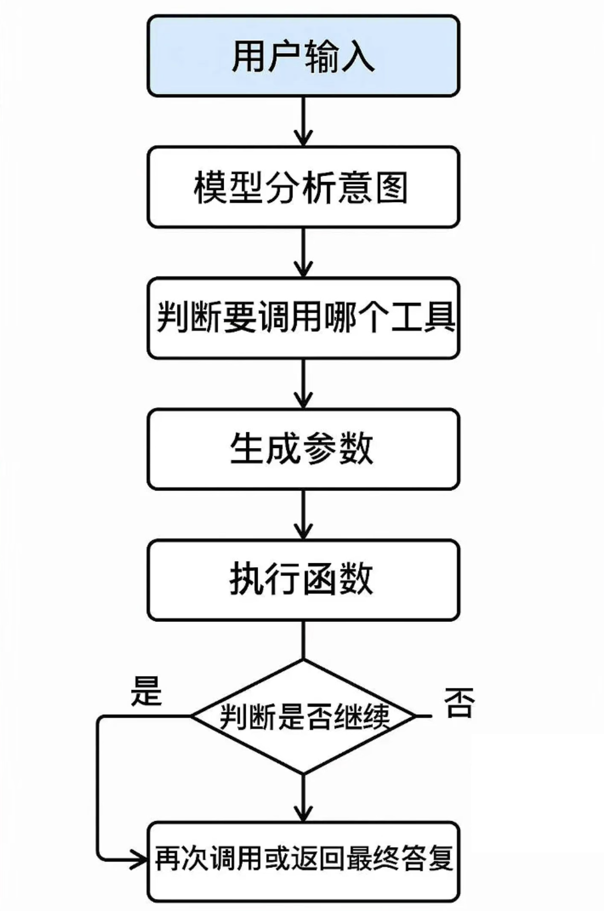

# AI

## 一些AI相关的概念

### LLM

LLM（Large Language Model，大语言模型）是一种能理解和生成人类语言的人工智能技术。核心是通过大规模数据训练，掌握语言背后的逻辑和知识，从而实现多种语言相关任务。

### Token

大模型中的 Token 本质是**文本的最小处理单位**，它不是传统意义上的字或词，而是模型在理解和生成语言时，对文本进行拆分后的基础片段。

简单来说，Token 就像大模型处理语言时用的 “乐高积木”，模型会先把文本拆成无数个 Token，处理完后再把这些 Token 重新组合成完整的句子。

### AIGC

AIGC（AI Generated Content），即由人工智能系统自主或辅助生成文本、图像、音频、视频、代码等各类内容的技术和过程。

> 也就是AI生成内容，像ChatGPT这样以对话（提示词）的形式，文生文内容。

缺点：

1. 不具备实时性
2. 不会使用工具

为了解决这两个问题，衍生出了两种技术方向：

1. 解决实时性：**RAG**
2. 解决工具问题：**Function Calling**

### 单模态

在最初的时候，例如gpt3，它只会去处理文字，这种一次只处理一种输入或输出的方式，就是单模态。

### 多模态

随着技术的发展，AI不仅仅是文生文了，例如现在的文生图、图生文、文生视频。

这些能力的出现，让模型能理解和生成多种形式的内容，这叫多模态。

### RAG

RAG（Retrieval-Augmented Generation，**检索增强生成**）是一种将信息检索与文本生成相结合的人工智能架构，通过在大语言模型（LLM）之外接入可实时更新的知识库，提升回答的准确性、时效性，并减少 “幻觉” 现象。

**核心原理**：

RAG 在回答问题时，先从外部知识库检索相关信息，再将这些信息融入提示词，引导 LLM 生成更精准、有依据的答案，流程如下：

- **检索（Retrieval）**：将用户问题转为向量，在向量数据库中检索最相关的文档片段（如 PDF、网页摘要）。
- **增强（Augmented）**：把检索到的片段与原问题组合成新提示，补充必要背景信息。
- **生成（Generation）**：LLM 根据增强后的提示生成最终回答。

**为什么需要 RAG 🧠**：

- **知识可更新**：弥补模型训练后无法自动获取新信息的局限，如政策变更、突发新闻。
- **领域覆盖广**：可接入专业数据库或私有文档，应对医学、法律等需要深度领域知识的场景。
- **减少幻觉**：基于检索到的事实生成，降低虚构内容风险。

### Function Calling

Function Calling 是一种将 LLM 模型与外部工具（如数据库、API）集成的方式，让模型根据你的指令，自动去调用外部的函数或接口，把任务执行掉。

缺点：各家模型厂商的标准不同，难以统一，解决方法就是MCP协议。

### Agent 智能体

AI Agent（智能体）是具备**自主感知、决策和执行能力**的 AI 系统，能像 “虚拟助手” 一样理解目标、规划步骤，并调用工具完成复杂任务，无需人类每一步干预。

它区别于传统 AI 工具（如单纯的文本生成或图片生成工具），核心在于 “自主性” 和 “任务闭环能力”。

### MCP 标准协议

MCP（Model Context Protocol）是由 Anthropic 公司于 2024 年 11 月推出的开源协议，旨在标准化LLM与外部工具的集成方式。

因为对于Agent要自主完成任务，可能需要接入很多种工具，如果没有标准协议，那么就会导致各个工具之间无法进行统一，集成难度困难，所以就需要MCP标准协议。
