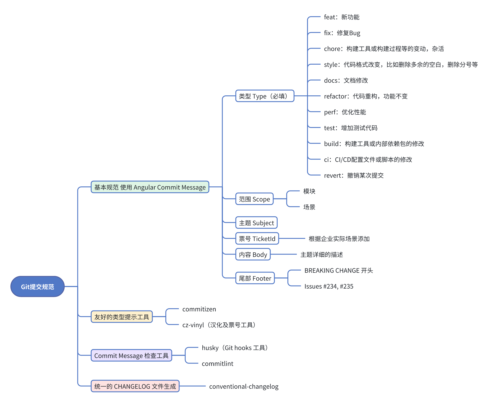

# git提交规范

## git规范分解

## git分支命名规范

分支命名规范如下，主分支基本为保护分支，不能直接push代码，需要通过 `Merge Request` 才可以。

- 主分支
  - `master/main`
  - `develop`
- 临时分支
  - `feature/{ticket-id}票号/{short-description}`
  - `release/v{version}`

> 临时分支举例：`feature/web-1002768/cart`、`release/v1.1.0`

## git提交规范

- 提交前：
  - `husky`
  - `lint-staged`：提交前对代码做eslint校验
- 提交中：
  - `cz-vinyl`
  - `commitizen`
- 提交后：
  - `@commitlint/cli`