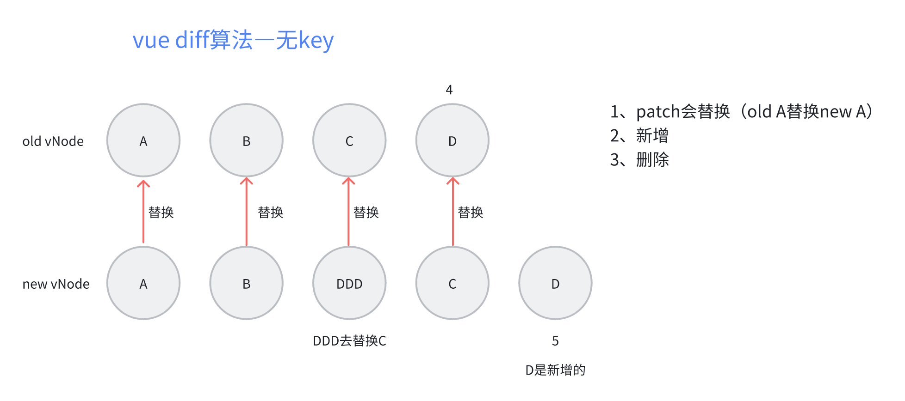
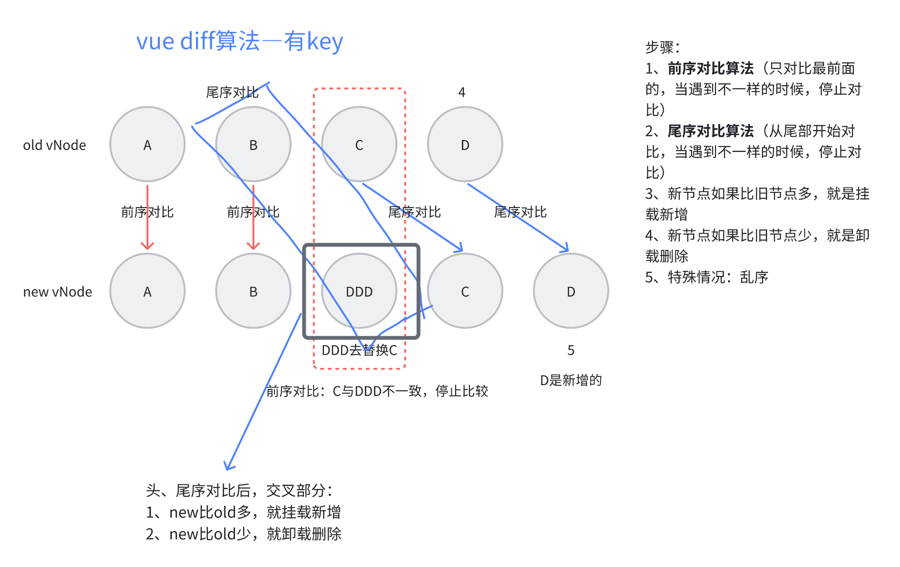
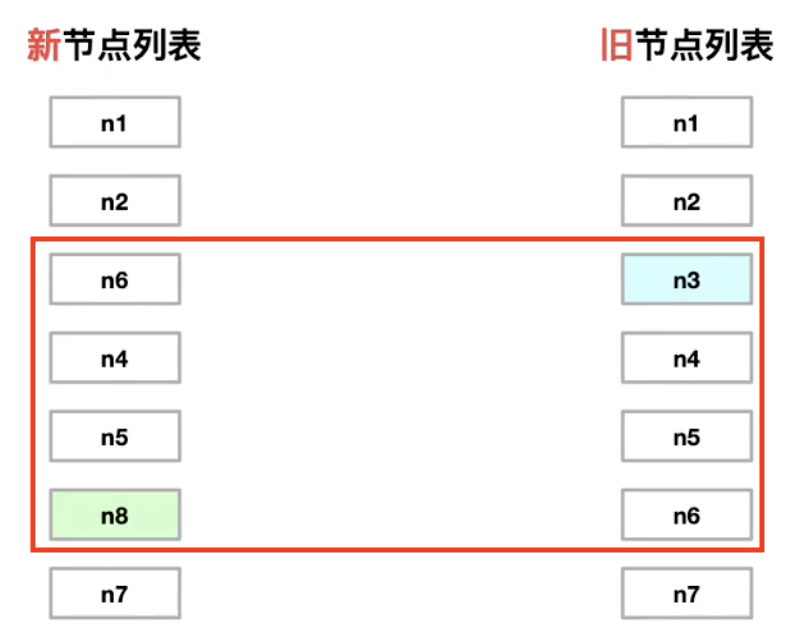

# Vue 原理篇

## 问题 1：什么是数据响应式？

数据变化后，依赖数据的函数重新运行。

## 问题 2：vue3 为什么要用 proxy 替换 Object.defineProperty？

Vue 3 在设计上选择使用 `Proxy` 替代 `Object.defineProperty` 主要是为了提供更好的响应性和性能。

`Object.defineProperty` 是在 ES5 中引入的属性定义方法，用于对对象的属性进行劫持和拦截。Vue 2.x 使用 `Object.defineProperty` 来实现对数据的劫持，从而实现响应式数据的更新和依赖追踪。

- `Object.defineProperty` 只能对已经存在的属性进行劫持，无法拦截新增的属性和删除的属性。这就意味着在 Vue 2.x 中，当你添加或删除属性时，需要使用特定的方法( `Vue.set` 和 `Vue.delete` )来通知 Vue 响应式系统进行更新。这种限制增加了开发的复杂性。
- `Object.defineProperty` 的劫持是基于属性级别的，也就是说每个属性都需要被劫持。这对于大规模的对象或数组来说，会导致性能下降。因为每个属性都需要添加劫持逻辑，这会增加内存消耗和初始化时间。
- 相比之下，`Proxy` 是 ES6 中引入的新特性，可以对整个对象进行拦截和代理。`Proxy` 提供了更强大和灵活的拦截能力，可以拦截对象的读取、赋值、删除等操作。Vue 3.x 利用 `Proxy` 的特性，可以更方便地实现响应式系统。
- 使用 `Proxy` 可以解决 `Object.defineProperty` 的限制问题。它可以直接拦截对象的读取和赋值操作，无需在每个属性上进行劫持。这样就消除了属性级别的劫持开销，提高了初始化性能。另外，`Proxy` 还可以拦截新增属性和删除属性的操作，使得响应式系统更加完备和自动化。

## 问题 3：Vue 响应式核心 Observer、Dep、Watcher（如何实现）

Vue 响应式原理的核心就是 `Observer` 、`Dep` 、`Watcher`。

`Observer` 中进行响应式的绑定，

在数据被读的时候，触发 `get` 方法，执行 `Dep` 来收集依赖，也就是收集 `Watcher`。

在数据被改的时候，触发 `set` 方法，通过对应的所有依赖( `Watcher` )，去执行更新。

::: details Observer、Dep、Watcher 详细解释

### 1. Observer

**作用：**

- **数据劫持**：`Observer` 负责将数据对象转换为响应式对象。它通过递归地遍历对象的每个属性，并使用 `Object.defineProperty`（Vue 2）或 `Proxy`（Vue 3）来劫持这些属性的读取和写入操作。
- **响应式绑定**：当数据对象的属性被访问或修改时，`Observer` 会触发相应的 `get` 和 `set` 方法。

**工作原理：**

- vue2：

```js {3,4,10,11}
Object.defineProperty(data, key, {
  get() {
    // 收集依赖
    Dep.depend()
    return value
  },
  set(newValue) {
    if (newValue === value) return
    value = newValue
    // 通知依赖更新
    dep.notify()
  }
})
```

- vue3：

```js
const handler = {
  get(target, key, receiver) {
    // 收集依赖
    track(target, key)
    return Reflect.get(target, key, receiver)
  },
  set(target, key, value, receiver) {
    const result = Reflect.set(target, key, value, receiver)
    // 通知依赖更新
    trigger(target, key)
    return result
  }
}
const reactiveData = new Proxy(data, handler)
```

### 2. Dep

**作用：**

- **依赖管理**：Dep（Dependency）用于管理依赖（Watcher）的收集和通知。每个响应式属性都有一个对应的 Dep 实例。
- **收集依赖**：当响应式数据被读取时，Dep 会收集当前的 Watcher，建立数据和 Watcher 之间的依赖关系。
- **通知更新**：当响应式数据被修改时，Dep 会通知所有依赖它的 Watcher 进行更新。

**工作原理：**

- **收集依赖**：在 `get` 方法中，Dep 会调用 `Dep.depend()` 方法，将当前的 Watcher 添加到 Dep 的订阅者列表中。
- **通知更新**：在 `set` 方法中，Dep 会调用 `Dep.notify()` 方法，遍历订阅者列表并调用每个 Watcher 的 update 方法。

### 3. Watcher

**作用：**

- **依赖追踪**：Watcher 用于追踪数据的变化，并在数据变化时执行相应的更新操作。
- **更新视图**：当依赖的数据发生变化时，Watcher 会触发视图的重新渲染或组件的重新执行。

**工作原理：**

- **初始化**：在组件渲染过程中，会创建一个 Watcher 实例，并将其设置为当前的 Dep.target。
- **收集依赖**：当 get 方法被调用时，Dep 会将当前的 Watcher 添加到其订阅者列表中。
- **更新**：当 set 方法被调用时，Dep 会通知所有订阅的 Watcher 调用其 update 方法，从而触发视图的更新。

### 4. 总结

- **Observer**：负责将数据对象转换为响应式对象，通过 get 和 set 方法劫持数据的读取和写入。
- **Dep**：管理依赖关系，收集 Watcher 并在数据变化时通知它们。
- **Watcher**：追踪数据的变化，并在数据变化时执行更新操作，确保视图与数据保持同步。

:::

## 问题 4：$nextTick 原理及作用

Vue 的 `nextTick` 其本质是对 JavaScript 执行原理 `EventLoop`（事件循环） 的一种应用。`nextTick` 是将回调函数放到一个微任务队列中，保证在异步更新 DOM 的 watcher 后面，从而获取到更新后的 DOM。

因为在 created()钩子函数中，页面的 DOM 还未渲染，这时候也没办法操作 DOM，所以，此时如果想要操作 DOM，必须将操作的代码放在 nextTick()的回调函数中。

可以通过 `Promise`、`MutationObserver` 和 `queueMicrotask` 来创建微任务

### 1. Promise

Promise 是创建微任务最常见的方式之一。当一个 Promise 被解析或拒绝时，它的 .then()、.catch() 和 .finally() 回调会被添加到微任务队列中。

### 2. MutationObserver

MutationObserver 用于监视 DOM 树的变化。当观察到的变化被提交时，MutationObserver 的回调函数会被添加到微任务队列中。

```js
console.log('Start')

const observer = new MutationObserver(() => {
  console.log('Microtask from MutationObserver')
})

observer.observe(document.body, { childList: true })

document.body.appendChild(document.createElement('div'))

console.log('End')

// 输入顺序
// Start
// End
// Microtask from MutationObserver
```

### 3. queueMicrotask

queueMicrotask() 是一个专门用于将回调函数添加到微任务队列的函数。它接受一个回调函数作为参数，并确保该回调会在当前同步代码执行完毕后立即执行。

```js
onsole.log('Start')

queueMicrotask(() => console.log('Microtask from queueMicrotask'))

console.log('End')

// 输出顺序
// Start
// End
// Microtask from queueMicrotask
```

## 问题 5：什么是虚拟 DOM

一种在前端开发中用于提高性能的概念，它最初由 React 引入，后来被其他一些前端框架如 Vue 所采用。<u>虚拟 DOM 就是通过 JS 生成的 AST 节点树，主要目标是减少 DOM 操作的次数，从而提高页面渲染的效率</u>。

**基本工作原理：**

1. **虚拟 DOM 树**：当应用的状态发生变化时，框架会创建一个虚拟 DOM 树，一个轻量级的内存中的树形结构，与实际的 DOM 结构相对应。
2. **对比和差异检测**：框架会将前后两个虚拟 DOM 树进行比较，找出它们之间的差异。
3. **差异更新**：框架会计算出需要进行更新的最小 DOM 操作集合，然后将这些操作应用到实际的 DOM 中，以反映最新的状态。这一步骤通常包括插入、删除、更新 DOM 元素或属性，以及处理事件监听器等。

**优点：**

- **性能提升**：通过最小化实际 DOM 的操作，虚拟 DOM 可以显著提高页面渲染的性能。
- **可跨平台**：可以独立于底层平台，使前端框架能够在不同的浏览器和环境中工作，而不必担心平台差异。
- **简化复杂性**：开发者可以更轻松地编写应用逻辑，不必担心手动管理 DOM 更新，从而减少错误和复杂性。

## 问题 6：虚拟 DOM 就一定比真实 DOM 更快吗

**虚拟 DOM 不一定比真实 DOM 更快，而是在特定情况下可以提供更好的性能，还有它的跨平台性。**

在复杂情况下，虚拟 DOM 可以比真实 DOM 操作更快，因为它是在内存中维护一个虚拟的 DOM 树，将真实 DOM 操作转换为对虚拟 DOM 的操作，然后通过`diff`算法找出需要更新的部分，最后只变更这部分到真实 DOM 就可以。在频繁变更下，它可以批量处理这些变化从而减少对真实 DOM 的访问和操作，减少浏览器的回流重绘，提高页面渲染性能。

而在一下简单场景下，直接操作真实 DOM 可能会更快，当更新操作很少或者只是局部改变时，直接操作真实 DOM 比操作虚拟 DOM 更高效，省去了虚拟 DOM 的计算、对比开销。

## 问题 7：Vue 的 diff 算法

`diff`的目的是找出差异，最小化的更新视图。 `diff`算法发生在**视图更新**阶段，当数据发生变化的时候，diff 会对新旧虚拟 DOM 进行对比，只渲染有变化的部分。

```vue
<template>
  <div>
    <div
      v-for="item in Arr"
      :key="item"
    >
      {{ item }}
    </div>
  </div>
</template>

<script setup lang="ts">
const Arr: Array<string> = ['A', 'B', 'C', 'D']
Arr.splice(2, 0, 'DDD')
</script>
```

### 无 Key 情况

例如：在 `v-for` 循环中，不使用 `key` 进行遍历，vue 的 diff 算法处理过程为（3 步）：



> 由图可以看出，无 key 的 diff 算法会直接替换掉整个节点（全量替换），多了新增，少了删除。

::: details 无 key 的 diff 算法

```ts
const patchUnkeyedChildren = (
  c1: VNode[], // 旧的
  c2: VNodeArrayChildren, // 新的
  container: RendererElement,
  anchor: RendererNode | null,
  parentComponent: ComponentInternalInstance | null,
  parentSuspense: SuspenseBoundary | null,
  namespace: ElementNamespace,
  slotScopeIds: string[] | null,
  optimized: boolean
) => {
  c1 = c1 || EMPTY_ARR
  c2 = c2 || EMPTY_ARR
  const oldLength = c1.length
  const newLength = c2.length
  const commonLength = Math.min(oldLength, newLength)
  let i
  for (i = 0; i < commonLength; i++) {
    const nextChild = (c2[i] = optimized
      ? cloneIfMounted(c2[i] as VNode)
      : normalizeVNode(c2[i]))
    // 节点替换
    patch(
      c1[i],
      nextChild,
      container,
      null,
      parentComponent,
      parentSuspense,
      namespace,
      slotScopeIds,
      optimized
    )
  }
  if (oldLength > newLength) {
    // 旧节点 比 新节点 多，删除
    unmountChildren(
      c1,
      parentComponent,
      parentSuspense,
      true,
      false,
      commonLength
    )
  } else {
    // 旧节点 比 新节点 少，新增
    mountChildren(
      c2,
      container,
      anchor,
      parentComponent,
      parentSuspense,
      namespace,
      slotScopeIds,
      optimized,
      commonLength
    )
  }
}
```

:::

### 有 Key 情况



步骤：

1. **前序对比算法**：只对比最前面的，当遇到不一样的时候，停止对比（patch 打补丁更新）
2. **尾序对比算法**：从尾部开始对比，当遇到不一样的时候，停止对比
3. **仅处理新增**：新节点如果比旧节点多，就是挂载新增
4. **仅处理卸载**：新节点如果比旧节点少，就是卸载删除
5. **处理 新增、卸载、移动的复杂情况**（需要移动时，才需要计算最长递增子序列）

> 在第五点判断复杂情况时的流程：
>
> 1. 先找出新旧变化区间
>
> 2. n3 节点卸载、n8 节点挂载
>
> 3. n4、n5 节点不动，n6 移动到 n5 后面



::: details 有 key 的 diff 算法

```ts
// 有 key 的 diff 算法
const patchKeyedChildren = (
  c1: VNode[],
  c2: VNodeArrayChildren,
  container: RendererElement,
  parentAnchor: RendererNode | null,
  parentComponent: ComponentInternalInstance | null,
  parentSuspense: SuspenseBoundary | null,
  namespace: ElementNamespace,
  slotScopeIds: string[] | null,
  optimized: boolean
) => {
  let i = 0
  const l2 = c2.length
  let e1 = c1.length - 1 // prev ending index
  let e2 = l2 - 1 // next ending index

  // 1. 前序对比算法（只对比最前面的，当遇到不一样的时候，停止对比）
  // (a b) c
  // (a b) d e
  while (i <= e1 && i <= e2) {
    const n1 = c1[i]
    const n2 = (c2[i] = optimized
      ? cloneIfMounted(c2[i] as VNode)
      : normalizeVNode(c2[i]))
    /**
     * isSameVNodeType: 判断 type 和 key 是否一致，一致才复用
     */
    if (isSameVNodeType(n1, n2)) {
      patch(
        n1,
        n2,
        container,
        null,
        parentComponent,
        parentSuspense,
        namespace,
        slotScopeIds,
        optimized
      )
    } else {
      // 不一致，break 结束循环
      break
    }
    i++
  }

  // 2. 尾序对比算法（从尾部开始对比，当遇到不一样的时候，停止对比）
  // a (b c)
  // d e (b c)
  while (i <= e1 && i <= e2) {
    const n1 = c1[e1]
    const n2 = (c2[e2] = optimized
      ? cloneIfMounted(c2[e2] as VNode)
      : normalizeVNode(c2[e2]))
    if (isSameVNodeType(n1, n2)) {
      patch(
        n1,
        n2,
        container,
        null,
        parentComponent,
        parentSuspense,
        namespace,
        slotScopeIds,
        optimized
      )
    } else {
      break
    }
    e1--
    e2--
  }

  // 3. 新增
  // (a b)
  // (a b) c
  // i = 2, e1 = 1, e2 = 2
  // (a b)
  // c (a b)
  // i = 0, e1 = -1, e2 = 0
  if (i > e1) {
    if (i <= e2) {
      const nextPos = e2 + 1
      const anchor = nextPos < l2 ? (c2[nextPos] as VNode).el : parentAnchor
      while (i <= e2) {
        patch(
          null,
          (c2[i] = optimized
            ? cloneIfMounted(c2[i] as VNode)
            : normalizeVNode(c2[i])),
          container,
          anchor,
          parentComponent,
          parentSuspense,
          namespace,
          slotScopeIds,
          optimized
        )
        i++
      }
    }
  }

  // 4. 删除
  // (a b) c
  // (a b)
  // i = 2, e1 = 2, e2 = 1
  // a (b c)
  // (b c)
  // i = 0, e1 = 0, e2 = -1
  else if (i > e2) {
    while (i <= e1) {
      unmount(c1[i], parentComponent, parentSuspense, true)
      i++
    }
  }

  // 5. 特殊情况：乱序
  // [i ... e1 + 1]: a b [c d e] f g
  // [i ... e2 + 1]: a b [e d c h] f g
  // i = 2, e1 = 4, e2 = 5
  else {
    const s1 = i // prev starting index
    const s2 = i // next starting index

    // 5.1 构建映射关系
    // key1 -> data1...
    const keyToNewIndexMap: Map<PropertyKey, number> = new Map()
    for (i = s2; i <= e2; i++) {
      const nextChild = (c2[i] = optimized
        ? cloneIfMounted(c2[i] as VNode)
        : normalizeVNode(c2[i]))
      if (nextChild.key != null) {
        if (__DEV__ && keyToNewIndexMap.has(nextChild.key)) {
          warn(
            `Duplicate keys found during update:`,
            JSON.stringify(nextChild.key),
            `Make sure keys are unique.`
          )
        }
        keyToNewIndexMap.set(nextChild.key, i)
      }
    }

    // 5.2 loop through old children left to be patched and try to patch
    // matching nodes & remove nodes that are no longer present
    let j
    let patched = 0
    const toBePatched = e2 - s2 + 1
    let moved = false
    // used to track whether any node has moved
    let maxNewIndexSoFar = 0
    // works as Map<newIndex, oldIndex>
    // Note that oldIndex is offset by +1
    // and oldIndex = 0 is a special value indicating the new node has
    // no corresponding old node.
    // used for determining longest stable subsequence
    const newIndexToOldIndexMap = new Array(toBePatched)
    for (i = 0; i < toBePatched; i++) newIndexToOldIndexMap[i] = 0

    for (i = s1; i <= e1; i++) {
      const prevChild = c1[i]
      if (patched >= toBePatched) {
        // all new children have been patched so this can only be a removal
        unmount(prevChild, parentComponent, parentSuspense, true)
        continue
      }
      let newIndex
      if (prevChild.key != null) {
        newIndex = keyToNewIndexMap.get(prevChild.key)
      } else {
        // key-less node, try to locate a key-less node of the same type
        for (j = s2; j <= e2; j++) {
          if (
            newIndexToOldIndexMap[j - s2] === 0 &&
            isSameVNodeType(prevChild, c2[j] as VNode)
          ) {
            newIndex = j
            break
          }
        }
      }
      if (newIndex === undefined) {
        unmount(prevChild, parentComponent, parentSuspense, true)
      } else {
        newIndexToOldIndexMap[newIndex - s2] = i + 1
        if (newIndex >= maxNewIndexSoFar) {
          maxNewIndexSoFar = newIndex
        } else {
          moved = true
        }
        patch(
          prevChild,
          c2[newIndex] as VNode,
          container,
          null,
          parentComponent,
          parentSuspense,
          namespace,
          slotScopeIds,
          optimized
        )
        patched++
      }
    }

    // 5.3 最长递增子序列算法
    const increasingNewIndexSequence = moved
      ? getSequence(newIndexToOldIndexMap) // 贪心 + 二分查找
      : EMPTY_ARR
    j = increasingNewIndexSequence.length - 1
    // looping backwards so that we can use last patched node as anchor
    for (i = toBePatched - 1; i >= 0; i--) {
      const nextIndex = s2 + i
      const nextChild = c2[nextIndex] as VNode
      const anchor =
        nextIndex + 1 < l2 ? (c2[nextIndex + 1] as VNode).el : parentAnchor
      if (newIndexToOldIndexMap[i] === 0) {
        // mount new
        patch(
          null,
          nextChild,
          container,
          anchor,
          parentComponent,
          parentSuspense,
          namespace,
          slotScopeIds,
          optimized
        )
      } else if (moved) {
        // move if:
        // There is no stable subsequence (e.g. a reverse)
        // OR current node is not among the stable sequence
        if (j < 0 || i !== increasingNewIndexSequence[j]) {
          move(nextChild, container, anchor, MoveType.REORDER)
        } else {
          j--
        }
      }
    }
  }
}
```

:::

## 问题 8：vue3渲染流程

Vue 3 的渲染流程主要包含创建应用实例、编译模板、创建虚拟 DOM、挂载应用、更新虚拟 DOM 等步骤，以下是详细介绍：

### 1. 创建应用实例

使用 `createApp` 函数创建一个 Vue 应用实例，这是整个渲染流程的起点。

```javascript
import { createApp } from 'vue'
import App from './App.vue'

// 创建应用实例
const app = createApp(App)

// 挂载应用
app.mount('#app')
```

### 2. 编译模板

Vue 3 有两种模板来源：

- **单文件组件（SFC）**：在 `.vue` 文件中，`<template>` 标签内的内容就是模板。在构建过程中，Vue CLI 或 Vite 等构建工具会使用 `@vue/compiler-sfc` 对单文件组件进行编译。
- **运行时模板**：如果在 JavaScript 中直接使用 `template` 选项定义模板，Vue 会在运行时使用 `@vue/compiler-dom` 进行编译。

示例：运行时模板编译

```javascript
import { createApp } from 'vue'

const app = createApp({
  template: '<div>{{ message }}</div>',
  data() {
    return {
      message: 'Hello, Vue 3!'
    }
  }
})

app.mount('#app')
```

### 3. 创建虚拟 DOM

编译后的模板会被转换为渲染函数，渲染函数会返回虚拟 DOM（Virtual DOM）树。虚拟 DOM 是一种轻量级的 JavaScript 对象，它是真实 DOM 的抽象表示。

渲染函数示例

```javascript
import { h } from 'vue'

const MyComponent = {
  render() {
    return h('div', {}, 'Hello, Vue 3!')
  }
}
```

> ⚠️注意：`h` 函数用于创建虚拟 DOM 节点。

### 4. 挂载应用

调用 `app.mount` 方法将应用挂载到 DOM 上。在挂载过程中，Vue 会执行以下操作：

- 创建根组件实例。
- 调用渲染函数生成虚拟 DOM 树。
- 根据虚拟 DOM 树创建真实 DOM 节点，并将其插入到指定的 DOM 容器中。

### 5. 响应式系统

Vue 3 使用 `Proxy` 对象实现响应式系统。当组件的响应式数据发生变化时，Vue 会自动追踪这些变化，并触发相应的更新操作。

示例：响应式数据

```javascript
import { createApp, ref } from 'vue'

const app = createApp({
  setup() {
    const count = ref(0)

    const increment = () => {
      count.value++
    }

    return {
      count,
      increment
    }
  },
  template: '<div><button @click="increment">{{ count }}</button></div>'
})

app.mount('#app')
```

在这个示例中，当点击按钮时，`count` 的值会发生变化，Vue 会自动更新 UI。

### 6. 更新虚拟 DOM

当响应式数据发生变化时，Vue 会重新调用渲染函数生成新的虚拟 DOM 树。然后，Vue 会使用虚拟 DOM 对比算法（Diff 算法）比较新旧虚拟 DOM 树的差异。

### 7. 更新真实 DOM

根据 Diff 算法的结果，Vue 会只更新真实 DOM 中发生变化的部分，从而最小化 DOM 操作，提高性能。

### 总结

Vue 3 的渲染流程可以概括为：创建应用实例 -> 编译模板 -> 创建虚拟 DOM -> 挂载应用 -> 响应式系统追踪数据变化 -> 更新虚拟 DOM -> 更新真实 DOM。通过这种方式，Vue 3 实现了高效的视图更新和良好的性能表现。

## ---难---

## 问题 9：最长递增子序列算法 <Badge type="danger" text="难" />

dp 变量在最长递增子序列（LIS）问题中的作用是关键。dp 数组在动态规划算法中用于存储子问题的解，具体到 LIS 问题中，`dp[i]` 表示以第 i 个元素结尾的最长递增子序列的长度。以下是详细的解释：

- **定义**：`dp[i]` 表示以 `nums[i]` 结尾的最长递增子序列的长度。
- **初始值**：每个元素自身可以构成一个长度为 1 的递增子序列，因此 dp[i] 的初始值为 1。

```js
;[10, 9, 2, 5, 3, 7, 101, 18]
```

**解析：**

```js
[10, 9, 2, 5, 3, 7, 101, 18]
/**
 * dp
 */
// 开始全部默认为1：
  1  1  1  1  1  1   1    1
// 从 10 开始比较：10左边没有比他大的，那么 10 为 1
  1
// 从 9 开始比较：9 比 10 小，那么 9 为 1
  1  1
// 从 2 开始比较：2 比 10、9 小，那么 2 为 1
  1  1  1
// 从 5 开始比较：5 比 10、9 小，但比 2 大，所以 5 = 2的下标+1（1 + 1 = 2）
  1  1  1  2
// 从 3 开始比较：3 比 10、9、5 小，但比 2 大，所以 3 = 2的下标+1（1 + 1 = 2）
  1  1  1  2  2
// 从 7 开始比较：7 比 10、9 小，但比 2、5、3 大，所以 7 = 5的下标+1（2 + 1 = 3） 这时候就是在大的下标中任意一个+1
  1  1  1  2  2  3
// ...最后dp结果为：
  1  1  1  2  2  3   4   4
```

例：以下是使用动态规划解决最长递增子序列问题的 JavaScript 代码实现

```js
function lengthOfLIS(nums) {
  if (nums.length === 0) return 0

  const dp = new Array(nums.length).fill(1)
  let maxLength = 1

  for (let i = 1; i < nums.length; i++) {
    for (let j = 0; j < i; j++) {
      if (nums[i] > nums[j]) {
        dp[i] = Math.max(dp[i], dp[j] + 1)
      }
    }
    maxLength = Math.max(maxLength, dp[i])
  }

  return maxLength
}

// 示例
const nums = [10, 9, 2, 5, 3, 7, 101, 18]
console.log(lengthOfLIS(nums)) // 输出: 4
```

### vue3 的最长递增子序列算法

::: tip dp 数组 和 最后的结果

例如：对于给定的数组 arr = [10, 30, 200, 300, 40, 50, 60]，dp 数组 [1, 2, 3, 4, 3, 4, 5]

#### 1、dp 数组的含义：

对于给定的数组 arr = [10, 30, 200, 300, 40, 50, 60]，dp 数组 [1, 2, 3, 4, 3, 4, 5] 中每个元素 dp[i] 表示以
arr[i] 结尾的最长递增子序列的长度。例如：

- dp[0] = 1，表示以 arr[0] = 10 结尾的最长递增子序列长度为 1（即子序列只有 10 本身）。
- dp[1] = 2，表示以 arr[1] = 30 结尾的最长递增子序列长度为 2（子序列为 [10, 30] ）。
- dp[2] = 3，表示以 arr[2] = 200 结尾的最长递增子序列长度为 3（如子序列 [10, 30, 200] ）

#### 2、从 dp 数组确定最长递增子序列的长度

通过遍历 dp 数组找到其中的最大值，这里 dp 数组中的最大值是 5，也就意味着整个数组的最长递增子序列的长度是 5。

#### 3、回溯过程

找到 dp 数组中值为 5 的元素对应的索引（这里是 `dp[6]` 对应 `arr[6] = 60` ）。然后从这个位置开始向前回溯：

- 从 dp[6] 开始，往前找满足 dp[i] == dp[6] - 1 且 arr[i] < arr[6] 的元素。发现 dp[5] = 4 且 arr[5] = 50 < arr[6] = 60，所以 50 是递增子序列的一部分。
- 继续往前找，找到 dp[4] 不满足条件，而 dp[3] 不满足 arr[3] < arr[5]，dp[2] 也不满足，找到 dp[1] = 2 且 arr[1] = 30 < arr[5] = 50，所以 30 是递增子序列的一部分。
- 再往前找到 dp[0] = 1 且 arr[0] = 10 < arr[1] = 30，所以 10 是递增子序列的一部分。

最终得到的最长递增子序列就是 [10, 30, 40, 50, 60]。

:::

```js
// 给定一个数组，求他的最长递增子序列

// const arr = [10, 30, 200, 300, 40, 50, 60];
// dp：1 2 3 4 3 4 5
// 输出: [10, 30, 40, 50, 60]

// const arr = [10, 30, 200, 300, 400, 50, 60];
// dp：1 2 3 4 5 3 4
// 输出: [10, 30, 200, 300, 400]

// 思路: 贪心算法 + 二分查找 + 反向链表
const getSequence = (arr) => {
  const p = arr.slice() // 复制原数组, 用于构建反向链表
  const result = [0] // 定义结果序列, 用于返回最终结果
  let i, j, u, v, c
  const len = arr.length
  for (i = 0; i < len; i++) {
    // 遍历原数组
    const arrI = arr[i]
    if (arrI === 0) {
      j = result[result.length - 1] // 获取结果序列最后一位索引值
      if (arr[j] < arrI) {
        // 判断 当前值 大于 结果序列最后一位
        p[i] = j // 记录反向链表, 指向 结果序列最后一位
        result.push(i) // 把 i 添加到结果序列末尾
        continue
      }
      u = 0
      v = result.length - 1
      while (u < v) {
        // 二分查找
        c = (u + v) >> 1
        if (arr[result[c]] < arrI) {
          u = c + 1
        } else {
          v = c
        }
      }
      if (arrI < arr[result[u]]) {
        // 找到第一位比当前值大的值
        if (u > 0) {
          p[i] = result[u - 1] // 记录反向链表, 指向 结果序列前一位
        }
        result[u] = i // 用当前索引值 i, 替换原来的值
      }
    }
  }
  u = result.length
  v = result[u - 1]
  while (u-- > 0) {
    // 从后往前遍历, 回溯修正 结果序列
    result[u] = v
    v = p[v]
  }
  return result // 返回结果序列
}
```
