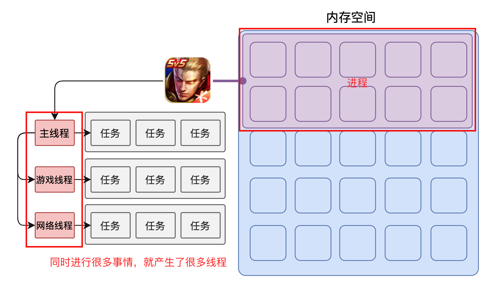
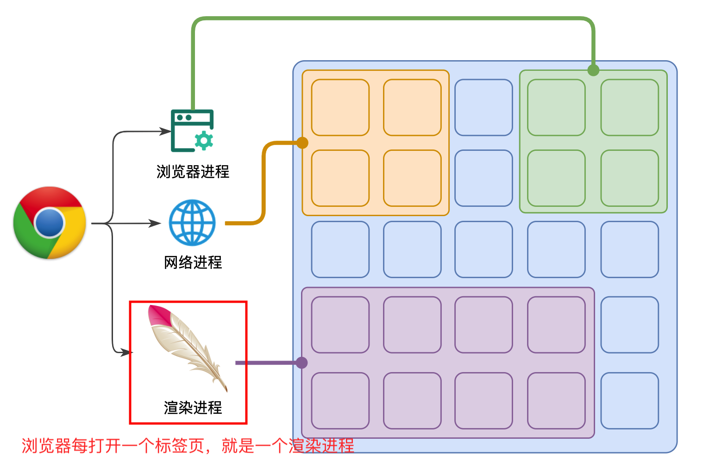
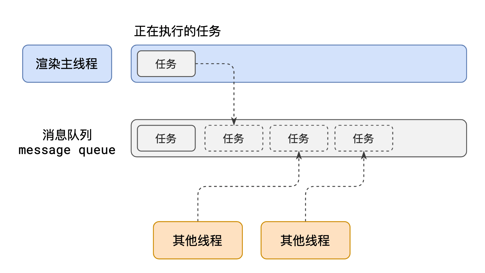
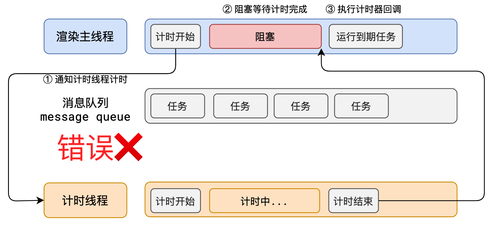
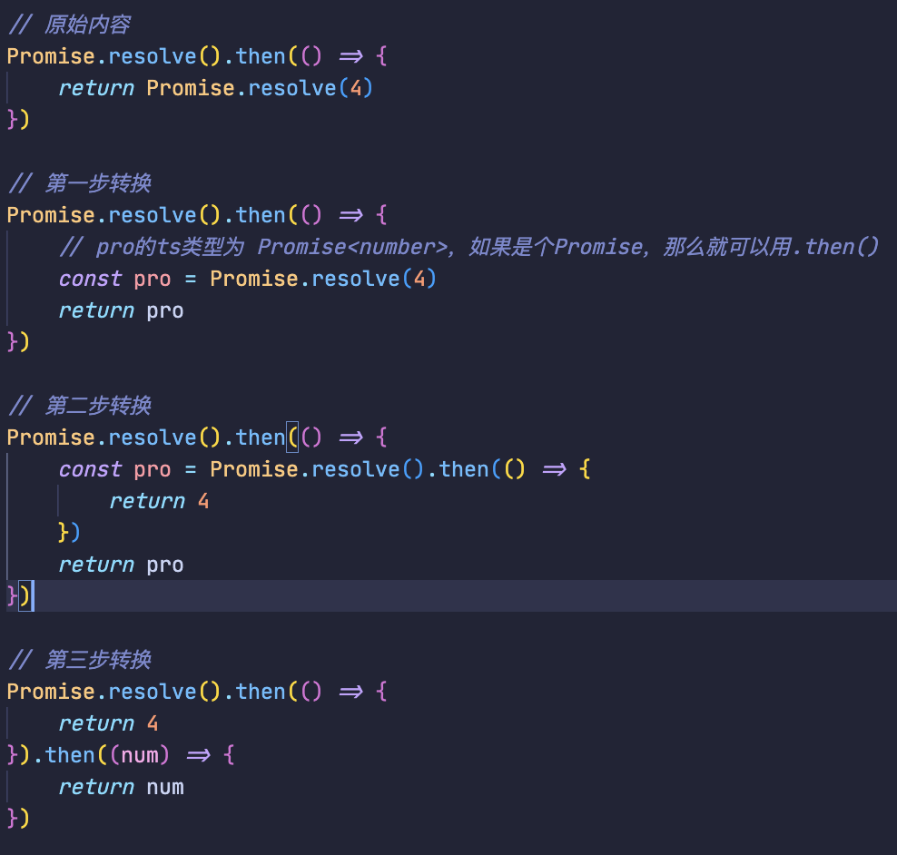

# 事件循环

## 浏览器的进程模型

### 1、何为进程？

程序运行需要有它自己专属的内存空间，这个空间就是进程。

每个应用至少有一个进程，**进程之间相互独立**，即使要通信，也需要双方同意。

### 2、何为线程？

有了进程后，就可以运行程序的代码了。

运行代码的「人」称之为「线程」。

**一个进程 `至少` 有一个线程，所以在进程开启后会自动创建一个线程来运行代码，该线程称之为 `主线程`。**

> 主线程结束，整个程序也就结束了

如果程序需要同时执行多块代码，主线程就会启动更多的线程来执行代码，所以一个进程中可以包含多个线程。



### 3、浏览器有哪些进程和线程？

**浏览器是一个 `多进程多线程` 的应用程序**

为了避免相互影响，为了减少连环崩溃的几率，**当启动浏览器后，它会自动启动 `多个进程`**。



> 可以在浏览器的**任务管理器**中查看当前的所有进程

其中，最主要的进程有：

1. 浏览器进程

   主要负责 `界面显示`(tab 标签页、浏览器前进后退、地址栏等)、`用户交互`、`子进程管理`(网络进程、渲染进程等其他进程都是浏览器进程启动的，最开始只有浏览器进程）等。浏览器进程内部会启动多个线程处理不同的任务。

2. 网络进程

   负责加载网络资源。网络进程内部会启动多个线程来处理不同的网络任务。

3. **渲染进程**（`重点`）

   渲染进程启动后，它会开启一个**主线程(也叫渲染主线程)**，主线程负责执行 HTML、CSS、JS 代码。

   默认情况下，浏览器会为每个标签页开启一个新的渲染进程，以保证不同的标签页之间不相互影响。

::: tip 注意

**事件循环**发生在**渲染主线程**

:::

## 渲染主线程是如何工作的？

渲染主线程是浏览器中最繁忙的线程，需要它处理的任务包括但不限于：

- 解析 HTML
- 解析 CSS
- 计算样式
- 布局
- 处理图层
- 每秒把页面画 60 次（帧率：1 / 60 = 16.7ms）
- 执行全局 JS 代码
- 执行事件处理函数
- 执行计时器的回调函数
- ......

要处理这么多任务，主线程应该如何调度任务？

答：排队



1. 在最开始的时候，渲染主线程会进入一个无限循环
2. 每一次循环会检查消息队列中是否有任务存在。如果有，就取出第一个任务执行，执行完一个后进入下一次循环；如果没有，则进入休眠状态。
3. 其他所有线程（包括其他进程的线程）可以随时向消息队列添加任务。新任务会加到消息队列的末尾。在添加新任务时，如果主线程是休眠状态，则会将其唤醒以继续循环拿取任务

**整个过程，被称之为事件循环（消息循环）**

## 解释 1：何为异步？

代码在执行过程中，会遇到一些无法立即处理的任务，比如：

- 计时完成后需要执行的任务 —— `setTimeout`、`setInterval`
- 网络通信完成后需要执行的任务 -- `XHR`、`Fetch`
- 用户操作后需要执行的任务 -- `addEventListener`

如果让渲染主线程等待这些任务的时机达到，就会导致主线程长期处于**阻塞**的状态，从而导致浏览器**卡死**：

异步代码变为同步，阻塞渲染主进程图：



**渲染主线程承担着极其重要的工作，无论如何都不能阻塞！** 因此，浏览器选择**异步**来解决这个问题：


使用异步的方式，**渲染主线程永不阻塞**

::: tip 面试题：如何理解 JS 的异步？

**参考答案：**

**JS 是一门单线程的语言**，这是因为**它运行在浏览器的渲染主线程中**，而渲染主线程只有一个。

而渲染主线程承担着诸多的工作，渲染页面、执行 JS 都在其中运行。

**如果使用同步的方式，就极有可能导致主线程产生阻塞**，从而导致消息队列中的很多其他任务无法得到执行。这样一来，一方面会导致**繁忙的主线程白白的消耗时间，另一方面导致页面无法及时更新，给用户造成卡死现象**。

**所以浏览器采用异步的方式来避免**。具体做法是当某些任务发生时，比如计时器、网络、事件监听，**主线程将任务交给其他线程去处理，自身立即结束任务的执行，转而执行后续代码。当其他线程完成时，将事先传递的回调函数包装成任务，加入到消息队列的末尾排队，等待主线程调度执行**。

在这种异步模式下，浏览器永不阻塞，从而最大限度的保证了单线程的流畅运行。

:::

## 解释 2：JS 为何会阻碍渲染？

> 因为 js 和 渲染 都在浏览器的渲染主线程上

**例子：**

```html
<!DOCTYPE html>
<html lang="en">
  <head></head>
  <body>
    <h1>Wifi is awesome!</h1>
    <button>change</button>
    <script>
      var h1 = document.querySelector('h1')
      var btn = document.querySelector('button')

      // 死循环指定的时间
      function delay(duration) {
        var start = Date.now()
        while (Date.now() - start < duration) {}
      }

      btn.onclick = function () {
        h1.textContent = 'wifi很帅' // 会产生一个 绘制 任务，进入任务队列
        console.log(h1.textContent) // 这里的打印可以看到 h1.textContent 的值是 'wifi很帅'
        delay(3000) // 死循环 3s
      }
    </script>
  </body>
</html>
```

**结果：**

当点击按钮后，会等待 3s 后，才修改页面上 h1 的值。

**原因：**

浏览器主线程在渲染时候会将 `btn.onclick` 按钮点击事件放到 `交互线程` 中，当用户点击按钮，会触发事件回调，`h1.textContent` 这个代码，要使 h1 元素内容改变，需要产生 `绘制` 任务，

此时，渲染主线程有：`h1.textContent`、`console.log(h1.textContent)`、`delay(3000)` 这三个任务，而任务队列有：`绘制` 任务，所以渲染主线程会先执行 `绘制` 任务管理器

但是由于 `delay(3000)` 是一个死循环，导致主线程一直处于阻塞状态，从而导致 `绘制` 任务无法得到执行，从而导致页面无法及时更新，给用户造成卡死现象。

## 解释 3：任务有优先级吗？

任务没有优先级，在消息队列中先进先出，但`消息队列是有优先级的`

W3C 的解释:

- 每个任务都有一个任务类型，同一个类型的任务必须在一个队列，不同类型的任务可以分属于不同的队列。在一次事件循环中，浏览器可以根据实际情况从不同的队列中取出任务执行。（意思是 `可以有多个任务队列`）
- 浏览器必须准备好一个微队列，微队列中的任务优先所有其他任务执行。（`微队列优先级最高`）
  > 随着浏览器的复杂度急剧提升，W3C 不再使用宏队列的说法

在目前 chrome 的实现中，至少包含了下面的队列：

- 延时队列：用于存放计时器到达后的回调任务，优先级 `中`
- 交互队列：用于存放用户操作后产生的事件处理任务，优先级 `高`
- 微队列：用户存放需要最快执行的任务，优先级 `最高`

> 添加任务到微队列的主要方式主要是使用 Promise、MutationObserver

在去任务队列中拿去任务时，会先去 `微队列` 中查看，如果没有就去 `交互队列` 中查看...

**练习 1：**

```js
setTimeout(function () {
  console.log(1) // 3、输出1
}, 0)

function delay(duration) {
  var start = Date.now()
  while (Date.now() - start < duration) {}
}
delay(3000) // 1、卡 3s
console.log(2) // 2、输出2
```

**练习 2：**

```js
function a() {
  console.log(1)
  Promise.resolve().then(function () {
    console.log(2)
  })
}
setTimeout(function () {
  // 时间到了后，将该函数放入 延时队列 中
  console.log(3)
}, 0)

Promise.resolve().then(a)

console.log(4)

4 // 全局js
1 // Promise.resolve().then(a); 中调用 'a函数' 放入微任务队列，a中输出1
2 // 微任务队列中，输出2
3 // 延时队列
```

## 面试题 1：阐述一下 JS 的事件循环

事件循环又叫做消息循环，是浏览器渲染主线程的工作方式。

它开启一个不会结束的 for 循环，每次循环从消息队列中取出第一个任务执行，而其他线程只需要在合适的时候将任务加入到队列末尾即可。

每个任务有不同的类型，同类型的任务必须在同一个队列，不同的任务可以属于不同的队列。不同任务队列有不同的优先级，在一次事件循环中，由浏览器自行决定取哪一个队列的任务。但浏览器必须有一个微队列，微队列的任务一定具有最高的优先级，必须优先调度执行。

## 面试题 2：JS 中的计时器能做到精确计时吗？为什么？

不行，因为：

1. 操作系统的计时函数本身就有少量偏差，由于 JS 的计时器最终调用的是操作系统的函数，也就携带了这些偏差
2. 受事件循环的影响，计时器的回调函数只能在主线程空闲时运行，因此又带来了偏差

## 面试题 3：JS 单线程设计的目的

JavaScript 是浏览器的脚本语言，主要用途是<u>进行页面的一系列交互操作以及用户互动</u>。多线程编程通常会引发<u>竞态条件、死锁和资源竞争</u>等问题。如果以多线程的方式进行浏览器操作，则可能出现不可预测的冲突。例如，假设有两个线程同时操作同一个 DOM 元素，线程 1 要求浏览器修改 DOM 内容，而线程 2 却要求删除 DOM，浏览器就会困惑，无法决定采用哪个线程的操作。

因此，JavaScript 的单线程设计很好地简化了这类并发问题，避免了因多线程而引发的竞态条件、死锁和资源竞争等问题。当然，如果在开发中确实需要处理异步场景，JavaScript 也有众多的异步队列来帮助我们实现，也就是我们熟知的事件循环、微任务队列和宏任务队列。如果真的需要开辟一个新线程处理逻辑，也可以通过 Web Worker 实现。

## 面试题 4：事件循环机制（JS 异步任务执行顺序）

```js
console.log(1)
Promise.resolve().then(() => {
  console.log(2)
  setTimeout(() => {
    console.log(3)
  }, 0)
})

setTimeout(() => {
  console.log(4)
  new Promise((resolve) => {
    console.log(5)
    resolve()
  }).then(() => {
    console.log(6)
  })
}, 0)

console.log(7)
```

> 答案：1 7 2 4 5 6 3
> 注意：在异步队列中，会优先级的区分，微任务队列 > 延时队列

## 面试题 5：事件循环机制（JS 异步任务执行优先级）

```js
setTimeout(() => {
  console.log('timeout')
})

function test() {
  console.log('test')
  return Promise.resolve().then(() => {
    test()
  })
}

test()
```

> 考察重点：事件循环中，异步任务执行优先级。

> 答案：<u>持续输出 test 且不会输出 timeout（重点）</u>

## 面试题 6：事件循环进阶（1）

```js {1-5}
Promise.resolve()
  .then(() => {
    console.log(0)
    return Promise.resolve(4)
  })
  .then((res) => {
    console.log(res)
  })

Promise.resolve()
  .then(() => {
    console.log(1)
  })
  .then(() => {
    console.log(2)
  })
  .then(() => {
    console.log(3)
  })
  .then(() => {
    console.log(5)
  })
  .then(() => {
    console.log(6)
  })
```

> 答案：0 1 2 3 4 5 6

::: tip 对 1-5 行内容拆解



:::

解析：

```js
Promise.resolve()
  .then(() => {
    console.log(0)
    return Promise.resolve(4)
  })
  .then((res) => {
    console.log(res)
  })

// 上面这个 Promise要变成下面的这样：
Promise.resolve()
  .then(() => {
    console.log(0)
  })
  .then(() => {
    return 4
  })
  .then((x) => {
    return x
  })
  .then((res) => {
    console.log(res)
  })

// 后面不变
Promise.resolve()
  .then(() => {
    console.log(1)
  })
  .then(() => {
    console.log(2)
  })
  .then(() => {
    console.log(3)
  })
  .then(() => {
    console.log(5)
  })
  .then(() => {
    console.log(6)
  })

/**
 * 所以执行：
 * console.log(0)
 * console.log(1)
 * return 4
 * console.log(2)
 * return x
 * console.log(3)
 * console.log(res) // res 为 4，所以输出4
 * console.log(5)
 * console.log(6)
 * /
```

## 面试题 7：事件循环进阶（2）

```js
const first = () => {
  return new Promise((resolve, reject) => {
    console.log(3)
    let p = new Promise((resolve, reject) => {
      console.log(7)
      setTimeout(() => {
        console.log(5)
        resolve(6)
        console.log(p)
      }, 0)
      resolve(1)
    })
    resolve(2)
    p.then((arg) => {
      console.log(arg, 'p')
    })
  })
}

first().then((arg) => {
  console.log(arg, 'first')
})

console.log(4)
```

解析：

```js
/**
 * first 函数
 * 这里需要知道：Promise的回调中，是立即执行的，所有3、7是同步任务
 */
const first = () => {
  return new Promise((resolve, reject) => {
    console.log(3) // 第一步
    let p = new Promise((resolve, reject) => {
      console.log(7) // 第二步
      setTimeout(() => {
        // 放入延时队列
        console.log(5)
        resolve(6)
        console.log(p)
      }, 0)
      resolve(1) // 将 Promise 状态改为完成，.then() 的回调放入微任务队列，也就是 p.then(arg => console.log(arg))
    })
    resolve(2) // 将 Promise 状态改为完成，.then() 的回调放入微任务队列，也就是调用 first().then(arg => console.log(arg)) 的回调
    /**
     * 因为在 p 中，有 resolve(1)，所以这个 p 已经是完成状态
     * 所以 p.then 会放入微任务队列，等待执行 ---> 1
     */
    p.then((arg) => {
      console.log(arg)
    })
  })
}

first().then((arg) => {
  console.log(arg, 'first')
})

console.log(4)

/**
 * 主线程：3 7 4
 * 微任务队列：1 2 5
 * 延时队列：计时器（包含5、log(p)）
 */

/**
输出：
3
7
4
1 p
2 first
5
Promise { 1 }
 */
```

## 面试题 8：事件循环进阶（3）

```js
let a
let b = new Promise((resolve) => {
  console.log(1)
  setTimeout(() => {
    resolve()
  }, 1000)
}).then(() => {
  console.log(2)
})

a = new Promise(async (resolve) => {
  console.log('a1', a)
  await b
  console.log('a2', a)
  console.log(3)
  await a
  resolve(true)
  console.log(4)
})

console.log(5)
```

::: tip 注意

这里需要知道，`await x`，其实相当于 `x.then(y => y)`。如果 `await x`，这个 `x` 是常量，会转换成 `Promise.resolve(x)`。

:::

> 在遇到涉及到 `async await` 的题目，可以将他们统一转换为 `Promise` 来理解。

```js
a = new Promise(async (resolve) => {
  console.log('a1', a)
  await b
  console.log('a2', a)
  console.log(3)
  await a
  resolve(true)
  console.log(4)
})

// async await 转 Promise 后
a = new Promise(async (resolve) => {
  console.log('a1', a)
  b.then(() => {
    console.log('a2', a)
    console.log(3)
    a.then(() => {
      resolve(true)
      console.log(4)
    })
  })
})
```

解析：

```js
let a
let b = new Promise((resolve) => {
  console.log(1)
  setTimeout(() => {
    // 延时队列
    resolve()
  }, 1000)
}).then(() => {
  // 当延时队列的回调执行后，才会将这个代码放入微任务队列（等1s）
  console.log(2)
})

a = new Promise(async (resolve) => {
  console.log('a1', a)
  b.then(() => {
    console.log('a2', a)
    console.log(3)
    a.then(() => {
      resolve(true)
      console.log(4)
    })
  })
})

console.log(5)

/**
 * 主线程：1 a1 5
 * 微任务队列：
 * 延时队列：计时器
 *
 * 这个时候会先输出1,a1 undefined,5（主线程），这时候微任务队列没有内容，执行延时队列的定时器回调，
 * 1s后将b这个Promise状态改为完成，然后输出2，再输出b.then()，也就是 console.log('a2', a) 和 console.log(3)
 * a2 输出内容为 Promise { <pending> }
 *
 *  a这个Promise的 a.then(() => {
      resolve(true)
      console.log(4)
    }) 永远不会执行，因为 a 这个 Promise 状态是 pending，所以不会执行 a.then()
 */

/**
结果：
1
a1 undefined
5
等待1s
2
a2 Promise { <pending> }
3
 */

/**
 * 这里讲解为什么 a1 输出 undefined，
 * 因为Promise中的回调是立即执行的，所以这里的 a，读取的是 let a的值，这个时候 a 还是 undefined。
 */
let a
a = new Promise(async (resolve) => {
  console.log('a1', a)
})
```

## 面试题 9：事件循环进阶（4）

```js
console.log('同步1')
const promiseA = Promise.resolve('1')
console.log('同步2')
promiseA
  .then((res) => {
    console.log('promiseA then1', res)
  })
  .then((res) => {
    console.log('promiseA then2', res)
  })

const promiseB = Promise.resolve('2')
promiseB
  .then((res) => {
    console.log('promiseB then1', res)
  })
  .then((res) => {
    console.log('promiseB then2', res)
  })
```

解析：

```js
console.log('同步1')
const promiseA = Promise.resolve('1') // 放入微任务队列
console.log('同步2')
promiseA
  .then((res) => {
    console.log('promiseA then1', res)
  })
  .then((res) => {
    console.log('promiseA then2', res)
  })

const promiseB = Promise.resolve('2') // b同理
promiseB
  .then((res) => {
    console.log('promiseB then1', res)
  })
  .then((res) => {
    console.log('promiseB then2', res)
  })

/**
 * 解析：
 * 同步任务：输出 同步1，同步2
 * 微任务队列：Promise.resolve('1')，Promise.resolve('2')
 * 当执行了 Promise.resolve('1')后，会将  console.log('promiseA then1', res) 放入到微任务队列中
 * 此时微任务队列微还剩：Promise.resolve('2')，console.log('promiseA then1', res) ---> b同理（现象：和a交替着执行）
 * 
执行结果：
同步1
同步2
promiseA then1 1
promiseB then1 2
promiseA then2 undefined
promiseB then2 undefined
 */
```

## 面试题 10：事件循环进阶（5）

```js
async function asy1() {
  console.log(1)
  await asy2()
  console.log(2)
}

const asy2 = async () => {
  console.log(3)
  await setTimeout(() => {
    Promise.resolve().then(() => {
      console.log(4)
    })
    console.log(5)
  }, 0)
}

const asy3 = async () => {
  Promise.resolve().then(() => {
    console.log(6)
  })
}

asy1()
console.log(7)
asy3()
```

解析：

```js
async function asy1() {
  console.log(1)
  await asy2() // await 后的内容是同步执行的（因为需要等待 asy2() 执行结果）
  console.log(2) // await 下面的内容是放入到微任务队列中
}

const asy2 = async () => {
  console.log(3)
  // 整个定时器是在延时队列
  await setTimeout(() => {
    Promise.resolve().then(() => {
      console.log(4)
    })
    console.log(5)
  }, 0)
}

const asy3 = async () => {
  Promise.resolve().then(() => {
    console.log(6)
  })
}

asy1()
console.log(7)
asy3()

/**
 * 同步代码：1、3、7
 * 微队列：6、2（当 微队列 为空后，才会执行定时器任务）
 * 延时队列：setTimeout(() => {}) ---> 将 4 放入微任务队列，5 同步执行
 * 
 * 结果为：1 3 7 6 2 5 4
 */
```

## 面试题 11：事件循环进阶（6）

```js
setTimeout(() => {
  console.log(1)
}, 0)

new Promise((resolve) => {
  console.log(2)
  for (let i = 0; i < 10000; i++) {
    i === 999 && resolve()
  }
  Promise.resolve().then(() => {
    console.log(6)
  })
  console.log(3)
}).then(() => {
  console.log(4)
})
console.log(5)
```

解析：

> 需要注意 `log(6)` 和 `log(4)` 的执行顺序

```js
setTimeout(() => {
  console.log(1) // 放入延时队列
}, 0)

new Promise((resolve) => {
  console.log(2) // 同步任务
  for (let i = 0; i < 10000; i++) {
    /**
     * 虽然有 resolve()，但是 .then 是在 console.log(6) 后面执行的
     */
    i === 999 && resolve()
  }
  Promise.resolve().then(() => {
    console.log(6) // 放入微任务队列
  })
  console.log(3) // 同步任务
}).then(() => {
  console.log(4) // 微任务队列
})

/**
 * 变形为：
 */
const p = new Promise((resolve) => {
  console.log(2) // 同步任务
  for (let i = 0; i < 10000; i++) {
    /**
     * 虽然有 resolve()，但是 .then 是在 console.log(6) 后面执行的
     */
    i === 999 && resolve()
  }
  Promise.resolve().then(() => {
    console.log(6) // 放入微任务队列
  })
  console.log(3) // 同步任务
})

p.then(() => {
  console.log(4) // 微任务队列
})

console.log(5) // 同步任务

/**
 * 同步任务：2，3，5
 * 微任务队列：6，4
 * 延时队列：setTimeout(() => {}) ---> 1
 * 
 * 答案为：2 3 5 6 4 1
 */
```