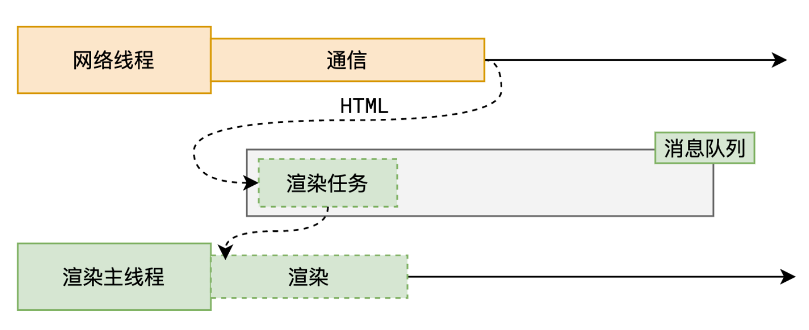
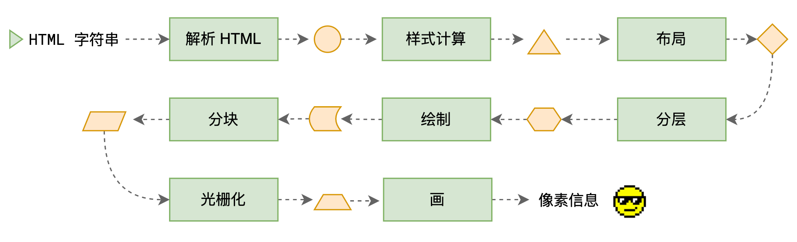
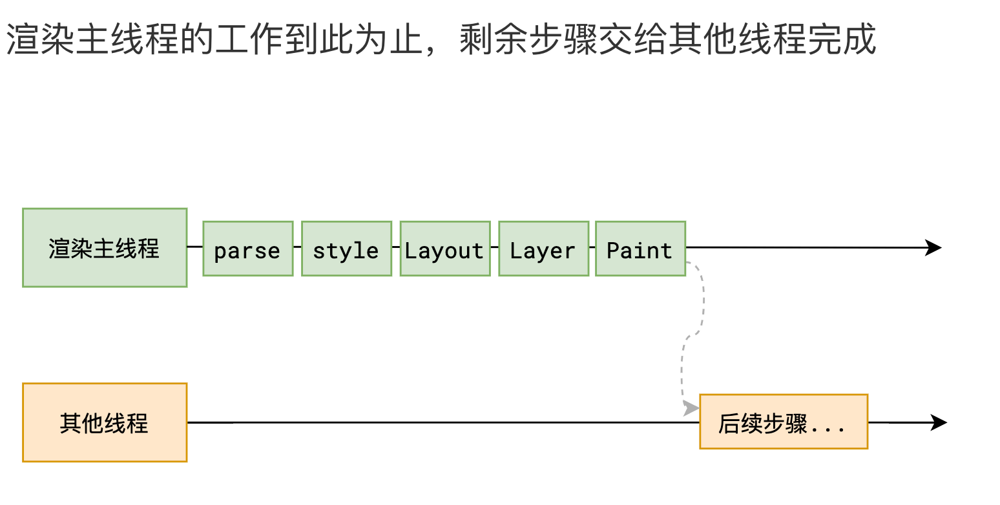

# 浏览器渲染原理

## 什么是渲染

将 html 字符串 转换成 页面像素信息

## 面试题 1：浏览器的渲染过程，DOM 树和渲染树的区别？

浏览器的渲染过程是将 HTML、CSS 和 JavaScript 转换为用户在浏览器窗口中看到的可视化页面的过程。这个过程涉及多个步骤，包括解析 HTML、构建 DOM 树、构建渲染树、计算布局和绘制等。

### 渲染过程：

1. **接收 HTML：**
   - 浏览器接收 HTTP 响应，并开始解析响应数据，查找 HTML 内容。
2. **构建 DOM 树：**
   - 浏览器解析 HTML 内容，构建 DOM（文档对象模型）树，表示页面的结构。
3. **构建 CSSOM 树：**
   - 同时，浏览器开始解析 CSS 样式表，构建 CSSOM（CSS 对象模型）树，表示页面的样式信息。
4. **渲染树构建：**
   - 浏览器将 DOM 树和 CSSOM 树结合起来，构建渲染树（Render Tree），表示页面的可见内容。
5. **布局和绘制：**
   - 浏览器计算渲染树中每个元素的大小和位置，然后进行页面布局（layout）。
   - 最后，浏览器绘制页面上的每个元素，呈现给用户。
   > 大部分时候，DOM 树和布局树并非一一对应。
   >
   >比如`display:none`的节点没有几何信息，因此不会生成到布局树；又比如使用了伪元素选择器，虽然 DOM 树中不存在这些伪元素节点，但它们拥有几何信息，所以会生成到布局树中。还有匿名行盒、匿名块盒等等都会导致 `DOM树 和 布局树 无法一一对应`。
6. **交互和 JavaScript：**
   - 如果遇到了 JavaScript 代码，浏览器会执行 JavaScript，可以修改 DOM 和 CSSOM，以及处理用户交互。
7. **完成页面加载：**
   - 当资源（包括嵌入的资源，样式表、脚本等）加载完成，浏览器会触发 `onload` 事件，表示页面加载完成。
8. **页面渲染完成：**
   - 用户可以看到页面内容，页面渲染完成。

### DOM 树和渲染树之间的主要区别在于：

- **DOM 树**：DOM 树表示文档的结构，包括所有 HTML 元素、属性和文本内容。它是一个抽象的树状结构，不包含样式信息，仅用于表示文档的逻辑结构。
- **渲染树**：渲染树包括 DOM 树中可视化渲染的部分，即将在屏幕上显示的元素和它们的样式信息。渲染树不包括不可见元素，如隐藏的元素或通过 CSS 隐藏的元素。

::: details 浏览器是如何渲染页面的？（详细过程）

当浏览器的网络线程收到 HTML 文档后，会产生一个渲染任务，并将其传递给渲染主线程的消息队列。

在事件循环机制的作用下（不断从任务队列拿任务），渲染主线程取出消息队列中的渲染任务，开启渲染流程。



### 渲染流水线



整个渲染流程分为多个阶段，分别是： HTML 解析、样式计算、布局、分层、绘制、分块、光栅化、画

每个阶段都有明确的输入输出，上一个阶段的输出会成为下一个阶段的输入。

这样，整个渲染流程就形成了一套组织严密的生产流水线。

### 第一步 解析 HTML

HTML 解析器会按照一定的规则，将 HTML 文档解析为 DOM 树 和 CSSOM 树。

解析过程中遇到 CSS 解析 CSS，遇到 JS 执行 JS。为了提高解析效率，浏览器在开始解析前，会启动一个 `预解析的线程`，率先下载 HTML 中的外部 CSS 文件和 外部的 JS 文件。

如果主线程解析到`link`位置，此时外部的 CSS 文件还没有下载解析好，主线程不会等待，继续解析后续的 HTML。这是因为`下载和解析 CSS 的工作是在预解析线程中进行的`。这就是 `CSS 不会阻塞 HTML 解析` 的**根本原因**。

如果主线程解析到`script`位置，`会停止解析 HTML`，转而等待 JS 文件下载好，并将全局代码解析执行完成后，才能继续解析 HTML。这是因为 JS 代码的执行过程可能会修改当前的 DOM 树，所以 DOM 树的生成必须暂停。这就是 **JS 会阻塞 HTML 解析的根本原因**。

第一步完成后，会得到 DOM 树和 CSSOM 树，浏览器的默认样式、内部样式、外部样式、行内样式均会包含在 CSSOM 树中。

### 第二步 样式计算

主线程会遍历得到的 DOM 树，依次为树中的每个节点计算出它最终的样式，称之为 Computed Style。

在这一过程中，很多预设值会变成绝对值，比如`red`会变成`rgb(255,0,0)`；相对单位会变成绝对单位，比如`em`会变成`px`

这一步完成后，会得到一棵带有样式的 DOM 树。

### 第三步 布局

布局阶段会依次遍历 DOM 树的每一个节点，计算每个节点的几何信息。例如节点的宽高、相对包含块的位置。

大部分时候，DOM 树和布局树并非一一对应。

比如`display:none`的节点没有几何信息，因此不会生成到布局树；又比如使用了伪元素选择器，虽然 DOM 树中不存在这些伪元素节点，但它们拥有几何信息，所以会生成到布局树中。还有匿名行盒、匿名块盒等等都会导致 `DOM树 和 布局树 无法一一对应`。

### 第四步 分层

主线程会使用一套复杂的策略对整个布局树中进行分层。

分层的好处在于，将来某一个层改变后，仅会对该层进行后续处理，从而提升效率。

滚动条、堆叠上下文、transform、opacity 等样式都会或多或少的影响分层结果，也可以通过`will-change`属性更大程度的影响分层结果。

### 第五步 绘制



主线程会为每个层单独产生绘制指令集，用于描述这一层的内容该如何画出来。

`完成绘制后，主线程将每个图层的绘制信息提交给合成线程，剩余工作将由合成线程完成。`

### 第六步 分块

合成线程首先对每个图层进行分块，将其划分为更多的小区域。

它会从线程池中拿取多个线程来完成分块工作，`交给多个线程同时进行`。

### 第七步 光栅化

合成线程会将块信息交给 GPU 进程，以极高的速度完成光栅化。

GPU 进程会开启多个线程来完成光栅化，并且优先处理靠近视口区域的块。

**光栅化的结果，就是一块一块的位图（像素块）**

### 第八步 画

合成线程拿到每个层、每个块的位图后，生成一个个「指引（quad）」信息。

指引会标识出每个位图应该画到屏幕的哪个位置，以及会考虑到旋转、缩放等变形。

`变形发生在合成线程，与渲染主线程无关`，这就是`transform`效率高的本质原因。

合成线程会把 quad 提交给 GPU 进程，由 GPU 进程产生系统调用，提交给 GPU 硬件，完成最终的屏幕成像。

:::

## 面试题 2：浏览器输入 URL 到页面加载显示完成全过程

1. **DNS 解析：**

   - 用户在浏览器中输入 URL，浏览器开始解析域名（URL）并查找 DNS 缓存，以查找域名对应的 IP 地址。
   - 如果域名对应的 IP 地址未在本地 DNS 缓存中找到，浏览器将查询操作传递给操作系统的 DNS 解析器，操作系统将查询操作传递给本地域名服务器。
   - 本地域名服务器在自己的 DNS 缓存中查找域名对应的 IP 地址，如果找到则返回，否则继续查询更高级别的 DNS 服务器，直到找到 IP 地址。

2. **建立 TCP 连接：**

   - 浏览器使用解析后的 IP 地址，尝试与 Web 服务器建立 TCP 连接。
   - 通过 TCP 三次握手，建立连接，确保浏览器和服务器之间可以互相通信。

3. **发起 HTTP 请求：**

   - 一旦建立了 TCP 连接，浏览器通过 HTTP 协议发送 HTTP 请求，包含请求的资源、请求头、浏览器类型等等。

4. **服务器处理请求：**

   - 服务器接收到 HTTP 请求，开始处理请求。
   - 服务器可能需要查询数据库，生成动态内容，或者从文件系统中读取静态资源。

5. **服务器响应：**

   - 服务器处理完成后，返回 HTTP 响应，其中包含 HTTP 状态码、响应头信息、响应数据等。
   - 如果请求资源不存在或发生错误，服务器将返回相应的状态码。

6. **接收 HTML：**

   - 浏览器接收 HTTP 响应，并开始解析响应数据，查找 HTML 内容。

7. **构建 DOM 树：**

   - 浏览器解析 HTML 内容，构建 DOM（文档对象模型）树，表示页面的结构。

8. **构建 CSSOM 树：**

   - 同时，浏览器开始解析 CSS 样式表，构建 CSSOM（CSS 对象模型）树，表示页面的样式信息。

9. **渲染树构建：**

   - 浏览器将 DOM 树和 CSSOM 树结合起来，构建渲染树（Render Tree），表示页面的可见内容。

10. **布局和绘制：**

    - 浏览器计算渲染树中每个元素的大小和位置，然后进行页面布局（layout）。
    - 最后，浏览器绘制页面上的每个元素，呈现给用户。

11. **交互和 JavaScript：**

    - 如果遇到了 JavaScript 代码，浏览器会执行 JavaScript，可以修改 DOM 和 CSSOM，以及处理用户交互。

12. **完成页面加载：**

    - 当资源（包括嵌入的资源，样式表、脚本等）加载完成，浏览器会触发 `onload` 事件，表示页面加载完成。

13. **页面渲染完成：**

    - 用户可以看到页面内容，页面渲染完成。

## 面试题 3：什么是 reflow（回流 / 重排）？如何发生？

<u>reflow(回流 / 重排) 的本质就是**重新计算布局树**，重新排版。</u>

所有对布局树的更改、读取，都会引发重排。

- 对布局树<u>更改</u>：异步重排

```js
dom.style.width = '100px';
dom.style.height = '100px';
// 只会重排一次，在下一次渲染的时候来进行重排
```

> 为了避免连续的多次操作导致布局树反复计算，浏览器会合并这些操作，当 JS 代码全部完成后再进行统一计算。所以，改动属性造成的 reflow 是`异步`完成的。

- 对布局树的<u>读取</u>：同步重排

```js
// 只要读取就强制重排，例如：
dom.clientHeight;
```

> 也同样因为如此，当 JS 获取布局属性时，就可能造成无法获取到最新的布局信息。浏览器在反复权衡下，最终决定获取属性立即 reflow。

> ⚠️注意：`border（外边框）`会导致重排，而 `outline（内边框）`不会，因为它不在布局树中。

**如何发生？**

只要对布局树的更高、读取都会引发重排。

**扩展：布局树的节点是否和DOM树一一对应？**

否，布局树和 DOM 树并不是一一对应的。比如`display:none`的节点没有几何信息，因此不会生成到布局树；又比如使用了伪元素选择器，虽然 DOM 树中不存在这些伪元素节点，但它们拥有几何信息，所以会生成到布局树中。还有匿名行盒、匿名块盒等等都会导致 DOM树 和 布局树 无法一一对应。

## 面试题 4：如何避免 reflow(回流 / 重排)？

避免 reflow（回流）是提高网页性能的一个重要方面，因为 reflow 会消耗大量资源，尤其是在复杂的页面中。以下是一些避免或减少 reflow 的策略：

- 减少 DOM 操作：尽量减少对 DOM 的读写操作，可以将多次操作合并为一次。
- 批量修改样式：使用 class 来修改元素样式，而不是频繁地直接修改 style 属性。
- 避免设置内联样式：尽量通过 CSS 类来控制样式，而不是使用 JavaScript 直接设置内联样式。
- 使用 getComputedStyle 或 currentStyle：如果需要获取样式信息，可以先获取所有计算后的样式，减少对 DOM 的访问次数。
- 固定布局尺寸：对于不改变大小的元素，明确指定其宽度和高度，浏览器可以更容易确定其他元素的位置。
- 减少不必要的复杂结构：简化 HTML 结构，避免过多嵌套，这有助于减少 reflow 的影响范围。

## 面试题 5：什么是 repaint（重绘）？何时发生？

repaint（重绘）是对所有非几何信息的读写所造成的可见样式的变化。

当改动了可见样式后，就需要重新计算，会引发 repaint。

由于元素的布局信息也属于可见样式，`所以 reflow 一定会引起 repaint`。

## 面试题 6：如何避免 repaint(重绘)？

- 减少样式更改：尽量减少对元素样式的频繁更改，特别是那些不影响布局但影响外观的属性（如颜色、背景等）。
- 批量更新样式：将多个样式更改合并为一次操作，使用 class 来切换样式，而不是逐个修改样式属性。
- 使用 CSS 动画：对于动画效果，优先使用 CSS 动画和过渡效果，而不是通过 JavaScript 频繁修改样式。
- 离屏渲染：利用 will-change 属性提示浏览器提前准备可能的动画或变化，从而减少实际发生时的重绘。
- 避免使用昂贵的样式属性：某些 CSS 属性（如 box-shadow、border-radius、opacity 等）会触发更频繁的重绘，应谨慎使用。
- 固定位置元素：对于固定位置的元素（如浮动菜单），确保它们不会因为其他元素的变化而频繁重绘。
- 使用 GPU 加速：将一些复杂的动画或变换交给 GPU 处理，例如使用 translate3d 或 transform: translateZ(0)来触发硬件加速。
- 减少透明度和滤镜效果：这些效果会导致更多的重绘，应尽量减少使用。

## 面试题 7：为什么 transform 的效率高？

因为 transform 既不会影响布局也不会影响绘制指令，它影响的只是渲染流程的最后一个 `draw` 阶段

由于 draw 阶段在合成线程中，所以 transform 的变化几乎不会影响渲染主线程。反之，渲染主线程无论如何忙碌，也不会影响 transform 的变化。

## 面试题 8：link 标签引入的 css、js 会阻塞渲染吗？

- CSS：

  - `link` 标签引入的 CSS 不会阻塞 HTML 的解析。这是因为下载和解析 CSS 的工作是在`预解析线程`中进行的，主线程不会等待外部 CSS 文件的下载和解析完成。
  - 然而，CSS 是**渲染阻塞资源**，即在 CSSOM 树构建完成之前，浏览器不会开始绘制页面内容，以确保页面样式的一致性。

- JS：
  - `<link rel="preload" href="script.js">` 这些 `link` 引入的 js 不会阻塞 HTML 的解析。
  - 预加载的 js 文件本身不会直接阻塞渲染。
  - 默认情况下，`<script>` 标签中的 js 会 阻塞 HTML 解析，直到该脚本下载、解析并执行完毕后，HTML 解析才会继续。
    > 如果后续通过带有 `async` 或 `defer` 属性的 `<script>` 标签引入，则不会阻塞 HTML 解析和渲染。

**总结：**

- link 标签引入的 css 不会阻塞 HTML 解析，但是可能会阻塞渲染。
- link 标签引入的 js 不会阻塞 HTML 解析，也不会阻塞渲染；只有 script 标签才可能会阻塞渲染。

## 面试题 9：link 标签上的 preload（预加载） 和 prefetch（预获取）？

**区别：**

- 优先级不一样：
   - preload：优先级高，立即加载
   - prefetch：优先级低，可以在空闲时间加载，后台缓存加载的内容

## 面试题 10：css 文件中 @import 规则的加载顺序及其对渲染的影响？

- 多个 @import 规则的加载顺序：
  - 浏览器会按照它们在 CSS 文件中出现的顺序依次加载每个 @import 引用的外部样式表。
  - 每个 @import 引用的样式表必须完全加载并解析后，浏览器才会继续处理后续的 @import 或者主样式表中的其他规则。
- @import 对渲染的影响：
  - @import 引用的样式表是渲染阻塞资源。浏览器会等待所有 @import 引用的样式表加载完毕后，才开始绘制页面内容。

## 面试题 11：script 标签 async 和 defer 的区别

- **默认情况（无 async 和 defer 属性）**：如果 `<script>` 标签既没有 `async` 属性，也没有 `defer` 属性，浏览器会按照标签在 HTML 中的顺序，阻塞页面渲染，下载后并同步加载脚本，脚本会阻塞页面的加载和渲染。
- **async 属性**：如果 `<script>` 标签带有 `async` 属性，<u style="background: pink;">脚本将异步下载</u>，<u>不会阻塞页面的加载和渲染</u>。脚本将在<u>下载完成后立即执行</u>，而不管其在文档中的位置。

```html
<script
  src="example.js"
  async
></script>
```

- **defer 属性**：如果 `<script>` 标签带有 defer 属性，<u style="background: pink;">脚本也会异步下载，但不会立即执行，会延迟到 dom 解析完成后，按照脚本顺序加载</u>，<u>不会阻塞页面的加载和渲染</u>。它将在文档解析完成（DOMContentLoaded 事件之前）时按照它们在文档中的顺序执行。

```html
<script
  src="example.js"
  defer
></script>
```

- **总结**：如果没有指定 async 或 defer 属性，<u>脚本默认是同步的，会阻塞页面加载</u>。如果使用 async 属性，脚本会异步加载和执行。如果使用 defer 属性，脚本也会异步加载，但在文档解析完成后按顺序执行。根据页面性能和脚本执行时机的需求，您可以选择适当的属性。
