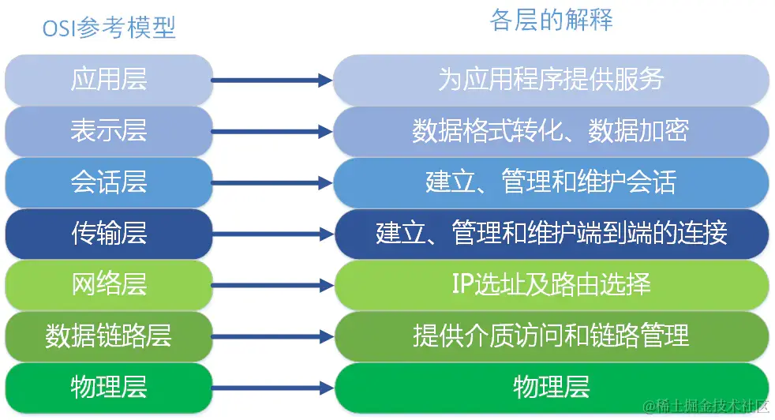
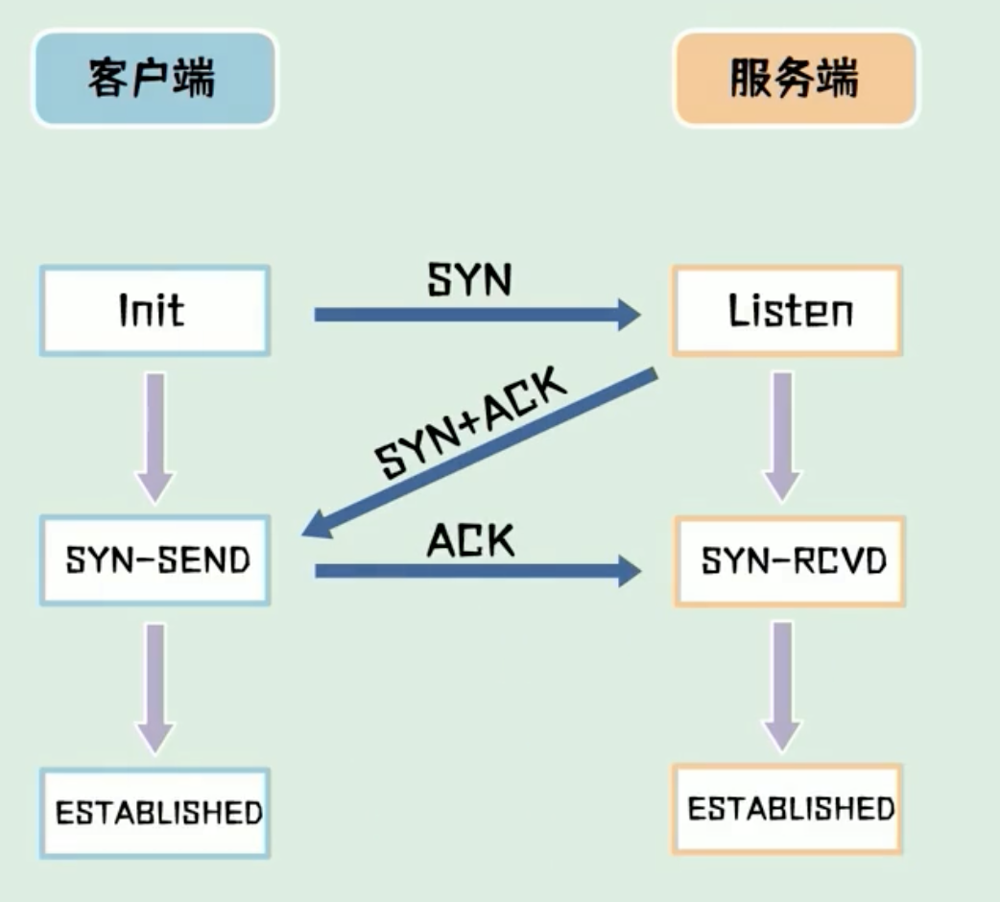
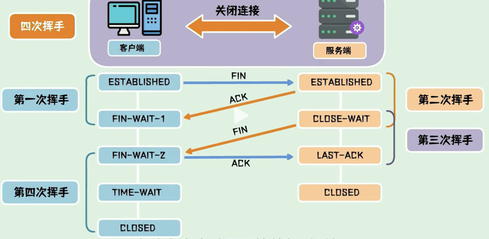
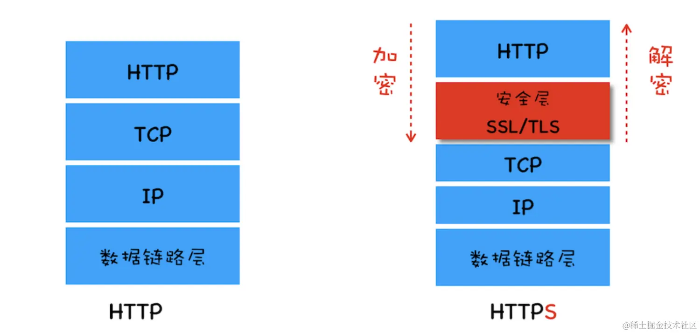

# 计算机网络

::: details 目录

[[toc]]

:::

## 面试题 1：OSI 及 OSI 七层模型

作用：将世界范围内的计算机连接为网络的框架

### OSI 七层模型

1. 应用层
   - 直接为用户提供网络服务，如 HTTP、FTP、SMTP 等。
   - 是用户与网络之间的接口，提供各种高级服务。
2. 表示层
   - 负责数据格式转换、加密解密、压缩解压等。
   - 确保发送方和接收方能够理解彼此的数据格式。
3. 会话层
   - 负责建立、管理和终止应用程序之间的会话。
   - 协调通信控制，例如对话的发起和结束。
4. 传输层
   - 不同主机之间的通信，提供端到端的通信服务，确保数据完整无误地到达接收方（稳定性）。
   - 常见协议有 TCP（传输控制协议）和 UDP（用户数据报协议）。
5. 网络层（IP 层面）
   - 负责路由选择，即将数据包从源地址传输到目的地址。
   - 处理数据包的转发和路径选择。
6. 数据链路层
   - 提供节点到节点的数据传输，检测并可能纠正错误。
7. 物理层
   - 描述数据在物理设备上如何传输和编码。

## 面试题 2：TCP/IP

定义：TCP（传输层）/IP（网络层） 是一组协议，用于在不同网络中实现传输数据的规范。它由两个主要部分组成：TCP（传输控制协议）和 IP（因特网协议）。

### TCP/IP 模型

和 OSI 模型类似，TCP/IP 模型分为 `4层`。

1. 应用层：将 OSI 的应用层、表示层、会话层进行整合。
2. 传输层
3. 网络层
4. 网络接口层：对应 OSI 的物理层、数据链路层

## 面试题 3：TCP（传输控制协议） 和 UDP（用户数据报协议） 的区别

两种常用的传输层协议，用于在网络中传输数据。

1. 连接方式
   - TCP：面向连接的协议，在传输数据之前需要建立可靠的连接（三次握手），确保通信双方准备好。
   - UDP：无连接的协议，直接发送数据，不需建立连接。
2. 可靠性
   - TCP：传输数据时，会进行错误校验和重传机制，确保数据传输成功。
   - UDP：不可靠的传输，不保证数据一定能到达接收方，也不保证数据顺序。
3. 速度
   - TCP：由于有连接建立、确认和重传等过程，速度较慢。
   - UDP：没有这些额外的操作，速度快，适合对实时性要求较高的场景。

## 面试题 4：TCP 的三次握手和四次挥手

### 三次握手

三次握手用于**建立连接**，建立连接的过程发送了 3 次数据包，也称为“三次握手”。

1. SYN 包：客户端先发一次请求，询问服务器能否建立连接
2. SYN+ACK 包：服务器收到请求后，向客户端发送确认包
3. ACK 包：客户端收到服务器的 ACK 包，表示服务器已经收到请求，可以建立连接

### 为什么是三次而不是两次？

因为为了防止已失效的请求报文，突然又传到服务器引起错误。就是为了解决网络信道不可靠的问题。

比如：SYN1 包在传输过程中，因为网络问题没有到达服务器，客户端重新发送 SYN2 包，这时服务器接收到 SYN2 后，返回 SYN+ACK 包，与客户端建立连接，这时如果 SYN1 网络好了，到达了服务器，服务器会认为这个失效的 SYN1 包是客户端发起的第二次连接，又会返回一个 SYN+ACK 包，导致两次状态不一致。

### 四次挥手

四次挥手用于**断开连接**，断开连接的过程发送了 4 次数据包，也称为“四次挥手”。

1. FIN 包：客户端发一个 FIN 包，表示要断开连接，但连接还保持，客户端进入终止等待 1 状态
2. ACK 包：服务器收到 FIN 包，返回一个 ACK 包，表示自己已经收到 FIN 包，自己进入关闭等待状态，客户端进入终止等待 2 状态
3. FIN 包：服务器发一个 FIN 包，表示要断开连接，但连接还保持
4. ACK 包：客户端收到 FIN 包，返回一个 ACK 包，客户端进入超时等待状态，经过超时时间后关闭连接，而服务器收到最后一次 ACK 包后立刻关闭连接。

### 为什么四次挥手，最后客户端需要进入超时等待状态？

这是为了保证服务器能够正常收到最后一个 ACK 包，防止客户端提前关闭连接。

## 面试题 5：HTTP 请求方式

1. GET：用于获取资源，通过 URL 传递参数，请求的结果会被缓存，可以被书签保存，不适合传输敏感信息。
2. POST：用于提交数据，将数据放在请求体中发送给服务器，请求的结果不会被缓存。
3. PUT：用于更新资源，将数据放在请求体中发送给服务器，通常用于更新整个资源。
4. DELETE：用于删除资源，将数据放在请求体中发送给服务器，用于删除指定的资源。
5. PATCH：用于部分更新资源，将数据放在请求体中发送给服务器，通常用于更新资源的部分属性。

## 面试题 6：GET 和 POST 的区别

**区别：**

1. get 幂等，post 不是。（多次访问效果一样为幂等）
2. get 能触发浏览器缓存，post 没有。
3. get 能由浏览器自动发起（如 img - src，资源加载），post 不行。
4. post 相对安全，一定程度上规避 CSRF 风险。

**相同：**

1. 都不安全，都是基于 http，明文传输（要做到安全，需要做加密，例如：https）。
2. 参数并没有大小限制，是 URL 大小有限制，因为要保护服务器。

> 因为 GET 请求的参数是在 URL 中的，而 URL 有大小的限制

## 面试题 7：RESTful 规范

**使用语义化的 URL 来表示资源的层级关系和操作**，如/users 表示用户资源，/users/{id}表示具体的用户。

1. 资源：将系统中的实体抽象为资源，每个资源都有一个唯一的标识符（URI）。
2. HTTP 方法：使用 HTTP 请求方式来操作资源，如 GET、POST、PUT、DELETE 等。
3. 状态码：使用 HTTP 状态码来表示请求的结果，如 200 表示成功，404 表示资源不存在等。
4. 无状态：每个请求都是独立的，服务器不保存客户端的状态信息，客户端需要在请求中携带所有必要的信息。

## 面试题 8：常见的 HTTP 状态码以及代表的意义

- 200 OK：请求成功，服务器成功处理了请求。
- 201 Created：请求已成功，并在服务器上创建了新的资源。
- 204 No Content：服务器成功处理了请求，但没有返回任何内容。
- 301 Moved Permanently：**永久重定向**，请求的资源已永久移动到新位置，客户端需要更新其请求地址。
- 302 Found：**临时重定向**，请求的资源已临时移动到新位置，但未来请求仍使用原始 URl。
- 303 See Other：请求的资源已临时移动到新位置，类似于 302，但明确要求客户端使用 GET 方法访问新的 URL。
- 304 Not Modified：请求的资源未修改，服务器返回此状态码，客户端可以使用缓存的资源。
- 400 Bad Request：服务器无法理解请求的语法，请求有语法错误。
- 401 Unauthorized：请求需要用户身份验证。
- 403 Forbidden：服务器拒绝请求，没有权限访问。
- 404 Not Found：请求的资源不存在。
- 405 Method Not Allowed：请求方法不被允许。
- 500 Internal Server Error：服务器内部错误，无法完成请求。
- 502 Bad Gateway：服务器作为网关或代理，从上游服务器收到无效响应。
- 503 Service Unavailable：服务器当前无法处理请求，通常由于过载或维护。

## 面试题 9：什么是 HTTPS 协议？如何加密的？

超文本传输安全协议 HTTPS 在 HTTP 层和 tcp 层中间加了一个 SSL/TLS 安全层，进行加密，避免了 HTTP 协议存在的信息窃听，信息劫持等风险。

HTTPS 增加的 TLS/SSL 层可以**对身份进行验证、信息加密解密**功能，避免这种问题发生。安全层的主要职责就是对发起的 HTTP 的数据进行加密解密操作。

## 面试题 10：Http 和 Https 的区别？

主要的区别在于**安全性和数据传输方式**上，HTTPS 比 HTTP 更加安全，适合用于保护网站用户的隐私和安全，如银行网站、电子商务网站等。

- **安全性**：HTTP 协议传输的数据都是未加密的，也就是明文的，因此使用 HTTP 协议传输的数据可以被任何抓包工具截取并查看。而 HTTPS 协议是由 SSL+HTTP 协议构建的可进行加密传输、身份认证的网络协议，更为安全。
- **端口号**：HTTP 协议的端口号是 80，HTTPS 协议的端口号是 443。
- **网址导航栏显示**：使用 HTTP 协议的网站导航栏显示的是"http://"，而使用 HTTPS 协议的网站导航栏显示的是"https://"。
- **网络速度**：HTTP 协议比 HTTPS 协议快，因为 HTTPS 协议需要进行加密和解密的过程。
- **SEO 优化**：搜索引擎更倾向于把 HTTPS 网站排在更前面的位置，因为 HTTPS 更安全。

## 面试题 11：Http1 和 Http2 的区别？

- **二进制协议**：HTTP1.1 的解析是基于文本，而 HTTP2 使用二进制，将请求和响应分割为更小的帧，从而实现多路复用。
- **多路复用**：在一个连接里，客户端和服务器都可以同时发送多个请求或回应，而且不用按照顺序一一发送，这样避免了 HTTP 队头阻塞，但是 TCP 的队头阻塞依旧存在。

  - HTTP 队头阻塞

  ::: details 什么是 HTTP 队头阻塞

  ### HTTP 队头堵塞

  在 HTTP/1.1 中，默认情况下，浏览器对同一域名下的并发连接数有限制（通常为 6-8 个），这意味着浏览器同一时间最多只能与服务器建立 6-8 个连接。同时，在同一连接中，请求和响应是按照顺序处理的，也就是说，一个请求需要等待前面的请求响应完成后才能开始处理。如果前面的请求处理时间较长，后续请求就必须等待，从而导致队头阻塞。

  总结：HTTP 队头堵塞是指在同一域名下浏览器的连接数有限制，并且请求要在连接内按顺序处理，这样就**会导致某个请求的延迟或阻塞会影响后续请求的处理**。

  :::

  - TCP 队头阻塞

  ::: details 什么是 TCP 队头堵塞

  ### TCP 队头阻塞

  在一个 TCP 连接中，如果某个数据包在传输过程中失误或者丢失，那么在这个数据包后发送的所有数据都需要等待，直到该数据被重新传输。这种情况会导致接收方在 TCP 缓冲区中，后续的数据包被阻塞在错误数据包之后，无法继续处理，即被堵塞在队头

  总结：TCP 协议为了保证数据包的有序传输，如果一个数据包在丢失损坏后，TCP 接受端会要求重新发送该数据包，直到被正确接收为止。

  :::

- **头部信息压缩**：由于 HTTP1.1 每次请求都会带上所有信息，比如 Cookie，这样会很浪费性能，HTTP2 引入头部压缩，一方面将头部信息使用 gzip 压缩后再发送，另一方面客户端和服务器同时维护一张头部信息表，所有字段都会存入这张表，生成索引，只发送索引就可以。
- **服务器推送**：HTTP2 允许服务器向客户端主动发送资源，只限于静态资源如 css，img 等

## 面试题 12：Cookie 为了解决什么问题？

Cookie 诞生的主要目的是<u>为了解决 HTTP 协议的无状态性问题</u>。HTTP 协议是一种无状态的协议，即服务器无法识别不同的用户或跟踪用户的状态。这导致了一些问题，比如无法保持用户的登录状态、无法跟踪用户的购物车内容等。

## 面试题 13：Cookie 和 Session 的区别？

`Cookie` 和 `Session` 都是用于在 web 应用中维护状态和用户身份的两种不同机制：

### Cookie

当后端通过 `Set-Cookie 响应头`返回 Cookie 时，浏览器会`自动`将其保存到本地。

- **自动保存**：浏览器接收到包含 Set-Cookie 响应头的 HTTP 响应后，会根据 Cookie 的属性（如域名、路径、有效期等）自动将 Cookie 保存在本地。
- **发送 Cookie**：之后，当浏览器向同一域名下的服务器发起请求时，会自动在请求头中添加 Cookie 字段，将对应的 Cookie 发送给服务器。

> ⚠️ 注意：浏览器对 Cookie 的处理遵循同源策略，即只有在请求的域名、协议和端口与设置 Cookie 时一致的情况下，浏览器才会自动携带 Cookie。

**缺点：**

1. 安全风险：可以被修改
2. 存储大小限制：浏览器对 Cookie 的存储大小有限制，通常为 4KB。
3. 可用限制：用户可能会禁用 Cookie

### Session

- **流程：**

  1. **创建会话**：当用户首次访问服务器时，服务器会为该用户创建一个唯一的会话标识符（Session ID），并将其存储在服务器端的内存或数据库中。
  2. **传递会话标识符**：服务器通过 `Set-Cookie 响应头`将 Session ID 发送到客户端浏览器。浏览器会自动保存这个 Session ID 并在后续请求中通过 Cookie 自动发送给服务器。
  3. **维护会话状态**：服务器根据接收到的 Session ID 查找对应的会话数据，从而维持用户的会话状态。

- **优点：**

  1. **安全性更高**：因为会话数据存储在服务器端，不会暴露给客户端，减少了被篡改的风险。
  2. **无大小限制**：不像 Cookie 有大小限制，Session 可以存储更多的数据。

- **缺点：**

  1. **服务器资源消耗**：每个用户都需要一个独立的 Session 数据，需要消耗服务器的资源。
  2. **跨域限制**：由于 Session 数据存储在服务器端，因此无法跨域访问，除非服务器支持跨域 Cookie。
  3. **扩展性差**：在分布式系统中，可能会导致某个服务器存储的 Session 数据丢失，从而导致用户会话状态丢失。

### 区别

Cookie（HTTP Cookie）和 Session（会话）都是用于在 Web 应用程序中维护状态和用户身份的两种不同机制：

- **存储位置**：

  - **Cookie**：Cookie 是<u>存储在客户端</u>（通常是用户的浏览器）中的小段文本数据。浏览器会在每次请求中自动发送 Cookie 到服务器，以便服务器可以识别用户。
  - **Session**：Session 数据通常<u>存储在服务器</u>上，而不是在客户端。服务器为每个用户创建一个唯一的会话，然后在服务器上存储会话数据。

- **持久性**：

  - **Cookie**：Cookie 可以具有持久性，可以设置过期时间。如果没有设置过期时间，Cookie 将成为会话 Cookie，存在于用户关闭浏览器前的会话期间。
  - **Session**：会话数据通常存在于用户活动的会话期间，一旦会话结束（用户退出登录或关闭浏览器），会话数据通常会被删除。

- **安全性**：

  - **Cookie**：Cookie 数据存储在客户端，可能会被用户篡改或窃取。因此，敏感信息通常不应存储在 Cookie 中，或者应该进行加密。
  - **Session**：Session 数据存储在服务器上，客户端不可见，因此通常更安全，特别适合存储敏感信息。

- **服务器负担**：

  - **Cookie**：服务器不需要维护 Cookie 的状态，因为它们存储在客户端。每次请求中都包含 Cookie，服务器只需要验证 Cookie 的有效性。
  - **Session**：服务器需要维护会话数据，这可能会增加服务器的负担，尤其是在大型应用程序中。

- **跨多个页面**：

  - **Cookie**：Cookie 可以被跨多个页面和不同子域共享，这使得它们适用于用户跟踪和跨多个页面的数据传递。
  - **Session**：会话数据通常只在单个会话期间可用，而不容易在不同会话之间共享。

- **无需登录状态**：
  - **Cookie**：Cookie 可以在用户未登录的情况下使用，例如用于购物车或用户首选项。
  - **Session**：会话通常与用户的身份验证和登录状态相关，需要用户登录后才能创建和访问会话。

## 面试题 14：什么是跨域？如何解决？

在 Web 应用程序中，一个网页的代码试图向不同源（即不同的域名、协议或端口）发起 HTTP 请求。浏览器的同源策略（Same-Origin Policy）限制了跨域请求，以保护用户的安全性和隐私。同源策略要求网页只能与同一源的资源进行交互，而不允许与不同源的资源直接交互。

**解决方法：**

- CORS：服务器开启跨域资源共享
- JSONP：利用`<script>`标签不存在跨域限制，只支持 GET 请求，且不安全。
- nginx 代理跨域
- nodejs 中间件代理跨域，通过 node 开启一个代理服务器。

## 面试题 15：同源策略具体限制的具体内容

- **DOM 访问限制**：不同源的网页不能直接访问彼此的 DOM 元素，包括读取和修改。这意味着一个网页无法通过 JavaScript 获取另一个网页的内容，除非目标网页明确授权。
- **Cookie 限制**：同源策略阻止网页访问不属于自己源的 Cookie。Cookie 是用于在客户端存储和传输信息的机制，同源策略确保 Cookie 只能由创建它的源访问。
- **XMLHttpRequest 限制**：XMLHttpRequest（XHR）是用于在网页和服务器之间进行异步数据交换的技术。同源策略禁止不同源的网页通过 XHR 请求发送或接收数据。
- **跨文档消息限制**：同源策略限制不同源的窗口或帧之间通过 postMessage()方法进行通信。这可以防止恶意网页滥用通信渠道。
- **脚本限制**：不同源的脚本文件（如 JavaScript）不能相互引用和执行。

## 面试题 16：发起请求是浏览器做了什么？

- **发送请求头**：浏览器向目标服务器发送一个请求，其中包含了请求方法（GET、POST 等）和请求的 URL。检查同源策略，浏览器会检查目标 URL 是否符合同源策略。它会比较目标 URL 的协议、主机和端口号与当前网页的协议、主机和端口号是否一致。<u>如果不一致，就会触发跨域请求</u>。
- **发送跨域请求**：如果目标 URL 与当前网页不同源，浏览器会发送一个跨域请求。跨域请求通常是一个 HTTP OPTIONS 预检请求（preflight request），用于检查目标服务器是否允许跨域请求。
- **服务器处理预检请求**：目标服务器接收到预检请求后，会进行一系列的处理。它会检查请求中的一些特定头部信息，如 `Origin` 和 `Access-Control-Request-Method`，来验证是否允许跨域请求。
- **发送响应头**：如果服务器允许跨域请求，它会在响应中添加一些特定的头部信息，如 `Access-Control-Allow-Origin` 和 `Access-Control-Allow-Methods`。这些头部信息告诉浏览器该请求是被允许的。
- **检查响应头**：浏览器接收到服务器的响应后，会检查响应中的头部信息。它会查看 `Access-Control-Allow-Origin` 头部，判断是否允许当前网页进行跨域请求。
- **处理响应数据**：如果服务器允许跨域请求，浏览器会将响应数据返回给发起请求的网页。否则，浏览器将拒绝访问响应数据，并在控制台中报错。

## 面试题 17：请求会发送 2 次的原因

1. **Preflight Requests (CORS)**：跨源资源共享（CORS）是一种安全机制，用于控制在不同源（域名、协议、端口）之间的资源请求。当你通过 Fetch API 向另一个域名发出跨源请求时，浏览器会自动进行 CORS 预检请求，也称为预检请求（preflight requests）。这是为了确定服务器是否接受跨源请求，以及哪些 HTTP 方法和头部字段是允许的。预检请求是 OPTIONS 方法的请求，这意味着你的浏览器首先发送一个 OPTIONS 请求，然后才发送实际的 GET 或 POST 请求。因此，你会看到两个请求。
2. **Redirects (重定向)**：如果服务器返回一个 HTTP 重定向响应（例如，状态码为 302 或 307），浏览器将首先向新的重定向目标 URL 发出一个请求，然后才会继续原始请求。这也可能导致看到两个请求，一个是重定向请求，另一个是最终目标请求。
3. **程序错误或重复调用**：在你的 JavaScript 代码中，有时会发生意外的重复调用 Fetch API 的情况，例如在某个事件处理程序中多次触发 Fetch 请求。这将导致多个请求被发送。
4. **浏览器预加载和预解析**：现代浏览器可能会在背后执行一些资源的预加载和预解析操作，以提高性能。这可能导致浏览器发送额外的请求。这些请求通常不会在开发者控制范围之内。
5. **浏览器插件或扩展**：有时，浏览器插件或扩展可能会触发 Fetch 请求。这可能会导致你看到不同于你的网站代码所发出的请求。
