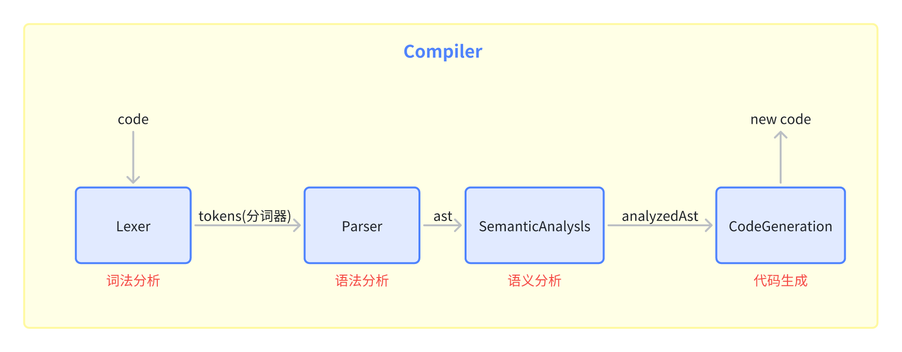

# babel

babel 是一个 JavaScript 编译器，主要作用是 ES6 语法的代码转换成 ES5 语法的代码。

::: tip 链接

babel 官网：[https://www.babeljs.cn/docs/](https://www.babeljs.cn/docs/)

ast 在线转换：[https://astexplorer.net/](https://astexplorer.net/)

:::

## 核心功能

- 语法转换：将新版本的 JavaScript 语法转换成旧版本语法
- Polyfill：polyfill 又叫做垫片/补丁，用于提供原生不支持的功能，借助 `core-js`，作 `新API` 的支持
- JSX 语法转换：将 JSX 语法转换成普通的 JavaScript 语法（React.createElement() 函数调用）

## babel 和 core-js 的区别

- babel：处理新语法
- core-js：处理新 api

::: tip `core-js` 原理

去方法的原型上面找，如果没有找到，表示浏览器不支持，core-js 就手动写一个方法添加到原型上。

:::

## 什么是 ast，有哪些应用场景

AST 是抽象语法树，用来表示源码的树形结构

**应用：**

- 代码转换
  - babel
  - less、sass
  - 构建工具（将代码打包转换）
  - 压缩与混淆
- 代码检查/格式化
  - eslint
  - prettier

## babel 转换过程



babel 提供了 JavaScript 的编译链路，能够将源代码转换为目标代码。

转换过程：`ast抽象语法树 -> transform转换 -> generate生成`

- `@babel/parser`：将JavaScript代码解析成抽象语法树（AST）
- `@babel/traverse`：遍历抽象语法树，对抽象语法树进行操作
- `@babel/generator`：将抽象语法树重新生成为JavaScript代码

> 转为 ast：方便遍历

## 将新语法转换成旧语法

安装

```bash
npm i @babel/core @babel/cli @babel/preset-env -D
```

例子

::: code-group

```js [index.js]
import babel from '@babel/core'
import presetEnv from '@babel/preset-env' // es6转es5的核心
import fs from 'node:fs'

const code = fs.readFileSync('./test.js', 'utf-8')

const result = babel.transform(code, {
  presets: [
    [
      presetEnv, // 预设，做新语法转换
      {
        useBuiltIns: 'usage', // 按需加载，自动引入
        corejs: 3 // 指定core-js版本
      }
    ]
  ]
})
console.log(result.code)
```

```js [test.js 转换前]
// 新语法 babel
const fn = (num) => num + 1
const arr = [1, 2, 3]
const newArr = [...arr, 4, 5]
class Foo {
  constructor(name) {
    this.name = name
  }
}
new Foo('foo')

// 新api core-js
const obj = Object.assign({}, { name: 1 })
```

```js [转换后]
'use strict'

require('core-js/modules/es.symbol.js')
require('core-js/modules/es.symbol.description.js')
require('core-js/modules/es.symbol.iterator.js')
require('core-js/modules/es.symbol.to-primitive.js')
require('core-js/modules/es.array.iterator.js')
require('core-js/modules/es.date.to-primitive.js')
require('core-js/modules/es.number.constructor.js')
require('core-js/modules/es.object.define-property.js')
require('core-js/modules/es.object.to-string.js')
require('core-js/modules/es.string.iterator.js')
require('core-js/modules/web.dom-collections.iterator.js')
function _typeof(o) {
  '@babel/helpers - typeof'
  return (
    (_typeof =
      'function' == typeof Symbol && 'symbol' == typeof Symbol.iterator
        ? function (o) {
            return typeof o
          }
        : function (o) {
            return o &&
              'function' == typeof Symbol &&
              o.constructor === Symbol &&
              o !== Symbol.prototype
              ? 'symbol'
              : typeof o
          }),
    _typeof(o)
  )
}
require('core-js/modules/es.array.concat.js')
require('core-js/modules/es.function.name.js')
require('core-js/modules/es.object.assign.js')
function _defineProperties(e, r) {
  for (var t = 0; t < r.length; t++) {
    var o = r[t]
    ;(o.enumerable = o.enumerable || !1),
      (o.configurable = !0),
      'value' in o && (o.writable = !0),
      Object.defineProperty(e, _toPropertyKey(o.key), o)
  }
}
function _createClass(e, r, t) {
  return (
    r && _defineProperties(e.prototype, r),
    t && _defineProperties(e, t),
    Object.defineProperty(e, 'prototype', { writable: !1 }),
    e
  )
}
function _toPropertyKey(t) {
  var i = _toPrimitive(t, 'string')
  return 'symbol' == _typeof(i) ? i : i + ''
}
function _toPrimitive(t, r) {
  if ('object' != _typeof(t) || !t) return t
  var e = t[Symbol.toPrimitive]
  if (void 0 !== e) {
    var i = e.call(t, r || 'default')
    if ('object' != _typeof(i)) return i
    throw new TypeError('@@toPrimitive must return a primitive value.')
  }
  return ('string' === r ? String : Number)(t)
}
function _classCallCheck(a, n) {
  if (!(a instanceof n))
    throw new TypeError('Cannot call a class as a function')
}
// 新语法
var fn = function fn(num) {
  return num + 1
}
var arr = [1, 2, 3]
var newArr = [].concat(arr, [4, 5])
var Foo = /*#__PURE__*/ _createClass(function Foo(name) {
  _classCallCheck(this, Foo)
  this.name = name
})
new Foo('foo')

// 新api
var obj = Object.assign(
  {},
  {
    name: 1
  }
)
```

:::

## JSX 转 React

安装对react支持的预设

```bash
npm i @babel/preset-react -D
```

例子

::: code-group

```js [index.js]
import babel from '@babel/core'
import presetEnv from '@babel/preset-env' // es6转es5的核心
import presetReact from '@babel/preset-react' // react语法转换预设 // [!code ++]
import fs from 'node:fs'

const code = fs.readFileSync('./App.jsx', 'utf-8')

const result = babel.transform(code, {
  presets: [
    [
      presetEnv, // 预设，做新语法转换
      {
        useBuiltIns: 'usage', // 按需加载，自动引入
        corejs: 3 // 指定core-js版本
      }
    ],
    presetReact // [!code ++]
  ]
})
console.log(result.code)
```

```jsx [App.jsx 转换前]
import react from 'react';
import { createRoot } from 'react-dom/client'

const App = () => {
  return (
    <div>
      <h1>Hello World</h1>
    </div>
  )
}

createRoot(document.getElementById('root')).render(<App />)
```

```js [转换后]
"use strict";

var _react = _interopRequireDefault(require("react"));
var _client = require("react-dom/client");
function _interopRequireDefault(e) { return e && e.__esModule ? e : { "default": e }; }
var App = function App() {
  return /*#__PURE__*/React.createElement("div", null, /*#__PURE__*/React.createElement("h1", null, "Hello World"));
};
(0, _client.createRoot)(document.getElementById('root')).render(/*#__PURE__*/React.createElement(App, null));
```

:::

## 编写 babel 插件

插件功能：将箭头函数转为普通函数

::: code-group

```js [index.js]
import babel from '@babel/core'
import fs from 'node:fs'

const code = fs.readFileSync('./test.js', 'utf-8')

// types 里包含了各种ast的方法
const transformFn = ({ types: t }) => { // [!code ++]
  return { // [!code ++]
    name: 'transform-fn', // [!code ++]
    visitor: { // 匹配 // [!code ++]
        ArrowFunctionExpression(path) { // [!code ++]
            const node = path.node // [!code ++]
            // 转为普通函数 // [!code ++]
            const arrowFunction = t.functionExpression( // [!code ++]
                null, // 函数名 // [!code ++]
                node.params, // 参数 // [!code ++]
                /** // [!code ++]
                 * blockStatement：ast需要的类型 // [!code ++]
                 */ // [!code ++]
                t.blockStatement([t.returnStatement(node.body)]), // 函数体 // [!code ++]
                node.async // [!code ++]
            ) // [!code ++]
            path.replaceWith(arrowFunction) // 替换原来的 // [!code ++]
        }, // [!code ++]
    } // [!code ++]
  } // [!code ++]
} // [!code ++]

const result = babel.transform(code, {
  plugins: [transformFn] // [!code ++]
})

console.log(result.code)
```

```js [test.js 转换前]
const fn = (num) => num + 1
```

```js [转换后]
const fn = function (num) {
  return num + 1;
};
```

:::

## plugin

`plugin` 决定了 `babel` 的编译能力