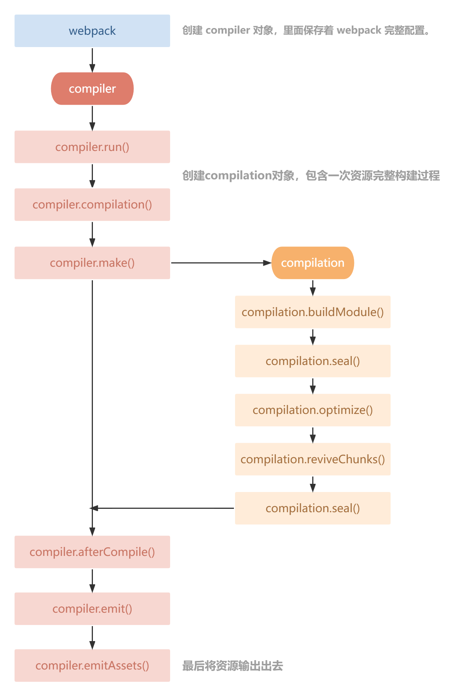
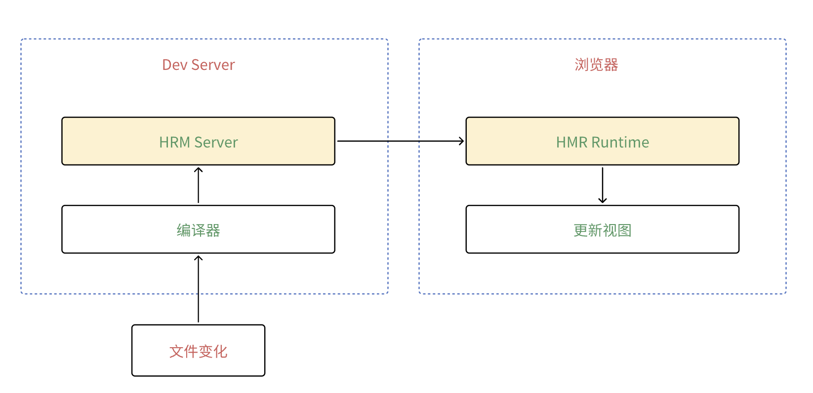

# webpack

## webpack 的作用

Webpack 是一个现代的前端**模块打包工具**，它用于构建和优化 Web 应用程序的前端资源，包括 JavaScript、CSS、图片、字体等。Webpack 的主要目标是<u>将项目的所有依赖项（模块、资源文件）打包到一个或多个最终的静态文件中</u>，以便在浏览器中加载。它改善了前端开发的工作流程，**提高了代码的可维护性和性能，解决了模块化、资源管理、性能优化和自动化**等多个关键问题。

## webpack 的构建流程

webpack 构建流程是一个 `串行` 的过程。

1. **读取配置文件**：Webpack 首先会读取项目中的配置文件（通常是 webpack.config.js），该配置文件包含了构建过程中的各种设置，如入口文件、输出目录、加载器（loaders）、插件（plugins）等。
2. **解析入口文件**：Webpack 会根据配置文件中定义的入口点（entry points）来解析应用程序的依赖关系。入口文件通常是应用程序的主要 JavaScript 文件，但也可以有多个入口点。
3. **依赖解析**：Webpack 分析入口文件和其依赖的模块，构建一个依赖关系图，以确定哪些模块依赖于其他模块，以及它们之间的依赖关系。
4. **加载器处理**：Webpack 使用加载器来处理不同类型的资源文件，如 CSS、图片、字体等。加载器允许开发人员在构建过程中转换这些资源文件，以便将它们整合到最终的输出文件中。
5. **插件处理**：Webpack 提供了插件系统，插件用于执行各种任务，如代码压缩、资源优化、HTML 生成、热模块替换（HMR）等。插件可以根据需要自定义 Webpack 的构建过程。
6. **生成输出文件**：Webpack 根据入口文件和依赖关系图生成一个或多个输出文件。这些输出文件包括 JavaScript 文件、CSS 文件、图片、字体等资源文件。
7. **优化和压缩**：Webpack 可以进行各种优化，包括代码压缩、Tree Shaking、懒加载等，以减小包的大小并提高性能。
8. **生成 Source Maps**：Webpack 可以生成 Source Maps，以便在开发中进行调试。Source Maps 是一种映射文件，将最终输出文件映射回原始源代码。
9. **输出到指定目录**：最终的构建结果被输出到配置文件中指定的目录中，通常是一个名为"dist"的目录。输出文件的命名和目录结构也可以根据配置进行自定义。
10. **完成构建过程**：Webpack 构建过程完成后，它会生成构建报告，包括构建成功或失败的信息，输出文件的大小等统计信息。

## webpack 有哪些核心概念？

1. entry：入口
2. output：输出
3. module：模块(loader)
4. plugin：插件
5. mode：模式
6. devServer：开发服务器
7. optimization：优化
8. code-splitting：代码切割

## 有哪些常见的 loader

- raw-loader：加载文件原始内容
- file-loader：把文件输出到文件夹中，在代码中通过相对 url 去引用输出的文件
- url-loader：与 file-loader 类似，可设置输出大小，小于大小 url-loader 会把文件转成 base64，并把 base64 输出到代码中，大于则输出文件
- source-map-loader：加载 source map 文件
- babel-loader：加载 ES6+ 语法，并转成 ES5
- ts-loader
- css-loader：加载 css 文件
- ...

## 有哪些常见的 plugin

- define-plugin：定义环境变量，在 `webpack5` 中，通过 `mode` 来定义环境变量
- html-webpack-plugin：生成 html 文件，并自动引入打包后的 js 文件
- mini-css-extract-plugin：将 css 提取到单独的文件中
- terser-webpack-plugin：压缩 js 文件
- webpack-bundle-analyzer：分析打包后的文件大小，并生成可视化的图表

## loader 和 plugin 的区别

### 1. 功能区别

- loader：本质是一个函数，对接收到的内容进行转换，返回转换后的结果。webpack 只认识 js，使用 loader 来转换其他类型的文件。
- plugin：插件，用于扩展 webpack 功能。在 Webpack 运行的生命周期中会广播出许多事件，Plugin 可以监听这些事件，在合适的时机通过 Webpack 提供的 API 改变输出结果。

### 2. 运行时机区别

- loader 运行在打包文件之前上
- plugins 在整个编译周期都起作用

## compiler 和 compilation 的区别

- Compiler（提供 webpack 的钩子）：compiler 对象中保存着完整的 Webpack 环境配置，每次启动 webpack 构建时它都是一个独一无二，仅仅会创建一次的对象。

  这个对象会在首次启动 Webpack 时创建，我们可以通过 compiler 对象上访问到 Webapck 的主环境配置，比如 loader 、 plugin 等等配置信息。

- Compilation（对资源的处理）：compilation 对象代表一次资源的构建，compilation 实例能够访问所有的模块和它们的依赖。



> Compiler：只会创建一次
>
> Compilation：会创建多次

## webpack 事件机制

Webpack 的事件机制的核心是插件系统，通过丰富的钩子和插件机制，开发者可以在编译的不同阶段插入自定义逻辑，从而实现高度定制化的构建流程。

**常见事件**

- before-run：在 webpack 开始编译之前触发，可以用于清除上一次构建的文件
- run：在 webpack 开始编译触发
- before-compile：在 webpack 开始编译之前触发，可以用于添加额外的编译配置或预处理代码
- compile：在 webpack 开始编译触发，可以用于监听编译过程或者处理编译错误
- this-compilation：在创建新的 compilation 对象时触发，compilation 对象代表当前编译过程中的所有状态和信息
- compilation：在编译代码期间触发，可以监听编译过程或处理编译错误
- emit：输出文件之前触发，用于修改输出文件或生成一些附加文件
- after-emit：输出文件之后触发，可以用于清理临时文件或资源
- done：编译完成时触发，可以用于生成构建报告

## 使用 webpack 时，用过哪些可以提高效率的插件？

- webpack-merge：提取公共配置，减少重复代码
- webpack-dev-server：开发服务器
- hot-module-replacement-plugin：hmr 热更新

## 如何优化 webpack 构建速度？

1. `OneOf`：每个文件只能被其中一个 loader 处理，匹配上了第一个就不会去判断下面了
2. 使用 Cache（缓存），提升二次打包速度
3. Thread（多进程打包）：安装`thread-loader`
4. 代码压缩
   - `terser-webpack-plugin`
   - `minimize-css-extract-plugin`
5. 缩小打包作用域：`exclude` / `include`
6. 排除依赖`externals`，使用 cdn
7. code split 代码切割
8. tree-shaking：只针对 esm 有效
9. resolve：减少模块查找时间

## 文件指纹

**是什么？**

文件指纹：打包后输出的文件名后缀

- hash：整个项目的 hash 值，只要项目文件有变化，整个项目的 hash 值就会改变
- chunkhash：根据 chunk 生成 hash 值，如果 chunk 中的文件有变化，那么就会生成新的 hash 值
- contenthash：根据文件内容生成 hash 值，如果文件内容有变化，那么就会生成新的 hash 值

**js 文件指纹**

```js
module.exports = {
  output: {
    filename: '[name].[contenthash].js',
    path: path.resolve(__dirname, 'dist')
  }
}
```

**css 文件指纹**

```js
modeule.exports = {
  plugins: [
    new MiniCssExtractPlugin({
      filename: '[name].[contenthash].css'
    })
  ]
}
```

**作用**

文件指纹，就是文件名加上 hash 值，可以防止缓存。

## webpack 热更新原理



1. **监控文件变化**：Webpack的开发服务器会监控项目中所有的模块文件，包括：JS文件、CSS文件、模板文件等。
2. **模块热替换**：当你在代码中做出更改并保存时，Webpack检测到文件变化，会首先通过热替换插件（Hot Module Replacement Plugin）生成新的模块代码。
3. **构建更新的模块**：生成的新模块代码会被构建成一个独立的文件或数据块。
4. **通知客户端**：Webpack开发服务器会将更新的模块代码的信息发送到浏览器。
5. **浏览器端处理**：浏览器接收到更新的模块信息后，会在不刷新页面的情况下通过热替换运行时（Hot Module Replacement Runtime）替换相应的模块。
6. **应用程序状态保持**：热更新还可以保持应用程序的状态。当修改代码不会丢失已有的数据、用户登录状态等。
7. **回调处理**：允许在模块更新时执行自定义的回调函数，可以处理特定的逻辑，以确保模块更新后的正确性。

> 概括：获取到变化的文件，使用 websocket 发送给客户端文件 hash，客户端收到消息后，发送请求，获取到文件内容，替换掉内存中的文件。

## webpack5 比 webpack4 更新了什么？

- 优化了构建速度，开发模式，构建速度明显提升
- tree-shaking：算法优化
- 内置的持久化缓存：可以缓存每个模块的编译结果，减少重复构建时间。
- 支持 WebAssmbly
- 支持模块联邦(Module Federation)：支持模块共享，远程加载（微前端的架构支持）

## 模块联邦

### 概念

模块联邦：多个项目之间共享代码的机制，特别适用于微前端架构

特点：

- 按需加载：只加载当前页面需要的模块，减少初始加载时间。
- 跨应用共享：多个微前端应用可以共享公共模块，避免重复打包。
- 独立部署：各个微前端应用可以独立开发、测试和部署。

### 使用

例如：在 App1 和 App2 应用中，需要同时共享同一个 ui 组件库

::: code-group

```js [模块提供方]
const ModuleFederationPlugin = require('webpack/lib/container/ModuleFederationPlugin')

module.exports = {
  plugins: [
    new ModuleFederationPlugin({
      name: 'app1',
      filename: 'remoteEntry.js',
      exposes: {
        // 需要共享的模块
        './Button': './src/components/Button'
      },
      shared: ['react', 'react-dom'] // 共享的第三方库
    })
  ]
}
```

```js [模块调用方]
module.exports = {
  plugins: [
    new ModuleFederationPlugin({
      name: 'app2',
      filename: 'remoteEntry.js',
      remotes: {
        app1: 'app1@http://localhost:3000/remoteEntry.js' // 模块提供方名称和地址
      },
      shared: ['react', 'react-dom'] // 共享的第三方库
    })
  ]
}
```

:::

### 模块联邦 和 monorepo 的区别

模块联邦（Module Federation）和 Monorepo 是两种不同的概念，模块联邦主要解决的是运行时的模块加载和共享问题，而 Monorepo 则是关于如何组织和管理代码仓库。

两者可以相辅相成，共同提升开发和部署的效率。

## 具体内容链接

::: tip 具体 webpack 内容

[https://blog.csdn.net/m0_65519288/article/details/143459980](https://blog.csdn.net/m0_65519288/article/details/143459980)

:::
