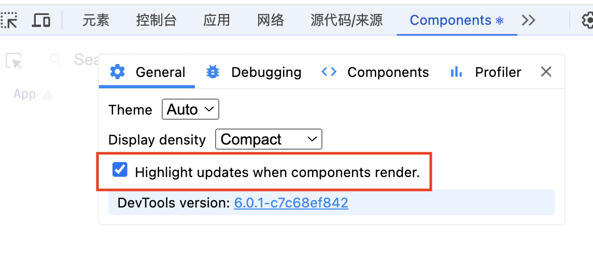

# 应用细节优化（react 篇）

## react 性能优化

::: tip
react性能优化主要是围绕着 `state 状态` 展开，实际上是在想办法减少 `rerender(重新渲染)`

- 组件异步加载：`React.lazy`、`Suspense`、`import() 动态导入`(与分包有关)
- `React.memo`：阻止一些不必要的更新
- `useMemo`、`useCallback` 的使用
- `performance` 进行性能分析

:::

## 调试工具



## 原生 hooks 状态优化

`组件拆分` 与 `开放封闭` 原则

### 代码优化 1：先使用 useCallback 优化

```tsx {4-8,17-19}
import React, { useCallback, useState } from 'react'

const StateDemo: React.FC = () => {
  const [count, setCount] = useState(0)
  // 写法1:
  const handleClick1 = useCallback(() => {
    setCount(count + 1)
  }, [count])

  // 写法2: 就近取值（推荐）
  /**
   * useCallback 钩子的依赖项数组中包含了 count，
   * 但 handleClick 函数内部并没有直接使用 count 变量。
   * 由于 setCount 使用了函数式更新（即 (val) => val + 1），
   * 因此不需要将 count 列为依赖项。这会导致不必要的重新渲染和性能问题。
   */
  const handleClick = useCallback(() => {
    setCount((val) => val + 1)
  }, [])
  return <div onClick={handleClick}>state demo --- {count}</div>
}

export default StateDemo
```

### 代码优化 2：将组件拆分

```tsx
import React, { useCallback, useState } from 'react'

const Count: React.FC<{ count: number }> = ({ count }) => {
  return <div>{count}</div>
}

const Price: React.FC<{ price: number }> = ({ price }) => {
  return <div>{price}</div>
}

const StateDemo: React.FC = () => {
  const [count, setCount] = useState(0)
  const [price, setPrice] = useState(0)

  const handleClick = useCallback(() => {
    setCount((val) => val + 1)
  }, [])
  const handlePrice = useCallback(() => {
    setPrice((val) => val + 1)
  }, [])

  return (
    <div>
      <button onClick={handleClick}>count++</button>
      <button onClick={handlePrice}>price++</button>
      <Count count={count} />
      <Price price={price} />
    </div>
  )
}

export default StateDemo
```

通过调试工具，结果发现：当 count 变化时，Count 和 Price 组件都会重新渲染，不是我们想要的

### 代码优化 3：在第二步的前提下，使用 `React.memo` 将组件包裹

```tsx {1,8}
const Count: React.FC<{ count: number }> = memo(({ count }) => {
  useEffect(() => {
    console.log('count')
  })
  return <div>{count}</div>
})

const Price: React.FC<{ price: number }> = memo(({ price }) => {
  useEffect(() => {
    console.log('price')
  })
  return <div>{price}</div>
})
```

虽然在两个组件的 `useEffect` 中，控制台输出的 log 可以知道，当 count 变化时，只有 count 的 useEffect 会执行，price 的 useEffect 不会执行

但是通过调试工具可以发现：当 count 变化时，Count 和 Price 组件都会重新渲染，也不是我们想要的

::: danger 原因
因为状态放在了父组件中，所以当父组件状态变化时，子组件也会重新渲染
:::

### 代码优化 4：将状态放在子组件中，使用 useImperativeHandle 和 forwardRef

采用`开放封闭原则`：将状态放在子组件中

```tsx {3-8,19-24,33,34,46,47}
const Count = forwardRef((prosp, ref) => {
  // [!code ++]
  const [count, setCount] = useState(0)
  useImperativeHandle(ref, () => ({
    // [!code ++]
    count,
    increment: () => {
      setCount((c) => c + 1)
    }
  }))
  useEffect(() => {
    console.log('count')
  })

  return <div>{count}</div>
})

const Price = forwardRef((props, ref) => {
  // [!code ++]
  const [price, setPrice] = useState(0)

  useImperativeHandle(ref, () => ({
    // [!code ++]
    price,
    increment: () => {
      setPrice((p) => p + 1)
    }
  }))
  useEffect(() => {
    console.log('price')
  })

  return <div>{price}</div>
})

const StateDemo: React.FC = () => {
  const ref1 = useRef(null)
  const ref2 = useRef(null)
  const handleClick = useCallback(() => {
    ref1.current!.increment()
  }, [])

  const handlePrice = useCallback(() => {
    ref2.current!.increment()
  }, [])
  return (
    <div>
      <button onClick={handleClick}>count++</button>
      <button onClick={handlePrice}>price++</button>
      <Count ref={ref1} />
      <Price ref={ref2} />
    </div>
  )
}

export default StateDemo
```

结果：当 count 变化时，Count 组件会重新渲染，Price 组件不会重新渲染，是我们想要的结果

## store 集中状态优化

这里 使用 redux + react-redux，使用代码如下：

```tsx
import React, { forwardRef, useCallback } from 'react'
import { useDispatch, useSelector } from 'react-redux'
import { State } from '../store'

const Count = forwardRef(() => {
  const store = useSelector<State>((state) => state)
  return <div>{store.count}</div>
})

const Price = forwardRef((props, ref) => {
  const store = useSelector<State>((state) => state)
  return <div>{store.price}</div>
})

const StateDemo: React.FC = () => {
  const dispatch = useDispatch()
  const handleClick = useCallback(() => {
    dispatch({ type: 'INCREMENT_COUNT' })
  }, [])

  const handlePrice = useCallback(() => {
    dispatch({ type: 'INCREMENT_PRICE' })
  }, [])
  return (
    <div>
      <button onClick={handleClick}>count++</button>
      <button onClick={handlePrice}>price++</button>
      <Count />
      <Price />
    </div>
  )
}

export default StateDemo
```

下面是优化前后对比，拿 Count 组件举例( Price 组件一样)：

::: code-group

```tsx {2} [优化前]
const Count = forwardRef(() => {
  const store = useSelector<State>((state) => state) // [!code --]
  return <div>{store.count}</div>
})
```

```tsx {2} [优化后]
const Count = forwardRef(() => {
  const count = useSelector<State>((state) => state.count) // [!code ++]
  return <div>{count}</div>
})
```

:::

::: tip 原因
因为在订阅状态的时候，没有用细颗粒度的方式，state 中会包含 count 和 price，当其中一个变化，会导致使用到的组件都重新渲染
:::
