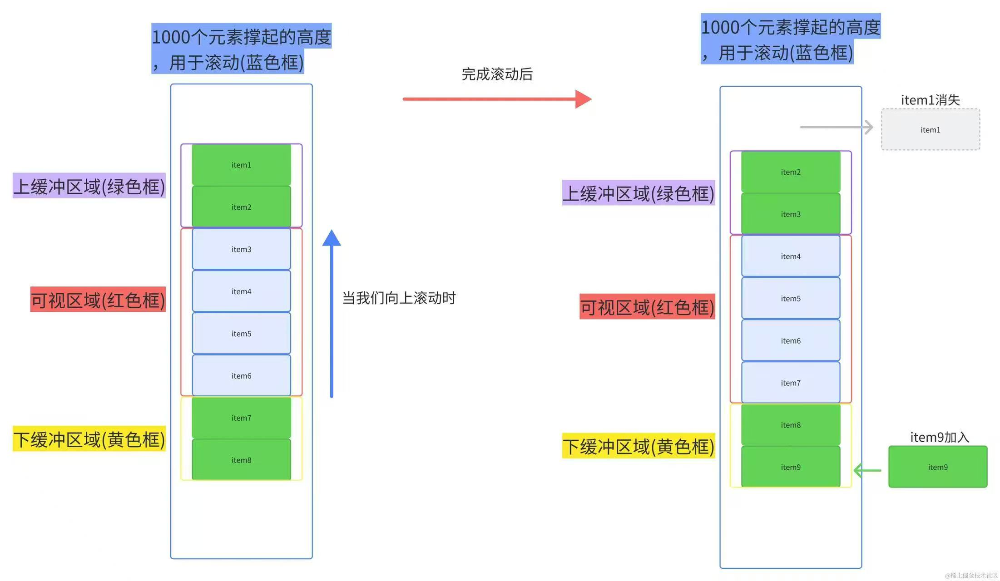

# 虚拟列表

::: tip 虚拟列表

`场景`：接口返回巨量的数据，全部渲染会非常耗时间、消耗性能

`解决`：只需要展示用户所能看到的数据，其他不做渲染

`实现`：外层容器高度固定，内层容器高度动态计算，虚拟容器用来显示滚动条（每条高度 * 数据量），通过滚动事件计算当前滚动位置，根据位置计算需要渲染的数据，渲染数据到页面



:::

## 虚拟列表，如果子元素高度不固定，处理方案

1. **动态计算子元素高度：**
首先，你需要在渲染子元素之前动态计算每个子元素的高度。

```js
const childElement = document.getElementById("child - element");
const childHeight = childElement.clientHeight;
```

2. **存储高度信息：**
一旦你计算了每个子元素的高度，你可以将这些高度信息存储在一个数组中，其中索引对应于子元素在虚拟列表中的位置。

```js
const childHeights = [100, 150, 120, ...]; // 存储子元素的高度
```

3. **根据高度信息渲染子元素：**
在虚拟列表中，使用已存储的子元素高度信息来计算视口中应该渲染哪些子元素。根据已知的子元素高度和视口的高度来动态计算可见子元素的数量。通过维护一个滚动位置，可以确定哪些子元素应该在视口中渲染，然后只渲染这些子元素。 

## 虚拟滚动中，快速滚动会有什么问题（如果有图片之类的，会一直加载，会卡顿咋办）

**可能遇到的问题**：

1. 渲染滞后 / 卡顿：虚拟滚动通常只渲染可视区域的元素。快速滚动时，浏览器可能无法及时回收旧节点、创建新节点，导致**短时间内 DOM 更新过多**，结果就是 UI 卡顿或掉帧。
2. 图片或媒体资源频繁加载：如果列表中有图片，每次渲染新元素就会触发网络请求。快速滚动时，之前加载的图片可能还没完成就被销毁，新渲染的元素又开始加载，会出现**大量请求堆积**，浏览器可能一度阻塞或掉帧。
3. 闪烁或占位问题：图片未加载完时，可能看到空白或占位闪烁。如果虚拟滚动库回收 DOM 节点时没有做好缓存，也会导致视觉跳动。
4. 状态丢失：快速滚动导致组件频繁卸载和挂载，如果组件内部有状态（如输入框内容、动画等），可能丢失。

**解决方法**：

### 1. **图片/媒体懒加载**

解决的问题：请求过多 / 网络阻塞 / 卡顿

因为快速滚动时，大量图片同时进入视口，每个都触发加载 → 几十甚至上百个并发请求，浏览器连接数有限 → 排队 → 卡顿。所以只加载“真正进入视口”的图片，未进入的不请求。

使用 `loading="lazy"` 或 IntersectionObserver 控制加载

```html

```

### 2. 占位

解决的问题：页面抖动 / 白屏闪烁 / CLS（布局偏移）

因为图片未加载前没有高度 → DOM 高度不稳定，所以滚动过程中不断 reflow → 视觉抖动。给图片设置固定尺寸或骨架占位（Skeleton），避免布局跳动。

### 3. 节流 / 防抖滚动事件

虽然虚拟滚动库一般内部有优化，但可以在自定义滚动逻辑中用 `requestAnimationFrame` 或节流函数，减少渲染频率。

### 4. 提前渲染缓冲区（overscan）
虚拟滚动库一般提供 `overscan` 参数：例如渲染 可视区域 + 上下额外 5~10 个元素。避免快速滚动出现空白。

### 5. DOM 缓存复用

解决的问题：频繁创建/销毁 DOM → 性能抖动

通过 **池化**（reuse DOM）而不是频繁创建/销毁节点。React 中常用 `react-window` 或 `react-virtualized` 已有此优化。

也就是只改变节点内容，用react代码举例：

::: details

> 注意：`key={index}`，而不是 item.id这样的变化内容（保证DOM复用）

```tsx
import React, { useRef, useEffect, useState } from "react";

const TOTAL = 10000;     // 总数据量
const ITEM_HEIGHT = 50;  // 每项高度
const VIEW_HEIGHT = 300; // 容器高度

export default function VirtualList() {
  const containerRef = useRef(null);

  // 可视区能容纳多少个
  const visibleCount = Math.ceil(VIEW_HEIGHT / ITEM_HEIGHT);

  // DOM池数据（固定长度）
  const [items, setItems] = useState(
    Array.from({ length: visibleCount + 2 }, (_, i) => ({
      index: i,
      top: i * ITEM_HEIGHT,
    }))
  );

  // 总高度（撑开滚动条）
  const totalHeight = TOTAL * ITEM_HEIGHT;

  // 核心：滚动更新
  const handleScroll = () => {
    const scrollTop = containerRef.current.scrollTop;

    // 当前起始 index
    const startIndex = Math.floor(scrollTop / ITEM_HEIGHT);

    // 更新池中每个节点的数据
    const newItems = items.map((_, i) => {
      const dataIndex = startIndex + i;

      return {
        index: dataIndex,
        top: dataIndex * ITEM_HEIGHT,
      };
    });

    setItems(newItems);
  };

  // 初始渲染
  useEffect(() => {
    handleScroll();
  }, []);

  return (
    <div
      ref={containerRef}
      onScroll={handleScroll}
      style={{
        height: VIEW_HEIGHT,
        overflowY: "auto",
        border: "1px solid #ccc",
        position: "relative",
      }}
    >
      {/* 撑开滚动区域 */}
      <div style={{ height: totalHeight, position: "relative" }}>
        {items.map((item, i) => (
          <div
            key={i} // ⚠️ 注意：这里用 i，而不是 item.index（保证DOM复用）
            style={{
              position: "absolute",
              height: ITEM_HEIGHT,
              width: "100%",
              borderBottom: "1px solid #eee",
              transform: `translateY(${item.top}px)`,
              background: "#fff",
            }}
          >
            Item {item.index}
          </div>
        ))}
      </div>
    </div>
  );
}
```

:::

### 6. 图片请求去抖/取消

在组件卸载时取消未完成的请求：

```js
const controller = new AbortController();
fetch(url, { signal: controller.signal });

// 卸载时取消
controller.abort();
```
