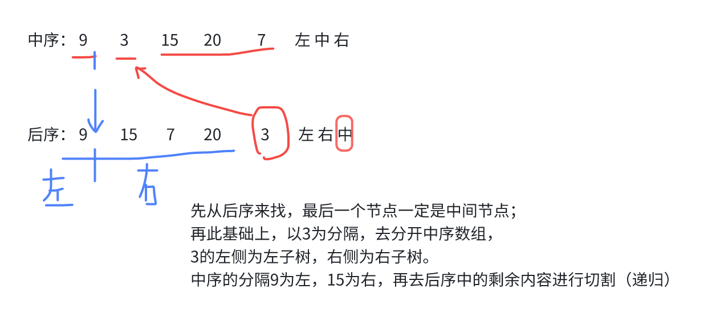

# 二叉树

## 1. 二叉树的前序遍历

<LeetCodeLink url="https://leetcode.cn/problems/binary-tree-preorder-traversal/description/" />

给你二叉树的根节点 `root` ，返回它节点值的**前序遍历**。

**示例 1**：

> **输入**：root = [1,null,2,3]
>
> **输出**：[1,2,3]
>
> **解释**：
>
> 

**示例 2**：

> **输入**：root = [1,2,3,4,5,null,8,null,null,6,7,9]
>
> **输出**：[1,2,4,5,6,7,3,8,9]
>
> **解释**：
>
> 

**示例 3**：

> **输入**：root = []
>
> **输出**：[]

**示例 4**：

> **输入**：root = [1]
>
> **输出**：[1]

::: code-group

```md [思路]
这个前序遍历在【二叉树基础知识】部分已经说过了，分为递归和迭代两种方法

要注意使用递归的时候，res 的初始化尽量防止参数中，也可以使用闭包，例如：
var inorderTraversal = function(root) {
**闭包**
const res = []
function inorder(node) {
if (!node) return
inorder(node.left)
res.push(node.val)
inorder(node.right)
}
inorder(root)
return res
}
如果将 res 数组在函数内部初始化，会导致每次递归调用都创建一个新的空数组，而不是在同一个数组上累积结果。
```

```js [递归法]
/**
 * Definition for a binary tree node.
 * function TreeNode(val, left, right) {
 *     this.val = (val===undefined ? 0 : val)
 *     this.left = (left===undefined ? null : left)
 *     this.right = (right===undefined ? null : right)
 * }
 */
/**
 * @param {TreeNode} root
 * @return {number[]}
 */
var preorderTraversal = function (root, res = []) {
  if (!root) return []
  // 中
  res.push(root.val)
  // 左
  preorderTraversal(root.left, res)
  // 右
  preorderTraversal(root.right, res)
  return res
}
```

```js [统一迭代法]
// 迭代法
var preorderTraversal = function (root) {
  if (!root) return []

  const result = []
  // ⚠️注意：需要初始化栈
  const stack = [root]

  while (stack.length > 0) {
    const node = stack.pop()

    if (node === null) {
      const curNode = stack.pop()
      result.push(curNode.val)
    } else {
      // 遍历：中左右
      // 栈存放：右左中
      // 右
      node.right && stack.push(node.right)
      // 左
      node.left && stack.push(node.left)
      // 中
      stack.push(node)
      stack.push(null)
    }
  }

  return result
}
```

:::

## 2. 二叉树的中序遍历

<LeetCodeLink url="https://leetcode.cn/problems/binary-tree-inorder-traversal/description/" />

这道题在【二叉树基础】中有说，和第一题差不多，只是交换递归/遍历的顺序即可。

## 3. 二叉树的后序遍历

<LeetCodeLink url="https://leetcode.cn/problems/binary-tree-postorder-traversal/description/" />

这道题在【二叉树基础】中有说，和第一题差不多，只是交换递归/遍历的顺序即可。

## 🚀 ⬇️ 二叉树层序遍历

## 4. 二叉树的层序遍历

<LeetCodeLink url="https://leetcode.cn/problems/binary-tree-level-order-traversal/description/" />

给你二叉树的根节点 `root` ，返回其节点值的 **层序遍历** 。 （即逐层地，从左到右访问所有节点）。

**示例 1**：


> 输入：root = [3,9,20,null,null,15,7]
>
> 输出：[[3],[9,20],[15,7]]

**示例 2**：

> 输入：root = [1]
>
> 输出：[[1]]

**示例 3**：

> 输入：root = []
>
> 输出：[]

::: code-group

```md [思路]
递归法（深度优先）：只需要考虑当前节点的和它的左右子节点，并递归处理。
迭代法（广度优先）：需要记录当前层的节点，并遍历当前层的节点，并记录下一层的节点。
```

```js [递归法]
var levelOrder = function (root) {
  if (!root) return []
  let res = []
  dfs(root, 0, res)
  return res
}

function dfs(root, step, res) {
  if (!root) return
  if (!res[step]) res[step] = []
  res[step].push(root.val)
  root.left && dfs(root.left, step + 1, res)
  root.right && dfs(root.right, step + 1, res)
}
```

```js [迭代法]
var levelOrder = function (root) {
  if (!root) return []
  const res = []
  const queue = [root]

  while (queue.length > 0) {
    const level_size = queue.length
    const cur_res = []

    for (let i = 0; i < level_size; i++) {
      // 处理当前元素
      let cur_node = queue.shift()
      cur_res.push(cur_node.val)

      // 处理子节点
      cur_node.left && queue.push(cur_node.left)
      cur_node.right && queue.push(cur_node.right)
    }

    res.push(cur_res)
  }
  return res
}
```

:::

## 5. 二叉树的层序遍历 II

<LeetCodeLink url="https://leetcode.cn/problems/binary-tree-level-order-traversal-ii/description/" />

给你二叉树的根节点 `root` ，返回其节点值 **自底向上的层序遍历** 。 （即按从叶子节点所在层到根节点所在的层，逐层从左向右遍历）

**示例 1**：


> 输入：root = [3,9,20,null,null,15,7]
>
> 输出：[[15,7],[9,20],[3]]

**示例 2**：

> 输入：root = [1]
>
> 输出：[[1]]

**示例 3**：

> 输入：root = []
>
> 输出：[]

::: code-group

```md [思路]
这道题和上一题非常类似，只是需要将输出的二维数组进行反转，
可以在上一题中最后将每一层 push 进去的时候，直接放在最前面（使用 unshift）
```

```js [迭代法（广度优先）]
/**
 * Definition for a binary tree node.
 * function TreeNode(val, left, right) {
 *     this.val = (val===undefined ? 0 : val)
 *     this.left = (left===undefined ? null : left)
 *     this.right = (right===undefined ? null : right)
 * }
 */
/**
 * @param {TreeNode} root
 * @return {number[][]}
 */
var levelOrderBottom = function (root) {
  if (!root) return []
  let res = []
  let queue = [root]

  while (queue.length > 0) {
    const level_size = queue.length
    const level_res = []
    for (let i = 0; i < level_size; i++) {
      const node = queue.shift()
      // 当前节点
      level_res.push(node.val)
      // 左
      node.left && queue.push(node.left)
      // 右
      node.right && queue.push(node.right)
    }
    res.unshift(level_res) // [!code ++]
  }
  return res
}
```

:::

## 6. 二叉树的右视图

<LeetCodeLink url="https://leetcode.cn/problems/binary-tree-right-side-view/description/" />

给定一个二叉树的 根节点 `root`，想象自己站在它的右侧，按照从顶部到底部的顺序，返回从右侧所能看到的节点值。

**示例 1**：

> 输入：root = [1,2,3,null,5,null,4]
>
> 输出：[1,3,4]
>
> 解释：
>
> 

**示例 2**：

> 输入：root = [1,2,3,4,null,null,null,5]
>
> 输出：[1,3,4,5]
>
> 解释：
>
> 

**示例 3**：

> 输入：root = [1,null,3]
>
> 输出：[1,3]

**示例 4**：

> 输入：root = []
>
> 输出：[]

::: code-group

```md [思路]
这道题的思路，本质还是层序遍历，但是需要记录每一层的最后一个节点。
结果只需要 push 到最后的结果数组即可，不用每层创建一个数组。
```

```c [代码]
/**
 * Definition for a binary tree node.
 * function TreeNode(val, left, right) {
 *     this.val = (val===undefined ? 0 : val)
 *     this.left = (left===undefined ? null : left)
 *     this.right = (right===undefined ? null : right)
 * }
 */
/**
 * @param {TreeNode} root
 * @return {number[]}
 */
var rightSideView = function (root) {
  if (!root) return []
  const res = []
  const queue = [root]

  while (queue.length > 0) {
    const level_size = queue.length

    for (let i = 0; i < level_size; i++) {
      // 当前节点
      const node = queue.shift()
      // 只push末尾节点
      if (i === level_size - 1) { // [!code ++]
        res.push(node.val) // [!code ++]
      } // [!code ++]
      node.left && queue.push(node.left)
      node.right && queue.push(node.right)
    }
  }
  return res
}
```

:::

## 7. 二叉树的层平均值

<LeetCodeLink url="https://leetcode.cn/problems/average-of-levels-in-binary-tree/description/" />

给定一个非空二叉树的根节点 root , 以数组的形式返回每一层节点的平均值。与实际答案相差 10 的-5 次方 以内的答案可以被接受。

**示例 1**：


> 输入：root = [3,9,20,null,null,15,7]
>
> 输出：[3.00000,14.50000,11.00000]
>
> 解释：第 0 层的平均值为 3,第 1 层的平均值为 14.5,第 2 层的平均值为 11。因此返回 [3, 14.5, 11] 。

**示例 2**：


> 输入：root = [3,9,20,15,7]
>
> 输出：[3.00000,14.50000,11.00000]

::: code-group

```md [思路]
看解答
```

```js [代码]
/**
 * Definition for a binary tree node.
 * function TreeNode(val, left, right) {
 *     this.val = (val===undefined ? 0 : val)
 *     this.left = (left===undefined ? null : left)
 *     this.right = (right===undefined ? null : right)
 * }
 */
/**
 * @param {TreeNode} root
 * @return {number[]}
 */
var averageOfLevels = function (root) {
  if (!root) return []
  let res = []
  let queue = [root]
  while (queue.length > 0) {
    // 用来控制遍历层数和算平均值的
    let level_size = queue.length // [!code ++]
    // 求和
    let sum = 0 // [!code ++]
    for (let i = 0; i < level_size; i++) {
      const node = queue.shift()
      sum += node.val // [!code ++]
      // 左
      node.left && queue.push(node.left)
      // 右
      node.right && queue.push(node.right)
    }
    let n = sum / level_size // [!code ++]
    res.push(n) // [!code ++]
  }
  return res
}
```

:::

## 8. N 叉树的层序遍历

<LeetCodeLink url="https://leetcode.cn/problems/n-ary-tree-level-order-traversal/description/" />

给定一个 N 叉树，返回其节点值的层序遍历。（即从左到右，逐层遍历）。

树的序列化输入是用层序遍历，每组子节点都由 null 值分隔（参见示例）。

**示例 1**：


> 输入：root = [1,null,3,2,4,null,5,6]
>
> 输出：[[1],[3,2,4],[5,6]]

**示例 2**：


> 输入：root = [1,null,2,3,4,5,null,null,6,7,null,8,null,9,10,null,null,11,null,12,null,13,null,null,14]
>
> 输出：[[1],[2,3,4,5],[6,7,8,9,10],[11,12,13],[14]]

::: code-group

```md [思路]
这道题每一层可能有 2 个以上,所以不再使用 `node.left node.right`，而是去添加它的所有子节点
```

```c [代码]
/**
 * // Definition for a _Node.
 * function _Node(val,children) {
 *    this.val = val;
 *    this.children = children;
 * };
 */
/**
 * @param {_Node|null} root
 * @return {number[][]}
 */
var levelOrder = function (root) {
  if (!root) return []
  let res = []
  let queue = [root]

  while (queue.length > 0) {
    let level_size = queue.length
    let level_res = []

    for (let i = 0; i < level_size; i++) {
      const node = queue.shift()
      level_res.push(node.val)

      // 遍历当前节点的子节点（不只是node.right / node.left)
      for (let item of node.children) { // [!code ++]
        queue.push(item) // [!code ++]
      } // [!code ++]
    }

    res.push(level_res)
  }

  return res
}
```

:::

## 9. 在每个树行中找最大值

<LeetCodeLink url="https://leetcode.cn/problems/find-largest-value-in-each-tree-row/description/" />

给定一棵二叉树的根节点 root ，请找出该二叉树中每一层的最大值。

**示例 1**：


> 输入: root = [1,3,2,5,3,null,9]
>
> 输出: [1,3,9]

**示例 2**：

> 输入: root = [1,2,3]
>
> 输出: [1,3]

::: code-group

```md [思路]
老思路，去比较大小即可（需要给 max 初始化设置一个无限小的值`-Infinity` / `-Number.MAX_VALUE`）
```

```js [代码]
/**
 * Definition for a binary tree node.
 * function TreeNode(val, left, right) {
 *     this.val = (val===undefined ? 0 : val)
 *     this.left = (left===undefined ? null : left)
 *     this.right = (right===undefined ? null : right)
 * }
 */
/**
 * @param {TreeNode} root
 * @return {number[]}
 */
var largestValues = function (root) {
  if (!root) return []
  let res = []
  let queue = [root]
  while (queue.length > 0) {
    const level_size = queue.length
    let max = -Number.MAX_VALUE // [!code ++]
    for (let i = 0; i < level_size; i++) {
      const node = queue.shift()
      max = Math.max(node.val, max) // [!code ++]
      // 子节点
      node.left && queue.push(node.left)
      node.right && queue.push(node.right)
    }
    res.push(max) // [!code ++]
  }
  return res
}
```

:::

## 10. 填充每个节点的下一个右侧节点指针

<LeetCodeLink url="https://leetcode.cn/problems/populating-next-right-pointers-in-each-node/description/" />

给定一个 完美二叉树 ，其所有叶子节点都在同一层，每个父节点都有两个子节点。二叉树定义如下：

```c
struct Node {
  int val;
  Node *left;
  Node *right;
  Node *next;
}
```

填充它的每个 next 指针，让这个指针指向其下一个右侧节点。如果找不到下一个右侧节点，则将 next 指针设置为 NULL。

初始状态下，所有 next 指针都被设置为 NULL。

**示例 1**：


> 输入：root = [1,2,3,4,5,6,7]
>
> 输出：[1,#,2,3,#,4,5,6,7,#]
>
> 解释：给定二叉树如图 A 所示，你的函数应该填充它的每个 next 指针，以指向其下一个右侧节点，如图 B 所示。序列化的输出按层序遍历排列，同一层节点由 next 指针连接，'#' 标志着每一层的结束。

**示例 2**:

> 输入：root = []
>
> 输出：[]

::: code-group

```md [思路]
这道题的输出和之前的容易让人迷糊，看答题模版，函数的返回值是 `_Node`，也就是二叉树节点，而不是数组，
所以需要构建二叉树的 `next` 节点。
如何去找到该节点呢？`const node = queue.shift()` 是当前节点，而 `queue[0]` 则是下一个节点，
原因如下：（队列头出，出来后的队列的首元素就是下一个节点）
假设当前层有节点 A, B, C
队列状态：[A, B, C, ...下一层节点]
let node = queue.shift(); // 取出 A
此时队列变为：[B, C, ...下一层节点]
queue[0] 就是 B，即 A 的下一个右侧节点
```

```c [代码]
/**
 * // Definition for a _Node.
 * function _Node(val, left, right, next) {
 *    this.val = val === undefined ? null : val;
 *    this.left = left === undefined ? null : left;
 *    this.right = right === undefined ? null : right;
 *    this.next = next === undefined ? null : next;
 * };
 */
/**
 * @param {_Node} root
 * @return {_Node}
 */
var connect = function (root) {
  if (!root) return root
  let queue = [root]
  while (queue.length > 0) {
    let level_size = queue.length
    for (let i = 0; i < level_size; i++) {
      const node = queue.shift()
      // if的作用：为了区分当前层的节点是否是最后一个节点： // [!code ++]
      // 当 i < level_size - 1 时：当前节点不是当前层的最后一个节点，需要设置 next 指针 // [!code ++]
      // 当 i === level_size - 1 时：当前节点是当前层的最后一个节点，不需要设置 next 指针（默认为 null） // [!code ++]
      if (i < level_size - 1) { // [!code ++]
        const next_node = queue[0] // [!code ++]
        node.next = next_node // [!code ++]
      } // [!code ++]
      node.left && queue.push(node.left)
      node.right && queue.push(node.right)
    }
  }
  return root // [!code ++]
}
```

:::

## 11. 二叉树的最小深度

<LeetCodeLink url="https://leetcode.cn/problems/minimum-depth-of-binary-tree/description/" />

给定一个二叉树，找出其最小深度。

最小深度是从根节点到最近叶子节点的最短路径上的节点数量。

**说明**：叶子节点是指没有子节点的节点。


**示例 1**：

> 输入：root = [3,9,20,null,null,15,7]
>
> 输出：2

**示例 2**：

> 输入：root = [2,null,3,null,4,null,5,null,6]
>
> 输出：5

::: code-group

```md [思路]
该题需要判断当前节点如何为空：左右子树的节点都为 null
```

```c [代码]
/**
 * Definition for a binary tree node.
 * function TreeNode(val, left, right) {
 *     this.val = (val===undefined ? 0 : val)
 *     this.left = (left===undefined ? null : left)
 *     this.right = (right===undefined ? null : right)
 * }
 */
/**
 * @param {TreeNode} root
 * @return {number}
 */
var minDepth = function (root) {
  if (!root) return 0
  let queue = [root]
  let minDeep = 0
  while (queue.length > 0) {
    const level_size = queue.length
    minDeep++
    for (let i = 0; i < level_size; i++) {
      const node = queue.shift()
      if (!node.left && !node.right) { // [!code ++]
        return minDeep // [!code ++]
      } // [!code ++]
      node.left && queue.push(node.left)
      node.right && queue.push(node.right)
    }
  }
  return minDeep
}
```

:::

## 🚀 ⬆️ 二叉树层序遍历

## 12. 翻转二叉树

<LeetCodeLink url="https://leetcode.cn/problems/invert-binary-tree/description/" />

给你一棵二叉树的根节点 root ，翻转这棵二叉树，并返回其根节点。

**示例 1**：


> 输入：root = [4,2,7,1,3,6,9]
>
> 输出：[4,7,2,9,6,3,1]

**示例 2**：


> 输入：root = [2,1,3]
>
> 输出：[2,3,1]

**示例 3**：

> 输入：root = []
>
> 输出：[]

::: code-group

```md [思路]
二叉树的翻转，可以以根节点为分界进行翻转，想要翻转它，其实就把每一个节点的左右孩子交换一下就可以了。

关键在于遍历顺序，前中后序应该选哪一种遍历顺序？
这道题目使用前序遍历和后序遍历都可以，唯独中序遍历不方便

**遍历的过程中去翻转每一个节点的左右孩子就可以达到整体翻转的效果**。
```

```js [递归法-前序遍历]
/**
 * Definition for a binary tree node.
 * function TreeNode(val, left, right) {
 *     this.val = (val===undefined ? 0 : val)
 *     this.left = (left===undefined ? null : left)
 *     this.right = (right===undefined ? null : right)
 * }
 */
/**
 * @param {TreeNode} root
 * @return {TreeNode}
 */
var invertTree = function (root) {
  if (!root) return null
  // 用变量保存一下节点
  let rightNode = root.right
  // 交换节点
  root.right = invertTree(root.left)
  root.left = invertTree(rightNode)
  return root
}
```

```js [迭代法-前序遍历]
/**
 * Definition for a binary tree node.
 * function TreeNode(val, left, right) {
 *     this.val = (val===undefined ? 0 : val)
 *     this.left = (left===undefined ? null : left)
 *     this.right = (right===undefined ? null : right)
 * }
 */
/**
 * @param {TreeNode} root
 * @return {TreeNode}
 */
var invertTree = function (root) {
  if (!root) return null
  const stack = [root]
  while (stack.length > 0) {
    const node = stack.pop()
    if (node === null) {
      // 运行到当前节点标记
      // 获取当前节点
      const cur_node = stack.pop()
      // 翻转
      const tmp = cur_node.left
      cur_node.left = cur_node.right
      cur_node.right = tmp
    } else {
      // 存节点，前序：中左右
      // 入栈顺序：右左中
      node.right && stack.push(node.right)
      node.left && stack.push(node.left)
      stack.push(node)
      stack.push(null)
    }
  }
  return root
}
```

```js [层序遍历]
/**
 * Definition for a binary tree node.
 * function TreeNode(val, left, right) {
 *     this.val = (val===undefined ? 0 : val)
 *     this.left = (left===undefined ? null : left)
 *     this.right = (right===undefined ? null : right)
 * }
 */
/**
 * @param {TreeNode} root
 * @return {TreeNode}
 */
var invertTree = function (root) {
  if (!root) return null
  const queue = [root]
  while (queue.length > 0) {
    const level_size = queue.length
    for (let i = 0; i < level_size; i++) {
      const node = queue.shift()
      // 交换当前节点的左右子树
      const temp = node.left
      node.left = node.right
      node.right = temp
      // 左右节点
      node.left && queue.push(node.left)
      node.right && queue.push(node.right)
    }
  }
  return root
}
```

:::

## 13. 对称二叉树

<LeetCodeLink url="https://leetcode.cn/problems/symmetric-tree/description/" />

给你一个二叉树的根节点 root ， 检查它是否轴对称。

**示例 1**：


> 输入：root = [1,2,2,3,4,4,3]
>
> 输出：true

**示例 2**：


> 输入：root = [1,2,2,null,3,null,3]
>
> 输出：false

::: code-group

```md [思路]
对于二叉树是否对称，要比较的是**根节点**的左子树与右子树是不是相互翻转的，
**其实要比较的是两个树（这两个树是根节点的左右子树）**，
所以在递归遍历的过程中，也是要**同时遍历两棵树**。

**递归法**：

- 参数：要比较的是两个树，参数自然也是左子树节点和右子树节点。
- 终止条件：要比较两个节点数值相不相同，首先要把两个节点为空的情况弄清楚！否则后面比较数值的时候就会操作空指针了。
  - 节点为空的情况有：（注意我们比较的其实不是左孩子和右孩子，所以如下称之为左节点右节点）
    左节点为空，右节点不为空，不对称，return false
    左不为空，右为空，不对称 return false
    左右都为空，对称，返回 true（当前节点，可以跳过到下一次循环）
  - 此时已经排除掉了节点为空的情况，那么剩下的就是左右节点不为空：
    左右都不为空，比较节点数值，不相同就 return false
- 单层递归的逻辑：左右节点都不为空，且数值相同的情况。
  - 比较二叉树外侧是否对称：传入的是左节点的左孩子，右节点的右孩子。
  - 比较内侧是否对称，传入左节点的右孩子，右节点的左孩子。
  - 如果左右都对称就返回 true ，有一侧不对称就返回 false。

**迭代法**：

这里的迭代法可不是前中后序的迭代写法，本题的本质是判断两个树是否是相互翻转的，其实已经不是所谓二叉树遍历的前中后序的关系了。
这里我们可以使用队列来比较两个树（根节点的左右子树）是否相互翻转，（注意这不是层序遍历）
通过队列来判断根节点的左子树和右子树的内侧和外侧是否相等，动画如下：
```

```js [递归法]
/**
 * Definition for a binary tree node.
 * function TreeNode(val, left, right) {
 *     this.val = (val===undefined ? 0 : val)
 *     this.left = (left===undefined ? null : left)
 *     this.right = (right===undefined ? null : right)
 * }
 */
/**
 * @param {TreeNode} root
 * @return {boolean}
 */
var isSymmetric = function (root) {
  if (!root) return false
  return diffNode(root.left, root.right)
}

function diffNode(left, right) {
  if ((left === null && right !== null) || (left !== null && right === null)) {
    // left、right只有一者为null，直接false
    return false
  } else if (left === null && right === null) {
    // 结束当前递归函数
    return true
  } else if (left.val !== right.val) {
    // 节点值不相等
    return false
  }
  // 排除当前节点很明显不对称的情况
  // 去考虑左树的外侧是否等于右树的外侧
  const outSide = diffNode(left.left, right.right)
  // 考虑左树内侧是否等于右树内侧
  const inSide = diffNode(left.right, right.left)
  // 只有当outSide和inSide两种情况都满足，树才是对称的
  return outSide && inSide
}
```

```js [迭代法]
/**
 * Definition for a binary tree node.
 * function TreeNode(val, left, right) {
 *     this.val = (val===undefined ? 0 : val)
 *     this.left = (left===undefined ? null : left)
 *     this.right = (right===undefined ? null : right)
 * }
 */
/**
 * @param {TreeNode} root
 * @return {boolean}
 */
var isSymmetric = function (root) {
  if (!root) return false
  // 同时去操作两颗树（左右树）
  const queue = [root.left, root.right]
  while (queue.length > 0) {
    // 和上面初始化的顺序一致就行
    const leftNode = queue.shift() // 左节点
    const rightNode = queue.shift() // 右节点
    // 下面的if else判断只是判断两个数的节点是否满足条件
    if (
      (leftNode === null && rightNode !== null) ||
      (leftNode !== null && rightNode === null)
    ) {
      // 节点不相同，直接false
      return false
    } else if (leftNode === null && rightNode === null) {
      // 节点相同，继续比较（可能是某个分支的节点，不一定到末尾了）
      continue
    } else if (leftNode.val !== rightNode.val) {
      return false
    }
    // if过后表示当前节点满足条件了，将子节点继续放入队列比较
    // 将左树外侧和右树外侧节点加入
    queue.push(leftNode.left)
    queue.push(rightNode.right)
    // 将左树内侧和右树内侧加入
    queue.push(leftNode.right)
    queue.push(rightNode.left)
  }
  return true
}
```

:::


## 14. 完全二叉树的节点个数

<LeetCodeLink url="https://leetcode.cn/problems/count-complete-tree-nodes/description/" />

给你一棵 **完全二叉树** 的根节点 `root` ，求出该树的节点个数。

**示例 1**：


> 输入：root = [1,2,3,4,5,6]
>
> 输出：6

**示例 2**：

> 输入：root = []
>
> 输出：0

**示例 3**：

> 输入：root = [1]
>
> 输出：1

::: code-group

```md [思路]
这道题的解法就是把它当作普通二叉树，前中后/层序计算出节点总数就行
```

```js [代码: 层序遍历]
/**
 * Definition for a binary tree node.
 * function TreeNode(val, left, right) {
 *     this.val = (val===undefined ? 0 : val)
 *     this.left = (left===undefined ? null : left)
 *     this.right = (right===undefined ? null : right)
 * }
 */
/**
 * @param {TreeNode} root
 * @return {number}
 */
var countNodes = function (root) {
  if (!root) return 0
  const queue = [root]
  let nums = 0
  while (queue.length > 0) {
    const level_size = queue.length
    for (let i = 0; i < level_size; i++) {
      const node = queue.shift()
      nums++
      node.left && queue.push(node.left)
      node.right && queue.push(node.right)
    }
  }
  return nums
}
```

:::

## 15. 平衡二叉树

<LeetCodeLink url="https://leetcode.cn/problems/balanced-binary-tree/description/" />

给定一个二叉树，判断它是否是平衡二叉树。

> 平衡二叉树是指该树所有节点的左右子树的**高度相差**不超过 1。

**示例 1**：


> 输入：root = [3,9,20,null,null,15,7]
>
> 输出：true

**示例 2**：


> 输入：root = [1,2,2,3,3,null,null,4,4]
>
> 输出：false

**示例 3**：

> 输入：root = []
>
> 输出：true

::: code-group

```txt [思路]
“平衡二叉树是指该树所有节点的左右子树的高度相差不超过 1。”
这里定义的高度，所以我们要采用后序遍历来解决。
因为后序遍历是左右中，计算完左右子树，最后处理当前节点（可以去看【二叉树基础知识-二叉树的高度和深度】部分）

递归法、迭代法核心：当前左子树右子树高度相差大于 1 就返回-1

**递归**：
此时既然要求比较高度，必然是要后序遍历。

**迭代**：
我们可以使用层序遍历来求深度，但是就不能直接用层序遍历来求高度了，这就体现出求高度和求深度的不同。

可以先定义一个函数，专门用来求高度，
这个函数（getHeight）通过栈模拟的后序遍历找每一个节点的高度（其实是通过求传入节点为根节点的最大深度来求的高度）；
然后再用栈来模拟后序遍历，遍历每一个节点的时候，再去判断左右孩子的高度是否符合

在getHeight函数，当node===null的时候，会执行deepth--的操作，这个操作的目的：
表示我们已经处理完当前节点及其子树，需要退回上一层。例如：
    1
   / \
  2   3
 /
4
遍历过程中的 depth 变化如下：
访问节点 1：depth = 1
访问节点 2：depth = 2
访问节点 4：depth = 3
节点 4 无子节点，处理完毕后 depth--，depth = 2
回到节点 2，处理完毕后 depth--，depth = 1
访问节点 3：depth = 2
节点 3 无子节点，处理完毕后 depth--，depth = 1
回到节点 1，处理完毕后 depth--，depth = 0
最终返回最大深度 3。
```

```js [递归法]
/**
 * Definition for a binary tree node.
 * function TreeNode(val, left, right) {
 *     this.val = (val===undefined ? 0 : val)
 *     this.left = (left===undefined ? null : left)
 *     this.right = (right===undefined ? null : right)
 * }
 */
/**
 * @param {TreeNode} root
 * @return {boolean}
 */
var isBalanced = function (root) {
  // 在上面的判断是不平衡就是-1，只要不是-1就是平衡二叉树
  return !(getDepth(root) === -1)
}

var getDepth = function (node) {
  // 终止条件：空节点高度为0
  if (node === null) return 0

  if (!node.left && !node.right) {
    return 1
  }

  // 获取左右子树高度
  let leftDepth = getDepth(node.left)
  // 提前发现不平衡：当左子树已经是不平衡的（返回-1），则整个树肯定不平衡
  if (leftDepth === -1) {
    return -1
  }
  let rightDepth = getDepth(node.right)
  if (rightDepth === -1) {
    return -1
  }

  // 左右子树高度差的绝对值，判断是否为平衡二叉树
  if (Math.abs(leftDepth - rightDepth) > 1) {
    return -1 // 不平衡返回-1
  } else {
    // 平衡则返回当前节点高度（高度是节点到叶子节点距离）
    return 1 + Math.max(leftDepth, rightDepth)
  }
}
```

```js [迭代法]
/**
 * Definition for a binary tree node.
 * function TreeNode(val, left, right) {
 *     this.val = (val===undefined ? 0 : val)
 *     this.left = (left===undefined ? null : left)
 *     this.right = (right===undefined ? null : right)
 * }
 */
/**
 * @param {TreeNode} root
 * @return {boolean}
 */
var isBalanced = function (root) {
  if (!root) return true
  const stack = [root]
  while (stack.length > 0) {
    const node = stack.pop()
    if (Math.abs(getHeight(node.left) - getHeight(node.right)) > 1) {
      return false
    }
    // 普通的前序遍历，但是这里的left、right可以不管顺序，（不是统一迭代法模版）
    node.left && stack.push(node.left)
    node.right && stack.push(node.right)
  }
  return true
}

function getHeight(node) {
  if (!node) return 0
  let stack = [node]
  // 树的高度
  let res = 0
  // 当前节点的高度
  let depth = 0
  while (stack.length > 0) {
    const node = stack.pop()
    if (node === null) {
      // 遇到标记元素，则弹出标记元素（可以不用变量接受当前元素）
      const cur_node = stack.pop()
      // 表示我们已经处理完当前节点及其子树，需要退回上一层
      /**
       * 因为当前是后序遍历，入栈顺序：中右左
       * 当执行到节点时，已经处理完当前节点的左右子树，所以需要退回上一层
       * 在遍历子树的时候，depth++了，所以此时需要--
       * */
      depth--
    } else {
      // 后序遍历：左右中
      // 入栈顺序：中右左
      // 中
      stack.push(node)
      stack.push(null)
      // 右
      node.right && stack.push(node.right)
      // 左
      node.left && stack.push(node.left)
      // 最后push到栈的元素是子节点，所以到下一层了，需要++
      depth++
    }
    // 选大的
    res = Math.max(res, depth)
  }
  return res
}
```

:::

## 16. 路径总和

<LeetCodeLink url="https://leetcode.cn/problems/path-sum/description/" />

给你二叉树的根节点 root 和一个表示目标和的整数 targetSum 。判断该树中是否存在 根节点到叶子节点 的路径，这条路径上所有节点值相加等于目标和 targetSum 。如果存在，返回 true ；否则，返回 false 。

叶子节点 是指没有子节点的节点。

**示例 1**：


> 输入：root = [5,4,8,11,null,13,4,7,2,null,null,null,1], targetSum = 22
>
> 输出：true
>
> 解释：等于目标和的根节点到叶节点路径如上图所示。

**示例 2**：


> 输入：root = [1,2,3], targetSum = 5
>
> 输出：false
>
> 解释：树中存在两条根节点到叶子节点的路径：
>
> (1 --> 2): 和为 3
>
> (1 --> 3): 和为 4
>
> 不存在 sum = 5 的根节点到叶子节点的路径。

**示例 3**：

> 输入：root = [], targetSum = 0
>
> 输出：false
>
> 解释：由于树是空的，所以不存在根节点到叶子节点的路径。

::: code-group

```md [思路]
题意：从根节点到叶子节点的路径，任意一条路径和等于 targetSum 即可

**递归思路**：

1、确定递归函数的参数和返回值：
traversal(node, sum) 返回布尔值（sum 可以初始化等于 targetSum，然后去依次相减），如果减到叶子节点为 0，则符合条件

2、确定递归终止条件：
当遇到叶子节点，判断当前路径是否是符合条件的：
`if (node.left == null && node.right == null && sum == 0)` 就符合条件，return true
不符合条件的路径：
`if (node.left == null && node.right == null && sum != 0)`：到叶子节点不为 0，证明不符合条件

3、确定单层递归逻辑：
上面的判断 node 的左右子树可能为空，下面进行判断：
如果左子树不为空，那就 count 减去 node.left.val，转到当前节点的子节点进行递归
if (node.left != null) {
count -= node.left.val;
traversal(node.left, count)
}
由于 traversal 函数是有返回值的，返回布尔值所以需要放在 if 中进行判断，也就变成了：
`if (node.left != null && traversal(node.left, count - node.left.val)) return true`，
为什么判断后可以直接 return true 呢？
是因为后面的判断 traversal 的返回值已经是 true，表示下面的某个节点已经满足条件了，只是回溯到当前节点，依次向上，直到根节点；
右节点也是如此。
如果上面判断都不满足，则 return false

在上面 if 的递归中`traversal(node.left, count - node.left.val)`，由于没有改变 count 的实际值，所以在回溯的时候不需要把 count 恢复到原来的值（不用把减掉的加回来）
```

```js [代码]
/**
 * Definition for a binary tree node.
 * function TreeNode(val, left, right) {
 *     this.val = (val===undefined ? 0 : val)
 *     this.left = (left===undefined ? null : left)
 *     this.right = (right===undefined ? null : right)
 * }
 */
/**
 * @param {TreeNode} root
 * @param {number} targetSum
 * @return {boolean}
 */
var hasPathSum = function (root, targetSum) {
  if (!root) return false
  return traversal(root, targetSum - root.val)
}

function traversal(node, count) {
  if (!node.left && !node.right && count === 0) {
    // 某个节点满足条件，结束递归（如果当前是叶子节点，相当于递归回溯，上面的依次为true，直到根节点）
    return true
  }
  if (!node.left && !node.right && count !== 0) {
    // 找到叶子节点也不满足条件，结束递归
    return false
  }

  // 单层逻辑
  // 节点为空，进行递归
  // 为什么是count - node.left.val，而不是count - node.val？
  // 因为当前traversal遍历的节点是node.left，参数2指的是根节点经过当前节点还需要多少值，所以需要减去node.left.val
  if (node.left && traversal(node.left, count - node.left.val)) {
    // 执行到这行，表示if判断中的traversal为true，只要traversal为true，就回溯结果
    return true
  }
  if (node.right && traversal(node.right, count - node.right.val)) {
    return true
  }

  // 上面情况不满足就是返回false
  return false
}
```

:::

## 17. 路径总和 II

<LeetCodeLink url="https://leetcode.cn/problems/path-sum-ii/description/" />

给你二叉树的根节点 root 和一个整数目标和 targetSum ，找出所有 从根节点到叶子节点 路径总和等于给定目标和的路径。

叶子节点 是指没有子节点的节点。

**示例 1**：


> 输入：root = [5,4,8,11,null,13,4,7,2,null,null,5,1], targetSum = 22
>
> 输出：[[5,4,11,2],[5,8,4,5]]

**示例 2**：


> 输入：root = [1,2,3], targetSum = 5
>
> 输出：[]

**示例 3**：

> 输入：root = [1,2], targetSum = 0
>
> 输出：[]

::: code-group

```md [思路]
这道题是遍历整个树，找到所有路径，所以递归函数不要返回值！
注意需要回溯，当递归完成后，要回溯到上一层，将末尾节点（下一层的节点）从路径中删除
```

```js [代码]
/**
 * Definition for a binary tree node.
 * function TreeNode(val, left, right) {
 *     this.val = (val===undefined ? 0 : val)
 *     this.left = (left===undefined ? null : left)
 *     this.right = (right===undefined ? null : right)
 * }
 */
/**
 * @param {TreeNode} root
 * @param {number} targetSum
 * @return {number[][]}
 */
var pathSum = function (root, targetSum) {
  if (!root) return []
  // 存放结果的二维数组
  const res = []
  traversal(root, targetSum - root.val, [root.val], res)
  return res
}

// path为一条符合条件的路径结果
function traversal(node, count, path, res) {
  if (!node.left && !node.right && count === 0) {
    // 找到符合条件的路径
    // 不能直接res.push(path)，要深拷贝
    res.push([...path])
    return
  }
  if (!node.left && !node.right && count !== 0) {
    // 不符合条件
    return
  }
  // 单次递归操作
  if (node.left) {
    // 存放下一个节点的路径
    path.push(node.left.val)
    traversal(node.left, count - node.left.val, path, res)
    // 回溯（执行traversal，表示子节点已经执行完成了，所以需要把push进去的值给弹出）
    path.pop()
  }

  if (node.right) {
    path.push(node.right.val)
    traversal(node.right, count - node.right.val, path, res)
    path.pop()
  }

  return
}
```

:::

## 18. 从中序与后序遍历序列构造二叉树

<LeetCodeLink url="https://leetcode.cn/problems/construct-binary-tree-from-inorder-and-postorder-traversal/description/" />

给定两个整数数组 `inorder` 和 `postorder` ，其中 `inorder` 是二叉树的中序遍历， `postorder` 是同一棵树的后序遍历，请你构造并返回这颗 二叉树 。

注意：

- `inorder` 和 `postorder` 都由 不同 的值组成
- `postorder` 中每一个值都在 `inorder` 中
- `inorder` 保证是树的中序遍历
- `postorder` 保证是树的后序遍历

**示例 1**:


> 输入：inorder = [9,3,15,20,7], postorder = [9,15,7,20,3]
>
> 输出：[3,9,20,null,null,15,7]

**示例 2**:

> 输入：inorder = [-1], postorder = [-1]
>
> 输出：[-1]

::: code-group

```md [思路]
这道题我们需要先从后序数组开始，数组的最后一个元素为根节点，
通过这个根节点，将中序数组分为两个数组，左侧为根节点的左子树，右侧为根节点的右子树；
将左子树数组的最右侧元素去分割后序数组的剩余数组，然后分开的数组也通过末尾元素找到根节点，以此类推（思路如下）

**递归实现**：
第一步：如果数组大小为零的话，说明是空节点了（只用判断后序一个即可）
第二步：如果不为空，那么取后序数组最后一个元素作为节点元素
第三步：找到后序数组最后一个元素在中序数组的位置，作为切割点
第四步：切割中序数组，切成中序左数组和中序右数组（顺序别搞反了，一定是先切中序数组）

为什么先切中序数组？

- 在构造二叉树的过程中，我们需要知道根节点在中序遍历中的位置，这样才能确定：
  - 左子树有多少个节点
  - 右子树有多少个节点
  - 进而才能正确切割后序数组

第五步：切割后序数组，切成后序左数组和后序右数组
第六步：递归处理左区间和右区间
```

```js [代码]
/**
 * Definition for a binary tree node.
 * function TreeNode(val, left, right) {
 *     this.val = (val===undefined ? 0 : val)
 *     this.left = (left===undefined ? null : left)
 *     this.right = (right===undefined ? null : right)
 * }
 */
/**
 * @param {number[]} inorder
 * @param {number[]} postorder
 * @return {TreeNode}
 */
var buildTree = function (inorder, postorder) {
  // 1. 空节点
  if (!postorder.length) return null

  // 2. 根节点为后序数组末尾节点
  const rootVal = postorder[postorder.length - 1]
  const root = new TreeNode(rootVal)

  // 3. 根节点在中序数组中的下标
  const in_root_index = inorder.indexOf(rootVal)

  // 4. 切割中序数组
  const leftInorder = inorder.slice(0, in_root_index)
  const rightInorder = inorder.slice(in_root_index + 1)

  // 5. 根据中序切割结果，切割后序数组（后序要借助中序数组的长度进行切割，所以要先切割中序）
  const leftPostorder = postorder.slice(0, leftInorder.length)
  const rightPostorder = postorder.slice(
    leftInorder.length,
    postorder.length - 1
  )

  // 6. 递归构建左右子树
  root.left = buildTree(leftInorder, leftPostorder)
  root.right = buildTree(rightInorder, rightPostorder)

  return root
}
```

:::

| 思路                           | 过程                             |
| ------------------------------ | -------------------------------- |
|  |  |

## 19. 从前序与中序遍历序列构造二叉树

<LeetCodeLink url="https://leetcode.cn/problems/construct-binary-tree-from-preorder-and-inorder-traversal/description/" />

给定两个整数数组 preorder 和 inorder ，其中 preorder 是二叉树的先序遍历， inorder 是同一棵树的中序遍历，请构造二叉树并返回其根节点。

::: code-group

```md [思路]
和上一题思路一样，都是借助前序/后序数组，找到根节点，需要注意切割的位置
```

```js [代码]
/**
 * Definition for a binary tree node.
 * function TreeNode(val, left, right) {
 *     this.val = (val===undefined ? 0 : val)
 *     this.left = (left===undefined ? null : left)
 *     this.right = (right===undefined ? null : right)
 * }
 */
/**
 * @param {number[]} preorder
 * @param {number[]} inorder
 * @return {TreeNode}
 */
var buildTree = function (preorder, inorder) {
  if (preorder.length === 0) return null
  // 前序：中左右
  // 中序：左中右
  const rootval = preorder[0]
  const root = new TreeNode(rootval)
  // 根节点在中序数组的下标
  const in_root_index = inorder.indexOf(rootval)
  // 切割中序数组
  const leftInOrder = inorder.slice(0, in_root_index)
  const rightInOrder = inorder.slice(in_root_index + 1)
  // 切割前序数组
  const leftPreOrder = preorder.slice(1, leftInOrder.length + 1)
  const rightPreOrder = preorder.slice(leftInOrder.length + 1)

  root.left = buildTree(leftPreOrder, leftInOrder)
  root.right = buildTree(rightPreOrder, rightInOrder)

  return root
}
```

:::

## 20. 最大二叉树

<LeetCodeLink url="https://leetcode.cn/problems/maximum-binary-tree/description/" />

给定一个不重复的整数数组 `nums` 。 `最大二叉树` 可以用下面的算法从 `nums` 递归地构建:

1. 创建一个根节点，其值为 `nums` 中的最大值。
2. 递归地在最大值 `左边` 的 `子数组前缀上` 构建左子树。
3. 递归地在最大值 `右边` 的 `子数组后缀上` 构建右子树。

返回 `nums` 构建的 `最大二叉树`。

**示例 1**：


> 输入：nums = [3,2,1,6,0,5]
>
> 输出：[6,3,5,null,2,0,null,null,1]
>
> 解释：递归调用如下所示：
>
> - [3,2,1,6,0,5] 中的最大值是 6 ，左边部分是 [3,2,1] ，右边部分是 [0,5]
>   - [3,2,1] 中的最大值是 3 ，左边部分是 [] ，右边部分是 [2,1]
>     - 空数组，无子节点
>     - [2,1] 中的最大值是 2 ，左边部分是 [] ，右边部分是 [1] 。
>       - 空数组，无子节点。
>       - 只有一个元素，所以子节点是一个值为 1 的节点。
>   - [0,5] 中的最大值是 5 ，左边部分是 [0] ，右边部分是 [] 。
>     - 只有一个元素，所以子节点是一个值为 0 的节点。
>     - 空数组，无子节点。

**示例 2**：


> 输入：nums = [3,2,1]
>
> 输出：[3,null,2,null,1]

::: code-group

```md [思路]
这道题和上面两道题很像，但是比它们都简单。
```

```js [代码]
/**
 * Definition for a binary tree node.
 * function TreeNode(val, left, right) {
 *     this.val = (val===undefined ? 0 : val)
 *     this.left = (left===undefined ? null : left)
 *     this.right = (right===undefined ? null : right)
 * }
 */
/**
 * @param {number[]} nums
 * @return {TreeNode}
 */
var constructMaximumBinaryTree = function (nums) {
  if (!nums.length) return null
  // 找到最大值
  const max = Math.max(...nums)
  const root = new TreeNode(max)
  // 最大值下标
  const max_index = nums.indexOf(max)
  // 左数组
  const left = nums.slice(0, max_index)
  // 右数组
  const right = nums.slice(max_index + 1)
  // 构建左右子树
  root.left = constructMaximumBinaryTree(left)
  root.right = constructMaximumBinaryTree(right)
  return root
}
```

:::

## 21. 合并二叉树

<LeetCodeLink url="https://leetcode.cn/problems/merge-two-binary-trees/description/" />

给你两棵二叉树： `root1` 和 `root2` 。

想象一下，当你将其中一棵覆盖到另一棵之上时，两棵树上的一些节点将会重叠（而另一些不会）。你需要将这两棵树合并成一棵新二叉树。合并的规则是：如果两个节点重叠，那么将这两个节点的值相加作为合并后节点的新值；否则，不为 null 的节点将直接作为新二叉树的节点。

返回合并后的二叉树。

**注意**: 合并过程必须从两个树的根节点开始。

**示例 1**：


> 输入：root1 = [1,3,2,5], root2 = [2,1,3,null,4,null,7]
>
> 输出：[3,4,5,5,4,null,7]

**示例 2**：

> 输入：root1 = [1], root2 = [1,2]
>
> 输出：[2,2]

::: code-group

```md [思路]
题目意思：有两个二叉树，如果当前节点两个数都有值，则合并两个节点的值，否则只保留不为空的节点。
递归实现：

1. 退出条件：

- 当两个节点都为空时，返回空
- 当一个节点为空时，返回另一个不为空的节点

2. 单层递归逻辑：构建新的节点（此时构建的就是两个树节点存在的情况）
```

```js [代码]
/**
 * Definition for a binary tree node.
 * function TreeNode(val, left, right) {
 *     this.val = (val===undefined ? 0 : val)
 *     this.left = (left===undefined ? null : left)
 *     this.right = (right===undefined ? null : right)
 * }
 */
/**
 * @param {TreeNode} root1
 * @param {TreeNode} root2
 * @return {TreeNode}
 */
var mergeTrees = function (root1, root2) {
  // 如果两个节点都为null，则已经到底
  if (!root1 && !root2) return null
  // 如果其中一个节点为null，返回另一个节点
  if (!root1) return root2
  if (!root2) return root1

  // 两个节点都存在的情况
  // 创建新节点，值为两个节点值的和
  const node = new TreeNode(root1.val + root2.val)
  node.left = mergeTrees(root1.left, root2.left)
  node.right = mergeTrees(root1.right, root2.right)

  return node
}
```

:::

## 22. 验证二叉搜索树

<LeetCodeLink url="https://leetcode.cn/problems/validate-binary-search-tree/description/" />

给你一个二叉树的根节点 `root` ，判断其是否是一个有效的二叉搜索树。

**有效** 二叉搜索树定义如下：

节点的左子树只包含 **严格小于** 当前节点的数。
节点的右子树只包含 **严格大于** 当前节点的数。
所有左子树和右子树自身必须也是二叉搜索树。

**示例 1**：


> 输入：root = [2,1,3]
>
> 输出：true

**示例 2**：


> 输入：root = [5,1,4,null,null,3,6]
>
> 输出：false
>
> 解释：根节点的值是 5 ，但是右子节点的值是 4 。

::: code-group

```md [思路]
这道题可以采用中序遍历，判断是否是升序（合理使用性质）。
因为中序遍历是：前中后，可以将它们的每个节点都保存下来，然后判断是否是升序。
```

```js [代码]
/**
 * Definition for a binary tree node.
 * function TreeNode(val, left, right) {
 *     this.val = (val===undefined ? 0 : val)
 *     this.left = (left===undefined ? null : left)
 *     this.right = (right===undefined ? null : right)
 * }
 */
/**
 * @param {TreeNode} root
 * @return {boolean}
 */
var isValidBST = function (root) {
  const arr = []
  function inOrder(node) {
    if (!node) return null
    // 中序：前中后
    node.left && inOrder(node.left)
    arr.push(node.val)
    node.right && inOrder(node.right)
  }
  inOrder(root)
  // 排序
  for (let i = 1; i < arr.length; ++i) {
    if (arr[i] <= arr[i - 1]) return false
  }
  return true
}
```

:::

## 23. 将有序数组转换为二叉搜索树

<LeetCodeLink url="https://leetcode.cn/problems/convert-sorted-array-to-binary-search-tree/description/" />

给你一个整数数组 `nums` ，其中元素已经按 **升序** 排列，请你将其转换为一棵 **平衡二叉搜索树**。

**示例 1**：


> 输入：nums = [-10,-3,0,5,9]
>
> 输出：[0,-3,9,-10,null,5]
>
> 解释：[0,-10,5,null,-3,null,9] 也将被视为正确答案：
>
> 

**示例 2**：


> 输入：nums = [1,3]
>
> 输出：[3,1]
>
> 解释：[1,null,3] 和 [3,1] 都是高度平衡二叉搜索树。

::: code-group

```md [思路]
这道题和上面的【中序和后序构造二叉树】、【最大二叉树】一样
本质就是寻找分割点，分割点作为当前节点，然后递归左区间和右区间。
但是这道题比上面的更简单，因为数组是有序的，所以分割点直接取中间点即可。

如果数组长度为偶数，中间节点有两个，取哪一个？
取哪一个都可以，只不过构成了不同的平衡二叉搜索树。
```

```js [代码]
/**
 * Definition for a binary tree node.
 * function TreeNode(val, left, right) {
 *     this.val = (val===undefined ? 0 : val)
 *     this.left = (left===undefined ? null : left)
 *     this.right = (right===undefined ? null : right)
 * }
 */
/**
 * @param {number[]} nums
 * @return {TreeNode}
 */
var sortedArrayToBST = function (nums) {
  return buildTree(nums, 0, nums.length - 1)
}

// arr数组 left下标 right下标
function buildTree(arr, left, right) {
  if (left > right) {
    return null
  }
  const mid = Math.floor((left + right) / 2)
  const rootVal = arr[mid]
  const root = new TreeNode(rootVal)
  root.left = buildTree(arr, left, mid - 1)
  root.right = buildTree(arr, mid + 1, right)
  return root
}
```

:::

## 24. 二叉树的最近公共祖先

给定一个二叉树, 找到该树中两个指定节点的最近公共祖先。

百度百科中最近公共祖先的定义为：“对于有根树 T 的两个节点 p、q，最近公共祖先表示为一个节点 x，满足 x 是 p、q 的祖先且 x 的深度尽可能大（一个节点也可以是它自己的祖先）。”
