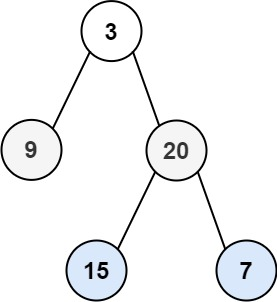

# 二叉树

## 1. 二叉树的前序遍历

<LeetCodeLink url="https://leetcode.cn/problems/binary-tree-preorder-traversal/description/" />

给你二叉树的根节点 `root` ，返回它节点值的**前序遍历**。

**示例 1**：

> **输入**：root = [1,null,2,3]
>
> **输出**：[1,2,3]
>
> **解释**：
>
> 

**示例 2**：

> **输入**：root = [1,2,3,4,5,null,8,null,null,6,7,9]
>
> **输出**：[1,2,4,5,6,7,3,8,9]
>
> **解释**：
>
> 

**示例 3**：

> **输入**：root = []
>
> **输出**：[]

**示例 4**：

> **输入**：root = [1]
>
> **输出**：[1]

::: code-group

```md [思路]
这个前序遍历在【二叉树基础知识】部分已经说过了，分为递归和迭代两种方法

要注意使用递归的时候，res 的初始化尽量防止参数中，也可以使用闭包，例如：
var inorderTraversal = function(root) {
**闭包**
const res = []
function inorder(node) {
if (!node) return
inorder(node.left)
res.push(node.val)
inorder(node.right)
}
inorder(root)
return res
}
如果将 res 数组在函数内部初始化，会导致每次递归调用都创建一个新的空数组，而不是在同一个数组上累积结果。
```

```js [递归法]
/**
 * Definition for a binary tree node.
 * function TreeNode(val, left, right) {
 *     this.val = (val===undefined ? 0 : val)
 *     this.left = (left===undefined ? null : left)
 *     this.right = (right===undefined ? null : right)
 * }
 */
/**
 * @param {TreeNode} root
 * @return {number[]}
 */
var preorderTraversal = function (root, res = []) {
  if (!root) return []
  // 中
  res.push(root.val)
  // 左
  preorderTraversal(root.left, res)
  // 右
  preorderTraversal(root.right, res)
  return res
}
```

```js [统一迭代法]
// 迭代法
var preorderTraversal = function (root) {
  if (!root) return []

  const result = []
  // ⚠️注意：需要初始化栈
  const stack = [root]

  while (stack.length > 0) {
    const node = stack.pop()

    if (node === null) {
      const curNode = stack.pop()
      result.push(curNode.val)
    } else {
      // 遍历：中左右
      // 栈存放：右左中
      // 右
      node.right && stack.push(node.right)
      // 左
      node.left && stack.push(node.left)
      // 中
      stack.push(node)
      stack.push(null)
    }
  }

  return result
}
```

:::

## 2. 二叉树的中序遍历

<LeetCodeLink url="https://leetcode.cn/problems/binary-tree-inorder-traversal/description/" />

这道题在【二叉树基础】中有说，和第一题差不多，只是交换递归/遍历的顺序即可。

## 3. 二叉树的后序遍历

<LeetCodeLink url="https://leetcode.cn/problems/binary-tree-postorder-traversal/description/" />

这道题在【二叉树基础】中有说，和第一题差不多，只是交换递归/遍历的顺序即可。

## 4. 二叉树的层序遍历

<LeetCodeLink url="https://leetcode.cn/problems/binary-tree-level-order-traversal/description/" />

给你二叉树的根节点 `root` ，返回其节点值的 **层序遍历** 。 （即逐层地，从左到右访问所有节点）。

**示例 1**：



> 输入：root = [3,9,20,null,null,15,7]
>
> 输出：[[3],[9,20],[15,7]]

**示例 2**：

> 输入：root = [1]
>
> 输出：[[1]]

**示例 3**：

> 输入：root = []
>
> 输出：[]

::: code-group

```md [思路]
递归法（深度优先）：只需要考虑当前节点的和它的左右子节点，并递归处理。
迭代法（广度优先）：需要记录当前层的节点，并遍历当前层的节点，并记录下一层的节点。
```

```js [递归法]
var levelOrder = function (root) {
  if (!root) return []
  let res = []
  dfs(root, 0, res)
  return res
}

function dfs(root, step, res) {
  if (!root) return
  if (!res[step]) res[step] = []
  res[step].push(root.val)
  root.left && dfs(root.left, step + 1, res)
  root.right && dfs(root.right, step + 1, res)
}
```

```js [迭代法]
var levelOrder = function (root) {
  if (!root) return []
  const res = []
  const queue = [root]

  while (queue.length > 0) {
    const level_size = queue.length
    const cur_res = []

    for (let i = 0; i < level_size; i++) {
      // 处理当前元素
      let cur_node = queue.shift()
      cur_res.push(cur_node.val)

      // 处理子节点
      cur_node.left && queue.push(cur_node.left)
      cur_node.right && queue.push(cur_node.right)
    }

    res.push(cur_res)
  }
  return res
}
```

:::

## 5. 二叉树的层序遍历 II

<LeetCodeLink url="https://leetcode.cn/problems/binary-tree-level-order-traversal-ii/description/" />

给你二叉树的根节点 `root` ，返回其节点值 **自底向上的层序遍历** 。 （即按从叶子节点所在层到根节点所在的层，逐层从左向右遍历）

**示例 1**：


> 输入：root = [3,9,20,null,null,15,7]
>
> 输出：[[15,7],[9,20],[3]]

**示例 2**：

> 输入：root = [1]
>
> 输出：[[1]]

**示例 3**：

> 输入：root = []
>
> 输出：[]

::: code-group

```md [思路]
这道题和上一题非常类似，只是需要将输出的二维数组进行反转
```

```js [迭代法（广度优先）]
```

:::