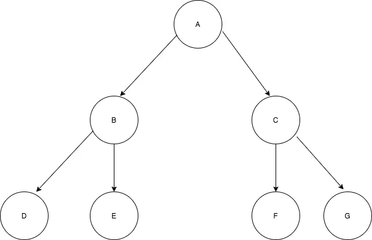
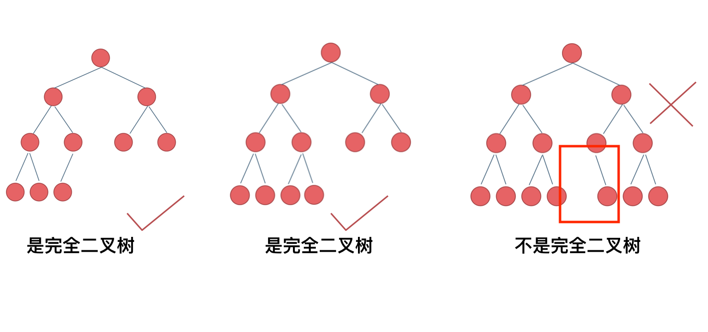
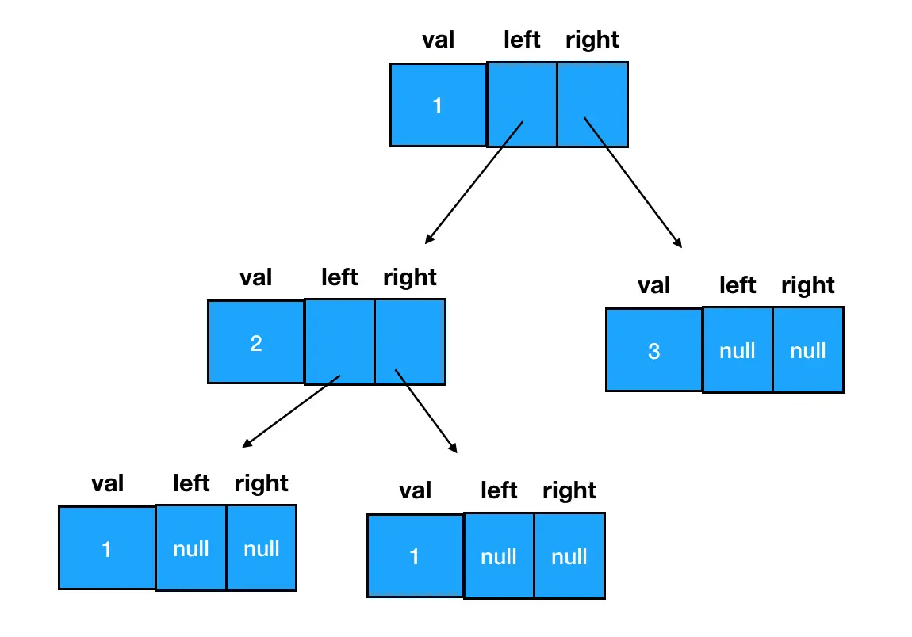
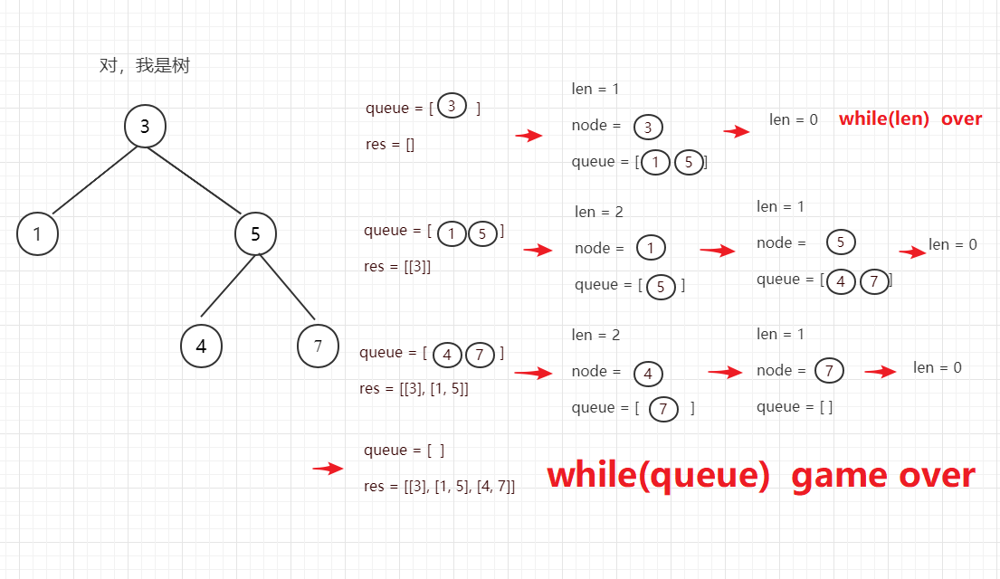

# 二叉树基础知识

## 树结构

- 树的层次计算规则：根结点所在的那一层记为第一层，其子结点所在的就是第二层，以此类推。
- 结点和树的“高度”计算规则：叶子结点高度记为 1，每向上一层高度就加 1，逐层向上累加至目标结点时，所得到的的值就是目标结点的高度。树中结点的最大高度，称为“树的高度”。
- “度”的概念：一个结点开叉出去多少个子树，被记为结点的“度”。
- “叶子结点”：叶子结点就是度为 0 的结点。

## 二叉树结构

二叉树是指满足以下要求的树：

- 它可以没有根结点，作为一棵空树存在
  > 空树的含义：空树是指不包含任何节点的树，即连根节点都不存在。这是树这种数据结构的一个合法状态，就像空数组、空链表一样，是数据结构的边界情况。空树通常用 null 或 None 来表示树的根节点指针
- 如果它不是空树，那么必须由根结点、左子树和右子树组成，且左右子树都是二叉树。如下图：



注意：**二叉树不能被简单定义为每个结点的度都是 2 的树**。普通的树并不会区分左子树和右子树，但在二叉树中，左右子树的位置是严格约定、不能交换的。对应到图上来看，也就意味着 B 和 C、D 和 E、F 和 G 是不能互换的。

## 二叉树的种类

### 1. 满二叉树

满二叉树：如果一棵二叉树只有度为 0 的结点和度为 2 的结点，并且度为 0 的结点在同一层上，则这棵二叉树为满二叉树。


这棵二叉树为满二叉树，也可以说深度为 k，有 2^k-1 个节点的二叉树。

### 2. 完全二叉树

在完全二叉树中，除了最底层节点可能没填满外，其余每层节点数都达到最大值，并且**最下面一层的节点都集中在该层最左边的若干位置**。若最底层为第 h 层（h 从 1 开始），则该层包含 1~ 2^(h-1) 个节点。



最后一个不是是因为图中方框的内容没有节点，需要从左依次排满

### 3. 二叉搜索树

前面介绍的树，都没有数值的，而二叉搜索树是有数值的了，**二叉搜索树是一个有序树**。

- 若它的左子树不空，则左子树上所有结点的值均小于它的根结点的值；
- 若它的右子树不空，则右子树上所有结点的值均大于它的根结点的值；
- 它的左、右子树也分别为二叉排序树


### 4. 平衡二叉搜索树（平衡二叉树）

平衡二叉搜索树：又被称为 AVL 树，且具有以下性质：它是一棵空树或它的**左右两个子树的高度差的绝对值不超过 1**，并且左右两个子树都是一棵平衡二叉搜索树。


最后一棵 不是平衡二叉树，因为它的左右两个子树的高度差的绝对值超过了 1。

## 二叉树的存储方式

**二叉树可以链式存储，也可以顺序存储**。

那么链式存储方式就用指针， 顺序存储的方式就是用数组。

| 链式存储                       | 顺序存储                                                                                                      |
| ------------------------------ | ------------------------------------------------------------------------------------------------------------- |
|  |  如果父节点的数组下标是 i，那么它的左孩子就是 i _ 2 + 1，右孩子就是 i _ 2 + 2。 |

因为勇链式表示的二叉树，更有利于我们理解，所以一般我们都是用链式存储二叉树。

## 二叉树的定义（编码实现）

在 JS 中，二叉树使用对象来定义。它的结构分为三块：

- 数据域
- 左侧子结点（左子树根结点）的引用
- 右侧子结点（右子树根结点）的引用

在定义二叉树构造函数时，我们需要把左侧子结点和右侧子结点都预置为空：

```js
function TreeNode(val, left, right) {
  this.val = val === undefined ? 0 : val
  this.left = left === undefined ? null : left
  this.right = right === undefined ? null : right
}
```

当你需要新建一个二叉树结点时，直接调用构造函数、传入数据域的值就行了：

```js
const node = new TreeNode(1)
```

以这个结点为根结点，我们可以通过给 left/right 赋值拓展其子树信息，延展出一棵二叉树。因此从更加细化的角度来看，一棵二叉树的形态实际是这样的：



## 二叉树的遍历方式总括

二叉树主要有两种遍历方式：

- [**深度优先遍历**](/算法/深度优先和广度优先)：先往深走，遇到叶子节点再往回走。
- [**广度优先遍历**](/算法/深度优先和广度优先)：一层一层的去遍历。

那么从深度优先遍历和广度优先遍历进一步拓展，才有如下遍历方式：

- 深度优先遍历
  - 前序遍历（递归法，迭代法）
  - 中序遍历（递归法，迭代法）
  - 后序遍历（递归法，迭代法）
- 广度优先遍历
  - 层次遍历（迭代法）

在深度优先遍历中：有三个顺序，前中后序遍历。这里**前中后，其实指的就是中间节点的遍历顺序**，例如：

- 前序遍历：**中**左右（中间节点在前）
- 中序遍历：左**中**右（中间节点在中）
- 后序遍历：左右**中**（中间节点在后）


> 注意，例如遍历的时候前序遍历（中左右），那么左子树的所有节点也要满足中左右，右子树也是如此。

## 二叉树的递归遍历

需要确定递归的三要素：（以前序遍历为例）

1. 确定递归函数的参数和返回值

```js
function preorder(root) {}
```

2. 确定终止条件：当前遍历的节点是空了，那么本层递归就要结束了

```js
if (root === null) return
```

3. 确定单层递归的逻辑：指的是你每一次重复的内容是什么

在这里，我们要做先序遍历，那么每一次重复的其实就是 `根结点 -> 左子树 -> 右子树` 这个路线

```js
// 输出当前遍历的结点值
console.log('当前遍历的结点值是：', root.val)
// 递归遍历左子树
preorder(root.left)
// 递归遍历右子树
preorder(root.right)
```

### 前序遍历

```js
// 所有遍历函数的入参都是树的根结点对象
function preorder(root) {
  // 递归边界，root 为空
  if (!root) {
    return
  }

  // 输出当前遍历的结点值
  console.log('当前遍历的结点值是：', root.val) // [!code ++]
  // 递归遍历左子树
  preorder(root.left)
  // 递归遍历右子树
  preorder(root.right)
}
```

### 中序遍历

```js
// 所有遍历函数的入参都是树的根结点对象
function inorder(root) {
  // 递归边界，root 为空
  if (!root) {
    return
  }

  // 递归遍历左子树
  inorder(root.left)
  // 输出当前遍历的结点值
  console.log('当前遍历的结点值是：', root.val) // [!code ++]
  // 递归遍历右子树
  inorder(root.right)
}
```

### 后序遍历

```js
function postorder(root) {
  // 递归边界，root 为空
  if (!root) {
    return
  }

  // 递归遍历左子树
  postorder(root.left)
  // 递归遍历右子树
  postorder(root.right)
  // 输出当前遍历的结点值
  console.log('当前遍历的结点值是：', root.val) // [!code ++]
}
```

## 二叉树的迭代遍历

为什么可以用迭代法（非递归的方式）来实现二叉树的前后中序遍历呢？

**递归的实现就是：每一次递归调用都会把函数的局部变量、参数值和返回地址等压入调用栈中**，然后递归返回的时候，从栈顶弹出上一次递归的各项参数，所以这就是递归为什么可以返回上一层位置的原因。

> 递归的实现原理也是依赖于栈的

### 前序遍历

前序遍历是中左右，每次先处理的是中间节点，那么**先将根节点放入栈中，然后将右孩子加入栈，再加入左孩子**。

> 为什么要先加入 右孩子，再加入左孩子呢？ 因为这样出栈的时候才是中左右的顺序（先右后左，这样栈顶就是左节点了）。


**注意代码中空节点不入栈**

```js
// 入栈 右 -> 左
// 出栈 中 -> 左 -> 右
var preorderTraversal = function (root, res = []) {
  if (!root) return res
  const stack = [root]
  let cur = null
  while (stack.length) {
    cur = stack.pop()
    res.push(cur.val)
    cur.right && stack.push(cur.right)
    cur.left && stack.push(cur.left)
  }
  return res
}
```

### 后序遍历

后序遍历和先序遍历差不多，只需要调整一下先序遍历的代码顺序，就变成中右左的遍历顺序，然后在反转 result 数组，输出的结果顺序就是左右中了


**注意代码中空节点不入栈**

```js
// 入栈 左 -> 右
// 出栈 中 -> 右 -> 左 结果翻转
var postorderTraversal = function (root, res = []) {
  if (!root) return res
  const stack = [root]
  let cur = null
  while (stack.length) {
    cur = stack.pop()
    res.push(cur.val)
    // 前序的顺序交换
    cur.left && stack.push(cur.left) // [!code ++]
    cur.right && stack.push(cur.right) // [!code ++]
  }
  // 最后反转
  return res.reverse() // [!code ++]
}
```

### 中序遍历

中序遍历就不能使用和前序遍历一样的方法了，因为前序遍历的顺序是中左右，先访问的元素是中间节点，要处理的元素也是中间节点
。

而中序遍历是左中右，先访问的是二叉树顶部的节点，然后一层一层向下访问，直到到达树左面的最底部，再开始处理节点（也就是在把节点的数值放进 result 数组中），这就造成了**处理顺序和访问顺序是不一致的**。

- 访问顺序：从根节点开始，向下访问到最左节点，然后再开始处理
- 处理顺序：先处理左子树，再处理根节点，最后处理右子树

那么**在使用迭代法写中序遍历，就需要借用指针的遍历来帮助访问节点，栈则用来处理节点上的元素**。


```js
// 入栈 左 -> 右
// 出栈 左 -> 中 -> 右
var inorderTraversal = function (root, res = []) {
  const stack = []
  let cur = root
  while (stack.length || cur) {
    // 1. 指针一直向左走，找到最左节点
    if (cur) {
      // 将访问的节点放进栈
      stack.push(cur)
      // 左
      cur = cur.left
    } else {
      // 2. 从栈里弹出的数据，就是要处理的数据（放进result数组里的数据），也就是中间节点
      cur = stack.pop()
      res.push(cur.val)
      // 3. 中间节点转向右子树
      cur = cur.right
    }
  }
  return res
}
```

## 二叉树的统一迭代法

在上面我们发现迭代法实现的先中后序，其实风格也不是那么统一，除了先序和后序，有关联，中序完全就是另一个风格了，一会用栈遍历，一会又用指针来遍历。不像是递归法，实现了其中的一种遍历方式，其他两种只要稍稍改一下节点顺序就可以了。

其实针对三种遍历方式，使用迭代法是可以写出统一风格的代码！

**使用了一个特殊的标记（null）来标识已经访问过的节点，从而能够区分"第一次访问"和"第二次访问"节点的情况**，便可统一写法

- 非 null 节点：按照遍历顺序入栈，并在要处理的位置加入 null 标记
- null 节点：表示下一个节点需要被处理，将其值加入结果数组

### 前序遍历

- 遍历顺序：中 → 左 → 右
- 压栈顺序：右 → 左 → 中 → null
- 原因：想要先处理左子树，所以右子树先入栈；想要先处理根节点，所以子节点先入栈

::: details 前序遍历执行流程

- 每次从栈中弹出一个节点 node
- 如果 node 为 null，说明下一个节点是需要被记录值的节点
- 如果 node 不为 null，按照不同遍历顺序将节点和 null 标记重新入栈

:::

```js
// 前序遍历：中左右
// 压栈顺序：右左中
var preorderTraversal = function (root) {
  if (!root) return []

  const result = []
  const stack = [root]

  while (stack.length > 0) {
    const node = stack.pop()

    if (node !== null) {
      // 右子节点先入栈
      if (node.right) stack.push(node.right)
      // 左子节点后入栈
      if (node.left) stack.push(node.left)
      // 中节点入栈并标记（加入null）
      stack.push(node)
      stack.push(null)
    } else {
      // 遇到标记null，处理节点
      // 如果节点为null，那么此时stack.pop()就为需要处理的节点
      const node = stack.pop()
      result.push(node.val)
    }
  }

  return result
}
```

### 中序遍历

- 遍历顺序：左 → 中 → 右
- 压栈顺序：右 → 中 → null → 左
- 原因：想要最后处理右子树，所以右子树先入栈

```js
// 中序遍历：左中右
// 压栈顺序：右中左
var inorderTraversal = function (root) {
  if (!root) return []

  const result = []
  const stack = [root]

  while (stack.length > 0) {
    const node = stack.pop()

    if (node !== null) {
      // 右子节点先入栈
      if (node.right) stack.push(node.right)
      // 中节点入栈并标记（加入null）
      stack.push(node)
      stack.push(null)
      // 左子节点最后入栈
      if (node.left) stack.push(node.left)
    } else {
      // 遇到标记，处理节点
      const node = stack.pop()
      result.push(node.val)
    }
  }

  return result
}
```

### 后序遍历

- 遍历顺序：左 → 右 → 中
- 压栈顺序：中 → null → 右 → 左
- 原因：想要最后处理根节点，所以根节点先入栈

```js
// 后续遍历：左右中
// 压栈顺序：中右左
var postorderTraversal = function (root) {
  if (!root) return []

  const result = []
  const stack = [root]

  while (stack.length > 0) {
    const node = stack.pop()

    if (node !== null) {
      // 中节点入栈并标记（加入null）
      stack.push(node)
      stack.push(null)
      // 右子节点先入栈
      if (node.right) stack.push(node.right)
      // 左子节点后入栈
      if (node.left) stack.push(node.left)
    } else {
      // 遇到标记，处理节点
      const node = stack.pop()
      result.push(node.val)
    }
  }

  return result
}
```

> 这种统一写法的好处是三种遍历方式的结构非常相似，只需要调整入栈顺序即可实现不同的遍历方式。

## 层序遍历

层序遍历的解法有两种：深度优先和广度优先遍历。推荐使用广度优先算法。

层序遍历就是将树的节点按照层级顺序进行遍历，例如：


最后输出：[[3],[9,20],[15,7]]

### 层序遍历 - 深度优先遍历（递归实现）

通过 `step` 参数记录当前节点所在的层级，例如：

```json
    3
   / \
  9  20
    /  \
   15   7
执行过程：

访问节点3（第0层）：res[0] = [3]
访问节点9（第1层）：res[1] = [9]
访问节点20（第1层）：res[1] = [9, 20]
访问节点15（第2层）：res[2] = [15]
访问节点7（第2层）：res[2] = [15, 7]
最终返回：[[3], [9, 20], [15, 7]]
```

```js
var levelOrder = function (root) {
  if (!root) return []
  let res = []
  // 二叉树顶部永远只有一个元素，所以不用考虑其他同级节点
  dfs(root, 0, res)
  return res
}

// 只考虑当前节点，将左右子树进行递归处理
function dfs(root, step, res) {
  if (root) {
    // 处理当前节点
    if (!res[step]) res[step] = []
    res[step].push(root.val)

    // 处理左子树
    dfs(root.left, step + 1, res)
    // 处理右子树
    dfs(root.right, step + 1, res)
  }
}
```

### 层序遍历 - 广度优先遍历（非递归）



- 使用**队列**来保存待访问的节点，初始时将根节点加入队列

- 当队列不为空时：
  - 记录当前层级的节点数量
  - 遍历当前层级的节点，将它们的值存入当前层级数组
  - 将每个节点的左右子节点（如果存在）加入队列
  - 将当前层级数组加入结果数组

```js
function levelOrder(root) {
  if (!root) return []

  const result = []
  const queue = [root]

  while (queue.length > 0) {
    // 当前层的节点数量
    const levelSize = queue.length
    // 存储当前层的节点值
    const currentLevel = []

    // 遍历当前层的所有节点
    for (let i = 0; i < levelSize; i++) {
      const currentNode = queue.shift()
      currentLevel.push(currentNode.val)

      // 将子节点加入队列（下一层的节点）
      if (currentNode.left) queue.push(currentNode.left)
      if (currentNode.right) queue.push(currentNode.right)
    }

    // 将当前层结果加入最终结果
    result.push(currentLevel)
  }

  return result
}
```
