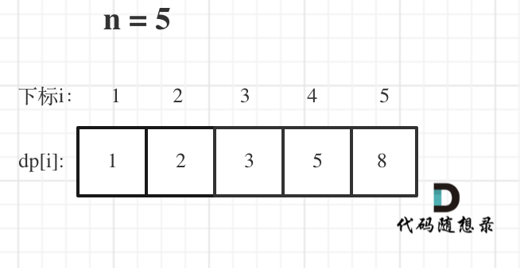

# 动态规划

## 动态规划理论基础

### 什么是动态规划

动态规划，英文：Dynamic Programming，简称 DP，如果某一问题有很多重叠子问题，使用动态规划是最有效的。

所以**动态规划中每一个状态一定是由上一个状态推导出来**的，这一点就区分于贪心，贪心没有状态推导，而是从局部直接选最优的，

### 动态规划解题步骤（5 步曲）

1. 确定 dp 数组（dp table）以及下标的含义
2. 确定递推公式
3. dp 数组如何初始化
4. 确定遍历顺序
5. 举例推导 dp 数组

> 后面对这 5 步会做解释

## 补充：01 背包问题

01 背包问题：有 `n` 件物品和一个容量为 `v` 的背包。第 `i` 件物品的重量是 `weight[i]`，价值是 `value[i]`。求解将哪些物品装入背包可使价值总和最大。

例如这题：

|        | 重量 | 价值 |
| ------ | ---- | ---- |
| 物品 0 | 1    | 15   |
| 物品 1 | 3    | 20   |
| 物品 2 | 4    | 30   |

问：背包最大重量为 4，装满背包的最大价值是多少？

> 在确定 dp 数组，有二维和一维两种（一维只是在二维的基础上做了优化）

### 二维 dp 数组

动规五部曲：

1、确定 dp 数组：

`dp[i][j]` 表示为下标为 `0` 到 `i` 直接的物品，任取，放进容量（重量）为 `j` 的背包。

2、确定递推公式：

`物品i` 有两种状态，分别是：放或不放

- 不放 `物品i`，背包容量为 `j` 所能装的最大价值为 `dp[i-1][j]`
- 放 `物品i`，背包容量为 `j` 所能装的最大价值为 `dp[i-1][j-weight[i]] + value[i]`

  > `dp[i-1][j-weight[i]]` 表示不放 `物品i` 的最大价值，j 是包含`物品i`的重量，所以要减去`物品i`的重量
  >
  > 因为`dp[i-1][j-weight[i]]`是没有算`物品i`的，所以需要再次加上`物品i`，也就是`value[i]` 表示 `物品i` 的价值

> `i-1` 表示前 `i` 个物品（即物品 0 到物品 i-1）中选择，也即不放 `物品i`

- 所以递推公式为：`dp[i][j] = Math.max(dp[i-1][j], dp[i-1][j-weight[i]] + value[i])`

3、dp 数组初始化

由递推公式可以知道，我们只需要初始化第一列和第一行（也就是容量为 0 的背包）即可（其他的初始化为 0 也行）


如图：当前元素是由正上方和左上方（不一定是斜 45 度的左上方）元素推到而来的

```js
// 初始化 dp 数组
const dp = new Array(weights.length)
  .fill(0)
  .map(() => new Array(bagWeight + 1).fill(0))

// 初始化第一行（第一个物品）
for (let j = weights[0]; j <= bagWeight; j++) {
  dp[0][j] = values[0]
}
```

4、确定遍历顺序

> 这里先遍历背包还是物品都可以

```js
// weights数组的大小就是物品个数
for (let i = 1; i < weights.length; i++) {
  // 遍历物品
  for (let j = 0; j <= bagWeight; j++) {
    // 当前背包容量装不下第i个物品，当前状态等于不考虑第i个物品时的状态
    if (j < weights[i]) {
      dp[i][j] = dp[i - 1][j]
    } else {
      // 当前背包容量可以装下第i个物品
      dp[i][j] = Math.max(dp[i - 1][j], dp[i - 1][j - weights[i]] + values[i])
    }
  }
}
```

5、举例：略

::: details 一维 dp 的实现

一维的 dp 数组两层 for 循环是不能颠倒的，外层是物品，内层是背包容量

```js
// 一维DP数组，只记录每个背包容量下的最大价值
const dp = new Array(bagWeight + 1).fill(0)

// 遍历物品
for (let i = 0; i < weights.length; i++) {
  // 重点：背包容量要从大到小遍历
  for (let j = bagWeight; j >= weights[i]; j--) {
    dp[j] = Math.max(dp[j], dp[j - weights[i]] + values[i])
  }
}
```

:::

## 1. 斐波那契数

<LeetCodeLink url="https://leetcode.cn/problems/fibonacci-number/description/" />

**斐波那契数** （通常用 `F(n)` 表示）形成的序列称为 **斐波那契数列** 。该数列由 `0` 和 `1` 开始，后面的每一项数字都是前面两项数字的和。也就是：

> F(0) = 0，F(1) = 1
> F(n) = F(n - 1) + F(n - 2)，其中 n > 1

给定 `n` ，请计算 `F(n)` 。

**示例 1**：

> 输入：n = 2
>
> 输出：1
>
> 解释：F(2) = F(1) + F(0) = 1 + 0 = 1

**示例 2**：

> 输入：n = 3
>
> 输出：2
>
> 解释：F(3) = F(2) + F(1) = 1 + 1 = 2

**示例 3**：

> 输入：n = 4
>
> 输出：3
>
> 解释：F(4) = F(3) + F(2) = 2 + 1 = 3

::: code-group

```md [思路]
动态规划 5 步曲：
1、确定 dp 数组以及下标的含义：dp[i]的定义为：第 i 个数的斐波那契数值是 dp[i]
2、确定递推公式：题目已经把递推公式直接给我们了：状态转移方程 dp[i] = dp[i - 1] + dp[i - 2]
3、dp 数组如何初始化：题目中把如何初始化也直接给我们了
4、确定遍历顺序：从递归公式 dp[i] = dp[i - 1] + dp[i - 2];中可以看出，dp[i]是依赖 dp[i - 1] 和 dp[i - 2]，那么遍历的顺序一定是从前到后遍历的
5、举例推导 dp 数组

代码有两种写法：
1、时间复杂度 O(n)，空间复杂度 O(n)
2、时间复杂度 O(n)，空间复杂度 O(1)：动规状态转移中，当前结果只依赖前两个元素的结果，所以只要两个变量代替 dp 数组记录状态过程。将空间复杂度降到 O(1)
```

```js [代码1]
/**
 * @param {number} n
 * @return {number}
 */
var fib = function (n) {
  const dp = [0, 1]
  for (let i = 2; i <= n; i++) {
    dp[i] = dp[i - 1] + dp[i - 2]
  }
  return dp[n]
}
```

```js [代码2]
/**
 * @param {number} n
 * @return {number}
 */
var fib = function (n) {
  if (n === 0) return 0
  if (n === 1) return 1
  // 动规状态转移中，当前结果只依赖前两个元素的结果，
  // 所以只要两个变量代替dp数组记录状态过程。将空间复杂度降到O(1)
  let pre1 = 1 // n - 1
  let pre2 = 0 // n - 2
  let temp
  for (let i = 2; i <= n; i++) {
    temp = pre1 // 前一个值，n-1
    pre1 = pre1 + pre2 // 当前值，n-1 + n-2
    pre2 = temp // pre2变为前一个值，temp
  }
  return pre1
}
```

:::

## 2. 爬楼梯

<LeteCodeLink url="https://leetcode.cn/problems/climbing-stairs/description/" />

假设你正在爬楼梯。需要 `n` 阶你才能到达楼顶。

每次你可以爬 `1` 或 `2` 个台阶。你有多少种不同的方法可以爬到楼顶呢？

**示例 1**：

> 输入：n = 2
>
> 输出：2
>
> 解释：有两种方法可以爬到楼顶。
>
> 1. 1 阶 + 1 阶
>
> 2. 2 阶

**示例 2**：

> 输入：n = 3
>
> 输出：3
>
> 解释：有三种方法可以爬到楼顶。
>
> 1. 1 阶 + 1 阶 + 1 阶
>
> 2. 1 阶 + 2 阶
>
> 3. 2 阶 + 1 阶

::: code-group

```md [思路]
爬到第一层楼梯有一种方法，爬到二层楼梯有两种方法。
那么第一层楼梯再跨两步就到第三层 ，第二层楼梯再跨一步就到第三层。
所以到第三层楼梯的状态可以由第二层楼梯 和 到第一层楼梯状态推导出来，那么就可以想到动态规划了。

动规五部曲：
定义一个一维数组来记录不同楼层的状态
1、确定 dp 数组以及下标的含义：dp[i]： 爬到第 i 层楼梯，有 dp[i]种方法
2、确定递推公式
如何可以推出 dp[i]呢？
从 dp[i]的定义可以看出，dp[i] 可以有两个方向推出来。
首先是 dp[i - 1]，上 i-1 层楼梯，有 dp[i - 1]种方法，那么再一步跳一个台阶不就是 dp[i]了么。
还有就是 dp[i - 2]，上 i-2 层楼梯，有 dp[i - 2]种方法，那么再一步跳两个台阶不就是 dp[i]了么。
那么 dp[i]就是 dp[i - 1]与 dp[i - 2]之和！（因为只能爬一步或两步）
所以 dp[i] = dp[i - 1] + dp[i - 2] 。

3、dp 数组初始化：dp[0]不去初始化（0 层可以为 0 也可以为 1，有争议），dp[1]=1，dp[2]=2，然后从 i = 3 开始递推
4、确定遍历顺序：从递推公式 dp[i] = dp[i - 1] + dp[i - 2];中可以看出，遍历顺序一定是从前向后遍历的

5、举例推导 dp 数组：
举例当 n 为 5 的时候，dp table（dp 数组）如下图：
从过程可以看出，这就是一个斐波那契的题目
```

```js [代码]
/**
 * @param {number} n
 * @return {number}
 */
var climbStairs = function (n) {
  // dp[i] 为第 i 阶楼梯有多少种方法爬到楼顶
  // dp[i] = dp[i - 1] + dp[i - 2]
  const dp = []
  dp[1] = 1
  dp[2] = 2
  // i 从 3 开始
  for (let i = 3; i <= n; i++) {
    dp[i] = dp[i - 1] + dp[i - 2]
  }
  return dp[n]
}
```

:::



## 3. 杨辉三角

<LeetCodeLink url="https://leetcode.cn/problems/pascals-triangle/description/" />

给定一个非负整数 `numRows`，生成「杨辉三角」的前 `numRows` 行。

在「杨辉三角」中，每个数是它左上方和右上方的数的和。


**示例 1**:

> 输入: numRows = 5
>
> 输出: [[1],[1,1],[1,2,1],[1,3,3,1],[1,4,6,4,1]]

**示例 2**:

> 输入: numRows = 1
>
> 输出: [[1]]

::: code-group

```md [思路]
1
1 1
1 2 1
1 3 3 1
1 4 6 4 1
其实题中的动图看不出规律，我们把它写成这样二维数组的形式就很清晰了（也就是左上方和正上方的和）。
例如：拿第 3 行第 2 列的元素举例，
dp[3][2] = dp[2][1] + dp[2][2]，
也就是 dp[i][j] = dp[i-1][j-1] + dp[i-1][j]

动规五部曲：
1、确定 dp 数组和下标的含义：
dp[i][j] 表示杨辉三角第 i 行第 j 列的值
其中 i 从 0 开始，j 从 0 到 i（注意，这个不是从 1 开始，和上面的例子不同）
2、确定递推公式：
边界条件：每行的第一个和最后一个元素都是 1
内部元素：dp[i][j] = dp[i-1][j-1] + dp[i-1][j]
3、dp 数组如何初始化：
第 0 行：dp[0][0] = 1
每行的边界元素：dp[i][0] = 1, dp[i][i] = 1
4、确定遍历顺序：
从上到下，从左到右遍历。因为当前行的值依赖于上一行的值，所以必须按行顺序计算
5、举例推导 dp：
以 numRows = 5 为例：

- 第 0 行：[1]
- 第 1 行：[1, 1]
- 第 2 行：[1, 2, 1] (2 = 1+1)
- 第 3 行：[1, 3, 3, 1] (3 = 1+2, 3 = 2+1)
- 第 4 行：[1, 4, 6, 4, 1] (4 = 1+3, 6 = 3+3, 4 = 3+1)
```

```js [代码]
/**
 * @param {number} numRows
 * @return {number[][]}
 */
var generate = function (numRows) {
  const dp = []
  for (let i = 0; i < numRows; i++) {
    // 每行
    const row = new Array(i + 1)
    // 每行的第一个和最后一个元素都是1
    row[0] = 1
    row[i] = 1
    // 计算中间的元素
    for (let j = 1; j < i; j++) {
      row[j] = dp[i - 1][j - 1] + dp[i - 1][j]
    }
    dp.push(row)
  }
  return dp
}
```

:::

## 4. 零钱兑换

<LeetCodeLink url="https://leetcode.cn/problems/coin-change/description/" />

给你一个整数数组 `coins` ，表示不同面额的硬币；以及一个整数 `amount` ，表示总金额。

计算并返回可以凑成总金额所需的 最少的硬币个数 。如果没有任何一种硬币组合能组成总金额，返回 `-1` 。

你可以认为每种硬币的数量是无限的。

**示例 1**：

> 输入：coins = [1, 2, 5], amount = 11
>
> 输出：3
>
> 解释：11 = 5 + 5 + 1

**示例 2**：

> 输入：coins = [2], amount = 3
>
> 输出：-1

**示例 3**：

> 输入：coins = [1], amount = 0
>
> 输出：0

::: code-group

```c [思路]
「完全背包」的思路来解决：

动规五步曲：
1、确定 dp 数组和下标的含义：
dp[i] 表示凑成金额 i 所需的最少硬币`个数`。我们最终要求的是 dp[amount]。

2、确定递推公式：
对于每个硬币 coin，如果 coin <= i，则可以考虑使用这个硬币。
此时递推公式为： dp[i] = min(dp[i], dp[i - coin] + 1)。

先说 dp[i - coin]，为什么是 i - coin？
当我们想凑成金额 i 时，可以这样思考：
如果我们选择使用一枚面值为 coin 的硬币，
那么剩下的问题就变成了：如何凑成金额 i - coin，
假设要凑成金额 11，硬币面值为 5：
要凑成 11元
 ↓
使用1枚5元硬币 + 凑成6元
    ↓              ↓
  dp[11] =     dp[11-5] + 1
           = dp[6] + 1
这用到了状态转移思想：我们已经计算出了凑成较小金额的最少硬币数（如 dp[6]），
我们只需要在这个dp[6]的基础上加上1（也就是加上面值5的硬币），得到凑成金额 11的硬币数。

整个递推过程演示：
假设 coins = [1, 2, 5]，计算 dp[11]：
// 初始状态
dp[11] = Infinity
// 尝试使用 1 元硬币
dp[11] = min(Infinity, dp[11-1] + 1) = min(Infinity, dp[10] + 1)
// 尝试使用 2 元硬币
dp[11] = min(当前值, dp[11-2] + 1) = min(当前值, dp[9] + 1)
// 尝试使用 5 元硬币
dp[11] = min(当前值, dp[11-5] + 1) = min(当前值, dp[6] + 1)
在使用不同面值的硬币的时候，会去不断更新dp[i]的值，只要不为Infinity，就有最少硬币数

3、初始化：
dp[0] = 0，因为凑成金额 0 所需的硬币数是 0。
其他值初始化为 Infinity，表示初始时无法凑成该金额。

4、遍历顺序：
外层循环遍历硬币。
内层循环遍历金额，从当前硬币的面值开始，到 amount 结束。

5、返回值：
如果 dp[amount] 仍然是 Infinity，说明无法凑成该金额，返回 -1。
否则返回 dp[amount]。
```

```js [代码]
/**
 * @param {number[]} coins
 * @param {number} amount
 * @return {number}
 */
var coinChange = function (coins, amount) {
  // 初始化dp数组，从0-amount有amount + 1个元素
  const dp = new Array(amount + 1).fill(Infinity)
  // i为金额，dp[i]为i金额时候的最少金币数
  // 0的时候为0
  dp[0] = 0

  // 循环面额，在每个面额都会有自己的最少金币数，面额不断变大，最少数量也会减少
  for (const coin of coins) {
    // 一张金币的话，起始位coin当前的面额，不断的去遍历到目标金额
    for (let i = coin; i <= amount; i++) {
      /**
        dp[i]是之前的面额对应金额i的最小数量，比如我当前的金额是3，面额为2，也就是i=3，
        dp[3]在之前面额为1的时候已经重新赋值了，不是Infinity了，这个dp[i]为上一个面额的值
      /**
        dp[i - coin]是为了更新dp[i]的，如果当前面额，满足这个条件就去更新
        dp[i - coin]，例如i为6，coin为5，那么就是dp[1]，因为刚好减去的就是当前循环的面值，
        如果减去后，得到的dp，一般会被之前的面额重新赋值过，没有的话为Infinity，Infinity再+1的话，根本不可能比之前的dp[i]大，
        其实这个过程也就是在更新面额的组合，让其硬币数最少，最后+1是是因为dp[i-coin]为i-coin的数量，再+1，就刚好凑齐了。
        例如：i=6，coin为5；dp[6-5]->dp[1]，这个结果为1，dp[1+5]也就是新的dp[i]，对应dp[6]，就为dp[i]的1，再加一张面值为5的，总共2张
      */
      dp[i] = Math.min(dp[i], dp[i - coin] + 1)
    }
  }

  return dp[amount] !== Infinity ? dp[amount] : -1
}
```

:::

## 5. 完全平方数

<LeetCodeLink url="https://leetcode.cn/problems/perfect-squares/description/" />

给你一个整数 `n` ，返回 和为 `n` 的完全平方数的最少数量。

> **完全平方数** 是一个整数，其值等于另一个整数的平方；换句话说，其值等于一个整数自乘的积。例如，1、4、9 和 16 都是完全平方数，而 3 和 11 不是。

**示例 1**：

> 输入：n = 12
>
> 输出：3
>
> 解释：12 = 4 + 4 + 4

**示例 2**：

> 输入：n = 13
>
> 输出：2
>
> 解释：13 = 4 + 9

::: code-group

```md [思路]
这道题和上面的【零钱兑换】思路一样。

思路：
1、确定 dp 数组的定义：dp[i] 表示和为 i 的完全平方数的最少数量
2、确定递推公式：
对于每个完全平方数 j*j，如果 j*j <= i，则 dp[i] = min(dp[i], dp[i - j*j] + 1)
其他的真的和上面就一样了
```

```js [代码]
/**
 * @param {number} n
 * @return {number}
 */
var numSquares = function (n) {
  const dp = new Array(n + 1).fill(Infinity)
  dp[0] = 0

  // 遍历所有可能的完全平方数（和上一题的金币面额一样）
  for (let j = 1; j * j <= n; j++) {
    const square = j * j // 完全平方数
    // 遍历所有金额
    for (let i = square; i <= n; i++) {
      dp[i] = Math.min(dp[i], dp[i - square] + 1)
    }
  }
  return dp[n]
}
```

:::

## 6. 打家劫舍

<LeetCodeLink url="https://leetcode.cn/problems/house-robber/description/" />

你是一个专业的小偷，计划偷窃沿街的房屋。每间房内都藏有一定的现金，影响你偷窃的唯一制约因素就是相邻的房屋装有相互连通的防盗系统，**如果两间相邻的房屋在同一晚上被小偷闯入，系统会自动报警**。

给定一个代表每个房屋存放金额的非负整数数组，计算你 **不触动警报装置的情况下** ，一夜之内能够偷窃到的最高金额。

**示例 1**：

> 输入：[1,2,3,1]
>
> 输出：4
>
> 解释：偷窃 1 号房屋 (金额 = 1) ，然后偷窃 3 号房屋 (金额 = 3)。偷窃到的最高金额 = 1 + 3 = 4 。

**示例 2**：

> 输入：[2,7,9,3,1]
>
> 输出：12
>
> 解释：偷窃 1 号房屋 (金额 = 2), 偷窃 3 号房屋 (金额 = 9)，接着偷窃 5 号房屋 (金额 = 1)。偷窃到的最高金额 = 2 + 9 + 1 = 12 。

::: code-group

```md [思路]
这道题和爬楼梯比较类似，解题思路：
1、确定 dp 数组的含义：
dp[i]表示偷窃到第 i 个房屋时，能偷窃到的最高金额（考虑下标 i，包含该元素，也就是 dp[0]为第一个房间）
2、确定递推公式：
分为偷和不偷两种状态，例如：nums 为[2,7,9,3,1]
偷当前房间 i：i-1 的房间不能偷，所以最大金额为 dp[i-2] + nums[i]
不偷当前房间：所以为前 i-1 的房间的最大数额，也就是 dp[i-1]。（这里的 i-1 可能偷，也可能不偷，之前计算过的，所以不用管）
则递推公式为：在偷和不偷中去最大值，dp[i] = Math.max(dp[i-2] + nums[i], dp[i-1])
3、dp 数组初始化：
由于 dp[i]的递推公式中包含 i-1 和 i-2，所以初始化时，dp[0]和 dp[1]需要初始化，即：
dp[0] = nums[0]; dp[1] = Math.max(nums[0], nums[1]);
dp[1]为前两个房间最大金额
4、确定遍历顺序：
从下标 2 开始，第三个元素
for (let i = 2; i < nums.length; i++) {}
5、例举：略
```

```js [代码]
/**
 * @param {number[]} nums
 * @return {number}
 */
var rob = function (nums) {
  const dp = []
  dp[0] = nums[0]
  dp[1] = Math.max(nums[0], nums[1])

  for (let i = 2; i < nums.length; i++) {
    // 偷
    const yes = dp[i - 2] + nums[i]
    // 不偷
    const no = dp[i - 1]
    // 当前的最大金额
    dp[i] = Math.max(yes, no)
  }
  return dp[nums.length - 1]
}
```

:::

## 7. 买卖股票的最佳时机

<LeetCodeLink url="https://leetcode.cn/problems/best-time-to-buy-and-sell-stock/description/" />

给定一个数组 `prices` ，它的第 `i` 个元素 `prices[i]` 表示一支给定股票第 `i` 天的价格。

你只能选择 **某一天** 买入这只股票，并选择在 **未来的某一个不同的日子** 卖出该股票。设计一个算法来计算你所能获取的最大利润。

返回你可以从这笔交易中获取的最大利润。如果你不能获取任何利润，返回 `0` 。

**示例 1**：

> 输入：[7,1,5,3,6,4]
>
> 输出：5
>
> 解释：在第 2 天（股票价格 = 1）的时候买入，在第 5 天（股票价格 = 6）的时候卖出，最大利润 = 6-1 = 5 。注意利润不能是 7-1 = 6, 因为卖出价格需要大于买入价格；同时，你不能在买入前卖出股票。

**示例 2**：

> 输入：prices = [7,6,4,3,1]
>
> 输出：0
>
> 解释：在这种情况下, 没有交易完成, 所以最大利润为 0。

::: code-group

```md [思路]
这道题只能买一天的，并且在不同的一天卖出。
这道题有三种方法：
1、暴力枚举，两层 for 循环，枚举每个买股票和卖股票的位置，求最大利润。但是这种方法会超时。
2、贪心：
记录历史最低价格：遍历过程中始终记录到目前为止的最低价格，
计算当前最大利润：每天计算如果今天卖出能获得的最大利润，
更新全局最大利润：不断更新所有可能利润中的最大值。
3、动态规划

动规五部曲：
1、确定 dp 数组以及下标的含义：dp[i] 表示到第 i 天为止能获得的最大利润
2、确定递推公式：dp[i] = Math.max(dp[i-1], prices[i] - minPrice)
dp[i-1]：前 i-1 天已经获得的最大利润（不交易第 i 天）
minPrice 是前 i-1 天的最低价格，需要记录
prices[i] - minPrice：当天卖出的利润
3、dp 数组初始化：
dp[0] = 0，因为第 0 天无法进行交易，利润为 0
minPrice = prices[0]，第 0 天的价格就是目前的最低价格
4、确定遍历顺序：从第 1 天开始，到第 n 天结束
5、举例推导 dp 数组：略
```

```js [暴力解法]
// 思路没问题，但是时间复杂度太高，超时
/**
 * @param {number[]} prices
 * @return {number}
 */
var maxProfit = function (prices) {
  let result = 0
  for (let i = 0; i < prices.length; i++) {
    for (let j = i + 1; j < prices.length; j++) {
      result = Math.max(result, prices[j] - prices[i])
    }
  }
  return result
}
```

```js [贪心]
var maxProfit = function (prices) {
  let lowerPrice = prices[0] // 重点是维护这个最小值（贪心的思想）
  let profit = 0
  for (let i = 0; i < prices.length; i++) {
    lowerPrice = Math.min(lowerPrice, prices[i]) // 贪心地选择左面的最小价格
    profit = Math.max(profit, prices[i] - lowerPrice) // 遍历一趟就可以获得最大利润
  }
  return profit
}
```

```js [动态规划]
/**
 * @param {number[]} prices
 * @return {number}
 */
var maxProfit = function (prices) {
  const dp = new Array(prices.length).fill(0)
  // 历史最低价格
  let miniPrice = prices[0]
  for (let i = 1; i < prices.length; i++) {
    miniPrice = Math.min(miniPrice, prices[i])
    // i-1天前的最大利润和今天的最大利润进行大小比较
    dp[i] = Math.max(dp[i - 1], prices[i] - miniPrice)
  }
  return dp[prices.length - 1]
}
```

:::

## 8. 买卖股票的最佳时机 II

<LeetCodeLink url="https://leetcode.cn/problems/best-time-to-buy-and-sell-stock-ii/description/" />

> 这道题我看题解有点麻烦，所以还是参考【贪心算法】的思路吧。 [🚀 链接](./贪心.html#_6-买卖股票的最佳时机-ii)

## 9. 单词拆分

<LeetCodeLink url="https://leetcode.cn/problems/word-break/description/" />

给你一个字符串 `s` 和一个字符串列表 `wordDict` 作为字典。如果可以利用字典中出现的一个或多个单词拼接出 `s` 则返回 `true`。

**注意**：不要求字典中出现的单词全部都使用，并且字典中的单词可以重复使用。

**示例 1**：

> 输入: s = "leetcode", wordDict = ["leet", "code"]
>
> 输出: true
>
> 解释: 返回 true 因为 "leetcode" 可以由 "leet" 和 "code" 拼接成。

**示例 2**：

> 输入: s = "applepenapple", wordDict = ["apple", "pen"]
>
> 输出: true
>
> 解释: 返回 true 因为 "applepenapple" 可以由 "apple" "pen" "apple" 拼接成。注意，你可以重复使用字典中的单词。

**示例 3**：

> 输入: s = "catsandog", wordDict = ["cats", "dog", "sand", "and", "cat"]
>
> 输出: false

::: code-group

```md [思路]
这道题就是一个典型的背包问题，
单词就是物品，字符串 s 就是背包，单词能否组成字符串 s，就是问物品能不能把背包装满。
拆分时可以重复使用字典中的单词，说明就是一个完全背包！

动规五部曲：
1、确定 dp 数组以及下标的含义：
dp[i] : dp[i] 表示字符串 s 的前 i 个字符能否被 wordDict 中的单词拼接出来。
dp[i]为 true，表示可以拆分为一个或多个在字典中出现的单词。
2、确定递推公式：
如果 dp[j] 为 true，且 s.substring(j, i) 在 wordDict 中，则 dp[i] 为 true。

- dp[j] 为 true：表示字符串 s 的前 j 个字符可以被成功拆分
- s.substring(j, i) 在 wordDict 中：表示从位置 j 到位置 i-1 的子串是一个有效单词
- 既然前 j 个字符可以拆分，而 j 到 i 又是一个单词，那么前 i 个字符也可以拆分，则推出 dp[i] 为 true

例如：以 s = "leetcode", wordDict = ["leet", "code"] 为例：
当 i=4 时，我们检查所有可能的 j（从 0 到 3）：
j=0 时，dp[0]=true（空字符串可以拆分），s.substring(0,4)="leet" 在字典中，
因此 dp[4]=true

3、dp 数组初始化：dp[0] = true，字符串空为 true（必须）
4、确定遍历顺序：外层遍历背包（字符串长度），内层遍历物品（字典中的单词）
5、举例：略

整体过程：
外层循环 i 从 1 到 s.length：逐步检查字符串的前 i 个字符是否能被拆分
内层循环 j 从 0 到 i-1：尝试所有可能的拆分点
匹配逻辑：前 j 个字符已经判断过，如果 dp[j] 为 true，再判断 j 到 i 的子串是否在字典中
```

```js [代码]
/**
 * @param {string} s
 * @param {string[]} wordDict
 * @return {boolean}
 */
var wordBreak = function (s, wordDict) {
  const dp = new Array(s.length + 1).fill(false)
  // 0表示空字符串
  dp[0] = true
  // 例如：字符串leetcode，就是从1-7（不是从0开始）
  for (let i = 1; i <= s.length; i++) {
    for (let j = 0; j < i; j++) {
      if (dp[j] === true && wordDict.includes(s.substring(j, i))) {
        dp[i] = true
        break
      }
    }
  }
  return dp[s.length]
}
```

:::

## 10. 最长递增子序列

<LeetCodeLink url="https://leetcode.cn/problems/longest-increasing-subsequence/description/" />

给你一个整数数组 `nums` ，找到其中最长严格递增子序列的长度。

子序列 是由数组派生而来的序列，删除（或不删除）数组中的元素而不改变其余元素的顺序。例如，`[3,6,2,7]` 是数组 `[0,3,1,6,2,2,7]` 的**子序列**。

**示例 1**：

> 输入：nums = [10,9,2,5,3,7,101,18]
>
> 输出：4
>
> 解释：最长递增子序列是 [2,3,7,101]，因此长度为 4 。

**示例 2**：

> 输入：nums = [0,1,0,3,2,3]
>
> 输出：4

**示例 3**：

> 输入：nums = [7,7,7,7,7,7,7]
>
> 输出：1

::: code-group

```c [思路]
递增子序列：选取某些元素，这些元素保持递增，元素之间可以不连续，但是要保证是数组原有的顺序。

动规五部曲：
1、确定 dp 数组以及下标的含义：dp[i] 表示以 某个数（nums[i]） 结尾的最长递增子序列的长度，
i为数组nums的下标

为什么要设计成nums[i]结尾？
如果我们不以"结尾元素"来定义，而是定义 dp[i] 为前 i 个元素中的最长递增子序列长度，例如：
// 错误的定义方式
dp[0] = 1  // [10]
dp[1] = 1  // [10] 或 [9]
dp[2] = 1  // [10] 或 [9] 或 [2]
dp[3] = 2  // [2,3]
dp[4] = 3  // [2,3,4]
dp[5] = 3  // [2,3,4] - 但我们无法知道是否能将最后一个2加入序列
出现的问题是：当我们计算 dp[5] 时，我们不知道前面的最长递增子序列是什么，也不知道能否将 nums[5] 加入其中。因为dp[i]此时记录的只是长度。

2、确定递推公式：对于每个 i，遍历所有 j < i（去检查前面的元素），
如果当前元素大于之前的某个元素，就更新 dp[i]，
nums[i] > nums[j]，则 dp[i] = max(dp[i], dp[j] + 1)
3、dp 数组初始化：
每个元素本身构成一个长度为 1 的子序列，所以 dp 数组初始化为 1
4、确定遍历顺序：
外层循环遍历 i 从 1 到 nums.length-1
内层循环遍历 j 从 0 到 i-1
当在内层循环中，j < i，在 j 从 0 到 i-1 的过程中，会不断更新 dp[i]
5、举例：
以 nums=[10,9,2,3,4,2] 为例：
// 初始化 dp 数组，每个位置都是 1
dp = [1, 1, 1, 1, 1, 1]
// 计算过程
dp[0] = 1 // 以 10 结尾的最长递增子序列长度为 1 ([10])
dp[1] = 1 // 以 9 结尾的最长递增子序列长度为 1 ([9])
dp[2] = 1 // 以 2 结尾的最长递增子序列长度为 1 ([2])
dp[3] = 2 // 以 3 结尾的最长递增子序列长度为 2 ([2,3])
dp[4] = 3 // 以 4 结尾的最长递增子序列长度为 3 ([2,3,4])
dp[5] = 1 // 以 2 结尾的最长递增子序列长度为 1 ，严格来说应该是 [2]，因为要求严格递增
最后需要去更新 maxLen，因为上面例子看到了dp[4] > dp[5]，
至于为什么我的dp[5]不能是[2,3,4]，是因为定义dp[i]中说明了是nums[i]**结尾**的子序列长度。
```

```js [代码]
/**
 * @param {number[]} nums
 * @return {number}
 */
var lengthOfLIS = function (nums) {
  // 初始化 dp 数组，值都为1
  // dp[i] 表示以某个数（nums[i]）结尾的最长递增子序列的长度
  const dp = new Array(nums.length).fill(1)
  let maxLen = 1
  for (let i = 0; i < nums.length; i++) {
    // 检查 i 之前的元素
    for (let j = 0; j < i; j++) {
      // 如果当前元素大于之前的某个元素，更新 dp[i]
      if (nums[i] > nums[j]) {
        // dp[j] + 1：dp[j]就是i之前的元素，如果nums[i] > nums[j]，则当前的nums[i]算作一个长度，所以dp[j] + 1
        dp[i] = Math.max(dp[i], dp[j] + 1)
      }
    }
    // 更新全局最大值
    maxLen = Math.max(maxLen, dp[i])
  }
  return maxLen
}
```

:::

## 11. 分割等和子集

<LeetCodeLink url="https://leetcode.cn/problems/partition-equal-subset-sum/description/" />

给你一个 **只包含正整数** 的 **非空** 数组 `nums` 。请你判断是否可以将这个数组分割成两个子集，使得两个子集的元素和相等。

**示例 1**：

> 输入：nums = [1,5,11,5]
>
> 输出：true
>
> 解释：数组可以分割成 [1, 5, 5] 和 [11] 。

**示例 2**：

> 输入：nums = [1,2,3,5]
>
> 输出：false
>
> 解释：数组不能分割成两个元素和相等的子集。

> 本题是一个 01 背包问题，上面基础部分有说。

::: code-group

```c [思路]
如果数组总和为 sum，要分成两个相等的子集，每个子集的和应该是 sum/2，
这本质上是一个 0-1 背包问题：背包容量为 sum/2，物品是数组中的元素，每个物品只能选一次

动规五部曲：
1、确定 dp 数组及下标含义：容量（所能装的重量）为 j 的背包，所背的物品价值最大为 dp[j]
如果背包所载重量为 target， dp[target]就是装满背包之后的总价值。
因为本题中每一个元素的**数值既是重量，也是价值**，所以，当 dp[target] === target 的时候，背包就装满了。
target 的值等于：所有元素的和 sum / 2
2、确定递推公式：
01 背包的递推公式为：dp[j] = Math.max(dp[j], dp[j - weight[i]] + value[i])
⚠️ 注意：在基础部分讲的递推公式是二维的，这里把[i-1]给移除了，也就是只记录每个背包容量下的最大价值
本题，相当于背包里放入数值，那么物品 i 的重量是 nums[i]，其价值也是 nums[i]
所以递推公式：dp[j] = Math.max(dp[j], dp[j - nums[i]] + nums[i])
3、初始化dp数组：都初始化为0即可
4、确定遍历顺序：
一维的01背包遍历的顺序的两个for循环不能颠倒，外层是物品，内层是背包容量
// 遍历物品
for (let i = 0; i < nums.length; i++) {
  // 倒序遍历背包容量
  for (let j = target; j >= nums[i]; j--) {
    dp[j] = Math.max(dp[j], dp[j - nums[i]] + nums[i]);
  }
}
为什么内层循环是倒序呢？这里举例说明
- 正序遍历处理物品2：
j=2: dp[2] = max(0, dp[0] + 2) = 2
j=3: dp[3] = max(0, dp[1] + 2) = max(0, 0 + 2) = 2
j=4: dp[4] = max(0, dp[2] + 2) = max(0, 2 + 2) = 4
问题出现了！ dp[4] = 4 意味着我们用了两次物品2（2+2=4），但01背包要求每个物品只能用一次！

- 倒序遍历处理物品2：
j=4: dp[4] = max(0, dp[2] + 2) = max(0, 0 + 2) = 2
j=3: dp[3] = max(0, dp[1] + 2) = max(0, 0 + 2) = 2
j=2: dp[2] = max(0, dp[0] + 2) = max(0, 0 + 2) = 2
这样每个物品只被使用了一次，符合01背包的要求。

正序遍历的问题：
j=2时更新了dp[2]
j=4时使用了刚更新的dp[2]，相当于同一个物品被用了两次
倒序遍历的优势：
j=4时使用的是上一轮的dp[2]
j=2时才更新dp[2]，不会影响当前轮次的其他计算
5、举例：略
```

```js [代码]
/**
 * @param {number[]} nums
 * @return {boolean}
 */
var canPartition = function (nums) {
  const sum = nums.reduce((a, b) => a + b, 0)

  // 如果总和为奇数，无法分割成两个相等子集
  if (sum % 2 === 1) return false

  const target = sum / 2

  // 初始化dp数组
  const dp = new Array(target + 1).fill(0)

  // 遍历物品
  for (let i = 0; i < nums.length; i++) {
    // 倒序遍历背包容量
    for (let j = target; j >= nums[i]; j--) {
      dp[j] = Math.max(dp[j], dp[j - nums[i]] + nums[i])
    }
  }

  // 如果dp[target]等于target，说明可以装满背包
  return dp[target] === target
}
```

:::

## ⬇️ 多维动态规划

## 12. 不同路径

## 13. 最小路径和

## 14. 最长公共子序列

## 15. 编辑距离
