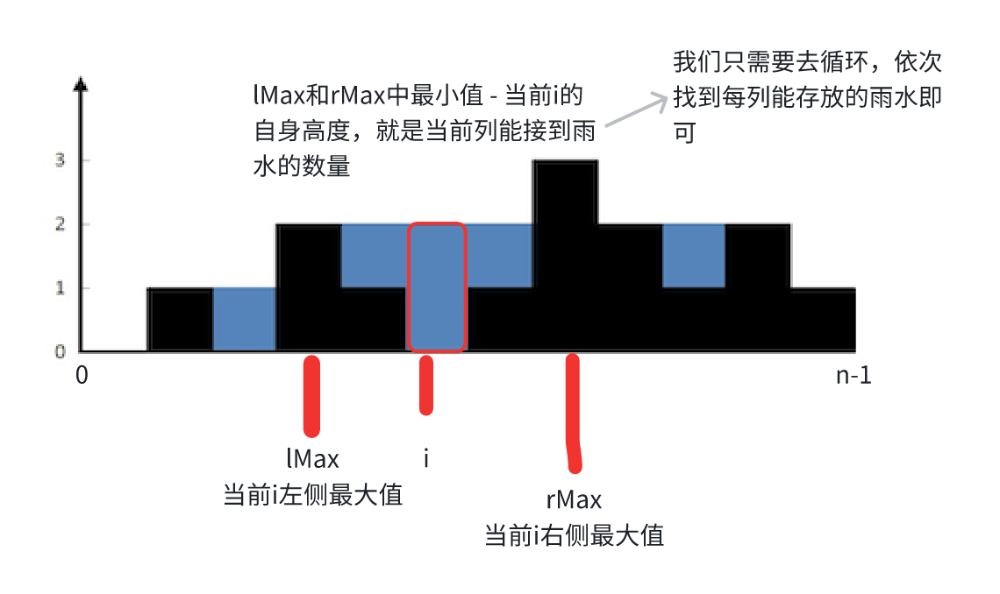

# 单调栈

## 技巧

单调栈是一种单调递增、递减的栈结构，在做题的时候我怎么能想到用单调栈呢？ 什么时候用单调栈呢？

**通常是一维数组，要寻找任一个元素的右边或者左边第一个比自己大或者小的元素的位置，此时我们就要想到可以用单调栈了**，时间复杂度为 O(n)。

那么单调栈的原理是什么呢？为什么时间复杂度是 O(n) 就可以找到每一个元素的右边第一个比它大的元素位置呢？

**单调栈的本质是空间换时间**，因为在遍历的过程中需要用一个栈来记录右边第一个比当前元素高的元素，优点是整个数组只需要遍历一次。

**更直白来说，就是用一个栈来记录我们遍历过的元素**，因为我们遍历数组的时候，我们不知道之前都遍历了哪些元素，以至于遍历一个元素找不到是不是之前遍历过一个更小的，所以我们需要用一个容器（这里用单调栈）来记录我们遍历过的元素。

在使用单调栈的时候首先要明确如下几点：

1. 单调栈里存放的元素是什么？
   - 单调栈里只需要存放元素的下标 i 就可以了，如果需要使用对应的元素，直接 T[i]就可以获取。
2. 单调栈里元素是递增呢？ 还是递减呢？
   > 注意以下讲解中，顺序的描述为**从栈头到栈底的顺序**
   - 例如：在数组中找到当前元素后面最近一个比自己大的元素，那么单调栈里存放的元素是递增的。因为栈顶是最小元素，当我们遇到一个比栈顶大的元素时，说明**栈顶元素找到了它右侧第一个比它大的元素**，此时栈顶元素出栈，继续比较下一个栈顶元素。
   - 即：如果求一个元素右边第一个更大元素，单调栈就是递增的，如果求一个元素右边第一个更小元素，单调栈就是递减的。

## 1. 每日温度

<LeetCodeLink url="https://leetcode.cn/problems/daily-temperatures/description/" />

给定一个整数数组 `temperatures`，表示每天的温度，返回一个数组 `answer`，其中 `answer[i]` 是指对于第 `i` 天，下一个更高温度出现在几天后。如果气温在这之后都不会升高，请在该位置用 `0` 来代替。

**示例 1**:

> **输入**: `temperatures = [73,74,75,71,69,72,76,73]`
>
> **输出**: `[1,1,4,2,1,1,0,0]`

**示例 2**:

> **输入**: `temperatures = [30,40,50,60]`
>
> **输出**: `[1,1,1,0]`

**示例 3**:

> **输入**: `temperatures = [30,60,90]`
>
> **输出**: `[1,1,0]`

::: code-group

```md [思路]
利用单调栈，因为要找当前数后面的元素，除了暴力解法套双循环可以拿到后面的元素，其他情况是拿不到的，
题中又说需要找到当前气温后面第一个比它高的气温，所以就可以维护一个单调栈，栈头到栈顶单调递增，
如果我当前元素下标是 i，**栈不为空**且**栈顶元素小于当前元素**（采用循环），
则说明 i 是栈顶元素后面第一个比它高的气温
```

```js [代码]
/**
 * @param {number[]} temperatures
 * @return {number[]}
 */
var dailyTemperatures = function (temperatures) {
  let len = temperatures.length
  // 存放下标，单调递增栈
  let stack = []
  let ans = Array(len).fill(0)
  for (let i = 0; i < len; i++) {
    // 当前元素
    const cur = temperatures[i]
    while (stack.length !== 0 && cur > temperatures[stack[stack.length - 1]]) {
      // n下标的元素找到了它的右侧最大值（n为之前某个元素的下标）
      let n = stack.pop()
      // 这里是找之间的间隔
      ans[n] = i - n
    }
    stack.push(i)
  }
  return ans
}
```

:::

## 2. 下一个更大元素 I

<LeetCodeLink url="https://leetcode.cn/problems/next-greater-element-i/description/" />

nums1 中数字 `x` 的下一个更大元素 是指 `x` 在 nums2 中对应位置 **右侧** 的第一个比 `x` 大的元素。

给你两个 **没有重复元素** 的数组 `nums1` 和 `nums2` ，下标从 0 开始计数，其中 `nums1` 是 `nums2` 的子集。

对于每个 `0 <= i < nums1.length` ，找出满足 `nums1[i] == nums2[j]` 的下标 `j` ，并且在 `nums2` 确定 `nums2[j]` 的下一个更大元素 。如果不存在下一个更大元素，那么本次查询的答案是 `-1` 。

返回一个长度为 `nums1.length` 的数组 `ans` 作为答案，满足 `ans[i]` 是如上所述的 **下一个更大元素** 。

**示例 1**：

> 输入：`nums1 = [4,1,2]`，`nums2 = [1,3,4,2]`。
>
> 输出：`[-1,3,-1]`
>
> 解释：nums1 中每个值的下一个更大元素如下所述：
>
> - `4` ，用加粗斜体标识，`nums2 = [1,3,4,2]`。不存在下一个更大元素，所以答案是 `-1` 。
>
> - `1` ，用加粗斜体标识，`nums2 = [1,3,4,2]`。下一个更大元素是 `3` 。
>
> - `2` ，用加粗斜体标识，`nums2 = [1,3,4,2]`。不存在下一个更大元素，所以答案是 `-1` 。

**示例 2**：

> 输入：`nums1 = [2,4]`，`nums2 = [1,2,3,4]`。
>
> 输出：`[3,-1]`
>
> 解释：nums1 中每个值的下一个更大元素如下所述：
>
> - `2` ，用加粗斜体标识，`nums2 = [1,2,3,4]`。下一个更大元素是 `3` 。
>
> - `4` ，用加粗斜体标识，`nums2 = [1,2,3,4]`。不存在下一个更大元素，所以答案是 `-1` 。

**提示：**

- nums1 和 nums2 中**所有整数 互不相同**
- nums1 中的所有整数同样出现在 nums2 中

::: code-group

```md [思路]
这里需要处理好两个数组的对应关系，可以采用 hash 表记录 nums1 的值和下标，
需要注意：哈希表记录的是 nums1，循环的是 nums2（当时第一次做的时候两者弄反了），
因为要找 nums2 的下一个更大元素，所以栈中记录的元素也是 nums2 的元素，
剩余的思路和第一题一样，只是在推入栈的时候，需要判断当前元素是不是在 nums1 中
```

```js [代码]
/**
 * @param {number[]} nums1
 * @param {number[]} nums2
 * @return {number[]}
 */
var nextGreaterElement = function (nums1, nums2) {
  // 记录nums1的值和下标对应关系
  let nums1_map = new Map()
  nums1.forEach((n, i) => nums1_map.set(n, i))
  // ⚠️注意：这里构造的是nums1长度的数组
  let ans = new Array(nums1.length).fill(-1)
  // 存放nums2的下标，单调递增栈
  let stack = []
  for (let i = 0; i < nums2.length; i++) {
    const cur = nums2[i]
    while (stack.length !== 0 && cur > nums2[stack[stack.length - 1]]) {
      // 找到栈顶的元素，当前cur表示为栈顶元素的下一个更大的元素
      const nums2_index_top = stack.pop()
      // nums2已经找到下一个更大元素的该元素（栈顶元素），对应nums1的元素下标
      const nums2_top = nums2[nums2_index_top]
      const nums1_idx = nums1_map.get(nums2_top)
      ans[nums1_idx] = cur
    }
    if (nums1_map.has(cur)) {
      stack.push(i)
    }
  }
  return ans
}
```

:::

## 3. 下一个更大元素 II

<LeetCodeLink url="https://leetcode.cn/problems/next-greater-element-ii/description/" />

给定一个循环数组 `nums`（`nums[nums.length - 1]` 的下一个元素是 `nums[0]`），返回 `nums` 中每个元素的下一个更大元素。

数字 `x` 的下一个更大的元素是按数组遍历顺序，这个数字之后的第一个比它更大的数，这意味着你应该循环地搜索它的下一个更大的数。如果不存在，则输出 `-1`。

**示例 1**：

> **输入**：`nums = [1,2,1]`
>
> **输出**：`[2,-1,2]`
>
> **解释**：
>
> - 第一个 `1` 的下一个更大的数是 `2`；
>
> - 数字 `2` 找不到下一个更大的数；
>
> - 第二个 `1` 的下一个最大的数需要循环搜索，结果也是 `2`。

**示例 2**：

> **输入**：`nums = [1,2,3,4,3]`
>
> **输出**：`[2,3,4,-1,4]`

::: code-group

```md [思路]
nums 是一个循环数组，nums[n−1] 右边是 nums[0]。我们可以把 nums 复制一份，拼在 nums 右边，这样就把环形数组变成一般数组了。例如 [1,2,1] 变成 [1,2,1,1,2,1]。
依旧与前两题的 while 循环思路一样，
在 push 进栈需要判断一下当前元素的下标，i < nums.length（原数组）
```

```js [代码]
/**
 * @param {number[]} nums
 * @return {number[]}
 */
var nextGreaterElements = function (nums) {
  let len = nums.length
  let stack = []
  let ans = new Array(len).fill(-1)
  // 将环形展开成一维数组
  nums = nums.concat(nums)
  for (let i = 0; i < len * 2; i++) {
    const cur = nums[i]
    while (stack.length !== 0 && cur > nums[stack[stack.length - 1]]) {
      const top_i = stack.pop()
      ans[top_i] = cur
    }
    // 因为当前的nums.length是原nums长度的2倍，环形多余的不记
    if (i < len) {
      stack.push(i)
    }
  }
  return ans
}
```

:::

## 4. 接雨水

<LeetCodeLink url="https://leetcode.cn/problems/trapping-rain-water/description/" />

给定 n 个非负整数表示每个宽度为 1 的柱子的高度图，计算按此排列的柱子，下雨之后能接多少雨水。

**示例 1**：


> 输入：height = [0,1,0,2,1,0,1,3,2,1,2,1]
>
> 输出：6
>
> 解释：上面是由数组 [0,1,0,2,1,0,1,3,2,1,2,1] 表示的高度图，在这种情况下，可以接 6 个单位的雨水（蓝色部分表示雨水）。

**示例 2**：

> 输入：height = [4,2,0,3,2,5]
>
> 输出：9

::: code-group

```md [思路]
解这道题首先要知道什么情况下是可以接到雨水的：
就是左右两侧都有柱子，在两个柱子之间以小的柱子高度为边界，是可以接到的。
我们可以计算当前列的左侧最大值和右侧最大值，他们的最小值减去自身高度，就是当前列能接到的雨水量
即：`min(leftMax, rightMax) - height[i]` 为当前列能接的雨水，如下图：
依次去循环累加，就是雨水总量。
```

```js [代码]
/**
 * @param {number[]} height
 * @return {number}
 */
var trap = function (height) {
  let n = height.length
  if (n === 0) return 0

  // 求lMax
  let lMax = new Array(n)
  // 对于最左边的柱子，它左侧没有其他柱子，因此它左侧的最大高度就是它本身
  lMax[0] = height[0]
  // 注意 i = 1 开始
  for (let i = 1; i < n; i++) {
    // 需要计算 lMax[i]，为当前元素i的左侧最大值
    // 也就是从0到i区间的最大高度下标
    // 去找到数组的前一项和当前项的最大值为当前i的lMax的最大值
    lMax[i] = Math.max(lMax[i - 1], height[i])
  }

  // 求rMax
  let rMax = new Array(n)
  rMax[n - 1] = height[n - 1]
  for (let i = n - 1 - 1; i >= 0; i--) {
    rMax[i] = Math.max(rMax[i + 1], height[i])
  }

  let ans = 0
  // 去遍历每一列，求当前列的雨水值
  for (let i = 0; i < n; i++) {
    // 当前列的雨水数为：左侧最大值和右侧最大值，二者取最小，减去自身高度
    let res = Math.min(lMax[i], rMax[i]) - height[i]
    ans += res
  }
  return ans
}
```

:::



## 5. 最小栈

<LeetCodeLink url="https://leetcode.cn/problems/min-stack/description/" />

设计一个支持 `push`，`pop`，`top` 操作，并能在常数时间内检索到最小元素的栈。

实现 `MinStack` 类:

- `MinStack()` 初始化堆栈对象。
- `void push(int val)` 将元素 `val` 推入堆栈。
- `void pop()` 删除堆栈顶部的元素。
- `int top()` 获取堆栈顶部的元素。
- `int getMin()` 获取堆栈中的最小元素。

**示例 1**：

> **输入**:
>
> ["MinStack","push","push","push","getMin","pop","top","getMin"]
>
> [[],[-2],[0],[-3],[],[],[],[]]
>
> **输出**:
>
> [null,null,null,null,-3,null,0,-2]
>
> **解释**:
>
> MinStack minStack = new MinStack();
>
> minStack.push(-2);
>
> minStack.push(0);
>
> minStack.push(-3);
>
> minStack.getMin(); // 返回 -3.
>
> minStack.pop();
>
> minStack.top(); // 返回 0.
>
> minStack.getMin(); // 返回 -2.

::: code-group

```md [思路]
因为题中说：检索到最小元素的栈
这个题需要两个栈，一个是正常的栈，进行 push 和 pop，另一个则是辅助栈，维护一个单调递减的栈（栈顶元素最小）
```

```js [代码]
var MinStack = function () {
  this.stack = []
  // 初始化需要设置一个最大值，因为在后续的过程中只保留min值
  // 不然就要判断栈为空的情况
  this.mini_stack = [Infinity] // Number.MAX_VALUE
}

/**
 * @param {number} val
 * @return {void}
 */
MinStack.prototype.push = function (val) {
  this.stack.push(val)
  const top = this.mini_stack[this.mini_stack.length - 1]
  const min = Math.min(top, val)
  this.mini_stack.push(min)
}

/**
 * @return {void}
 */
MinStack.prototype.pop = function () {
  this.stack.pop()
  // 只要是pop的话，就必定会有push，
  // 该操作只是为了保证mini_stack和stack保持栈内元素个数相同，
  // 因为mini_stack使用存储的是最小的，不用担心元素对应不上问题
  this.mini_stack.pop()
}

/**
 * @return {number}
 */
MinStack.prototype.top = function () {
  return this.stack[this.stack.length - 1]
}

/**
 * @return {number}
 */
MinStack.prototype.getMin = function () {
  return this.mini_stack[this.mini_stack.length - 1]
}

/**
 * Your MinStack object will be instantiated and called as such:
 * var obj = new MinStack()
 * obj.push(val)
 * obj.pop()
 * var param_3 = obj.top()
 * var param_4 = obj.getMin()
 */
```

```js [初始化代码]
var MinStack = function () {}

/**
 * @param {number} val
 * @return {void}
 */
MinStack.prototype.push = function (val) {}

/**
 * @return {void}
 */
MinStack.prototype.pop = function () {}

/**
 * @return {number}
 */
MinStack.prototype.top = function () {}

/**
 * @return {number}
 */
MinStack.prototype.getMin = function () {}

/**
 * Your MinStack object will be instantiated and called as such:
 * var obj = new MinStack()
 * obj.push(val)
 * obj.pop()
 * var param_3 = obj.top()
 * var param_4 = obj.getMin()
 */
```

:::

## 6. 商品折扣后的最终价格

<LeetCodeLink url="https://leetcode.cn/problems/final-prices-with-a-special-discount-in-a-shop/description/" />

给你一个数组 `prices`, 其中 `prices[i]` 是商店里第 `i` 件商品的价格。

商店里正在进行促销活动，如果你要买第 `i` 件商品，那么你可以得到与 `prices[j]` 相等的折扣，其中 `j` 是满足 j > i 且 `prices[j] <= prices[i]` 的最小下标，如果没有满足条件的 `j`，你将没有任何折扣。

请你返回一个数组，数组中第 `i` 个元素是折扣后你购买商品 `i` 最终需要支付的价格。

**示例 1**：

> **输入**：prices = [8,4,6,2,3]
>
> **输出**：[4,2,4,2,3]
>
> **解释**：
>
> 商品 0 的价格为 price[0]=8，你将得到 prices[1]=4 的折扣，所以最终价格为 8 - 4 = 4。
>
> 商品 1 的价格为 price[1]=4，你将得到 prices[3]=2 的折扣，所以最终价格为 4 - 2 = 2。
>
> 商品 2 的价格为 price[2]=6，你将得到 prices[3]=2 的折扣，所以最终价格为 6 - 2 = 4。
>
> 商品 3 和 4 都没有折扣。

**示例 2**：

> **输入**：prices = [1,2,3,4,5]
>
> **输出**：[1,2,3,4,5]
>
> **解释**：在这个例子中，所有商品都没有折扣。

**示例 3**：

> **输入**：prices = [10,1,1,6]
>
> **输出**：[9,0,1,6]

::: code-group

```md [思路]
这道题和上面的每日温度、下一个更大元素是一样的，都是单调栈，
我们因为我们遍历到当前元素，无法感知到后面元素和当前元素的大小关系，
所以需要遍历到后面的时候，当符合条件再来处理之前的元素
```

```js [代码]
/**
 * @param {number[]} prices
 * @return {number[]}
 */
var finalPrices = function (prices) {
  let len = prices.length
  // 存放下标，栈顶元素最小
  let stack = []
  let ans = new Array(len)

  for (let i = 0; i < len; i++) {
    const cur = prices[i]
    while (stack.length !== 0 && cur <= prices[stack[stack.length - 1]]) {
      // 前面符合折扣的商品下标
      let pre_idx = stack.pop()
      ans[pre_idx] = prices[pre_idx] - cur
    }
    // 默认价格都为不打折的
    // 这里也可以在初始化的时候 let ans = [...prices]
    // 注意 ans 这里不能使用push，因为初始化的时候每个元素为空
    ans[i] = cur
    stack.push(i)
  }
  return ans
}
```

:::
