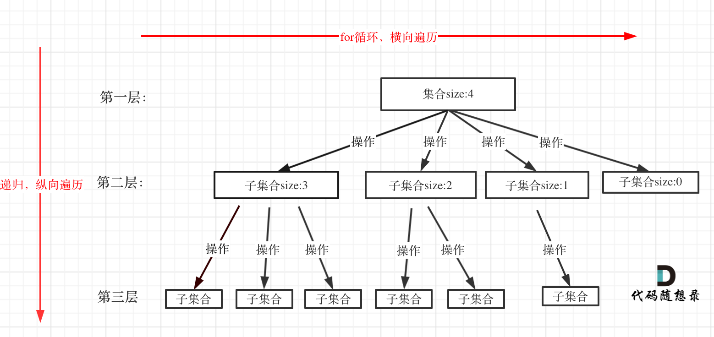
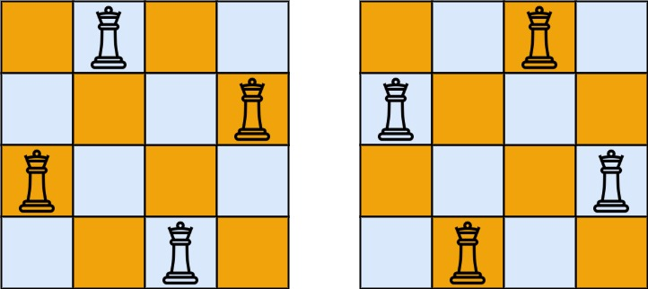

# 回溯

## 回溯法理论基础

### 什么是回溯法

回溯法也可以叫做回溯搜索法，它是一种搜索的方式。

回溯是递归的副产品，只要有递归就会有回溯。

回溯函数也就是递归函数，指的都是一个函数。

> ⚠️ 注意：回溯的本质是穷举，穷举所有可能，然后选出我们想要的答案，所以效率并不高。
>
> 但是有些问题没有更好的解决方案，只能用回溯法。

### 回溯法解决的问题

- 组合问题：N 个数里面按一定规则找出 k 个数的集合
- 切割问题：一个字符串按一定规则有几种切割方式
- 子集问题：一个 N 个数的集合里有多少符合条件的子集
- 排列问题：N 个数按一定规则全排列，有几种排列方式
- 棋盘问题：N 皇后，解数独等等

**⚠️ 注意：组合是不强调元素顺序的，排列是强调元素顺序**。

例如：{1, 2} 和 {2, 1} 在组合上，就是一个集合，因为不强调顺序，而要是排列的话，{1, 2} 和 {2, 1} 就是两个集合了。

记住组合无序，排列有序，就可以了

### 如何理解回溯法

**回溯法解决的问题都可以抽象为树形结构**，因为回溯法解决的都是在集合中递归查找子集，**集合的大小就构成了树的宽度，递归的深度就构成了树的深度**。

递归就要有终止条件，所以必然是一棵高度有限的树（N 叉树）。

### 回溯法模板

1. 回溯函数模板返回值以及参数：回溯法的参数不容易在一开始就确定下来，可以在后面写逻辑的时候进行补充

2. 回溯函数终止条件：什么时候达到了终止条件，树中就可以看出，一般来说搜到叶子节点了，也就找到了满足条件的一条答案，把这个答案存放起来，并结束本层递归。

```js
if (终止条件) {
  存放结果
  return
}
```

3. 回溯搜索的遍历过程

在上面我们提到了，回溯法一般是在集合中递归搜索，集合的大小构成了树的宽度，递归的深度构成的树的深度。如图：



```js
for (选择：本层集合中元素（树中节点孩子的数量就是集合的大小）) {
    处理节点;
    backtracking(路径，选择列表); // 递归
    回溯，撤销处理结果
}
```

**for 循环可以理解是横向遍历，backtracking（递归）就是纵向遍历**，这样就把这棵树全遍历完了，一般来说，搜索叶子节点就是找的其中一个结果了。

模版：

```js
function backtracking(参数) {
    if (终止条件) {
        存放结果;
        return;
    }

    for (选择：本层集合中元素（树中节点孩子的数量就是集合的大小）) {
        处理节点;
        backtracking(路径，选择列表); // 递归
        回溯，撤销处理结果
    }
}
```

## 1. 全排列

<LeetCodeLink url="https://leetcode.cn/problems/permutations/description/" />

给定一个不含重复数字的数组 `nums` ，返回其 所有可能的全排列 。你可以 **按任意顺序** 返回答案。

注：`nums` 中的所有整数 **互不相同**

示例 1：

输入：nums = [1,2,3]
输出：[[1,2,3],[1,3,2],[2,1,3],[2,3,1],[3,1,2],[3,2,1]]
示例 2：

输入：nums = [0,1]
输出：[[0,1],[1,0]]
示例 3：

输入：nums = [1]
输出：[[1]]

::: code-group

```md [思路]
这道题看下面的图就可以知道思路，以[1,2,3]为例，如图：
竖方向上是递归，找到当前的排列可能，如第二层：1,2,3，
这时候需要记录一下哪些数字已经使用了，在横向 for 的时候，去递归这些未使用的数字，例如：
第二层的【1】，used 为[true, false, false]，表示 1 已经使用，2、3 未使用，
去 for 循环 2、3，得到结果为：[1,2],[1,3]，used 为[true, true, false]，[true, false, true]，
在[1,2]中 used 为 false 的只有 3 了，[1,3]中 used 为 false 的只有 2 了，继续递归；
当 path 的长度等于 nums 的长度时，返回 path，结束递归。

上面 for 循环过程中，如果元素不在 used 中，需要设置为 true，并且将该元素放入 path
（path 为某一种结果的过程内容）

> used 数组，其实就是记录此时 path 里都有哪些元素使用了，一个排列里一个元素只能使用一次。

还需要注意：递归后，需要回溯，也就是将 used 数组中该元素设置为 false，将 path 中该元素删除。

> 在递归搜索过程中，当一条路径探索完毕后，需要撤销之前做出的选择，以便能够探索其他可能的路径。
```

```js [代码]
/**
 * @param {number[]} nums
 * @return {number[][]}
 */
var permute = function (nums) {
  // 存放结果的二维数组
  const res = []
  // 一维数组，记录当前路径（当前正在构建的排列）
  const path = []
  backtracking(nums, res, path, [])
  return res
}
// used是记录元素是否在path中
function backtracking(nums, res, path, used) {
  let len = nums.length
  // 结束条件：当 path 的长度等于原数组长度时，说明找到了一个完整的排列，将其加入结果集 res。
  if (path.length === len) {
    // 切记：二维数组不能直接push
    return res.push([...path])
  }

  for (let i = 0; i < len; i++) {
    // 说明该元素已在当前路径中，跳过
    if (used[i]) continue
    // 加入路径，并将used[i]设置为true
    path.push(nums[i])
    used[i] = true
    // 递归
    backtracking(nums, res, path, used)
    // 回溯（将内容还原）
    used[i] = false
    path.pop()
  }
}
```

:::


## 2. 子集

<LeetCodeLink url="https://leetcode.cn/problems/subsets/description/" />

给你一个整数数组 `nums` ，数组中的元素 **互不相同** 。返回该数组所有可能的子集（幂集）。

解集 不能 包含重复的子集。你可以按 任意顺序 返回解集。

**示例 1**：

> 输入：nums = [1,2,3]
>
> 输出：[[],[1],[2],[1,2],[3],[1,3],[2,3],[1,2,3]]

**示例 2**：

> 输入：nums = [0]
>
> 输出：[[],[0]]

::: code-group

```md [思路]
子集问题是找树的所有节点！
其实子集也是一种组合问题，因为它的集合是无序的，子集{1,2} 和 子集{2,1}是一样的。
那么既然是无序，取过的元素不会重复取，写回溯算法的时候，for 就要从 startIndex 开始，而不是从 0 开始！（和上一题不一样）
从图中红线部分，可以看出遍历这个树的时候，把所有节点都记录下来，就是要求的子集集合。

1、入参：nums、res（二维数组，存放最终结果）、path（一维数组，存放当前结果）、startIndex（遍历起点，因为取过的元素不用重复取）
2、递归终止条件：startIndex >= nums.length；startIndex 已经大于数组的长度了，就终止了，因为没有元素可取了；
其实也可以不加递归终止条件，因为 startIndex >= nums.length，本层 for 循环本来也结束了。
3、单层递归逻辑：
path.push(nums[i]); // 子集收集元素
backtracking(nums, res, path, i + 1); // 注意从 i+1 开始，元素不重复取
path.pop(); // 回溯
```

```js [代码]
/**
 * @param {number[]} nums
 * @return {number[][]}
 */
var subsets = function (nums) {
  // 存储结果的二维数组
  const res = []
  // 存储某一层树的结果，一维
  const path = []
  backtracking(nums, res, path, 0)
  return res
}

function backtracking(nums, res, path, startIndex) {
  // 每次递归都需要将当前路径加入结果（包括空集）
  // 上一层的值，初始化没有为[]
  res.push([...path])
  // 当 startIndex 等于 nums.length 时，循环不会执行，自然结束递归
  for (let i = startIndex; i < nums.length; i++) {
    path.push(nums[i])
    backtracking(nums, res, path, i + 1)
    // 回溯
    path.pop()
  }
}
```

:::


## 3. 电话号码的字母组合

<LeetCodeLink url="https://leetcode.cn/problems/letter-combinations-of-a-phone-number/description/" />

给定一个仅包含数字 `2-9` 的字符串，返回所有它能表示的字母组合。答案可以按 **任意顺序** 返回。

给出数字到字母的映射如下（与电话按键相同）。注意 1 不对应任何字母。

注：`digits[i]` 是范围 `['2', '9']` 的一个数字。


**示例 1**：

> 输入：digits = "23"
>
> 输出：["ad","ae","af","bd","be","bf","cd","ce","cf"]

**示例 2**：

> 输入：digits = ""
>
> 输出：[]

**示例 3**：

> 输入：digits = "2"
>
> 输出：["a","b","c"]

::: code-group

```c [思路]
这道题和第二题很相似，使用递归实现，需要解决的问题：
1、数字和字母如何映射：可以使用 map 进行映射
2、两个字母就两个 for 循环，三个字符我就三个 for 循环，以此类推：回溯法来解决 n 个 for 循环的问题，
例如：输入："23"，抽象为树形结构，如下图所示：
图中可以看出遍历的深度，就是输入"23"的长度，而叶子节点就是我们要收集的结果，输出["ad", "ae", "af", "bd", "be", "bf", "cd", "ce", "cf"]。
3、输入 1 _ #按键等等异常情况：1, _, #等没有字母映射的按键，直接跳过处理下一个（虽然题目说是2-9的数字）

递归实现：
1、**确定参数**：需要一个字符串 s 来收集叶子节点的结果，然后用一个字符串数组 result 保存起来，还有一个是 index
⚠️ 注意：这个 index 可不是上一题的 startIndex 了。这个 index 是记录遍历第几个数字了，就是用来遍历 digits 的（题目中给出数字字符串），同时 index 也表示树的深度。
2、**确定终止条件**：例如：输入用例"23"，两个数字，那么根节点往下递归两层就可以了，叶子节点就是要收集的结果集。
那么终止条件就是如果 index 等于输入的数字个数（digits.length）了（本来 index 就是用来遍历 digits 的）。然后收集结果，结束本层递归。
if (index === digits.length) {
    result.push(path.join(''));
    return;
}
3、**确定单层遍历逻辑**：遍历当前数字对应的所有字母即可
const digit = digits[index];
const str = phoneMap[digit];
for (let i = 0; i < str.length; i++) {
    path.push(str[i]);
    backtrack(index + 1);
    path.pop();
}
```

```js [代码]
/**
 * @param {string} digits
 * @return {string[]}
 */
var letterCombinations = function (digits) {
  // 处理空输入
  if (!digits || digits.length === 0) {
    return []
  }

  // 数字到字母的映射
  const phoneMap = {
    2: 'abc',
    3: 'def',
    4: 'ghi',
    5: 'jkl',
    6: 'mno',
    7: 'pqrs',
    8: 'tuv',
    9: 'wxyz'
  }

  const result = []
  const path = []

  function backtrack(index) {
    // 终止条件：已经处理完所有数字
    if (index === digits.length) {
      result.push(path.join(''))
      return
    }

    const digit = digits[index]
    // 获取字符串，例如2 => abc
    const str = phoneMap[digit]

    // 遍历当前数字对应的所有字母
    for (let i = 0; i < str.length; i++) {
      path.push(str[i])
      backtrack(index + 1)
      path.pop()
    }
  }

  backtrack(0)
  return result
}
```

```js [包含异常符号]
/**
 * @param {string} digits
 * @return {string[]}
 */
var letterCombinations = function (digits) {
  // 处理空输入
  if (!digits || digits.length === 0) {
    return []
  }

  // 数字到字母的映射
  const phoneMap = {
    2: 'abc',
    3: 'def',
    4: 'ghi',
    5: 'jkl',
    6: 'mno',
    7: 'pqrs',
    8: 'tuv',
    9: 'wxyz'
    // 1, *, # 等按键没有对应的字母
  }

  const result = []
  const path = []

  function backtrack(index) {
    // 终止条件：已经处理完所有数字
    if (index === digits.length) {
      result.push(path.join(''))
      return
    }

    const digit = digits[index]
    const str = phoneMap[digit]

    // 处理异常按键（1, *, #等没有字母映射的按键）
    if (!str) {
      // 跳过这些按键，直接处理下一个
      backtrack(index + 1)
      return
    }

    // 遍历当前数字对应的所有字母
    for (let i = 0; i < str.length; i++) {
      path.push(str[i])
      backtrack(index + 1)
      path.pop()
    }
  }

  backtrack(0)
  return result
}
```

:::


## 4. 组合

<LeetCodeLink url="https://leetcode.cn/problems/combinations/description/" />

给定两个整数 `n` 和 `k`，返回范围 `[1, n]` 中所有可能的 `k` 个数的组合。

你可以按 **任何顺序** 返回答案。

注意：

- 1 <= n <= 20
- 1 <= k <= n

**示例 1**：

> 输入：n = 4, k = 2
>
> 输出：
>
> ```js
> ;[
>   [2, 4],
>   [3, 4],
>   [2, 3],
>   [1, 2],
>   [1, 3],
>   [1, 4]
> ]
> ```

**示例 2**：

> 输入：n = 1, k = 1
>
> 输出：[[1]]

::: code-group

```md [思路]
直接的解法当然是使用 for 循环，例如示例中 k 为 2，很容易想到 用两个 for 循环，这样就可以输出 和示例中一样的结果。
如果 n 为 100，k 为 50 呢，那就 50 层 for 循环，
此时就会发现虽然想暴力搜索，但是用 for 循环嵌套连暴力都写不出来！

回溯法解决的问题都可以抽象为树形结构（N 叉树），用树形结构来理解回溯就容易多了。
那么我把组合问题抽象为如下树形结构：
可以看出这棵树，一开始集合是 1，2，3，4， 从左向右取数，取过的数，不再重复取。
第一次取 1，集合变为 2，3，4 ，因为 k 为 2，我们只需要再取一个数就可以了，分别取 2，3，4，得到集合[1,2] [1,3] [1,4]，以此类推。

每次从集合中选取元素，可选择的范围随着选择的进行而收缩，调整可选择的范围。
图中可以发现 n 相当于树的宽度，k 相当于树的深度。

递归实现：
1、参数：res、path，最重要的就是 startIndex，这个参数用来记录本层递归的中，集合从哪里开始遍历（集合就是[1,...,n] ）。
startIndex 就是防止出现重复的组合
2、递归终止条件：path 这个数组的大小如果达到 k，说明我们找到了一个子集大小为 k 的组合了，在图中 path 存的就是根节点到叶子节点的路径。
3、单层逻辑：从图中可以看出 for 循环用来横向遍历，递归的过程是纵向遍历。
for 循环每次从 startIndex 开始遍历，然后用 path 保存取到的节点 i
```

```js [代码]
/**
 * @param {number} n
 * @param {number} k
 * @return {number[][]}
 */
var combine = function (n, k) {
  // 存储最终结果（二维数组）
  let res = []
  // 存储每条结果（一维）
  let path = []
  function backtracking(startIndex) {
    if (path.length === k) {
      res.push([...path])
      return
    }
    for (let i = startIndex; i <= n; i++) {
      path.push(i)
      // 例如：当前为1，下一层为【2，3，4】，所以就要递归搜索i + 1
      backtracking(i + 1)
      path.pop()
    }
  }
  // 从1到n，初始化为1
  backtracking(1)
  return res
}
```

:::


## 5. 组合总和

<LeetCodeLink url="https://leetcode.cn/problems/combination-sum/description/" />

给你一个 **无重复元素** 的整数数组 `candidates` 和一个目标整数 `target` ，找出 `candidates` 中可以使数字和为目标数 `target` 的 所有 **不同组合** ，并以列表形式返回。你可以按 **任意顺序** 返回这些组合。

`candidates` 中的 **同一个** 数字可以 **无限制重复被选取** 。如果至少一个数字的被选数量不同，则两种组合是不同的。

对于给定的输入，保证和为 `target` 的不同组合数少于 `150` 个。

注意：

- candidates 的所有元素 互不相同
- 1 <= target <= 40

**示例 1**：

> 输入：candidates = [2,3,6,7], target = 7
>
> 输出：[[2,2,3],[7]]
>
> 解释：
>
> 2 和 3 可以形成一组候选，2 + 2 + 3 = 7 。注意 2 可以使用多次。
>
> 7 也是一个候选， 7 = 7 。
>
> 仅有这两种组合。

**示例 2**：

> 输入: candidates = [2,3,5], target = 8
>
> 输出: [[2,2,2,2],[2,3,3],[3,5]]

**示例 3**：

> 输入: candidates = [2], target = 1
>
> 输出: []

::: code-group

```c [思路]
递归思路：
1、参数：这道题和上一题一样，都是需要 startIndex 来控制 for 循环的起始位置
2、结束条件：sum等于target的时候，需要收集结果
if (sum > target) {
    return;
}
if (sum == target) {
    result.push(path);
    return;
}
3、单层搜索的逻辑：单层for循环依然是从startIndex开始，搜索candidates集合
前面加了后面需要回溯减掉（path的push也是）

剪枝优化：对于sum已经大于target的情况，就没有必要进入下一层递归了，可以结束本轮for循环的遍历，这就是剪枝。

步骤如下图：
```

```js [代码]
/**
 * @param {number[]} candidates
 * @param {number} target
 * @return {number[][]}
 */
var combinationSum = function (candidates, target) {
  const res = []
  const path = []
  // sum提出来也行
  // let sum = 0

  function backtracking(startIndex, sum) {
    // 剪枝：如果sum已经超过target，直接返回
    // 必须要有这个剪枝操作，否则会栈溢出
    if (sum > target) {
      return
    }

    // 终止条件：找到目标和
    if (sum === target) {
      res.push([...path])
      return
    }

    for (let i = startIndex; i < candidates.length; i++) {
      // 处理当前节点
      path.push(candidates[i]) // 添加到path
      sum += candidates[i]

      // 递归调用，注意这里是 i 而不是 i+1，因为可以重复使用元素
      backtracking(i, sum) //传入 i 而不是 i+1

      // 回溯
      sum -= candidates[i]
      path.pop() // 从path移除
    }
  }

  backtracking(0, 0)
  return res
}
```

:::


### 何时需要 statrIndex？

- 如果是一个集合来求组合的话，就需要 startIndex，例如：【77.组合】
- 如果是多个集合取组合，各个集合之间相互不影响，那么就不用 startIndex，例如：【17.电话号码的字母组合】

### 在递归的时候，statrIndex 何时为 i，何时为 i+1？

递归调用参数的时候：`backtracking(startIndex)`，分不清是 for 循环的 i，还是 i+1

- 组合问题，不允许重复使用元素：`backtracking(i+1)`
- 组合问题，允许重复使用元素：`backtracking(i)`

## 6. 括号生成

<LeetCodeLink url="https://leetcode.cn/problems/generate-parentheses/description/" />

数字 `n` 代表生成括号的对数，请你设计一个函数，用于能够生成所有可能的并且 **有效的** 括号组合。

注意：`1 <= n <= 8`

**示例 1**：

> 输入：n = 3
>
> 输出：["((()))","(()())","(())()","()(())","()()()"]

**示例 2**：

> 输入：n = 1
>
> 输出：["()"]

::: code-group

```md [思路]
生成有效括号的关键规则：
1、任意前缀中，左括号数量 >= 右括号数量（前缀是指：从字符串开始到任意位置的连续子串）
2、左右括号数量都等于 n
3、只有在左括号数量 > 右括号数量时，才能添加右括号
```

```js [代码1：隐式回溯]
/**
 * @param {number} n
 * @return {string[]}
 */
var generateParenthesis = function (n) {
  const res = []

  function backtracking(left, right, path) {
    // 终止条件（括号是成对出现的，所以要*2）
    if (path.length === 2 * n) {
      res.push(path)
      return
    }

    // 添加左括号，只要不超过n，总是允许的
    if (left < n) {
      backtracking(left + 1, right, path + '(')
    }

    // 添加右括号，只有当右括号数量小于左括号数量时才允许
    if (right < left) {
      // 递归传入的right + 1，就是"左括号数量 >= 右括号数量"的体现
      backtracking(left, right + 1, path + ')')
    }
  }

  backtracking(0, 0, '')
  return res
}
```

```js [代码2：显式回溯]
/**
 * @param {number} n
 * @return {string[]}
 */
var generateParenthesis = function (n) {
  const res = []
  const path = []

  function backtracking(left, right) {
    if (path.length === 2 * n) {
      // 终止条件
      res.push(path.join(''))
      return
    }
    // 需要显式回溯
    if (left < n) {
      path.push('(')
      backtracking(left + 1, right)
      path.pop() // 显式回溯
    }
    if (right < left) {
      path.push(')')
      backtracking(left, right + 1)
      path.pop() // 显式回溯
    }
  }

  backtracking(0, 0)
  return res
}
```

:::

### 显式回溯和隐式回溯

在上面【隐式回溯】这段代码中，我们确实没有像之前那样显式地执行回溯操作（如 path.pop()），这是因为**字符串是不可变的值类型**，而不是引用类型。

```js
// 数组的情况（引用类型）
let path = []
path.push('(') // path 变成 ['(']
backtracking(path) // 传递的是引用
path.pop() // 必须手动回溯

// 字符串的情况（值类型）
let path = ''
let newPath = path + '(' // 创建新字符串 "(", path 本身没变
backtracking(newPath) // 传递的是新字符串
// 不需要手动回溯，因为原 path 没有改变
```

在每次递归调用中：

- `path + '('` 创建了一个全新的字符串
- 原来的 path 字符串并没有被修改
- 当递归返回时，自动回到之前的字符串状态

### 什么时候需要在回溯问题中使用 for 循环？

在之前的回溯问题中，我们使用 for 循环是因为：

1. 需要在多个选项中做选择：

   - 全排列：从 n 个数中选择一个未使用的数
   - 子集：从数组中选择一个元素加入子集
   - 组合：从 [1,n] 中选择一个数
   - 电话号码：从当前数字对应的多个字母中选择一个

2. for 循环的作用：遍历当前层的所有可能选择

但在括号生成问题中比较特殊，每一步的选择是固定的：

1. 只有两种选择：

   - 添加一个左括号 `(`
   - 添加一个右括号 `)`

2. 不需要遍历集合：我们不需要从一个集合中选择元素，只需要决定添加哪种括号

::: details 树形结构对比

**组合问题**：每层有多个分支，需要用 for 循环遍历。

```txt
       root
    /   |   |   \
   1    2    3    4
  /|\  /|\  /|\
 2 3 4 3 4 4
```

**括号生成问题的树**：每层最多只有两个分支（添加左括号或右括号），可以直接用两个 if 语句处理。

```txt
       root
      /    \
     (      (不合法)
    / \    / \
   (   )  (   )
  / \ / \ ... ...
 (  ) ( )
```

:::

## 7. 分割回文串

<LeetCodeLink url="https://leetcode.cn/problems/palindrome-partitioning/description/" />

给你一个字符串 s，请你将 s 分割成一些子串，使每个子串都是回文串。返回 s 所有可能的分割方案。

- **回文串**是向前和向后读都相同的字符串。
- s 仅由小写英文字母组成

**示例 1**：

> 输入：s = "aab"
>
> 输出：[["a","a","b"],["aa","b"]]

**示例 2**：

> 输入：s = "a"
>
> 输出：[["a"]]

::: code-group

```c [思路]
切割问题，也可以抽象为一棵树形结构，如下图：

递归实现：
1、确定参数：全局变量数组path存放切割后回文的子串，二维数组result存放结果集。（这两个参数可以放到函数参数里）；
还需要startIndex，因为切割过的地方，不能重复切割，和组合问题也是保持一致的。
2、确定终止条件：如下图，切割线切到了字符串最后面，说明找到了一种切割方法，此时就是本层递归的终止条件。
// 如果起始位置已经大于s的大小，说明已经找到了一组分割方案了
if (startIndex >= s.size()) {
    result.push_back(path);
    return;
}
3、单层递归逻辑：在for (int i = startIndex; i < s.size(); i++)循环中，我们 定义了起始位置startIndex，那么 [startIndex, i] 就是要截取的子串。
首先判断这个子串是不是回文，如果是回文，就用path来记录切割过的回文子串。

其次还需要判断是否是回文串，可以使用双指针法，一个指针从前向后，一个指针从后向前，如果前后指针所指向的元素是相等的，就是回文字符串了。
```

```js [代码]
/**
 * @param {string} s
 * @return {string[][]}
 */
var partition = function (s) {
  // 存放最终结果的二维数组
  const res = []
  // 存放一条路径上的结果（一维数组）
  const path = []

  function backtracking(startIndex) {
    if (startIndex >= s.length) {
      res.push([...path])
      return
    }
    for (let i = startIndex; i < s.length; i++) {
      const str = s.slice(startIndex, i + 1)
      // 如果不是回文串
      if (!isPalindrome(str)) continue
      path.push(str)
      backtracking(i + 1)
      path.pop()
    }
  }
  backtracking(0)
  return res
}

// 判断是否是回文串
function isPalindrome(str) {
  let left = 0
  let right = str.length - 1
  while (left < right) {
    if (str[left] !== str[right]) {
      return false
    }
    left++
    right--
  }
  return true
}
```

:::


## 8. n 皇后

<LeetCodeLink url="https://leetcode.cn/problems/n-queens/description/" />

按照国际象棋的规则，皇后可以攻击与之处在同一行或同一列或同一斜线上的棋子。

`n` 皇后问题 研究的是如何将 `n` 个皇后放置在 `n×n` 的棋盘上，并且使皇后彼此之间不能相互攻击。

给你一个整数 `n` ，返回所有不同的 `n` 皇后问题 的解决方案。

每一种解法包含一个不同的 `n` 皇后问题 的棋子放置方案，该方案中 `'Q'` 和 `'.'` 分别代表了皇后和空位。

**提示**：`1 <= n <= 9`

**示例 1**：



> 输入：n = 4
>
> 输出：[[".Q..","...Q","Q...","..Q."],["..Q.","Q...","...Q",".Q.."]]
>
> 解释：如上图所示，4 皇后问题存在两个不同的解法。

**示例 2**：

> 输入：n = 1
>
> 输出：[["Q"]]

::: code-group

```c [思路]
首先来看一下皇后们的约束条件：

- 不能同行
- 不能同列
- 不能同斜线

确定完约束条件，来看看怎么去搜索皇后们的位置，其实搜索皇后的位置，可以抽象为一棵树。
下面用一个 3 * 3 的棋盘，将搜索过程抽象为一棵树，如下图：
从图中，可以看出，二维矩阵中矩阵的高就是这棵树的高度，矩阵的宽就是树形结构中每一个节点的宽度。

回溯实现：
1、确定参数：定义全局变量二维数组result来记录最终结果，参数n是棋盘的大小，然后用row来记录当前遍历到棋盘的第几层了
2、递归终止条件：当递归到棋盘最底层（也就是叶子节点）的时候，就可以收集结果并返回了
row相当于之前的startIndex，记录遍历到第几行了
if (row === n) {
    result.push(chessboard);
    return;
}
3、单层搜索的逻辑：遍历当前行的所有列
for (let col = 0; col < n; col++) {
    if (isValid(row, col)) {
        // 放置皇后
        chessboard[row][col] = 'Q';
        // 递归处理下一行
        backtrack(row + 1);
        // 回溯，移除皇后
        chessboard[row][col] = '.';
    }
}

还需要验证棋盘是否合法，按照如下标准去重（具体看代码）：
1、不能同行
2、不能同列
3、不能同斜线 （45度和135度角）
```

```js [代码]
/**
 * @param {number} n
 * @return {string[][]}
 */
var solveNQueens = function (n) {
  // 存放最后结果（二维）
  const res = []
  // 矩阵（二维）
  // ...
  // ...
  // ...
  const chessboard = new Array(n).fill(0).map(() => new Array(n).fill('.'))

  // 检查当前位置是否可以放置皇后
  function isValid(row, col) {
    // 检查列是否有皇后冲突
    for (let i = 0; i < row; i++) {
      if (chessboard[i][col] === 'Q') {
        return false
      }
    }

    // 检查左上对角线是否有皇后冲突
    for (let i = row - 1, j = col - 1; i >= 0 && j >= 0; i--, j--) {
      if (chessboard[i][j] === 'Q') {
        return false
      }
    }

    // 检查右上对角线是否有皇后冲突
    for (let i = row - 1, j = col + 1; i >= 0 && j < n; i--, j++) {
      if (chessboard[i][j] === 'Q') {
        return false
      }
    }

    return true
  }

  function backtracking(row) {
    // 递归终止条件：当处理完所有行时，将当前解加入结果
    if (row === n) {
      // 将二维数组转换为字符串数组并加入结果
      res.push(chessboard.map((rowArr) => rowArr.join('')))
      return
    }
    // 遍历当前行的所有列
    for (let col = 0; col < n; col++) {
      if (isValid(row, col)) {
        // 放置皇后
        chessboard[row][col] = 'Q'
        // 因为一行只能放一个，递归处理下一行
        backtracking(row + 1)
        // 回溯，移除皇后
        chessboard[row][col] = '.'
      }
    }
  }

  backtracking(0)
  return res
}
```

:::


