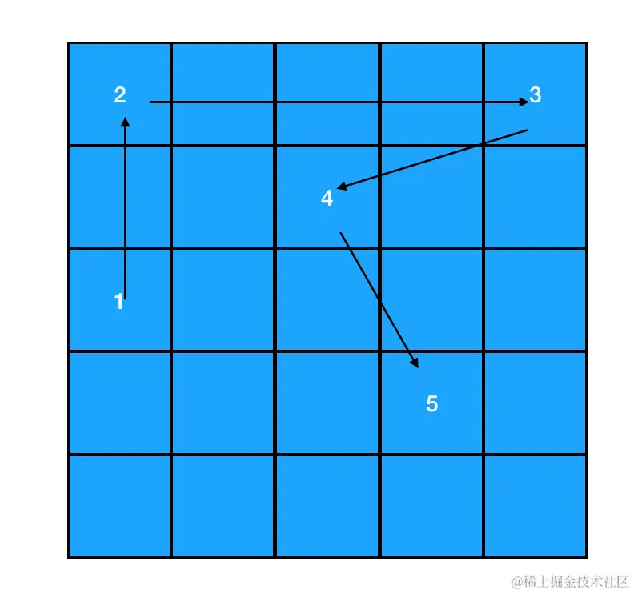
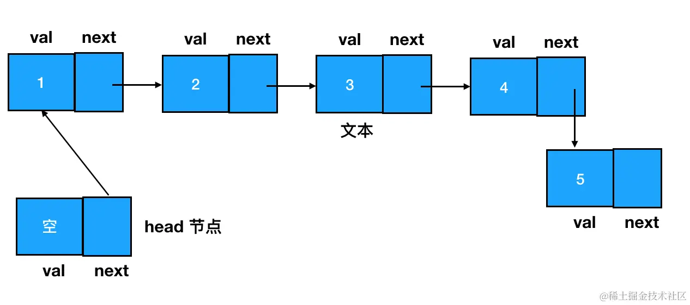
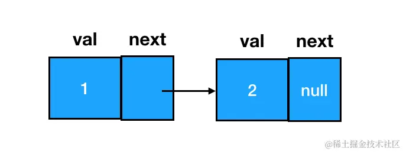
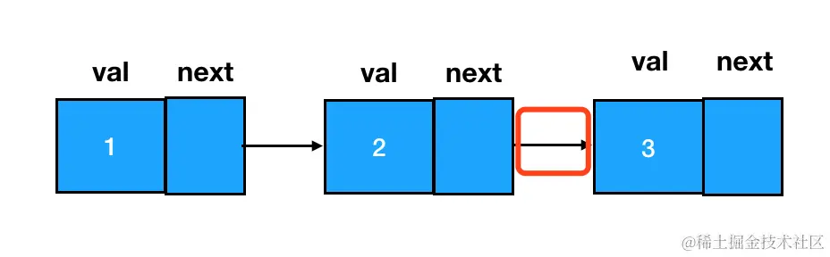
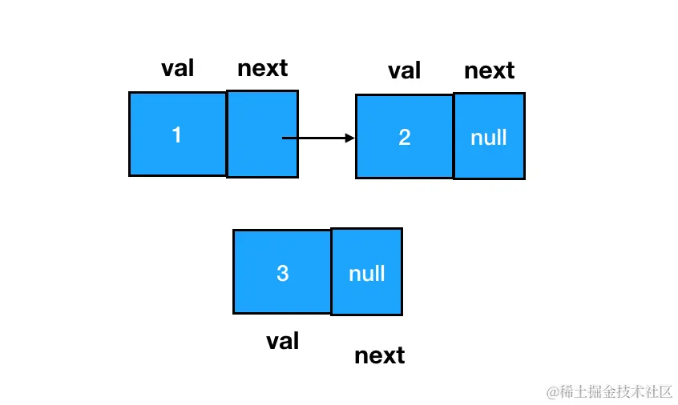
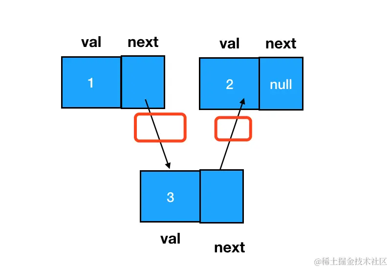
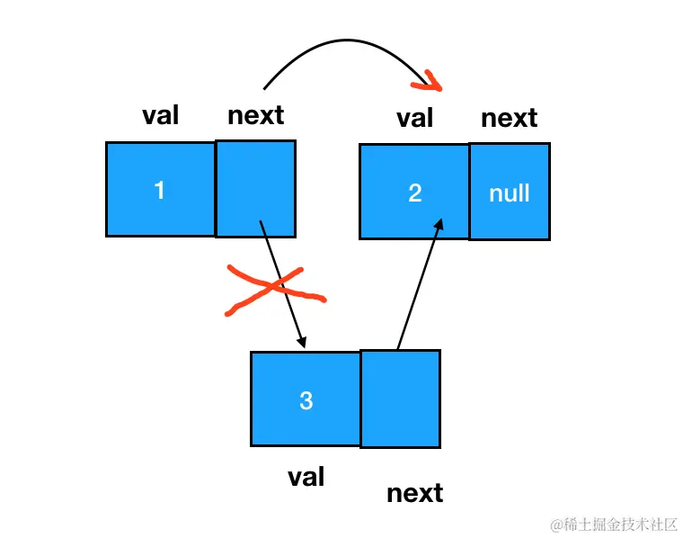

# 数据结构

## 数组

**数组的创建**

```js
// 方式1
const arr = [1,2,3];
// 方式2 构造函数
const arr = new Array(10); // 创建了10个元素的空数组
const arr = (new Array(7)).fill(1) // 得到一个长度为7，且每个元素都初始化为1的数组
```

**数组遍历**

1. for循环
2. forEach
3. map

**数组增加元素三种方法**

- `unshift` 方法-添加元素到数组的头部

```js
const arr = [1,2]
arr.unshift(0) // [0,1,2]
```

- `push` 方法-添加元素到数组的尾部

```js
const arr = [1,2]
arr.push(3) // [1,2,3]
```

- `splice` 方法-添加元素到数组的任何位置

第一个入参是起始的索引值，第二个入参表示从起始索引开始需要删除的元素个数。这里我们指明从索引为1的元素开始，删掉1个元素，也就相当于把 arr[1] 给删掉了。这就是数组中删除任意位置元素的方法。
至于传入两个以上参数这种用法，是用于在删除的同时完成数组元素的新增。

```js
const arr = [1,2] 
arr.splice(1,0,3) // [1,3,2]
```

**数组删除元素三种方法**

- `shift` 方法-删除数组头部的元素

```js
const arr = [1,2,3]
arr.shift() // [2,3]
```

- `pop` 方法-删除数组尾部的元素

```js
const arr = [1,2,3]
arr.pop() // [1,2]
```

- `splice` 方法-删除数组任意位置的元素

## 栈（Stack）——只用 pop 和 push 完成增删的“数组”

特点：`后进先出`，类似于 `拿盘子`

```js
// 初始状态，栈空
const stack = []  
// 入栈过程
stack.push('东北大板')
stack.push('可爱多')
stack.push('巧乐兹')
stack.push('冰工厂')
stack.push('光明奶砖')

// 出栈过程，栈不为空时才执行
while(stack.length) {
    // 单纯访问栈顶元素（不出栈）
    const top = stack[stack.length-1]
    console.log('现在取出的冰淇淋是', top)  
    // 将栈顶元素出栈
    stack.pop()
}

// 栈空
stack // []
```

```bash
现在取出的冰淇淋是 光明奶砖
现在取出的冰淇淋是 冰工厂
现在取出的冰淇淋是 巧乐兹
现在取出的冰淇淋是 可爱多
现在取出的冰淇淋是 东北大板
```

## 队列（Queue）——只用 shift 和 push 完成增删的“数组”

特点：`先进先出`，类似于 `排队`

```js
const queue = []  
queue.push('user1')
queue.push('user2')
queue.push('user3')  
  
while(queue.length) {
    // 单纯访问队头元素（不出队）
    const top = queue[0]
    console.log(top,'取餐')
    // 将队头元素出队
    queue.shift()
}

// 队空
queue // []
```

```bash
user1 取餐
user2 取餐
user3 取餐
```

## 链表

在链表中，每一个结点的结构都包括了两部分的内容：数据域和指针域。JS 中的链表，是以嵌套的对象的形式来实现的：

```js
{
    // 数据域
    val: 1,
    // 指针域，指向下一个结点
    next: {
        val:2,
        next: ...
    }
}   
```



要想访问链表中的任何一个元素，我们都得从起点结点开始，逐个访问 next，一直访问到目标结点为止。为了确保起点结点是可抵达的，我们有时还会设定一个 head 指针来专门指向链表的开始位置：



**链表的创建**

创建链表结点，咱们需要一个构造函数：

```js {1-4}
function ListNode(val) {
    this.val = val;
    this.next = null;
}
```

在使用构造函数创建结点时，传入 val （数据域对应的值内容）、指定 next （下一个链表结点）即可：

```js
const node = new ListNode(1)  
node.next = new ListNode(2)
```

以上，就创建出了一个数据域值为1，next 结点数据域值为2的链表结点：



**链表元素的添加**

添加是直接在尾部添加结点，相对比较简单，我们改变一个 next 指针就行。这里记值为2的 node 结点为 node2（假设 node2 是现在的尾部结点），值为3的 node 结点为 node3。假如我要把 node3 添加到 node2 所在链表的尾部，直接把 node2 的 next 指针指向 node3 即可：



如何在两个结点间插入一个结点？注意，由于链表有时会有头结点，这时即便你是往链表头部增加结点，其本质也是“在头结点和第一个结点之间插入一个新结点”。所以说，任意两结点间插入一个新结点这种类型的增加操作，将会是链表基础中的一个关键考点。

要想完成这个动作，我们需要变更的是前驱结点和目标结点的 next 指针指向，过程如下图：

插入前：



插入后：



注意圈红的地方，下面用代码来表述一下这个改变。

```js
// 如果目标结点本来不存在，那么记得手动创建
const node3 = new ListNode(3)
// 把node3的 next 指针指向 node2（即 node1.next）
node3.next = node1.next
// 把node1的 next 指针指向 node3
node1.next = node3
```

**链表元素的删除**

删除的标准是：在链表的遍历过程中，无法再遍历到某个结点的存在。按照这个标准，要想遍历不到 node3，我们直接让它的前驱结点 node1 的 next 指针跳过它、指向 node3 的后继即可：



如此一来，node3 就成为了一个完全不可抵达的结点了，它会被 JS 的垃圾回收器自动回收掉。这个过程用代码表述如下：

```js
node1.next = node3.next
```

**这里注意**：在涉及链表删除操作的题目中，重点不是定位目标结点，而是定位目标结点的前驱结点。做题时，完全可以只使用一个指针（引用），这个指针用来定位目标结点的前驱结点。比如说咱们这个题里，其实只要能拿到 node1 就行了：

```js
// 利用 node1 可以定位到 node3
const target = node1.next
// target.next => node3.next 
node1.next = target.next
```

> 在链表中，添加和删除操作的复杂度是固定的——不管链表里面的结点个数 n 有多大，只要我们明确了要插入/删除的目标位置，那么我们需要做的都仅仅是改变目标结点及其前驱/后继结点的指针指向。 因此我们说链表增删操作的复杂度是常数级别的复杂度，用大 O 表示法表示为 O(1)。

> 链表也有一个弊端：当我们试图读取某一个特定的链表结点时，必须遍历整个链表来查找它。

## 树