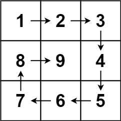
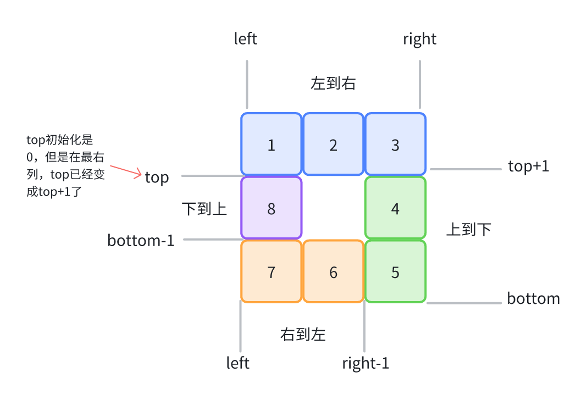

# 数组

## 数组基础知识

**数组的创建**

```js
// 方式1
const arr = [1, 2, 3]
// 方式2 构造函数
const arr = new Array(10) // 创建了10个元素的空数组
const arr = new Array(7).fill(1) // 得到一个长度为7，且每个元素都初始化为1的数组
```

**数组遍历**

1. for 循环
2. forEach
3. map

**数组增加元素三种方法**

- `unshift` 方法-添加元素到数组的头部

```js
const arr = [1, 2]
arr.unshift(0) // [0,1,2]
```

- `push` 方法-添加元素到数组的尾部

```js
const arr = [1, 2]
arr.push(3) // [1,2,3]
```

- `splice` 方法-添加元素到数组的任何位置

第一个入参是起始的索引值，第二个入参表示从起始索引开始需要删除的元素个数。这里我们指明从索引为 1 的元素开始，删掉 1 个元素，也就相当于把 arr[1] 给删掉了。这就是数组中删除任意位置元素的方法。
至于传入两个以上参数这种用法，是用于在删除的同时完成数组元素的新增。

```js
const arr = [1, 2]
arr.splice(1, 0, 3) // [1,3,2]
```

**数组删除元素三种方法**

- `shift` 方法-删除数组头部的元素

```js
const arr = [1, 2, 3]
arr.shift() // [2,3]
```

- `pop` 方法-删除数组尾部的元素

```js
const arr = [1, 2, 3]
arr.pop() // [1,2]
```

- `splice` 方法-删除数组任意位置的元素

## 1. 二分查找

<LeetCodeLink url="https://leetcode.cn/problems/binary-search/description/" />

给定一个 n 个元素有序的（升序）整型数组 nums 和一个目标值 target，写一个函数搜索 nums 中的 target，如果 target 存在返回下标，否则返回 -1。

你必须编写一个具有 `O(log n)` 时间复杂度的算法。

**示例 1**：

> **输入**：nums = [-1,0,3,5,9,12], target = 9
>
> **输出**：4
>
> **解释**：9 出现在 nums 中并且下标为 4

**示例 2**：

> **输入**：nums = [-1,0,3,5,9,12], target = 2
>
> **输出**：-1
>
> **解释**：2 不存在 nums 中因此返回 -1

::: code-group

```md [思路]
每次查找数组的中间点，然后和目标进行判断，如果不相等，在折半查找。
而且题目说到的时间复杂度是 O(log n)，那就是使用二分查找法了
```

```js [代码]
/**
 * @param {number[]} nums
 * @param {number} target
 * @return {number}
 */
var search = function (arr, target) {
  let left = 0
  let right = arr.length - 1
  while (left <= right) {
    // 中间数下标
    let mid = Math.floor((left + right) / 2)
    if (arr[mid] === target) return mid
    // target在中间到右边
    if (arr[mid] < target) left = mid + 1
    // target在左边到中间
    else right = mid - 1
  }
  return -1
}
```

:::

## 2. 移除元素

<LeetCodeLink url="https://leetcode.cn/problems/remove-element/description/" />

给你一个数组 nums 和一个值 val，你需要 原地 移除所有数值等于 val 的元素。元素的顺序可能发生改变。然后返回 nums 中与 val 不同的元素的数量。

- 假设 nums 中不等于 val 的元素数量为 k，要通过此题，您需要执行以下操作：

- 更改 nums 数组，使 nums 的前 k 个元素包含不等于 val 的元素。nums 的其余元素和 nums 的大小并不重要。
  返回 k。

**示例 1**：

> 输入：nums = [3,2,2,3], val = 3
>
> 输出：2, nums = [2,2,_,_]
>
> 解释：你的函数函数应该返回 k = 2, 并且 nums 中的前两个元素均为 2。
>
> 你在返回的 k 个元素之外留下了什么并不重要（因此它们并不计入评测）。

**示例 2**：

> 输入：nums = [0,1,2,2,3,0,4,2], val = 2
>
> 输出：5, nums = [0,1,4,0,3,_,_,_]
>
> 解释：你的函数应该返回 k = 5，并且 nums 中的前五个元素为 0,0,1,3,4。
>
> 注意这五个元素可以任意顺序返回。
>
> 你在返回的 k 个元素之外留下了什么并不重要（因此它们并不计入评测）。

::: code-group

```md [思路]
这道题虽然题目很长，其实就是删除数组中等于 val 的元素，并返回不等的元素个数。
有两种解决思路：
1、循环，相等的删除
2、使用双指针，定义 left、right，思路是将所有不等于 val 的元素移到数组前面，返回 left 的值即为不等的元素个数
```

```js [代码1]
/**
 * @param {number[]} nums
 * @param {number} val
 * @return {number}
 */
var removeElement = function (nums, val) {
  for (let i = nums.length - 1; i >= 0; i--) {
    if (nums[i] === val) {
      nums.splice(i, 1)
    }
  }
  return nums.length
}
```

```js [代码2]
/**
 * @param {number[]} nums
 * @param {number} val
 * @return {number}
 */
var removeElement = function (nums, val) {
  let left = 0
  let right = nums.length - 1
  while (left <= right) {
    if (nums[left] === val) {
      // 如果等于val，将当前元素换成右侧不等的
      // （其实也不知道等不等于，所以会继续循环，但是right--后，right到末尾的元素的长度肯定是等于val的元素长度）
      nums[left] = nums[right]
      right--
    } else {
      left++
    }
  }
  return left
}
```

:::

## 3. 长度最小的子数组

<LeetCodeLink url="https://leetcode.cn/problems/minimum-size-subarray-sum/description/" />

给定一个含有 \( n \) 个正整数的数组和一个正整数 `target`。找出该数组中满足其总和大于等于 `target` 的长度最小的**子数组** `[nums_l, nums_{l+1}, ..., nums_{r-1}, nums_r]`，并返回其长度。如果不存在符合条件的子数组，返回 `0`。

**示例 1：**

> 输入：`target = 7`, `nums = [2,3,1,2,4,3]`
>
> 输出：`2`
>
> 解释：子数组 `[4,3]` 是该条件下的长度最小的子数组。

**示例 2：**

> 输入：`target = 4`, `nums = [1,4,4]`
>
> 输出：`1`

**示例 3：**

> 输入：`target = 11`, `nums = [1,1,1,1,1,1,1,1,1]`
>
> 输出：`0`

::: code-group

```md [思路]
1. 这道题可以使用滑动窗口来做（双指针），使用 `left` 和 `right` 两个指针维护一个滑动窗口
2. `right` 指针不断向右扩展窗口，增加 sum
3. 当 sum 足够大时，尝试移动 left 指针缩小窗口
4. 在每一步都检查当前窗口是否满足条件，并更新最小长度

需要注意：定义一个初始值 `ans`，用于标记是否找到了符合条件的子数组，
它需要初始化一个较大的值，比如 `n + 1` / `Infinity`，
这样当没有找到满足条件的子数组时，ans 的值就不会变化，也就返回 `0`。
```

```js [代码]
/**
 * @param {number} target
 * @param {number[]} nums
 * @return {number}
 */
var minSubArrayLen = function (target, nums) {
  let n = nums.length
  // 设置ans为一个最大值
  let ans = n + 1
  // 初始化指针
  let left = 0,
    right = 0
  // 统计总和
  let sum = 0
  // 窗口大小
  let winLen = 0
  for (; right < n; right++) {
    sum += nums[right]
    // 缩小窗口大小，来获取到长度最小的子数组
    while (sum >= target) {
      winLen = right - left + 1
      ans = Math.min(ans, winLen)
      sum -= nums[left]
      left++
    }
  }
  // 如果循环中没有更新 ans，说明没有符合要求的子数组，根据题目规定，这种情况返回 0
  return ans <= n ? ans : 0
}
```

:::

## 4. 螺旋矩阵 II

<LeetCodeLink url="https://leetcode.cn/problems/spiral-matrix-ii/description/" />

给定一个正整数 `n`，生成一个包含 `1` 到 `n²` 所有元素的 `n x n` 正方形矩阵，且元素按顺时针顺序螺旋排列。

**示例 1**：



- 输入：`n = 3`
- 输出：`[[1, 2, 3], [8, 9, 4], [7, 6, 5]]`

**示例 2**：

- 输入：`n = 1`
- 输出：`[[1]]`

::: code-group

```md [思路]
这个题没有什么算法思路，就是模拟，模拟一圈运行的情况：
从左到右，从上到下，从右到左，从下到上，重复以上步骤，直到矩阵的元素都填满了
思路如下图
```

```js [代码]
/**
 * @param {number} n
 * @return {number[][]}
 */
var generateMatrix = function (n) {
  let left = 0
  let right = n - 1
  let bottom = n - 1
  let top = 0
  const total = n * n
  // 方法1:
  // const dep = Array.from({ length: n }, () => [])
  // 错误创建，会导致引用同一个数组空间
  // const dep = Array.from({ length: n }).fill([])
  // 方法2:
  const dep = []
  for (let i = 0; i < n; i++) {
    dep[i] = []
  }

  let count = 0 // 步数
  // 注意：count不能<=total，当count===total时，结束循环
  while (count < total) {
    // 从左往右 一维下标不变
    for (let i = left; i <= right; i++) {
      dep[left][i] = ++count
    }
    // 向下移动到下一行，第一行是 dep[left][x]，已经设置完成
    top++
    // 从上到下，也就是最右侧一列，二维下标不变，dep[x][right]
    for (let i = top; i <= bottom; i++) {
      dep[i][right] = ++count
    }
    // 最右列已经设置过值了，剩余right--列
    right--
    // 从右到左，一维下标不变 dep[bottom][x]
    for (let i = right; i >= left; i--) {
      dep[bottom][i] = ++count
    }
    // 最后一行已经设置过了，还有bottom-1行没设置（bottom-1到第一行top）
    bottom--
    // 下到上，还有bottom-1行没设置（bottom-1到第一行top）
    for (let i = bottom; i >= top; i--) {
      dep[i][left] = ++count
    }
    left++
  }
  return dep
}
```

:::


