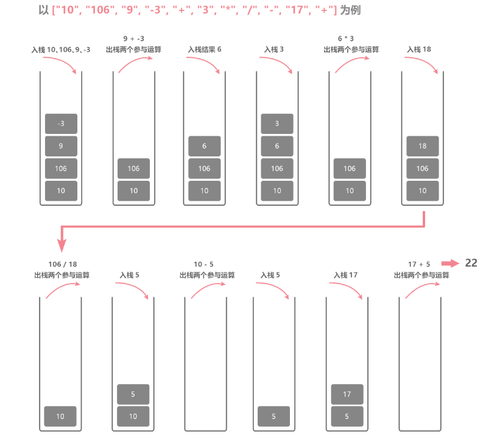

# 栈与队列

## 栈与队列理论基础

### 栈（Stack）——只用 pop 和 push 完成增删的“数组”

特点：`后进先出`，类似于 `拿盘子`

```js
// 初始状态，栈空
const stack = []
// 入栈过程
stack.push('东北大板')
stack.push('可爱多')
stack.push('巧乐兹')
stack.push('冰工厂')
stack.push('光明奶砖')

// 出栈过程，栈不为空时才执行
while (stack.length) {
  // 单纯访问栈顶元素（不出栈）
  const top = stack[stack.length - 1]
  console.log('现在取出的冰淇淋是', top)
  // 将栈顶元素出栈
  stack.pop()
}

// 栈空
stack // []
```

```bash
现在取出的冰淇淋是 光明奶砖
现在取出的冰淇淋是 冰工厂
现在取出的冰淇淋是 巧乐兹
现在取出的冰淇淋是 可爱多
现在取出的冰淇淋是 东北大板
```

### 队列（Queue）——只用 shift 和 push 完成增删的“数组”

特点：`先进先出`，类似于 `排队`

```js
const queue = []
queue.push('user1')
queue.push('user2')
queue.push('user3')

while (queue.length) {
  // 单纯访问队头元素（不出队）
  const top = queue[0]
  console.log(top, '取餐')
  // 将队头元素出队
  queue.shift()
}

// 队空
queue // []
```

```bash
user1 取餐
user2 取餐
user3 取餐
```

## 1. 用栈实现队列

<LeetCodeLink url="https://leetcode.cn/problems/implement-queue-using-stacks/description/" />

请你仅使用两个栈实现先入先出队列。队列应当支持一般队列支持的所有操作（`push`、`pop`、`peek`、`empty`）：

实现 `MyQueue` 类：

- `void push(int x)` 将元素 `x` 推到队列的末尾
- `int pop()` 从队列的开头移除并返回元素
- `int peek()` 返回队列开头的元素
- `boolean empty()` 如果队列为空，返回 `true`；否则，返回 `false`

**说明**：

- 你 **只能** 使用标准的栈操作 —— 也就是只有 `push to top`，`peek/pop from top`，`size`，和 `is empty` 操作是合法的。
- 你所使用的语言也许不支持栈。你可以使用 `list` 或者 `deque`（双端队列）来模拟一个栈，只要是标准的栈操作即可。

**示例 1**：

> **输入**：
>
> ["MyQueue", "push", "push", "peek", "pop", "empty"]
>
> [[], [1], [2], [], [], []]
>
> **输出**：
>
> [null, null, null, 1, 1, false]
>
> **解释**：
>
> MyQueue myQueue = new MyQueue();
>
> myQueue.push(1); // queue is: [1]
>
> myQueue.push(2); // queue is: [1, 2] (leftmost is front of the queue)
>
> myQueue.peek(); // return 1
>
> myQueue.pop(); // return 1, queue is [2]
>
> myQueue.empty(); // return false

::: code-group

```md [思路]
题中说使用**两个栈**实现队列，栈的话就只能使用数组的 `pop` 和 `push` 方法。

队列是先进先出，定义一个 `stackIn` 栈，用来将元素压入栈中，实现队列的进；
定义一个 `stackOut` 栈，用来将元素弹出栈，实现队列的出。

- myQueue.push()：直接在 `stackIn` 栈中压入元素
- myQueue.pop()：如果 `stackOut` 栈不为空，直接弹出栈顶元素即可；如果为空，则将 `stackIn` 栈中的元素全部压入 `stackOut` 栈中（相当于将 `stackIn` 栈中的元素倒序压入 `stackOut` 栈中），再弹出栈顶元素

例如：
stackIn: 【1,2,3<-入口
依次将 3、2、1 弹出 stackIn，放入 stackOut 中
stackOut: 出口<-3,2,1】

- myQueue.peek()：返回队列第一个元素，可以调用 `myQueue.pop()` 方法，该方法会返回并删除队列第一个元素。所以需要重新将该元素 `push` 放回 `stackOut` 中。
- myQueue.empty()：两个栈都为空时，才返回 true
```

```js [代码]
var MyQueue = function () {
  this.stackIn = []
  this.stackOut = []
}

/**
 * @param {number} x
 * @return {void}
 */
MyQueue.prototype.push = function (x) {
  this.stackIn.push(x)
}

/**
 * @return {number}
 */
MyQueue.prototype.pop = function () {
  let size = this.stackOut.length
  if (size) {
    return this.stackOut.pop()
  }
  while (this.stackIn.length) {
    const last = this.stackIn.pop()
    this.stackOut.push(last)
  }
  return this.stackOut.pop()
}

/**
 * @return {number}
 */
MyQueue.prototype.peek = function () {
  // 获取队头元素，并且从stackOut栈中删去了
  const res = this.pop()
  // 需要重新放回stackOut中
  this.stackOut.push(res)
  return res
}

/**
 * @return {boolean}
 */
MyQueue.prototype.empty = function () {
  return !this.stackIn.length && !this.stackOut.length
}

/**
 * Your MyQueue object will be instantiated and called as such:
 * var obj = new MyQueue()
 * obj.push(x)
 * var param_2 = obj.pop()
 * var param_3 = obj.peek()
 * var param_4 = obj.empty()
 */
```

:::

## 2. 用队列实现栈

<LeetCodeLink url="https://leetcode.cn/problems/implement-stack-using-queues/description/" />

请你仅使用两个队列实现一个后入先出（LIFO）的栈，并支持普通栈的全部四种操作（`push`、`top`、`pop` 和 `empty`）。

实现 `MyStack` 类：

- `void push(int x)` 将元素 `x` 压入栈顶。
- `int pop()` 移除并返回栈顶元素。
- `int top()` 返回栈顶元素。
- `boolean empty()` 如果栈是空的，返回 `true`；否则，返回 `false` 。

**注意**：

- 你只能使用队列的标准操作 —— 也就是 `push to back`、`peek/pop from front`、`size` 和 `is empty` 这些操作。
- 你所使用的语言也许不支持队列。你可以使用 `list`（列表）或者 `deque`（双端队列）来模拟一个队列，只要是标准的队列操作即可。

**示例**：

> **输入**：
>
> ["MyStack", "push", "push", "top", "pop", "empty"]
>
> [[], [1], [2], [], [], []]
>
> **输出**：
>
> [null, null, null, 2, 2, false]
>
> **解释**：
>
> MyStack myStack = new MyStack();
>
> myStack.push(1);
>
> myStack.push(2);
>
> myStack.top(); // 返回 2
>
> myStack.pop(); // 返回 2
>
> myStack.empty(); // 返回 False

::: code-group

```md [思路]
题中说需要两个队列，队列只能使用数组的 shift 和 push 方法

- myStack.push()：直接 push 到 inQueue
- myStack.pop()：由于需要弹出最后进来的元素，但是又不能使用 pop，shift 只能弹出第一个元素

1. 判断 inQueue 的长度是否大于 1（采用循环），大于 1 就表示队列里还有其他的元素，
   就可以采用一个新的队列 saveQueue 来暂存之前的元素（除去最后的，之前的元素都保存在 saveQueue 中）
   然后去操作 inQueue 的 shift 拿到的末尾元素
2. 判断 inQueue 是否有元素，为空，可能 saveQueue 中有，就把 saveQueue 的复制到 inQueue 中，saveQueue 置空即可

- myStack.top()：可以调用 `myStack.pop()` 方法，最后将 `myStack.pop()` 弹出的元素，再添加回去即可
- myStack.empty()：两个队列长度为空，则返回 true
```

```js [代码]
var MyStack = function () {
  // 入栈 <- [1,2,3] <- 3进
  // 出栈 3出 -> [3,2,1] ->
  this.inQueue = []
  // 暂存的
  this.saveQueue = []
}

/**
 * @param {number} x
 * @return {void}
 */
MyStack.prototype.push = function (x) {
  // push是放入栈的末尾
  this.inQueue.push(x)
}

/**
 * @return {number}
 */
MyStack.prototype.pop = function () {
  if (!this.inQueue.length) {
    // 如果为空，暂存的saveQueue可能有元素，需要将暂存的原封不动的放回inQueue
    // [this.inQueue, this.saveQueue] = [this.saveQueue, this.inQueue];
    this.inQueue = this.saveQueue
    this.saveQueue = []
  }
  // 把inQueue除第一个元素的其他元素放入saveQueue进行暂存，确保只剩最后进入的
  while (this.inQueue.length > 1) {
    // 先进的元素
    const firstN = this.inQueue.shift()
    this.saveQueue.push(firstN)
  }
  return this.inQueue.shift()
}

/**
 * @return {number}
 */
MyStack.prototype.top = function () {
  const res = this.pop()
  // inQueue <- [1,2,3] <- 栈顶是3
  this.inQueue.push(res)
  return res
}

/**
 * @return {boolean}
 */
MyStack.prototype.empty = function () {
  return !this.inQueue.length && !this.saveQueue.length
}

/**
 * Your MyStack object will be instantiated and called as such:
 * var obj = new MyStack()
 * obj.push(x)
 * var param_2 = obj.pop()
 * var param_3 = obj.top()
 * var param_4 = obj.empty()
 */
```

:::

## 3. 有效的括号

<LeetCodeLink url="https://leetcode.cn/problems/valid-parentheses/description/" />

给定一个只包括 `'('`，`')'`，`'{'`，`'}'`，`'['`，`']'` 的字符串 `s`，判断字符串是否有效。

有效字符串需满足：

1. 左括号必须用相同类型的右括号闭合。
2. 左括号必须以正确的顺序闭合。
3. 每个右括号都有一个对应的相同类型的左括号。

**示例 1**:

输入: `s = "()"`  
输出: `true`

**示例 2**:

输入: `s = "()[]{}"`  
输出: `true`

**示例 3**:

输入: `s = "(]"`  
输出: `false`

**示例 4**:

输入: `s = "([)]"`  
输出: `false`

**示例 5**:

输入: `s = "{[]}"`  
输出: `true`

::: code-group

```md [思路]
本题是「邻项消除」问题，左右括号需要匹配，可以利用栈来实现。

1. 当 s 的长度为奇数，直接返回 false
2. 用 map 保存括号匹配关系
3. 去循环 s，如果匹配到左括号：将左括号对应的右括号压入栈中，
   匹配到右括号：栈空（没有右括号），或者左括号与右括号(char)不匹配
4. 当循环结束后，栈为空，才返回 true
```

```js [代码]
/**
 * @param {string} s
 * @return {boolean}
 */
var isValid = function (s) {
  const len = s.length
  if (len % 2 !== 0) {
    // 奇数直接return
    return false
  }
  const map = {
    '(': ')',
    '{': '}',
    '[': ']'
  }
  const stack = []
  for (let i = 0; i < len; i++) {
    const char = s[i]
    if (map[char]) {
      // 如果是左括号，将右括号放入栈中
      stack.push(map[char])
    } else if (stack.length === 0 || stack.pop() !== char) {
      // 栈空（没有右括号），或者左括号与右括号(char)不匹配
      return false
    }
  }
  // 遍历完后，只有栈空才表示都匹配上了
  return stack.length === 0
}
```

:::

## 4. 删除字符串中的所有相邻重复项

<LeetCodeLink url="https://leetcode.cn/problems/remove-all-adjacent-duplicates-in-string/description/" />

给出由小写字母组成的字符串 `s`，重复项删除操作会选择两个相邻且相同的字母，并删除它们。

在 `s` 上反复执行重复项删除操作，直到无法继续删除。

在完成所有重复项删除操作后返回最终的字符串。答案保证唯一。

**示例**：

> **输入**："abbaca"
>
> **输出**："ca"
>
> **解释**：
>
> 例如，在 "abbaca" 中，我们可以删除 "bb" 由于两字母相邻且相同，这是此时唯一可以执行删除操作的重复项。之后我们得到字符串"aaca"，其中又只有 "aa" 可以执行重复项删除操作，所以最后的字符串为 "ca"。

::: code-group

```md [思路]
利用栈来解决此题，去遍历字符串 s，如果栈顶元素和当前遍历的字符相同，则将栈顶元素弹出，否则将当前字符入栈。
需要注意：如果不匹配，弹出的元素，同时也需要和当前元素一起放回（可以看具体代码）
最后返回的栈的结果就是去重复的字符串。
```

```js [代码]
/**
 * @param {string} s
 * @return {string}
 */
var removeDuplicates = function (s) {
  const stack = []
  for (let c of s) {
    if (stack.length === 0) {
      // 栈为空直接push
      stack.push(c)
      continue
    }
    // 栈顶元素
    const last = stack.pop()
    if (last !== c) {
      // 字符串不匹配，又放回栈中
      stack.push(last)
      // 把当前不匹配的也放回栈中
      stack.push(c)
    }
  }
  return stack.join('')
}
```

:::

## 5. 逆波兰表达式求值

<LeetCodeLink url="https://leetcode.cn/problems/evaluate-reverse-polish-notation/description/" />

给你一个字符串数组 `tokens` ，表示一个根据 逆波兰表示法 表示的算术表达式。

请你计算该表达式。返回一个表示表达式值的整数。

**注意**：

- 有效的算符为 `'+'`、`'-'`、`'*'` 和 `'/'`。
- 每个操作数（运算对象）都可以是一个整数或者另一个表达式。
- 两个整数之间的除法总是**向零截断**。
- 表达式中不含除零运算。
- 输入是一个根据逆波兰表示法表示的算术表达式。
- 答案及所有中间计算结果可以用 32 位 整数表示。

**示例 1**：

> **输入**：tokens = ["2","1","+","3","*"]
>
> **输出**：9
>
> **解释**：该算式转化为常见的中缀算术表达式为：((2 + 1) \* 3) = 9

**示例 2**：

> **输入**：tokens = ["4","13","5","/","+"]
>
> **输出**：6
>
> **解释**：该算式转化为常见的中缀算术表达式为：(4 + (13 / 5)) = 6

**示例 3**：

> **输入**：tokens = ["10","6","9","3","+","-11","*","/","*","17","+","5","+"]
>
> **输出**：22
>
> **解释**：该算式转化为常见的中缀算术表达式为：
>
> ((10 _ (6 / ((9 + 3) _ -11))) + 17) + 5
>
> = ((10 _ (6 / (12 _ -11))) + 17) + 5
>
> = ((10 \* (6 / -132)) + 17) + 5
>
> = ((10 \* 0) + 17) + 5
>
> = (0 + 17) + 5
>
> = 17 + 5
>
> = 22

::: code-group

```md [思路]
将数组循环放入栈中，当遇到运算符时，将栈中两个数字取出，进行运算，将结果放回栈中。
向零截断：也就是小数部分被直接舍去，只保留整数部分，且向零的方向取整
console.log(3.7 | 0) // 输出 3
console.log(-3.7 | 0) // 输出 -3
流程如下图：
```

```js [代码]
/**
 * @param {string[]} tokens
 * @return {number}
 */
var evalRPN = function (tokens) {
  const playMap = {
    '+': (a, b) => a + b,
    '-': (a, b) => a - b,
    '*': (a, b) => a * b,
    '/': (a, b) => (a / b) | 0
  }
  const stack = []
  for (let i = 0; i < tokens.length; i++) {
    let str = tokens[i]
    if (playMap[str]) {
      // 当前为符号
      let b = stack.pop()
      let a = stack.pop()
      const res = playMap[str](a, b)
      stack.push(res)
    } else {
      // 数字
      stack.push(Number(str)) // str是数字字符串，要转为数字
    }
  }
  return stack.pop()
}
```

:::



## 6. 滑动窗口最大值

给你一个整数数组 `nums`，有一个大小为 `k` 的滑动窗口从数组的最左侧移动到数组的最右侧。你只可以看到在滑动窗口内的 `k` 个数字。滑动窗口每次只向右移动一位。

返回滑动窗口中的最大值。

**示例 1**：

> **输入**：nums = [1,3,-1,-3,5,3,6,7], k = 3
>
> **输出**：[3,3,5,5,6,7]
>
> **解释**：

<pre>
滑动窗口的位置                  最大值
---------------               -----
[1  3  -1] -3  5  3  6  7       3
 1 [3  -1  -3] 5  3  6  7       3
 1  3 [-1  -3  5] 3  6  7       5
 1  3  -1 [-3  5  3] 6  7       5
 1  3  -1  -3 [5  3  6] 7       6
 1  3  -1  -3  5 [3  6  7]      7
</pre>

**示例 2**：

> **输入**：nums = [1], k = 1
>
> **输出**：[1]

::: code-group

```md [思路]
可以采用单调队列来解（单调队列就是维持队列中元素的单调递增/递减）
创建一个单调队列，我们需要保持单调队列中元素单调递增，单调队列的队头元素就是当前滑动窗口中的最大值，例如例 1：

- 【1】,3,-1,-3,5,...
  当前窗口选中了 1 个元素，单调队列初始化为空，
  当 i = 0，单调队列可以直接 push 元素 1 进入，窗口后移
- 【1,3】,-1,-3,5,...
  当 i = 1，会将 3 推入单调队列，这时，3 比 1 大，将 3 前的所有元素都弹出（这样做是为了保证队列出口处元素最大）
  因为 3 为窗口的最左侧，并且维持单调队列递减，此时还不能记录最大值，因为窗口不够 k
- 【1,3,-1】,-3,5,...
  当 i = 2，将 -1 推入单调队列，这时，-1 比 3 小，不用处理
  如果当前元素，比队列的左前所有元素都大，就把比当前元素小的所有元素都弹出去
- 1,【3,-1,-3】,5,...
  当 i = 3，将 -3 推入单调队列，这时，-3 比 -1 小，不用处理
- 1,3,【-1,-3,5】,...
  当 i = 4，将 5 推入单调队列，这时，3 已经不再窗口中了，直接弹出，
  5 比 -3 大，将 -1，-3 都弹出去，只保留 5，确保队头元素是最大的
- ...

需要注意：
确保窗口形成后，再在结果数组中放入窗口的最大值
也就是前 3 个元素是无脑放入单调队列的，不过也要维护单减，第 3 个元素时才开始判断最大值

步骤：

1. 每次滑动窗口时：
2. 先移除队列中不在窗口范围内 的元素 (i - k) 之前的。
3. 再从队列尾部移除比当前 nums[i] 小的元素，保证队列单调递减。
4. 队列头部元素始终是窗口内的最大值，存入 res[]。
```

```js [代码]
/**
 * @param {number[]} nums
 * @param {number} k
 * @return {number[]}
 */
var maxSlidingWindow = function (nums, k) {
  // 存放结果
  let res = []
  // 单调队列（单减，队头为最大值），存放元素下标
  let queue = []
  for (let i = 0; i < nums.length; i++) {
    // 如果队列中有比当前元素小的元素，就将他们全部移除，从该元素的前一个开始找
    while (queue.length > 0 && nums[queue[queue.length - 1]] < nums[i]) {
      queue.pop()
    }
    // 将当前元素推入队列
    queue.push(i)
    // 如果单调队列的元素已经不在窗口中，需要移除，同时每次移动一步，所以只需要判断一次。
    if (queue.length > 0 && queue[0] < i - k + 1) {
      queue.shift()
    }
    // 大于k个元素，才开始找最大值，不然窗口没形成
    if (i >= k - 1) {
      const max = nums[queue[0]]
      res.push(max)
    }
  }
  return res
}
```

:::

## 7. 前 K 个高频元素

<LeetCodeLink url="https://leetcode.cn/problems/top-k-frequent-elements/description/" />

给你一个整数数组 `nums` 和一个整数 `k` ，请你返回其中出现频率前 `k` 高的元素。你可以按任意顺序返回答案。

**示例 1**：

> **输入**: nums = [1,1,1,2,2,3], k = 2
>
> **输出**: [1,2]

**示例 2**：

> **输入**: nums = [1], k = 1
>
> **输出**: [1]

::: code-group

```md [思路]
这道题虽然在栈和队列中，但是可以用哈希表来解决：

1. 记录数的 hash
2. 然后对 hash 表进行排序
3. 输出前 k 个

需要补充一点基础：Map 是一个可迭代对象，所以可以使用 Array.from()方法将 Map 转为数组，
转为的是一个二维数组，例如: a 出现 2 次，b 出现一次，对应[[a, 2], [b, 1]]
```

```js [代码]
/**
 * @param {number[]} nums
 * @param {number} k
 * @return {number[]}
 */
var topKFrequent = function (nums, k) {
  let map = new Map()
  for (let i = 0; i < nums.length; i++) {
    let n = nums[i]
    if (map.has(n)) {
      map.set(n, map.get(n) + 1)
    } else {
      map.set(n, 1)
    }
  }

  let arr = Array.from(map).sort((a, b) => b[1] - a[1])
  let res = []
  for (let i = 0; i < k && i < arr.length; i++) {
    let arr_map = arr[i]
    res.push(arr_map[0])
  }
  return res
}
```

:::
