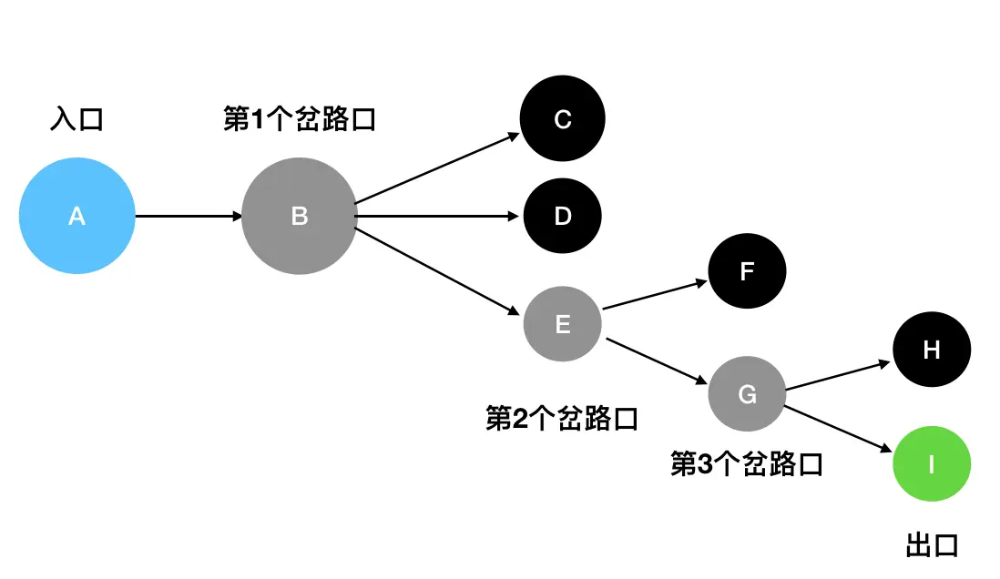
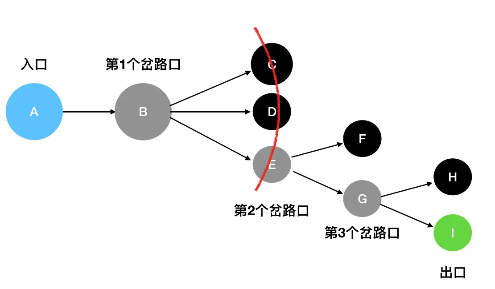

# 深度优先（DFS）和广度优先（BFS）

> 这章只是作扫盲，具体的应用需要去看二叉树部分（二叉树前中后序遍历->深度遍历，二叉树层序遍历->广度遍历）

拿迷宫举例，在找出口的这个过程里，我们贯彻了“不撞南墙不回头”的原则：只要没有碰壁，就决不选择其它的道路，而是坚持向当前道路的深处挖掘——像这样将“深度”作为前进的第一要素的搜索方法，就是所谓的“深度优先搜索”。

深度优先搜索的核心思想，是试图穷举所有的完整路径。

## 深度优先

**深度优先搜索的本质——栈结构**

现在我们把迷宫中的每一个坐标看做是栈里的一个元素，用栈来模拟这个过程：

1. 从 A 出发（A 入栈），经过了 B（B 入栈），接下来面临 C、D、E 三条路。这里按照从上到下的顺序来走（你也可以选择其它顺序），先走 C（C 入栈）。
2. 发现 C 是死胡同，后退到最近的岔路口 B（C 出栈），尝试往 D 方向走（D 入栈）。
3. 发现 D 是死胡同，，后退到最近的岔路口 B（D 出栈），尝试往 E 方向走（E 入栈）。
4. E 是一个岔路口，眼前有两个选择：F 和 G。按照从上到下的顺序来走，先走 F（F 入栈）。
5. 发现 F 是死胡同，后退到最近的岔路口 E（F 出栈），尝试往 G 方向走（G 入栈）。
6. G 是一个岔路口，眼前有两个选择：H 和 I。按照从上到下的顺序来走，先走 H（H 入栈）。
7. 发现 H 是死胡同，后退到最近的岔路口 G（H 出栈），尝试往 I 方向走（I 入栈）。
8. I 就是出口，成功走出迷宫。

## 广度优先

广度优先搜索（BFS）并不执着于“一往无前”这件事情。它关心的是眼下自己能够直接到达的所有坐标，其动作有点类似于“扫描”——比如说站在 B 这个岔路口，它会只关注 C、D、E 三个坐标，至于 F、G、H、I这些遥远的坐标，现在不在它的关心范围内：

只有在走到了 E处时，它发现此时可以触达的坐标变成了 F、G，此时才会去扫描F、G。

1. 初始化，先将入口A入队（queue里现在只有A）。
2. 访问入口A（第一层），访问完毕后将A出队。发现直接能抵达的坐标只有B，于是将B入队（queue里现在只有B）。
3. 访问B（第二层），访问完毕后将B出队。发现直接能抵达的坐标变成了C、D和E，于是把这三个坐标记为下一层的访问对象，也就是把它们全部入队（queue里现在是C、D、E）
4. 访问第三层。这里我按照从上到下的顺序（你也可以按照其它顺序），先访问 C（访问完毕后C出队）和D（访问完毕后D出队），然后访问E（访问完毕后E出队）。访问C处和D处都没有见到新的可以直接抵达的坐标，所以不做额外的动作。但是在E处我们见到了可以直接抵达的F和G，因此把F和G记为下一层（第四层）需要访问的对象，F、G依次入队（queue里现在是 F、G）。
5. 访问第五层。第五层按照从上到下的顺序，先访问的是H（访问完毕后H出队），发现从H出发没有可以直接抵达的坐标，因此不作额外的操作。接着访问I（访问完毕后I出队），发现I就是出口，问题得解（此时 queue 队列已经被清空）。
