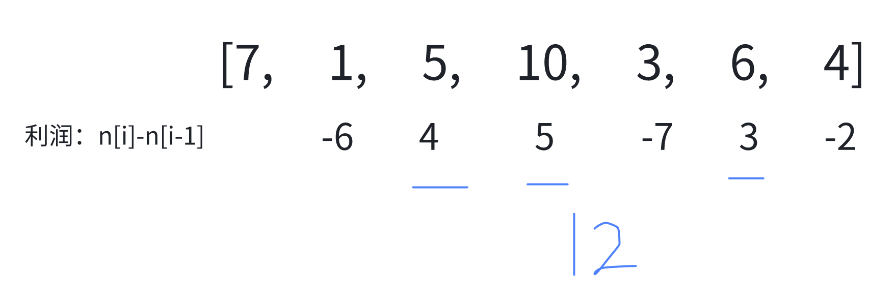

# 贪心

## 贪心算法理论基础

贪心的本质是选择每一阶段的局部最优，从而达到全局最优。

> 没了，这个只能靠感觉

## 1. 分发饼干

<LeetCodeLink url="https://leetcode.cn/problems/assign-cookies/description/" />

假设你是一位很棒的家长，想要给你的孩子们一些小饼干。但是，每个孩子最多只能给一块饼干。

对每个孩子 `i`，都有一个胃口值 `g[i]`，这是能让孩子们满足胃口的饼干的最小尺寸；并且每块饼干 `j`，都有一个尺寸 `s[j]`。如果 `s[j] >= g[i]`，我们可以将这个饼干 `j` 分配给孩子 `i` ，这个孩子会得到满足。你的目标是满足尽可能多的孩子，并输出这个最大数值。

**示例 1**:

> 输入: g = [1,2,3], s = [1,1]
>
> 输出: 1
>
> 解释:
>
> 你有三个孩子和两块小饼干，3 个孩子的胃口值分别是：1,2,3。
>
> 虽然你有两块小饼干，由于他们的尺寸都是 1，你只能让胃口值是 1 的孩子满足。
>
> 所以你应该输出 1。

**示例 2**:

> 输入: g = [1,2], s = [1,2,3]
>
> 输出: 2
>
> 解释:
>
> 你有两个孩子和三块小饼干，2 个孩子的胃口值分别是 1,2。
>
> 你拥有的饼干数量和尺寸都足以让所有孩子满足。
>
> 所以你应该输出 2。

::: code-group

```md [思路]
为了满足尽可能多的孩子，我们应该采用贪心策略：
1、将孩子的胃口值数组 `g` 和饼干尺寸数组 `s` 都进行升序排序
2、优先满足胃口小的孩子，这样可以保证整体能满足的孩子数量最多
3、使用双指针分别指向孩子和饼干，当饼干能满足孩子时，两个指针都向后移动，否则只移动饼干指针
```

```js [代码]
/**
 * @param {number[]} g
 * @param {number[]} s
 * @return {number}
 */
var findContentChildren = function (g, s) {
  // 从小到大排序
  g.sort((a, b) => a - b)
  s.sort((a, b) => a - b)
  // 孩子指针
  let child = 0
  // 饼干指针
  let cookie = 0
  // 满足孩子数量
  let count = 0

  while (child < g.length && cookie < s.length) {
    // 如果当前饼干能满足当前孩子
    if (g[child] <= s[cookie]) {
      child++
      count++
    }
    // 无论是否满足，都要看下一个饼干
    cookie++
  }
  return count
}
```

:::

## 2. 跳跃游戏

<LeetCodeLink url="https://leetcode.cn/problems/jump-game/description/" />

给你一个非负整数数组 `nums` ，你最初位于数组的 **第一个下标** 。数组中的每个元素代表你在该位置可以跳跃的最大长度。

判断你是否能够到达最后一个下标，如果可以，返回 `true` ；否则，返回 `false`。

**示例 1**：

> 输入：nums = [2,3,1,1,4]
>
> 输出：true
>
> 解释：可以先跳 1 步，从下标 0 到达下标 1, 然后再从下标 1 跳 3 步到达最后一个下标。

**示例 2**：

> 输入：nums = [3,2,1,0,4]
>
> 输出：false
>
> 解释：无论怎样，总会到达下标为 3 的位置。但该下标的最大跳跃长度是 0 ， 所以永远不可能到达最后一个下标。

::: code-group

```md [思路]
这道题其实跳几步无所谓，关键在于可跳的覆盖范围！
不一定非要明确一次究竟跳几步，每次取最大的跳跃步数，这个就是可以跳跃的覆盖范围。
这个范围内，别管是怎么跳的，反正一定可以跳过来。
**那么这个问题就转化为跳跃覆盖范围究竟可不可以覆盖到终点！**
每次移动取最大跳跃步数（得到最大的覆盖范围），每移动一个单位，就更新最大覆盖范围。

过程如下图：
i 每次移动只能在 cover 的范围内移动，每移动一个元素，cover 得到该元素数值（新的覆盖范围）的补充，让 i 继续移动下去。
而 cover 每次只取 max(该元素数值补充后的范围, cover 本身范围)。
如果 cover 大于等于了终点下标，直接 return true 就可以了。
```

```js [代码]
/**
 * @param {number[]} nums
 * @return {boolean}
 */
var canJump = function (nums) {
  let maxReach = 0 // 当前能到达的最远位置
  for (let i = 0; i < nums.length; i++) {
    // 如果当前位置不可达，直接返回 false
    // 如果当前的最大距离还没有i大（正常情况是i<=maxReach，因为i每次只走一步)，那后面就不可能到最后了
    if (i > maxReach) {
      return false
    }
    // 更新当前下标能到达的最远位置
    maxReach = Math.max(maxReach, i + nums[i])
    // 如果已经可以到达最后一个位置，提前返回
    if (maxReach > nums.length) {
      return true
    }
  }
  return true
}
```

:::


## 3. 跳跃游戏 II

<LeetCodeLink url="https://leetcode.cn/problems/jump-game-ii/description/" />

给定一个长度为 `n` 的 **0 索引**整数数组 `nums`。初始位置为 `nums[0]`。

每个元素 `nums[i]` 表示从索引 `i` 向后跳转的最大长度。换句话说，如果你在索引 `i` 处，你可以跳转到任意 `(i + j)` 处：

- `0 <= j <= nums[i]` 且
- `i + j < n`
  返回到达 `n - 1` 的最小跳跃次数。测试用例保证可以到达 `n - 1`。

**示例 1**:

> 输入: nums = [2,3,1,1,4]
>
> 输出: 2
>
> 解释: 跳到最后一个位置的最小跳跃数是 2。从下标为 0 跳到下标为 1 的位置，跳 1 步，然后跳 3 步到达数组的最后一个位置。

**示例 2**:

> 输入: nums = [2,3,0,1,4]
>
> 输出: 2

::: code-group

```c [思路]
本题的目标是用最少的跳跃次数到达数组的最后一个位置，使用贪心策略，每次尽可能地跳到最远的位置，这样可以保证跳跃次数最少。
具体实现时，维护三个变量：

- maxReach：当前能跳到的最远位置。
- end：当前这一跳能到达的最远位置。
- steps：跳跃次数。
- 遍历数组，更新 maxReach，当遍历到 end 时，说明需要进行下一次跳跃，此时更新 end 为 maxReach，并增加跳跃次数。

不需要具体知道每一步跳到哪，只需要知道每次跳跃能覆盖的范围边界，当走到边界时就必须再跳一次
if (i === end) {
    end = maxReach // 更新下一次跳跃能到达的最远位置
    steps++ // 增加跳跃次数
}

- 当 maxReach 大于等于最后一个位置时，返回当前的跳跃次数。
```

```js [代码]
/**
 * @param {number[]} nums
 * @return {number}
 */
var jump = function (nums) {
  let maxReach = 0 // 当前能跳到的最远位置
  let end = 0 // 当前这一跳能到达的最远位置
  let steps = 0 // 跳跃次数

  for (let i = 0; i < nums.length - 1; i++) {
    // 更新当前能跳到的最远位置
    maxReach = Math.max(maxReach, i + nums[i])

    // 如果遍历到当前这一跳的最远位置，则需要进行下一次跳跃
    /**
     * 当我们遍历到 i === end 时，意味着我们已经走完了当前这次跳跃所能覆盖的所有位置，
     * 此时我们必须进行下一次跳跃，所以需要增加跳跃次数
     * （也就是当前走过的，也就是i步，和end持平，那么就该计算下一个跳跃了）
     */
    if (i === end) {
      end = maxReach // 更新下一次跳跃能到达的最远位置
      steps++ // 增加跳跃次数
    }
  }

  return steps
}
```

:::

## 4. 无重叠区间

<LeetCodeLink url="https://leetcode.cn/problems/non-overlapping-intervals/description/" />

给定一个区间的集合 `intervals` ，其中 `intervals[i] = [starti, endi]` 。返回 需要移除区间的最小数量，使剩余区间互不重叠 。

注意 只在一点上接触的区间是**不重叠**的。例如 `[1, 2]` 和 `[2, 3]` 是不重叠的。

**示例 1**:

> 输入: intervals = [[1,2],[2,3],[3,4],[1,3]]
>
> 输出: 1
>
> 解释: 移除 [1,3] 后，剩下的区间没有重叠。

**示例 2**:

> 输入: intervals = [ [1,2], [1,2], [1,2] ]
>
> 输出: 2
>
> 解释: 你需要移除两个 [1,2] 来使剩下的区间没有重叠。

**示例 3**:

> 输入: intervals = [ [1,2], [2,3] ]
>
> 输出: 0
>
> 解释: 你不需要移除任何区间，因为它们已经是无重叠的了。

::: code-group

```md [思路]
1、按区间结束位置排序：按照区间的结束位置进行升序排序，这样可以优先选择结束位置早的区间，为后续区间留出更多空间。
2、从第一个区间开始，选择结束位置最早的区间
3、遍历后续区间，如果当前区间的起始位置不小于上一个选中区间的结束位置，则选择该区间

总区间数减去选择的区间数，就是需要移除的最小区间数。
```

```js [代码]
/**
 * @param {number[][]} intervals
 * @return {number}
 */
var eraseOverlapIntervals = function (intervals) {
  if (intervals.length === 0) return 0

  // 按区间结束位置升序排序
  intervals.sort((a, b) => a[1] - b[1])

  let count = 1 // 选中的区间数量，初始化为1（选择第一个区间）
  let end = intervals[0][1] // 上一个选中区间的结束位置

  for (let i = 1; i < intervals.length; i++) {
    // 如果当前区间起始位置大于上一个选中区间的结束位置，说明不重叠
    if (intervals[i][0] >= end) {
      count++
      end = intervals[i][1] // 更新结束位置
    }
  }

  // 需要移除的区间数 = 总区间数 - 选中区间数
  return intervals.length - count
}
```

:::

## 5. 划分字母区间

<LeetCodeLink url="https://leetcode.cn/problems/partition-labels/description/" />

给你一个字符串 `s` 。我们要把这个字符串划分为尽可能多的片段，同一字母最多出现在一个片段中。例如，字符串 `"ababcc"` 能够被分为 `["abab", "cc"]`，但类似 `["aba", "bcc"]` 或 `["ab", "ab", "cc"]` 的划分是非法的。

注意，划分结果需要满足：将所有划分结果按顺序连接，得到的字符串仍然是 `s`（`s` 仅由小写英文字母组成）。

返回一个表示每个字符串片段的长度的列表。

**示例 1**：

> 输入：s = "ababcbacadefegdehijhklij"
>
> 输出：[9,7,8]
>
> 解释：
>
> 划分结果为 "ababcbaca"、"defegde"、"hijhklij" 。
>
> 每个字母最多出现在一个片段中。
>
> 像 "ababcbacadefegde", "hijhklij" 这样的划分是错误的，因为划分的片段数较少。

**示例 2**：

> 输入：s = "eccbbbbdec"
>
> 输出：[10]

::: code-group

```md [思路]
这道题需要先理清楚这个切割的过程，就拿：ababcbacadefegde 举例，
每个字母只能出现在一个字符串中，例如第一个字母 a，我们就需要找到他最后出现的位置，也就是下标 8 的位置，
如果在下标 0-8 的区间内，其余的字母也在这个范围，那么就可以分割一个字符串，
如果其余字符超过了这个区间，那么就扩大。

那么，如何去找到他们的最大区间呢？
我们可以利用哈希表，去记录字母出现的最远位置

如何去找切割点呢？
当我们 for 循环遍历的 i，等于我们的 end 结束位置时，说明这个区间已经结束，那么我们就可以进行切割了。
```

```js [代码]
/**
 * @param {string} s
 * @return {number[]}
 */
var partitionLabels = function (s) {
  // 使用哈希表存储字符串中每个元素的最后出现的位置（也就是最远位置）
  let endPosition = {}
  for (let i = 0; i < s.length; i++) {
    endPosition[s[i]] = i
  }

  // 记录每个切割的字符串长度
  const res = []
  // 切割字符串的开始下标
  let start = 0
  // 切割字符串的结束下标
  let end = 0

  for (let i = 0; i < s.length; i++) {
    // 获取当前字符的最远下标
    let max_position = endPosition[s[i]]
    // 去更新当前切割字符串的结束下标
    end = Math.max(end, max_position)
    // 如果结束下标等于当前的i，标识当前切割的字符串已经结束
    if (end === i) {
      // 存放长度
      res.push(end - start + 1)
      // 更新起始值
      start = end + 1
    }
  }
  return res
}
```

:::

## 6. 买卖股票的最佳时机 II

<LeetCodeLink url="https://leetcode.cn/problems/best-time-to-buy-and-sell-stock-ii/description/" />

给你一个整数数组 `prices` ，其中 `prices[i]` 表示某支股票第 `i` 天的价格。

在每一天，你可以决定是否购买和/或出售股票。你在任何时候 最多 只能持有 一股 股票。你也可以先购买，然后在 同一天 出售。

返回 你能获得的 最大 利润 。

**示例 1**：

> 输入：prices = [7,1,5,3,6,4]
>
> 输出：7
>
> 解释：在第 2 天（股票价格 = 1）的时候买入，在第 3 天（股票价格 = 5）的时候卖出, 这笔交易所能获得利润 = 5 - 1 = 4。
> 随后，在第 4 天（股票价格 = 3）的时候买入，在第 5 天（股票价格 = 6）的时候卖出, 这笔交易所能获得利润 = 6 - 3 = 3。
> 最大总利润为 4 + 3 = 7 。

**示例 2**：

> 输入：prices = [1,2,3,4,5]
>
> 输出：4
>
> 解释：在第 1 天（股票价格 = 1）的时候买入，在第 5 天 （股票价格 = 5）的时候卖出, 这笔交易所能获得利润 = 5 - 1 = 4。
> 最大总利润为 4 。

**示例 3**：

> 输入：prices = [7,6,4,3,1]
>
> 输出：0
>
> 解释：在这种情况下, 交易无法获得正利润，所以不参与交易可以获得最大利润，最大利润为 0。

::: tip

这个题目在【动态规划】部分会单独再说，这里只举例一下如何用贪心算法解决。

:::

::: code-group

```md [思路]
这道题我们只需要去算出每天的利润，只去加为正的利润即可。
```

```js [代码]
/**
 * @param {number[]} prices
 * @return {number}
 */
var maxProfit = function (prices) {
  let total = 0
  // i从1开始，0没有利润
  for (let i = 1; i < prices.length; i++) {
    const p = prices[i] - prices[i - 1]
    if (p > 0) {
      total += p
    }
  }
  return total
}
```

:::


