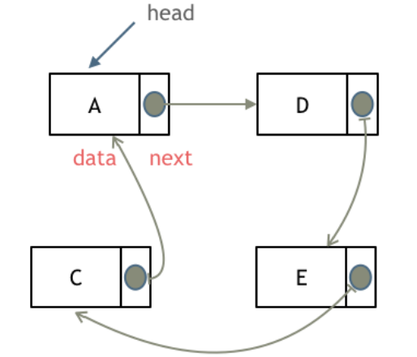
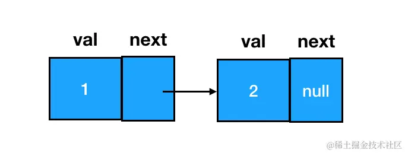
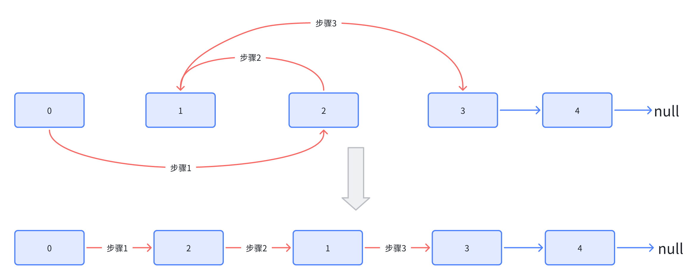
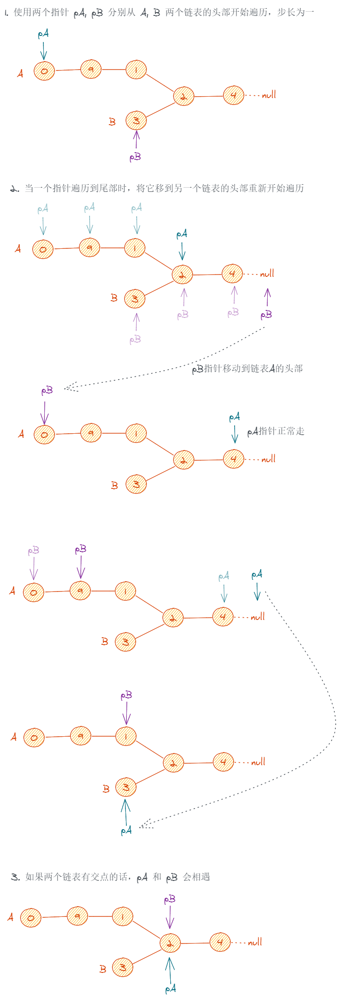
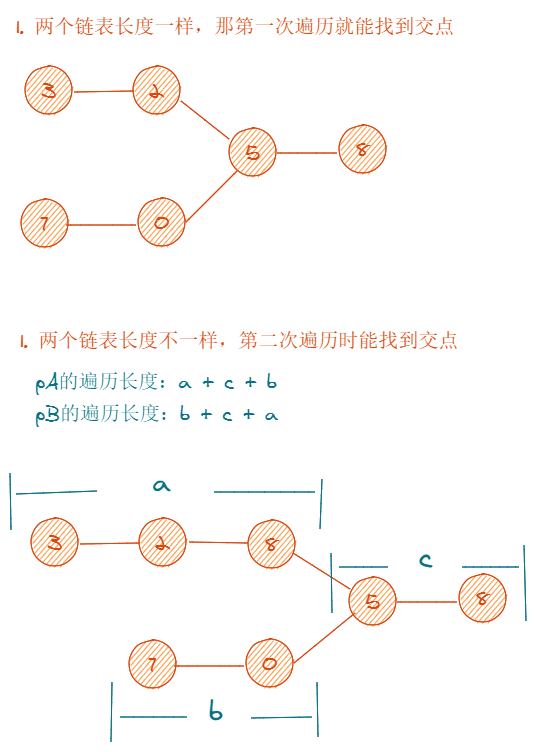

# 链表

## 链表理论基础

### 概念

链表是一种通过指针串联在一起的线性结构，每一个节点由两部分组成，一个是数据域一个是指针域（存放指向下一个节点的指针），最后一个节点的指针域指向 null（空指针的意思）。

链表在内存中不是连续分布的，各个节点分布在内存的不同地址空间上，通过指针串联在一起。

JS 中的链表，是以嵌套的对象的形式来实现的：

```js
{
    // 数据域
    val: 1,
    // 指针域，指向下一个结点
    next: {
        val:2,
        next: ...
    }
}
```


### 链表的类型

#### 单链表

每个结点只包含一个指针，指向下一个结点（上图所示）

#### 双链表

每一个节点有两个指针域，一个指向下一个节点，一个指向上一个节点。双链表既可以向前查询也可以向后查询。


#### 循环链表

循环链表，顾名思义，就是链表首尾相连。

循环链表可以用来解决约瑟夫环问题。



### 链表的定义

创建链表结点，咱们需要一个构造函数：

```js
function ListNode(val, next) {
  this.val = val === undefined ? 0 : val
  this.next = next === undefined ? null : next
}
```

在使用构造函数创建结点时，传入 val （数据域对应的值内容）、指定 next （下一个链表结点）即可：

```js
const node = new ListNode(1)
node.next = new ListNode(2)
```

以上，就创建出了一个数据域值为 1，next 结点数据域值为 2 的链表结点：



### 链表的操作

#### 删除节点

删除的标准是：在链表的遍历过程中，无法再遍历到某个结点的存在。按照这个标准，要想遍历不到 node3，我们直接让它的前驱结点 node1 的 next 指针跳过它、指向 node3 的后继即可：


```js
node1.next = node3.next
```

**这里注意**：在涉及链表删除操作的题目中，重点不是定位目标结点，而是定位目标结点的前驱结点。做题时，完全可以只使用一个指针（引用），这个指针用来定位目标结点的前驱结点。比如说咱们这个题里，其实只要能拿到 node1 就行了：

```js
// 利用 node1 可以定位到 node3
// target => node3
const target = node1.next
// node1.next => node3.next 也就是 node1 -> node2
node1.next = target.next
```

> 要是删除第五个节点（末尾），也就是需要从头节点查找到第四个节点通过 next 指针进行删除操作，**查找**的时间复杂度是`O(n)`。

#### 添加节点

例如：要把 node3 **添加**到 node2 所在链表的**尾部**，直接把 node2 的 next 指针指向 node3 即可：


如何在两个**结点间插入**一个结点？我们需要变更的是前驱结点和目标结点的 next 指针指向，过程如下图：

| 插入前                              | 插入后                              |
| ----------------------------------- | ----------------------------------- |
|  |  |

```js
// 如果目标结点本来不存在，那么记得手动创建
const node3 = new ListNode(3)
// 把node3的 next 指针指向 node2（即 node1.next）
node3.next = node1.next
// 把node1的 next 指针指向 node3
node1.next = node3
```

### 复杂度和适用场景

|      | 插入/删除（时间复杂度） | 查询（时间复杂度） | 适用场景                         |
| ---- | ----------------------- | ------------------ | -------------------------------- |
| 数组 | O(n)                    | O(1)               | 数据量固定，频繁查询，较少增删   |
| 链表 | O(1)                    | O(n)               | 数据量不固定，频繁增删，较少查询 |

## 1. 移除链表元素

<LeetCodeLink url="https://leetcode.cn/problems/remove-linked-list-elements/description/" />

给你一个链表的头节点 `head` 和一个整数 `val` ，请你删除链表中所有满足 `Node.val == val` 的节点，并返回新的头节点。

**示例 1**：


输入：`head = [1,2,6,3,4,5,6]`, `val = 6`  
输出：`[1,2,3,4,5]`

**示例 2**：

输入：`head = []`, `val = 1`  
输出：`[]`

**示例 3**：

输入：`head = [7,7,7,7]`, `val = 7`  
输出：`[]`

::: code-group

```md [思路]
链表移除元素，也就是访问不到该节点，可以将上一个节点的 next 指向该节点的 next.next，
这里有两种方法：

1. 直接使用原来的链表来进行删除操作，需要对头节点进行判断
2. 设置一个虚拟头结点在进行删除操作（推荐）
   ⚠️ 注意：如果使用第一种方法，如果头节点为空，可能导致链表不再指向有效的头部，所以一般推荐使用**虚拟头结点在进行删除操作**
```

```js [方法1：操作原来的链表]
/**
 * Definition for singly-linked list.
 * function ListNode(val, next) {
 *     this.val = (val===undefined ? 0 : val)
 *     this.next = (next===undefined ? null : next)
 * }
 */
/**
 * @param {ListNode} head
 * @param {number} val
 * @return {ListNode}
 */
var removeElements = function (head, val) {
  // 跳过头节点等于val的情况
  while (head && head.val === val) {
    head = head.next
  }
  let cur = head
  // cur和cur.next都不为null
  while (cur && cur.next) {
    if (cur.next.val === val) {
      cur.next = cur.next.next
    } else {
      cur = cur.next
    }
  }
  return head
}
```

```js [方法2：设置一个虚拟头结点进行删除]
/**
 * Definition for singly-linked list.
 * function ListNode(val, next) {
 *     this.val = (val===undefined ? 0 : val)
 *     this.next = (next===undefined ? null : next)
 * }
 */
/**
 * @param {ListNode} head
 * @param {number} val
 * @return {ListNode}
 */
var removeElements = function (head, val) {
  // 设置一个虚拟的头节点，这样就不用考虑head的头节点===val的情况了
  const pre = new ListNode(0, head)
  // 当前去操作这个虚拟的头节点链表，这样就不会破坏虚拟链表的引用
  let cur = pre
  while (cur !== null && cur.next !== null) {
    if (cur.next.val === val) {
      cur.next = cur.next.next
    } else {
      // 创建cur的原因就是因为该操作可能会破坏链表的引用
      cur = cur.next
    }
  }
  // pre.next 就是这里的 head
  return pre.next
  // 这里为什么不能return head？
  // 如果原始链表的第一个节点（即你传入的 head）的值等于 val，那么在循环中它会被删除，head 就不再指向有效的链表头部。（head头被删除了）
  // 而创建的虚拟节点 pre.next 始终指向当前有效的链表头
}
```

:::

## 2. 设计链表

<LeetCodeLink url="https://leetcode.cn/problems/design-linked-list/description/"/>

你可以选择使用单链表或者双链表，设计并实现自己的链表。

单链表中的节点应该具备两个属性：`val` 和 `next` 。`val` 是当前节点的值，`next` 是指向下一个节点的指针/引用。

如果是双向链表，则还需要属性 `prev` 以指示链表中的上一个节点。假设链表中的所有节点下标从 0 开始。

实现 `MyLinkedList` 类：

- `MyLinkedList()` 初始化 `MyLinkedList` 对象。
- `int get(int index)` 获取链表中下标为 `index` 的节点的值。如果下标无效，则返回 -1 。
- `void addAtHead(int val)` 将一个值为 `val` 的节点插入到链表中第一个元素之前。在插入完成后，新节点会成为链表的第一个节点。
- `void addAtTail(int val)` 将一个值为 `val` 的节点追加到链表中作为链表的最后一个元素。
- `void addAtIndex(int index, int val)` 将一个值为 `val` 的节点插入到链表中下标为 `index` 的节点之前。如果 `index` 等于链表的长度，那么该节点会被追加到链表的末尾。如果 `index` 比长度更大，该节点将**不会插入**到链表中。
- `void deleteAtIndex(int index)` 如果下标有效，则删除链表中下标为 `index` 的节点。

**示例**：

> **输入**
>
> ```
> ["MyLinkedList", "addAtHead", "addAtTail", "addAtIndex", "get", "deleteAtIndex", "get"]
> [[], [1], [3], [1, 2], [1], [1], [1]]
> ```
>
> **输出**
>
> ```
> [null, null, null, null, 2, null, 3]
> ```
>
> **解释**
>
> ```
> MyLinkedList myLinkedList = new MyLinkedList();
> myLinkedList.addAtHead(1);
> myLinkedList.addAtTail(3);
> myLinkedList.addAtIndex(1, 2);  // 链表变为 1->2->3
> myLinkedList.get(1);            // 返回 2
> myLinkedList.deleteAtIndex(1);  // 现在，链表变为 1->3
> myLinkedList.get(1);            // 返回 3
> ```

::: details **初始化代码**

```js
var MyLinkedList = function () {}

/**
 * @param {number} index
 * @return {number}
 */
MyLinkedList.prototype.get = function (index) {}

/**
 * @param {number} val
 * @return {void}
 */
MyLinkedList.prototype.addAtHead = function (val) {}

/**
 * @param {number} val
 * @return {void}
 */
MyLinkedList.prototype.addAtTail = function (val) {}

/**
 * @param {number} index
 * @param {number} val
 * @return {void}
 */
MyLinkedList.prototype.addAtIndex = function (index, val) {}

/**
 * @param {number} index
 * @return {void}
 */
MyLinkedList.prototype.deleteAtIndex = function (index) {}

/**
 * Your MyLinkedList object will be instantiated and called as such:
 * var obj = new MyLinkedList()
 * var param_1 = obj.get(index)
 * obj.addAtHead(val)
 * obj.addAtTail(val)
 * obj.addAtIndex(index,val)
 * obj.deleteAtIndex(index)
 */
```

:::

::: code-group

```md [思路]
这个题的核心在于需要自己手动构建链表节点结构

还需要记住如何进行节点的获取，节点删除，节点新增的即可写出来
```

```js [代码]
// 创建单个节点
var ListNode = function (val) {
  this.val = val
  this.next = null
}

var MyLinkedList = function () {
  // 定义头节点，不用 this.next，为了方便区分
  this.head = null
  this.count = 0
}

MyLinkedList.prototype.getNode = function (index) {
  /**
        index >= this.count 而不是 index > this.count，例如：
        假设链表中有 3 个节点（count = 3）：
        0	第一个节点
        1	第二个节点
        2	第三个节点
        所以 index === this.count 时，这个索引 已经超出了最后一个节点的范围
    */
  if (index < 0 || index >= this.count) {
    return null
  }
  let cur = new ListNode(0)
  cur.next = this.head
  // i <= index，因为 i = 0 是虚拟头节点
  for (let i = 0; i <= index; i++) {
    cur = cur.next
  }
  return cur
}

/**
 * @param {number} index
 * @return {number}
 */
MyLinkedList.prototype.get = function (index) {
  let node = this.getNode(index)
  return node ? node.val : -1
}

/**
 * @param {number} val
 * @return {void}
 */
MyLinkedList.prototype.addAtHead = function (val) {
  let node = new ListNode(val)
  if (this.count > 0) {
    node.next = this.head
  }
  this.head = node
  this.count++
}

/**
 * @param {number} val
 * @return {void}
 */
MyLinkedList.prototype.addAtTail = function (val) {
  // 新增的最后一个节点
  let node = new ListNode(val)
  if (this.count === 0) {
    this.head = node
  } else {
    let cur = this.head
    while (cur !== null && cur.next !== null) {
      cur = cur.next
    }
    cur.next = node
  }
  this.count++
}

/**
 * @param {number} index
 * @param {number} val
 * @return {void}
 */
MyLinkedList.prototype.addAtIndex = function (index, val) {
  // 不符合插入条件的
  if (index > this.count || index < 0) {
    return
  }
  // 插入开头
  if (index === 0) {
    this.addAtHead(val)
  }
  // 插入末尾
  else if (index === this.count) {
    this.addAtTail(val)
  }
  // 正常插入
  else {
    // 上一个节点
    let preNode = this.getNode(index - 1)
    // 下一个节点
    let nextNode = preNode.next
    let node = new ListNode(val)
    node.next = nextNode
    preNode.next = node
    this.count++
  }
}

/**
 * @param {number} index
 * @return {void}
 */
MyLinkedList.prototype.deleteAtIndex = function (index) {
  // index < 0 而不是 <= 0，因为在 this.getNode 方法中，最后return是包含虚拟节点0的头元素
  /**
        index >= this.count 而不是 index > this.count，例如：
        假设链表中有 3 个节点（count = 3）：
        0	第一个节点
        1	第二个节点
        2	第三个节点
        所以 index === this.count 时，这个索引 已经超出了最后一个节点的范围
    */
  if (index < 0 && index >= this.count) {
    return
  }
  if (index === 0) {
    this.head = this.head.next
  } else {
    let preNode = this.getNode(index - 1)
    preNode.next = preNode.next.next
  }
  this.count--
}

/**
 * Your MyLinkedList object will be instantiated and called as such:
 * var obj = new MyLinkedList()
 * var param_1 = obj.get(index)
 * obj.addAtHead(val)
 * obj.addAtTail(val)
 * obj.addAtIndex(index,val)
 * obj.deleteAtIndex(index)
 */
```

:::

## 3. 反转链表

<LeetCodeLink url="https://leetcode.cn/problems/reverse-linked-list/description/" />

给你单链表的头节点 head ，请你反转链表，并返回反转后的链表。

**示例**：


> 输入：head = [1,2,3,4,5]
>
> 输出：[5,4,3,2,1]

[视频讲解链接](https://www.bilibili.com/video/BV1nB4y1i7eL/?vd_source=cf4f28ce42db1c09e7c6e81596a56338)

::: code-group

```md [思路]
做这道题我们要清楚他的反转过程：
前 ⬇️ 头节点  
 -> -> -> ->
1 2 3 4 null
后 null <- <- <- <- ⬆️ 头节点

可以采用**双指针**来解决：

1. 初始化：定义一个指针 `cur`，初始化指向 `head` 头节点，再定义一个指针 `pre`。
   可以想象成 `cur` 的前一个节点是 `pre`，此时的 `pre` 充当尾节点，初始化为 `null`（因为由上面流程可知，“前”的头节点的前为 null）。

2. 循环：当 `cur` 节点不为 null 时，执行循环。循环条件 `cur !== null` 原因如下：
   例如：当 cur 执行到节点 4 的时候，pre 还在 3：
   pre⬇️ ⬇️cur
   -> -> -> ->
   1 2 3 4 null
   当 pre 移动到 4 的时候，cur 为 null，此时循环结束
   pre⬇️ ⬇️cur
   -> -> -> ->
   1 2 3 4 null

3. 反转：当 cur 反转指向 pre 的时候，cur 和后面的节点就断开连接了。所以在反转前，需要使用一个临时变量 tmp 将后续的节点连接保存起来。
   pre⬇️ ⬇️cur
   <- ❌ -> -> ->
   null 1 2 3 4 null
   也就是：`let tmp = cur.next`（在赋值前，cur 与下一个节点 cur.next 还有联系的时候用 tmp 保存）
   `cur.next = pre` // 这步就是在将 cur 执行 pre，也就是反转操作
   `pre = cur` // 可以理解为将反转好的节点进行保存
   `cur = tmp` // cur 与之前断开出保持连接，进行下一次循环
```

```js [方法1：双指针写法]
/**
 * Definition for singly-linked list.
 * function ListNode(val, next) {
 *     this.val = (val===undefined ? 0 : val)
 *     this.next = (next===undefined ? null : next)
 * }
 */
/**
 * @param {ListNode} head
 * @return {ListNode}
 */
var reverseList = function (head) {
  let cur = head
  let pre = null
  while (cur !== null) {
    let tmp = cur.next
    cur.next = pre
    pre = cur
    cur = tmp
  }
  return pre
}
```

```js [方法2：递归]
// 和双指针一样，只是循环过程变成了递归
var reverse = function (pre, head) {
  if (!head) return pre
  const temp = head.next
  head.next = pre
  pre = head
  return reverse(pre, temp)
}

var reverseList = function (head) {
  return reverse(null, head)
}
```

:::

## 4. 两两交换链表中的节点

<LeetCodeLink url="https://leetcode.cn/problems/swap-nodes-in-pairs/description/" />

给你一个链表，两两交换其中相邻的节点，并返回交换后链表的头节点。你必须在不修改节点内部的值的情况下完成本题（即，只能进行节点交换）。

**示例 1**：


输入：head = [1,2,3,4]
输出：[2,1,4,3]

**示例 2**：

输入：head = []
输出：[]

**示例 3**：

输入：head = [1]
输出：[1]

::: code-group

```md [思路]
建议使用虚拟头结点，这样会方便很多，要不然每次针对头结点（没有前一个指针指向头结点），还要单独处理。
接下来就是交换相邻两个元素了，具体过程可以看下图
也就是由原来的 node0 -> node1 -> node2 -> node3
变为：node0 -> node2 -> node1 -> node3
```

```js [代码]
/**
 * Definition for singly-linked list.
 * function ListNode(val, next) {
 *     this.val = (val===undefined ? 0 : val)
 *     this.next = (next===undefined ? null : next)
 * }
 */
/**
 * @param {ListNode} head
 * @return {ListNode}
 */
var swapPairs = function (head) {
  let cur = new ListNode(0, head)
  let node0 = cur
  // 确保
  while (node0.next && node0.next.next) {
    let node1 = node0.next
    let node2 = node1.next
    let node3 = node2.next

    node0.next = node2 // 0 -> 2
    node2.next = node1 // 2 -> 1
    node1.next = node3 // 1 -> 3

    // 下一轮 哨兵节点0的对应第二轮的是转换后的node1（如图），依次后推
    node0 = node1
  }
  return cur.next
}
```

:::



## 5. 删除链表的倒数第 N 个结点

<LeetCodeLink url="https://leetcode.cn/problems/remove-nth-node-from-end-of-list/description/" />

给你一个链表，删除链表的倒数第 n 个结点，并且返回链表的头结点。

**示例 1**：


输入：`head = [1,2,3,4,5], n = 2`  
输出：`[1,2,3,5]`

**示例 2**：

输入：`head = [1], n = 1`  
输出：`[]`

**示例 3**：

输入：`head = [1,2], n = 1`  
输出：`[1]`

::: code-group

```md [思路]
这个题本质来说就是一个数学问题，可以采用**双指针**来解决

1. 定义两个指针，fast 指针先移动 n 步，然后 fast、slow 两个指针同时移动，当 fast 指针到达末尾时，slow 指针指向的节点就是倒数第 n 个节点
   （因为 fast 指针先移动 n 步，这 n 步也就是 fast 和 slow 指针之间的距离，然后一起移动，等 fast 到末尾时，相当于从尾部数 n 个节点，这个 n 就对应 fast 和 slow 的距离）
2. 需要注意的是，当 fast 先移动 n，如果 n 等于链表总节点数（也就是 fast 已经走到末尾了），需要删除的节点为头结点，此时返回 head.next
   （如果采用哨兵节点，则不需要判断头节点情况）
```

```js [代码1：操作原链表]
/**
 * Definition for singly-linked list.
 * function ListNode(val, next) {
 *     this.val = (val===undefined ? 0 : val)
 *     this.next = (next===undefined ? null : next)
 * }
 */
/**
 * @param {ListNode} head
 * @param {number} n
 * @return {ListNode}
 */
var removeNthFromEnd = function (head, n) {
  let fast = head
  let slow = head
  while (n--) {
    fast = fast.next
  }

  // 如果fast === null，表示fast已经移动到末尾了，表示这个n为整个链表的总结点个数，删除元素为首元素
  if (fast === null) {
    return head.next
  }

  // 同时移动
  while (fast && fast.next) {
    fast = fast.next
    slow = slow.next
  }

  slow.next = slow.next.next

  return head
}
```

```js [代码2：操作哨兵链表]
/**
 * Definition for singly-linked list.
 * function ListNode(val, next) {
 *     this.val = (val===undefined ? 0 : val)
 *     this.next = (next===undefined ? null : next)
 * }
 */
/**
 * @param {ListNode} head
 * @param {number} n
 * @return {ListNode}
 */
var removeNthFromEnd = function (head, n) {
  let cur = new ListNode(0, head)
  let fast = cur
  let slow = cur
  while (n--) {
    fast = fast.next
  }

  while (fast && fast.next) {
    fast = fast.next
    slow = slow.next
  }

  slow.next = slow.next.next

  return cur.next
}
```

:::

## 6. 相交链表

<LeetCodeLink url="https://leetcode.cn/problems/intersection-of-two-linked-lists/description/" />

给你两个单链表的头节点 `headA` 和 `headB` ，请你找出并返回两个单链表相交的起始节点。如果两个链表不存在相交节点，返回 `null` 。

图示两个链表在节点 `c1` 开始相交：

题目数据 **保证** 整个链式结构中不存在环。

注意，函数返回结果后，链表必须 **保持其原始结构** 。

**自定义评测**：

**评测系统**的输入如下（你设计的程序 **不适用** 此输入）：

- `intersectVal` - 相交的起始节点的值。如果不存在相交节点，这一值为 `0`
- `listA` - 第一个链表
- `listB` - 第二个链表
- `skipA` - 在 `listA` 中（从头节点开始）跳到交叉节点的节点数
- `skipB` - 在 `listB` 中（从头节点开始）跳到交叉节点的节点数

评测系统将根据这些输入创建链式数据结构，并将两个头节点 `headA` 和 `headB` 传递给你的程序。如果程序能够正确返回相交节点，那么你的解决方案将被 **视作正确答案** 。

**示例 1**：


> **输入**：`intersectVal = 8, listA = [4,1,8,4,5], listB = [5,6,1,8,4,5], skipA = 2, skipB = 3`
>
> **输出**：`Intersected at '8'`
>
> **解释**：
>
> 相交节点的值为 `8` （注意，如果两个链表相交则不能为 `0`）。
>
> 从各自的表头开始算起，链表 `A` 为 `[4,1,8,4,5]`，链表 `B` 为 `[5,6,1,8,4,5]`。
>
> 在 `A` 中，相交节点前有 `2` 个节点；在 `B` 中，相交节点前有 `3` 个节点。
>
> - 请注意相交节点的值不为 `1`，因为在链表 `A` 和链表 `B` 之中值为 `1` 的节点（`A` 中第二个节点和 `B` 中第三个节点）是不同的节点。换句话说，它们在内存中指向两个不同的位置，而链表 `A` 和链表 `B` 中值为 `8` 的节点（`A` 中第三个节点，`B` 中第四个节点）在内存中指向相同的位置。

**示例 2**：


> **输入**：`intersectVal = 2, listA = [1,9,1,2,4], listB = [3,2,4], skipA = 3, skipB = 1`
>
> **输出**：`Intersected at '2'`
>
> **解释**：
>
> 相交节点的值为 `2` （注意，如果两个链表相交则不能为 `0`）。
>
> 从各自的表头开始算起，链表 `A` 为 `[1,9,1,2,4]`，链表 `B` 为 `[3,2,4]`。
>
> 在 `A` 中，相交节点前有 `3` 个节点；在 `B` 中，相交节点前有 `1` 个节点。

**示例 3**：


> **输入**：`intersectVal = 0, listA = [2,6,4], listB = [1,5], skipA = 3, skipB = 2`
>
> **输出**：`No intersection`
>
> **解释**：
>
> 从各自的表头开始算起，链表 `A` 为 `[2,6,4]`，链表 `B` 为 `[1,5]`。
>
> 由于这两个链表不相交，所以 `intersectVal` 必须为 `0`，而 `skipA` 和 `skipB` 可以是任意值。
>
> 这两个链表不相交，因此返回 `null` 。

::: code-group

```md [思路]
题中说的相交，不是节点的值相等，而是两个节点的引用相等。

这个题有三种解法：

1. 暴力解法
2. 哈希表
3. 双指针（思路新奇）

**暴力解法**：
对于链表 A 的每个节点，都去链表 B 中遍历一遍找看看有没有相同的节点

**哈希表**：

- 先遍历一遍链表 A，用哈希表把每个节点都记录下来(注意要存节点引用而不是节点值)
- 再去遍历链表 B，找到在哈希表中出现过的节点即为两个链表的交点

**双指针**：

- 使用两个指针 pA 和 pB，分别指向链表 A 和链表 B 的头结点开始遍历，步长为 1
- 当一个指针遍历到尾部时，将它移到另一个链表的头部重新开始遍历
- 如果两个链表有交点，那么两个指针最终会指向同一个节点（也就是相遇）
  （过程如下图）

1. 如果两个链表长度相同，在第一次遍历就能找到交点（过程如下）
2. 如果长度不同，在第二次遍历也能找到交点（过程如下）
   pA 遍历的长度：a+c+b
   pB 遍历的长度：b+c+a
3. 如果没有交点，遍历结束都返回 null，结束遍历
```

```js [暴力解法]
/**
 * @param {ListNode} headA
 * @param {ListNode} headB
 * @return {ListNode}
 */
var getIntersectionNode = function (headA, headB) {
  if (!headA || !headB) return null
  let pA = headA
  while (pA) {
    let pB = headB
    while (pB) {
      if (pA === pB) return pB
      pB = pB.next
    }
    pA = pA.next
  }
  return null
}
```

```js [哈希表法]
/**
 * @param {ListNode} headA
 * @param {ListNode} headB
 * @return {ListNode}
 */
var getIntersectionNode = function (headA, headB) {
  if (!headA || !headB) return null
  const hashMap = new Map()

  let pA = headA
  while (pA) {
    hashMap.set(pA, 1)
    pA = pA.next
  }

  let pB = headB
  while (pB) {
    if (hashMap.has(pB)) {
      return pB
    }
    pB = pB.next
  }

  return null
}
```

```js [双指针法]
var getIntersectionNode = function (headA, headB) {
  if (!headA || !headB) return null

  let pA = headA,
    pB = headB
  while (pA !== pB) {
    pA = pA === null ? headB : pA.next
    pB = pB === null ? headA : pB.next
  }
  return pA
}
```

:::

::: details 双指针法遍历过程



:::

::: details 双指针法判断交点



:::

## 7. 环形链表 II

<LeetCodeLink url="https://leetcode.cn/problems/linked-list-cycle-ii/description/" />

给定一个链表的头节点 `head` ，返回链表开始入环的第一个节点。如果链表无环，则返回 `null`

如果链表中有某个节点，可以通过连续跟踪 `next` 指针再次次到达，则链表中存在环。为了表示给定链表中的环，评测系统内部使用整数 `pos` 来表示链表尾连接到链表中的位置（索引从 **0** 开始）。如果 `pos` 是 `-1` ，则在该链表中没有环。**注意**：`pos` 不作为参数进行传递，仅仅是为了标识链表的实际情况。  

**不允许修改** 链表。

**示例 1**：


**输入**：`head = [3,2,0,-4], pos = 1`  
**输出**：返回索引为 `1` 的链表节点  
**解释**：链表中有一个环，其尾部连接到第二个节点。  

**示例 2**：


**输入**：`head = [1,2], pos = 0`  
**输出**：返回索引为 `0` 的链表节点  
**解释**：链表中有一个环，其尾部连接到第一个节点。  

**示例 3**：


**输入**：`head = [1], pos = -1`  
**输出**：返回 `null`  
**解释**：链表中没有环。  

https://leetcode.cn/problems/linked-list-cycle-ii/solutions/1083013/tu-jie-kuai-man-zhi-zhen-ji-qiao-yuan-li-5tz0

## 8. 合并两个有序链表

<LeetCodeLink url="https://leetcode.cn/problems/merge-two-sorted-lists/description/?envType=study-plan-v2&envId=top-100-liked" />

