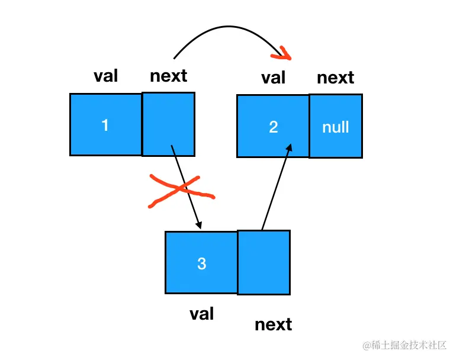
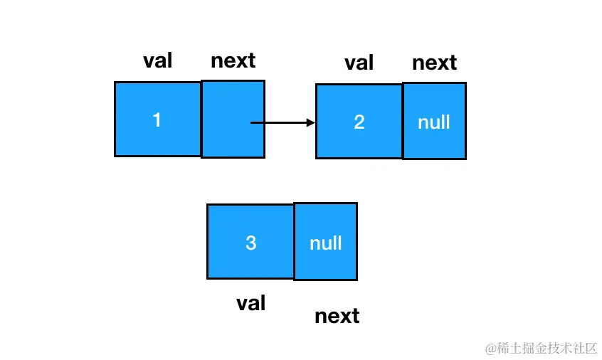

# 链表

## 链表理论基础

### 概念

链表是一种通过指针串联在一起的线性结构，每一个节点由两部分组成，一个是数据域一个是指针域（存放指向下一个节点的指针），最后一个节点的指针域指向 null（空指针的意思）。

链表在内存中不是连续分布的，各个节点分布在内存的不同地址空间上，通过指针串联在一起。

JS 中的链表，是以嵌套的对象的形式来实现的：

```js
{
    // 数据域
    val: 1,
    // 指针域，指向下一个结点
    next: {
        val:2,
        next: ...
    }
}
```


### 链表的类型

#### 单链表

每个结点只包含一个指针，指向下一个结点（上图所示）

#### 双链表

每一个节点有两个指针域，一个指向下一个节点，一个指向上一个节点。双链表既可以向前查询也可以向后查询。


#### 循环链表

循环链表，顾名思义，就是链表首尾相连。

循环链表可以用来解决约瑟夫环问题。


### 链表的定义

创建链表结点，咱们需要一个构造函数：

```js
function ListNode(val, next) {
  this.val = val === undefined ? 0 : val
  this.next = next === undefined ? null : next
}
```

在使用构造函数创建结点时，传入 val （数据域对应的值内容）、指定 next （下一个链表结点）即可：

```js
const node = new ListNode(1)
node.next = new ListNode(2)
```

以上，就创建出了一个数据域值为 1，next 结点数据域值为 2 的链表结点：


### 链表的操作

#### 删除节点

删除的标准是：在链表的遍历过程中，无法再遍历到某个结点的存在。按照这个标准，要想遍历不到 node3，我们直接让它的前驱结点 node1 的 next 指针跳过它、指向 node3 的后继即可：



```js
node1.next = node3.next
```

**这里注意**：在涉及链表删除操作的题目中，重点不是定位目标结点，而是定位目标结点的前驱结点。做题时，完全可以只使用一个指针（引用），这个指针用来定位目标结点的前驱结点。比如说咱们这个题里，其实只要能拿到 node1 就行了：

```js
// 利用 node1 可以定位到 node3
// target => node2
const target = node1.next
// node1.next => node3.next
node1.next = target.next
```

> 要是删除第五个节点（末尾），也就是需要从头节点查找到第四个节点通过 next 指针进行删除操作，**查找**的时间复杂度是`O(n)`。

#### 添加节点

例如：要把 node3 **添加**到 node2 所在链表的**尾部**，直接把 node2 的 next 指针指向 node3 即可：


如何在两个**结点间插入**一个结点？我们需要变更的是前驱结点和目标结点的 next 指针指向，过程如下图：

| 插入前                              | 插入后                              |
| ----------------------------------- | ----------------------------------- |
|  |  |

```js
// 如果目标结点本来不存在，那么记得手动创建
const node3 = new ListNode(3)
// 把node3的 next 指针指向 node2（即 node1.next）
node3.next = node1.next
// 把node1的 next 指针指向 node3
node1.next = node3
```

### 复杂度和适用场景

|      | 插入/删除（时间复杂度） | 查询（时间复杂度） | 适用场景                         |
| ---- | ----------------------- | ------------------ | -------------------------------- |
| 数组 | O(n)                    | O(1)               | 数据量固定，频繁查询，较少增删   |
| 链表 | O(1)                    | O(n)               | 数据量不固定，频繁增删，较少查询 |

## 1. 移除链表元素

<LeetCodeLink url="https://leetcode.cn/problems/remove-linked-list-elements/description/" />
