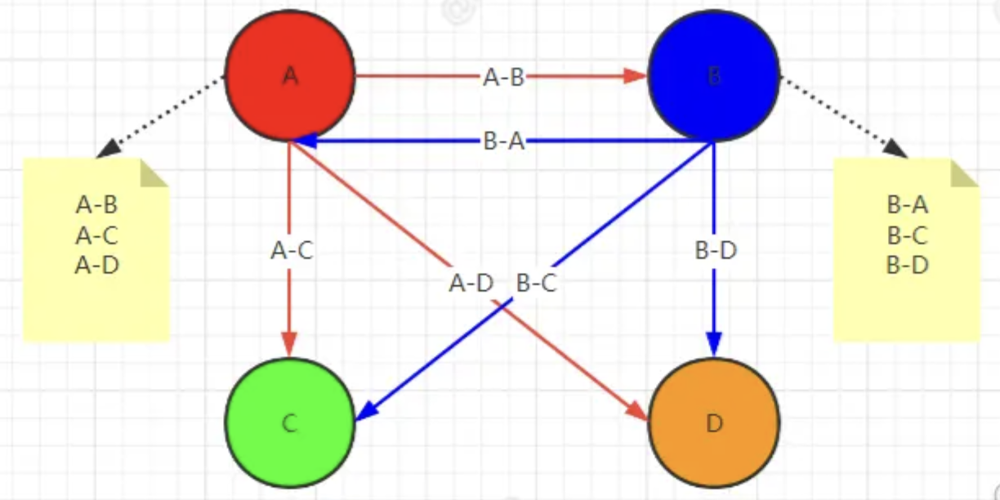

# wxg-微信公众号面经

## 开篇

1、自我介绍

2、工作经历有什么特殊的，学到了哪些前端知识

- 公司采用 jsp -> uniapp，通过嵌套方式，了解了微前端的概念
- 打包到 ios 和安卓，体验了 ios 真机打包
- 公司 2: 无亮点，主要是业务开发（有分包，但是我没看过）

3、简历技术栈比较新，是如何去规划学习路线的

## 基础八股

1、浏览器输入 url 到页面显示的过程

2、请求静态资源时，可能会产生跨域，说说什么是跨域，为什么会产生跨域，如何解决的？

- 回答的时候把浏览器发送预检请求一起答了

3、上面回答不同域会产生安全问题，详细说说这个安全问题包括什么？

- csrf
- xss

4、csrf 提到 cookie，问浏览器有哪些存储方式，不同点是什么？

5、聊聊状态码

- 1xx-5xx，1xx 不知道

6、你在请求中 headers 常用的是哪些？

- Authorization
- cookie
- origin
- http options 的：access-control-request-method
- 升级 socket 的一些字段：版本，是否升级等

7、说说对 websocket 的了解

8、http2 和 http1 的区别

9、对 es6 的理解

- 新增语法和 api
- 简化开发，esm、es5 的继承使用原型链，es6 使用 class

10、块级作用域的理解

11、闭包

## 手撕

1、深拷贝

2、有效括号字符串验证

## 项目

一、低代码项目

1、用了什么库，技术栈？

- 顺便说了项目结构，但是没说核心的 json schema 部分（回答的不是很好，回答的是一些什么 vue、element plus 库感觉有点捞）

2、项目写了 cdn 优化，如何实现的？

- 项目打包上线后，发现页面加载白屏时间过长，通过依赖检查工具，发现大部分首包内容第三方库的依赖比较大（路由懒加载已经分包过了），将第三方库排除在外（例如 hightjs、vue），使用 vite 的 cdn 插件去实现 cdn 加载第三方库。

3、项目中 jwt 如何实现的？

- 结合了 nest 封装的注解回答的，前后端都有

4、权限如何实现，颗粒度到什么层度？

- 基于 RBAC 角色权限模型，回答了路由拦截、不同身份的动态路由、自定义指令实现按钮权限

二、markdown 编辑器项目

1、ast 解析如何实现的

三、桌面端 im

1、是如何想到要做这个的？

2、webrtc 性能是如何解决的？

- 在多人视频聊天中，通过遍历实现的 p2p 通话会很卡
- 项目没有实现，解决办法：通过服务器来对每个用户进行连接

::: tip 答案

### 多房间多用户通话方案

#### 方案 1：（不推荐）

假设有 A、B、C、D 四个人需要参会，**但是 WebRTC 仅支持 P2P**，那么 A 如果要和剩下的三个人视频通话，就必须和他们三个人都建立关联，也就是形成`A-B`，`A-C`，`A-D`的关联关系。



缺点：如果直播间人数很多，那么在主播的浏览器中维护了大量的`new RTCPeerConnection`实例，当直播间几万人甚至几十万，那主播的浏览器内存会炸掉，毕竟 RTCPeer 的实例太多。

#### 方案 2：

使用流媒体 MCU（多点控制单元）架构，主播只需将自己的音视频流推送到 MCU 服务器，观众则从 MCU 服务器订阅并接收这些流，这样主播和观众都只需与 MCU 服务器建立连接，大大减轻了主播端的负担。

拿 `mediasoup`库举例： 在服务器端会使用 WebRTC 技术来实现媒体流的处理和传输。也就是主播和观众都是通过与服务器进行连接的，观众的视频也是通过服务器来获取视频流的。

:::

3、p2p 通话是否要 2 个人都在线才行？

- 需要，私聊一个不在会自动挂断，群聊不会

4、消息如何存储？

- 本地+后端

5、mac 和 win 做了哪些兼容性处理？

- 主要是判断系统，做出细调
- （这个没答：好像 mac 写了一个 xml 的内容来提供摄像头访问权限弹窗）

::: tip 答案

### 兼容性处理

#### 一、摄像头权限

Mac 系统会弹出权限确认窗口，让用户决定是否允许应用访问摄像头。这是因为 Mac 的安全机制更为严格，在应用尝试访问敏感硬件（如摄像头、麦克风等）时，系统会要求用户明确授权，从而保护用户的隐私。需要在打包的时候配置 `entitlements.mac.plist` 文件，以请求摄像头权限，不然后续的摄像头操作可能会失败。

```xml
<?xml version="1.0" encoding="UTF-8"?>
<!DOCTYPE plist PUBLIC "-//Apple//DTD PLIST 1.0//EN" "http://www.apple.com/DTDs/PropertyList-1.0.dtd">
<plist version="1.0">
  <dict>
    <key>com.apple.security.cs.allow-jit</key>
    <true/>
    <key>com.apple.security.cs.allow-unsigned-executable-memory</key>
    <true/>
    <key>com.apple.security.cs.allow-dyld-environment-variables</key>
    <true/>
    <key>com.apple.security.device.audio-input</key>
    <true/>
    <key>com.apple.security.device.camera</key>
    <true/>
  </dict>
</plist>
```

---

```json
{
  "build": {
    "mac": {
      "target": ["dmg", "zip"],
      "entitlements": "scripts/entitlements.mac.plist",
      "hardenedRuntime": true,
      "extendInfo": {
        "NSMicrophoneUsageDescription": "请允许访问您的麦克风",
        "NSCameraUsageDescription": "请允许访问您的摄像头"
      }
    }
  }
}
```

Windows 系统的权限管理相对宽松。默认情况下，应用并不会直接获取摄像头权限。当应用尝试访问摄像头时，系统会在任务栏附近弹出一个小的提示框，提示用户应用正在请求访问摄像头，用户需要在提示框中进行确认操作，才能允许应用访问摄像头。

#### 二、win 打包后包内容大小调整

在 windows 平台，打包完成后会有很多不需要的文件，其中 locales 是多语言的配置，36MB，我的应用不需要多语言，因此把除中文的全部排除

```js
const path = require('path')
const fs = require('fs-extra')

module.exports = async (context) => {
  if (process.platform === 'darwin') return
  const unpackedDir = path.join(context.appOutDir, 'locales')

  // 删除除 zh-CN.pak 之外的所有文件
  const files = await fs.readdir(unpackedDir)
  for (const file of files) {
    if (!file.endsWith('zh-CN.pak')) {
      await fs.remove(path.join(unpackedDir, file))
    }
  }

  // 删除特定的文件
  const filesToDelete = ['LICENSE.electron.txt', 'LICENSES.chromium.html']

  for (const fileName of filesToDelete) {
    const filePath = path.join(context.appOutDir, fileName)
    if (await fs.pathExists(filePath)) {
      await fs.remove(filePath)
    }
  }
}
```

---

```json
{
  "build": {
    "afterPack": "scripts/afterPack.js"
  }
}
```

:::

6、软件后续更新功能？

- 未实现，不了解

::: tip 答案

**方案一、使用 `electron-updater`**

electron-builder 是一个流行的 Electron 打包工具，内置了 electron-updater 模块，支持增量更新。

```js
// autoUpdater.js
const path = require('path')
// 需要安装
const { autoUpdater } = require('electron-updater')

module.exports = (url, win) => {
  // latest.yml 线上
  autoUpdater.updateConfigPath = path.join(
    __dirname,
    process.env.NODE_ENV === 'development' ? 'latest.yml' : '../app-update.yml'
  )

  // 设置更新源url
  autoUpdater.setFeedURL(url)

  //检查是否有更新
  autoUpdater.checkForUpdates()

  // 更新异常
  autoUpdater.on('error', function (e, message) {
    win.send('error', message)
  })

  //有新版本时
  autoUpdater.on('update-available', function (e, message) {
    win.send('update-available', message)
  })

  // 更新下载进度事件
  autoUpdater.on('download-progress', function (e, progressObj) {
    win.send('download-progress', e.percent)
  })

  // 更新下载完成事件
  autoUpdater.on('update-downloaded', function (e, progressObj) {
    win.send('update-downloaded', progressObj)
    autoUpdater.quitAndInstall()
  })

  //没有新版本时
  autoUpdater.on('update-not-available', (_info) => {
    console.log('没有更新')
  })
}
```

**方案二、手动实现增量更新**

步骤：

- 检测新版本：

  - 在客户端请求服务器接口，获取最新版本信息。
  - 对比本地版本和服务器版本，判断是否需要更新。

- 下载增量包：

  - 从服务器下载差异文件（如 .zip 或 .patch 文件）。
  - 可以使用 axios 或 node-fetch 下载文件。

- 应用更新：

  - 使用 fs 模块解压或替换文件。
  - 重启应用以应用更新。

```js
const fs = require('fs')
const path = require('path')
const { app } = require('electron')
const axios = require('axios')
const extract = require('extract-zip')

async function checkForUpdates() {
  const localVersion = app.getVersion()
  const { data: remoteVersion } = await axios.get(
    'https://your-server.com/version'
  )

  if (remoteVersion > localVersion) {
    const updateUrl = 'https://your-server.com/update.zip'
    const updatePath = path.join(app.getPath('temp'), 'update.zip')
    const extractPath = app.getAppPath()

    // 下载更新包
    const response = await axios.get(updateUrl, { responseType: 'stream' })
    response.data.pipe(fs.createWriteStream(updatePath))

    response.data.on('end', async () => {
      // 解压更新包
      await extract(updatePath, { dir: extractPath })
      // 重启应用
      app.relaunch()
      app.quit()
    })
  }
}

app.on('ready', () => {
  checkForUpdates()
})
```

:::
