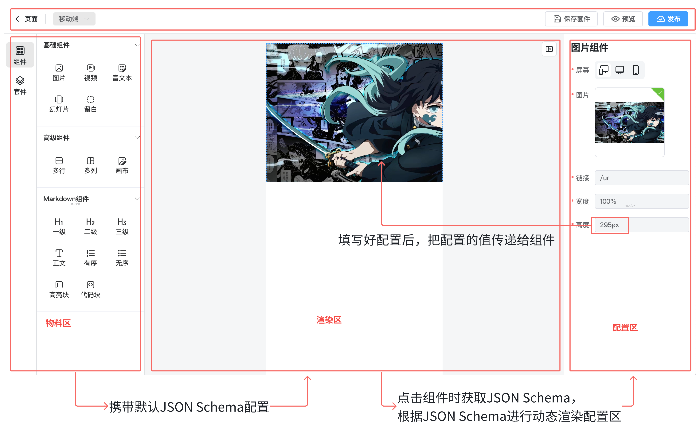

# 低代码数据协议、物料渲染、vue-demi

## 低代码数据协议



低代码的核心是物料的数据结构，可以使用 JSON，因为 JSON 数据前后端通用。

该项目采用 JSON Schema 代替普通 JSON 数据，JSON Schema 提供了一种标准化的方式来**定义**和**验证** JSON 数据的结构和内容。

> JSON Schema 本质就是 JSON，只是有一定的规范。

## 为什么采用 @sinclair/typebox 库来定义 JSON Schema，而不采用 .json 文件？

> @sinclair/typebox 库是一个 TypeScript 库，用于定义和验证 JSON Schema。它提供了一种类型安全的方式来定义和验证 JSON 数据的结构和内容，并支持多种数据类型，如字符串、数字、布尔值、数组、对象等。

因为这个库有更好的类型提示，更方便操作。

## 物料渲染

通过 vue 的动态组件，循环 pinia 中的物料数据，物料组件数据从物料组件库全局安装使用

## 为什么选择 vue-demi 来进行多版本组件库打包？

物料组件库导出了渲染容器，如果需要单独渲染，可以拿到 json，在 vue2 和 vue3 版本进行单独渲染。

## vue-demi 的坑

### 问题 1

在进行多版本打包时，vue 的版本会错乱，这时候就需要根据 pnpm 中`packageExtensions`对 vue 版本进行覆盖

> 在 pnpm 中，packageExtensions 的作用是对 package.json 文件中的依赖进行扩展或覆盖，而无需直接修改项目的 package.json 文件。它允许你在全局或局部范围内自定义依赖的版本、配置等信息，而不影响原始项目的文件内容。

```json [根目录/package.json]
{
  "pnpm": {
    "packageExtensions": {
      "vue-template-compiler": {
        "peerDependencies": {
          "vue": "^2.7.16"
        }
      },
      "vue-template-compiler@2.7.16": {
        "peerDependencies": {
          "vue": "^2.7.16"
        }
      }
    }
  },
  "devDependencies": {}
}
```

### 问题 2

`vue-demi` 的 SFC 模版问题，需要采用选项式 api 才能实现，组合式 api 在 vue2 版本可能有 bug，导致内容出不来
