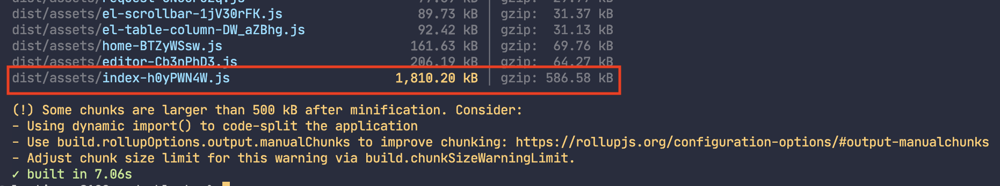
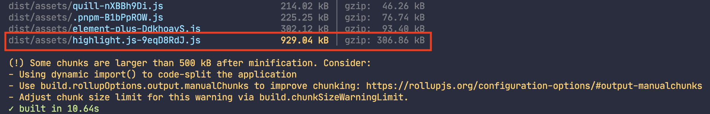
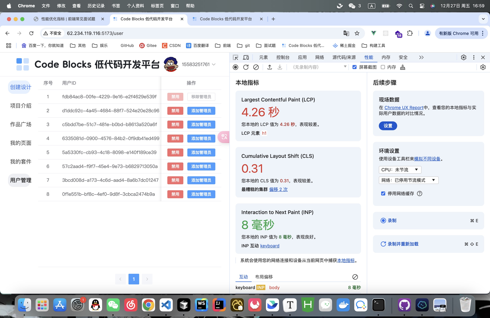
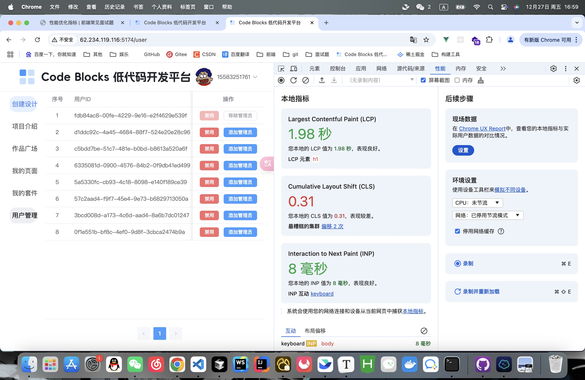

# code-blocks 低代码项目性能优化

起因：在部署到线上的时候，项目访问速度比较慢（不考虑服务器带宽的问题）

## 打包构建优化前

`需要`：

- 路由懒加载
- 组件库按需导入

## 体积分析

执行 `pnpm build` 进行打包



提示的警告是：打包后的文件超过大小，可以采用代码切割来解决（单个文件过大，会导致首屏加载速度过慢）

::: tip

可以使用 `rollup-plugin-visualizer` 查看打包后的文件大小

```js
import { visualizer } from 'rollup-plugin-visualizer'

export default defineConfig({
  plugins: [
    visualizer({
      emitFile: true, // 生成文件
      open: true,
      filename: 'stats.html', //分析图生成的文件名
      gzipSize: true, // 收集 gzip 大小并将其显示
      brotliSize: true // 收集 brotli 大小并将其显示
    })
  ]
})
```

:::

## 代码切割

对于分析的结果，可以采用 `代码压缩` 和 `代码切割` 的方式

```ts {19-29，45-61}
import { fileURLToPath, URL } from 'node:url'
import { defineConfig } from 'vite'
import vue from '@vitejs/plugin-vue'
import AutoImport from 'unplugin-auto-import/vite'
import Components from 'unplugin-vue-components/vite'
import { ElementPlusResolver } from 'unplugin-vue-components/resolvers'

export default defineConfig({
  plugins: [
    vue(),
    AutoImport({
      resolvers: [ElementPlusResolver()]
    }),
    Components({
      resolvers: [ElementPlusResolver()]
    })
  ],
  build: {
    // [!code ++]
    minify: 'terser', // 压缩代码 // [!code ++]
    rollupOptions: {
      // [!code ++]
      output: {
        // [!code ++]
        manualChunks(id) {
          // [!code ++]
          if (id.includes('node_modules')) {
            // [!code ++]
            return extractPackageName(id) // [!code ++]
          } // [!code ++]
        } // [!code ++]
      } // [!code ++]
    } // [!code ++]
  } // [!code ++]
})

// 从路径中提取包名 // [!code ++]
function extractPackageName(id: string): string {
  // [!code ++]
  // 检查是否包含 .pnpm // [!code ++]
  if (id.includes('.pnpm')) {
    // [!code ++]
    const pnpmMatch = id.match(/\.pnpm\/([^/@]+)/) // [!code ++]
    if (pnpmMatch && pnpmMatch[1]) {
      // [!code ++]
      return pnpmMatch[1] // [!code ++]
    } // [!code ++]
  } // [!code ++]
  // 对于其他包管理工具（如 npm 或 yarn） // [!code ++]
  const nodeModulesMatch = id.match(/node_modules\/([^/@]+)/) // [!code ++]
  if (nodeModulesMatch && nodeModulesMatch[1]) {
    // [!code ++]
    return nodeModulesMatch[1] // [!code ++]
  } // [!code ++]
  return 'vendor' // [!code ++]
} // [!code ++]
```

切割后的大小：



可以从图中看到，有个`highlight.js`库还是很大，所以可以将这个库采用 cdn 引入来解决

::: danger 注意

两次打包时间对比可以看到：通过代码切割，构建时间反而变长了，是因为生成的文件数和是否压缩，都会影响构建时间。我们首先考虑首屏加载优化，其次再考虑构建速度（可以降低优先级）

- 如何减少构建速度
  - 减少不必要的分割
  - 使用缓存
  - 并行构建

:::

## 使用 cdn

1. 使用 `rollupOptions.external` 将 `highlight.js` 排除构建

这里需要用到 `rollup-plugin-external-globals`

> 作用：告诉 Rollup 将 第三方包作为全局变量 xxx 暴露到全局作用域中

```ts {1,7-13}
import externalGlobals from 'rollup-plugin-external-globals' // [!code ++]

export default defineConfig({
  build: {
    minify: 'terser',
    rollupOptions: {
      external: ['highlight.js'], // 告诉 Rollup 不要将 highlight.js 包打包到输出中 // [!code ++]
      plugins: [ // [!code ++]
        externalGlobals({ // [!code ++]
          // 告诉 Rollup 将 highlight.js 包作为全局变量 hljs 暴露到全局作用域中 // [!code ++]
          'highlight.js': 'hljs' // [!code ++]
        }) // [!code ++]
      ], // [!code ++]
      output: {
        manualChunks(id) {
          if (id.includes('node_modules')) {
            return extractPackageName(id)
          }
        }
      }
    }
  }
})
```

2. cdn引入

使用 `vite-plugin-cdn-import` 插件

```ts {2,13-29}
import externalGlobals from 'rollup-plugin-external-globals'
import importCDNPlugin from 'vite-plugin-cdn-import' // [!code ++]

export default defineConfig({
  plugins: [
    vue(),
    AutoImport({
      resolvers: [ElementPlusResolver()]
    }),
    Components({
      resolvers: [ElementPlusResolver()]
    }),
    importCDNPlugin({ // [!code ++]
      modules: [ // [!code ++]
        { // [!code ++]
          name: 'highlight.js', // [!code ++]
          var: 'hljs', // [!code ++]
          path: 'https://cdn.bootcdn.net/ajax/libs/highlight.js/11.10.0/highlight.min.js' // [!code ++]
        } // [!code ++]
      ], // [!code ++]
      generateScriptTag(name, url) { // 给script 标签添加 async 属性 // [!code ++]
        return { // [!code ++]
          attrs: { // [!code ++]
            src: url, // [!code ++]
            async: true // [!code ++]
          } // [!code ++]
        } // [!code ++]
      } // [!code ++]
    }) // [!code ++]
  ],
  build: {
    minify: 'terser',
    rollupOptions: {
      external: ['highlight.js'], // 告诉 Rollup 不要将 highlight.js 包打包到输出中
      plugins: [
        externalGlobals({
          // 告诉 Rollup 将 highlight.js 包作为全局变量 hljs 暴露到全局作用域中
          'highlight.js': 'hljs'
        })
      ],
      output: {
        manualChunks(id) {
          if (id.includes('node_modules')) {
            return extractPackageName(id)
          }
        }
      }
    }
  }
})
```

虽然打包时间变长了，但是首屏加载变快了，从 `4.26s -> 1.98s` 速度提升 `2.15` 倍




