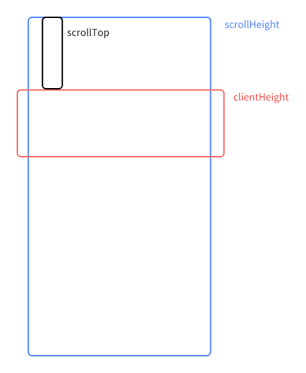

# 同步滚动

## 思路

在两块区域（编辑区、预览区）之间，当鼠标进入其中一个区域时，记录当前滚动区域，保证两个区域滚动不会发生冲突

> 例如：编辑区滚动时，记录当前的滚动区域时 editor，在预览区的`onScroll`中，return 不执行滚动函数，因为预览区是被动滚动的

## 滚动工具函数

同步滚动有两种方案：

1. 按比例
2. 按行数匹配滚动

### 按比例滚动

**思路**：触发滚动的容器，计算滚动百分比，让另一个容器也跟随滚动（操作另一个容器的 `scrollTop`）

**缺点**：滚动位置会略微有误差，不能实现元素精准到滚动到容器视口

::: details 具体实现

```js
// utils/handle-scroll.ts
const scrollSyncFn = () => {
  let isSyncing = false
  return ({
    toScrollInstance, // 触发滚动的实例
    fromScrollInstance, // 同步滚动的实例
  }: {
    toScrollInstance: HTMLElement | null
    fromScrollInstance: HTMLElement | null
  }) => {
    if (isSyncing) return
    isSyncing = true
    if (toScrollInstance && fromScrollInstance) {
      const scrollTop = toScrollInstance.scrollTop
      const scrollHeight = toScrollInstance.scrollHeight
      const clientHeight = toScrollInstance.clientHeight || 1 // 可视区域高度
      const scrollPercentage = scrollTop / (scrollHeight - clientHeight) // 滚动百分比
      fromScrollInstance!.scrollTop =
        scrollPercentage *
        (fromScrollInstance!.scrollHeight - fromScrollInstance!.clientHeight)
    }
    isSyncing = false
  }
}

export const scrollSync = scrollSyncFn()
```

:::

### 按行数匹配滚动

**思路**：通过建立编辑器行和预览区域元素之间的位置映射，实现精确的双向同步滚动。

**情况细分**：

- 正常滚动
- 一边滚动到底部后，另一边也滚动到底部（不然会出现，一边到底部，另一边底部会被遮住的情况）

**具体实现**：

1. `CodeMirror` 可以根据 `line` 属性获取行信息，所以需要在进行 AST 解析的时候，在每个行元素上设置一个 `data-line` 属性，用于标识行号。

```ts
// 计算编辑器和预览区域高度的对应关系
function computeHeightMapping({
  previewView,
  editorView
}: InstancesType): void {
  // 清空映射数组
  this.clearHeightMappings()

  // 获取有效节点
  const validNodes = this.getValidPreviewNodes(previewView)
  validNodes.forEach((node) => {
    // 获取预览区每个元素的行号，data-line 属性的值
    const lineNumber = this.getLineNumber(node)
    // 判断行号是否有效
    if (!this.isValidLineNumber(lineNumber, editorView)) return
    // 返回编辑器行信息，包括该行到顶部的距离
    const editorLineInfo = this.getEditorLineInfo(lineNumber, editorView)
    if (!editorLineInfo) return

    // 添加两个滚动区的映射关系
    this.editorElementList.push(editorLineInfo.top)
    this.previewElementList.push((node as HTMLElement).offsetTop)
  })
}

// 获取编辑器行信息
function getEditorLineInfo(lineNumber: number, editorView: EditorView) {
  const line = editorView.state?.doc?.line(lineNumber)
  return line ? editorView.lineBlockAt(line.from) : null
}
```

2. 同步滚动核心实现

> - scrollTop：可视区域顶部到文档流顶部的距离，也是滚动条滚动的距离
>
> - scrollHeight：元素内容实际高度，包括超出视窗的溢出部分
>
> - clientHeight：窗口可视范围高度
>
> 
>
> 当 clientHeight + scrollTop >= scrollHeight 时，表示已经抵达内容的底部了

```ts
// 同步滚动
private synchronizeScroll(
  source: "editor" | "preview",
  { editorView, previewView }: InstancesType,
): void {
  // 判断滚动的元素 和 被滚动的元素
  const { scrollElement, targetElement } = this.getScrollElements(
    source,
    editorView,
    previewView,
  );
  if (!scrollElement || !targetElement) return;

  // 顶部边界检查
  if (scrollElement.scrollTop <= 0) {
    targetElement.scrollTop = 0;
    return;
  }

  // 底部边界检查 isScrolledToBottom：判断是否滚动到底部
  if (this.isScrolledToBottom(scrollElement)) {
    // 具体在下面 2.2 实现
    this.scrollToBottom(targetElement);
    return;
  }

  // 具体在下面 2.1 实现
  this.performProportionalScroll(scrollElement, targetElement, source);
}

// 判断是否滚动到底部
private isScrolledToBottom(element: Element): boolean {
  return (
    // ScrollSynchronizer.BOTTOM_THRESHOLD 常量为 1
    element.scrollTop + element.clientHeight + ScrollSynchronizer.BOTTOM_THRESHOLD >=
    element.scrollHeight
  );
}
```

- 2.1 performProportionalScroll

```ts
// 比例滚动
private performProportionalScroll(
  scrollElement: Element,
  targetElement: Element,
  source: "editor" | "preview",
): void {
  // 高度映射
  const sourceList = source === "editor" ? this.editorElementList : this.previewElementList;
  const targetList = source === "editor" ? this.previewElementList : this.editorElementList;
  // 获取当前滚动的元素的索引
  const scrollIndex = this.findScrollIndex(sourceList, scrollElement.scrollTop);
  if (scrollIndex >= sourceList.length - 1) return;

  const { ratio, targetScrollTop } = this.calculateScrollPosition(
    scrollIndex,
    sourceList,
    targetList,
    scrollElement.scrollTop,
  );

  if (ratio >= 0) {
    requestAnimationFrame(() => {
      targetElement.scrollTop = targetScrollTop;
    });
  }
}

// 查找滚动索引
private findScrollIndex(sourceList: number[], scrollTop: number): number {
  for (let i = 0; i < sourceList.length - 1; i++) {
    if (scrollTop < sourceList[i + 1]) return i;
  }
  return sourceList.length - 1;
}

// 计算滚动位置 该方法的返回滚动比例和目标滚动位置
private calculateScrollPosition(
  index: number,
  sourceList: number[],
  targetList: number[],
  scrollTop: number,
) {
  // 滚动区间当前元素到下一个元素的距离
  const sourceDistance = sourceList[index + 1] - sourceList[index];
  const targetDistance = targetList[index + 1] - targetList[index];

  if (
    // ScrollSynchronizer.MIN_SCROLL_DISTANCE 常量为 10，表示滚动距离太小，不进行滚动
    sourceDistance < ScrollSynchronizer.MIN_SCROLL_DISTANCE ||
    targetDistance < ScrollSynchronizer.MIN_SCROLL_DISTANCE
  ) {
    return { ratio: -1, targetScrollTop: 0 };
  }

  const ratio = Math.max(0, Math.min(1, (scrollTop - sourceList[index]) / sourceDistance));
  let targetScrollTop = targetList[index] + targetDistance * ratio;

  //* 边界修正
  if (targetScrollTop < 0) targetScrollTop = 0; // 顶部边界保护
  const maxScroll = targetList[targetList.length - 1];
  if (targetScrollTop > maxScroll) targetScrollTop = maxScroll; // 底部边界保护

  return { ratio, targetScrollTop };
}
```

- 2.2 scrollToBottom

```ts
// 将目标元素滚动到底部
private scrollToBottom(targetElement: Element): void {
  const targetScrollTop = targetElement.scrollHeight - targetElement.clientHeight;
  const currentScrollTop = targetElement.scrollTop;
  const distance = targetScrollTop - currentScrollTop;

  const animate = (timestamp: number, startTime?: number) => {
    if (!startTime) startTime = timestamp;
    const progress = timestamp - startTime;
    // ScrollSynchronizer.SCROLL_ANIMATION_DURATION 常量为 100 ms，表示滚动动画持续时间
    const percent = Math.min(progress / ScrollSynchronizer.SCROLL_ANIMATION_DURATION, 1);

    targetElement.scrollTop = currentScrollTop + distance * percent;

    if (progress < ScrollSynchronizer.SCROLL_ANIMATION_DURATION) {
      requestAnimationFrame((time) => animate(time, startTime));
    }
  };

  requestAnimationFrame(animate);
}
```

::: details 具体实现

```js
/**
 * 此类用于处理编辑器和预览区域的滚动同步
 */
import { EditorView } from "@uiw/react-codemirror";
interface InstancesType {
  previewView: HTMLElement;
  editorView: EditorView;
}

class ScrollSynchronizer {
  // 编辑器和预览区域的高度映射
  private readonly editorElementList: number[] = [];
  private readonly previewElementList: number[] = [];
  // 滚动动画的配置参数
  private static readonly SCROLL_ANIMATION_DURATION = 100; // ms
  private static readonly MIN_SCROLL_DISTANCE = 10; // px
  // 添加底部滚动阈值
  private static readonly BOTTOM_THRESHOLD = 1; // px

  // 计算编辑器和预览区域高度的对应关系
  private computeHeightMapping({ previewView, editorView }: InstancesType): void {
    this.clearHeightMappings();

    const validNodes = this.getValidPreviewNodes(previewView);
    validNodes.forEach((node) => {
      const lineNumber = this.getLineNumber(node);
      if (!this.isValidLineNumber(lineNumber, editorView)) return;

      const editorLineInfo = this.getEditorLineInfo(lineNumber, editorView);
      if (!editorLineInfo) return;

      this.editorElementList.push(editorLineInfo.top);
      this.previewElementList.push((node as HTMLElement).offsetTop);
    });
  }

  // 同步滚动
  private synchronizeScroll(
    source: "editor" | "preview",
    { editorView, previewView }: InstancesType,
  ): void {
    const { scrollElement, targetElement } = this.getScrollElements(
      source,
      editorView,
      previewView,
    );
    if (!scrollElement || !targetElement) return;

    // 顶部边界检查
    if (scrollElement.scrollTop <= 0) {
      targetElement.scrollTop = 0;
      return;
    }

    // 底部边界检查
    if (this.isScrolledToBottom(scrollElement)) {
      this.scrollToBottom(targetElement);
      return;
    }

    this.performProportionalScroll(scrollElement, targetElement, source);
  }

  // 获取有效的预览节点
  private getValidPreviewNodes(previewView: HTMLElement): Element[] {
    return Array.from(previewView.childNodes).filter((node: ChildNode) => {
      const element = node as HTMLElement;
      return !((element.clientHeight === 0 && node.nodeName === "P") || node.nodeType === 3);
    }) as Element[];
  }

  // 获取行号
  private getLineNumber(node: Element): number {
    const lineAttr = node.getAttribute("data-line");
    return lineAttr ? Number(lineAttr) : -1;
  }

  // 判断行号是否有效
  private isValidLineNumber(lineNumber: number, editorView: EditorView): boolean {
    return lineNumber >= 1 && editorView.state?.doc && lineNumber <= editorView.state.doc.lines;
  }

  // 获取编辑器行信息
  private getEditorLineInfo(lineNumber: number, editorView: EditorView) {
    const line = editorView.state?.doc?.line(lineNumber);
    return line ? editorView.lineBlockAt(line.from) : null;
  }

  // 清除高度映射
  private clearHeightMappings(): void {
    this.editorElementList.length = 0;
    this.previewElementList.length = 0;
  }

  // 获取滚动元素
  private getScrollElements(
    source: "editor" | "preview",
    editorView: EditorView,
    previewView: HTMLElement,
  ) {
    const scrollElement = source === "editor" ? editorView.scrollDOM : previewView;
    const targetElement = source === "editor" ? previewView : editorView.scrollDOM;
    return { scrollElement, targetElement };
  }

  // 判断是否滚动到底部
  private isScrolledToBottom(element: Element): boolean {
    return (
      element.scrollTop + element.clientHeight + ScrollSynchronizer.BOTTOM_THRESHOLD >=
      element.scrollHeight
    );
  }

  // 滚动到顶部
  private scrollToTop(editorView: EditorView, previewView: HTMLElement): void {
    editorView.scrollDOM.scrollTo({
      top: 0,
      behavior: "smooth",
    });
    previewView.scrollTo({
      top: 0,
      behavior: "smooth",
    });
  }

  // 滚动到底部
  private scrollToBottom(targetElement: Element): void {
    const targetScrollTop = targetElement.scrollHeight - targetElement.clientHeight;
    const currentScrollTop = targetElement.scrollTop;
    const distance = targetScrollTop - currentScrollTop;

    const animate = (timestamp: number, startTime?: number) => {
      if (!startTime) startTime = timestamp;
      const progress = timestamp - startTime;
      const percent = Math.min(progress / ScrollSynchronizer.SCROLL_ANIMATION_DURATION, 1);

      targetElement.scrollTop = currentScrollTop + distance * percent;

      if (progress < ScrollSynchronizer.SCROLL_ANIMATION_DURATION) {
        requestAnimationFrame((time) => animate(time, startTime));
      }
    };

    requestAnimationFrame(animate);
  }

  // 比例滚动
  private performProportionalScroll(
    scrollElement: Element,
    targetElement: Element,
    source: "editor" | "preview",
  ): void {
    const sourceList = source === "editor" ? this.editorElementList : this.previewElementList;
    const targetList = source === "editor" ? this.previewElementList : this.editorElementList;

    const scrollIndex = this.findScrollIndex(sourceList, scrollElement.scrollTop);
    if (scrollIndex >= sourceList.length - 1) return;

    const { ratio, targetScrollTop } = this.calculateScrollPosition(
      scrollIndex,
      sourceList,
      targetList,
      scrollElement.scrollTop,
    );

    if (ratio >= 0) {
      requestAnimationFrame(() => {
        targetElement.scrollTop = targetScrollTop;
      });
    }
  }

  // 查找滚动索引
  private findScrollIndex(sourceList: number[], scrollTop: number): number {
    for (let i = 0; i < sourceList.length - 1; i++) {
      if (scrollTop < sourceList[i + 1]) return i;
    }
    return sourceList.length - 1;
  }

  // 计算滚动位置
  //* 该方法的返回滚动比例和目标滚动位置
  private calculateScrollPosition(
    index: number,
    sourceList: number[],
    targetList: number[],
    scrollTop: number,
  ) {
    const sourceDistance = sourceList[index + 1] - sourceList[index];
    const targetDistance = targetList[index + 1] - targetList[index];

    if (
      sourceDistance < ScrollSynchronizer.MIN_SCROLL_DISTANCE ||
      targetDistance < ScrollSynchronizer.MIN_SCROLL_DISTANCE
    ) {
      return { ratio: -1, targetScrollTop: 0 };
    }

    const ratio = Math.max(0, Math.min(1, (scrollTop - sourceList[index]) / sourceDistance));
    let targetScrollTop = targetList[index] + targetDistance * ratio;

    //* 边界修正
    if (targetScrollTop < 0) targetScrollTop = 0; // 顶部边界保护
    const maxScroll = targetList[targetList.length - 1];
    if (targetScrollTop > maxScroll) targetScrollTop = maxScroll; // 底部边界保护

    return { ratio, targetScrollTop };
  }

  // 处理编辑器滚动
  public handleEditorScroll(editorView: EditorView, previewView: HTMLElement | null): void {
    if (!previewView) return;
    this.computeHeightMapping({ previewView, editorView });
    this.synchronizeScroll("editor", { editorView, previewView });
  }

  // 处理预览区滚动
  public handlePreviewScroll(previewView: HTMLElement | null, editorView: EditorView): void {
    if (!previewView) return;
    this.computeHeightMapping({ previewView, editorView });
    this.synchronizeScroll("preview", { editorView, previewView });
  }

  // 处理双区域滚动到顶部
  public handleScrollTop(editorView: EditorView, previewView: HTMLElement): void {
    if (!previewView) return;
    this.computeHeightMapping({ previewView, editorView });
    this.scrollToTop(editorView, previewView);
  }
}

//? 可选导出  //导出方便测试
export const scrollSynchronizer = new ScrollSynchronizer();

export const handleEditorScroll = ({ editorView, previewView }: InstancesType): void => {
  scrollSynchronizer.handleEditorScroll(editorView, previewView);
};

export const handlePreviewScroll = ({ editorView, previewView }: InstancesType): void => {
  scrollSynchronizer.handlePreviewScroll(previewView, editorView);
};

export const handleScrollTop = ({ editorView, previewView }: InstancesType): void => {
  scrollSynchronizer.handleScrollTop(editorView, previewView);
};
```

:::
