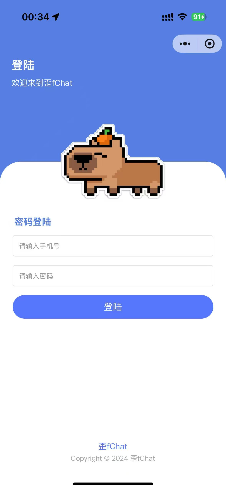
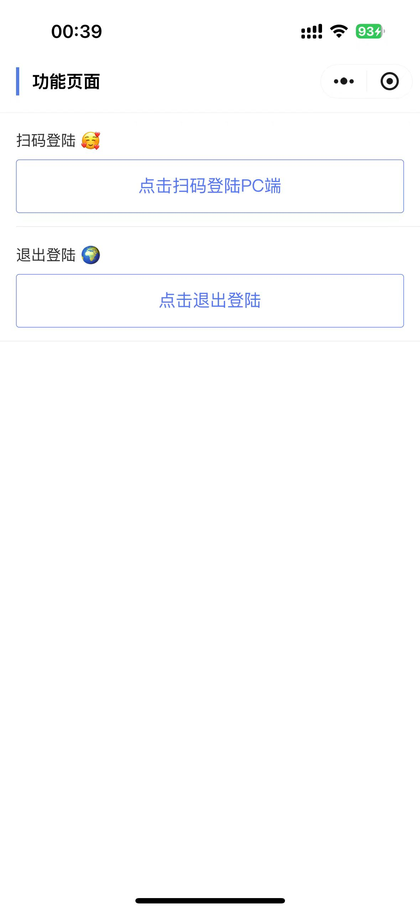
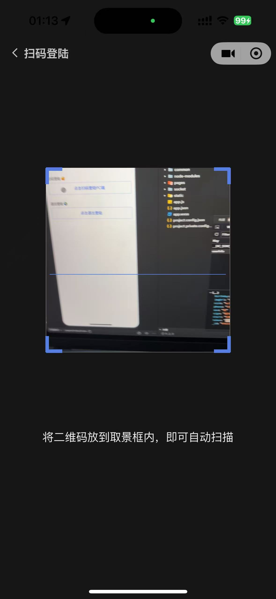
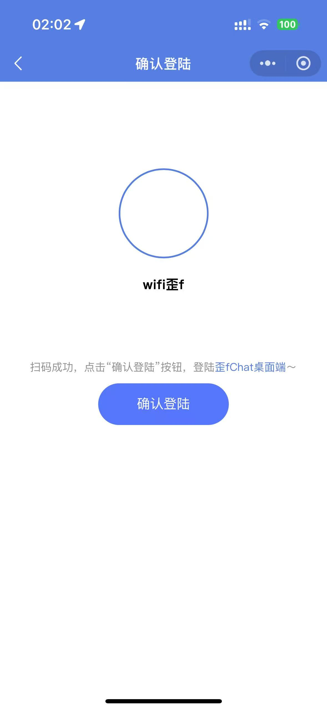
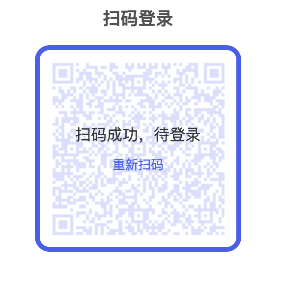

# 扫码登录

## 扫码登录流程

### 1. 移动端先登录

> 这里以微信小程序为例



移动端必须要用账号密码登录成功，因为这样才能拿到 `用户id` 和 `token`。

### 2. 点击扫码登录按钮

点击后，进行摄像头权限检测，成功跳转到扫码页面



> 这里拿 uniapp 代码举例

```js
const handleClick = () => {
  uni.authorize({
    scope: 'scope.camera',
    success() {
      uni.reLaunch({
        url: '/pages/scan/scan'
      })
    },
    fail() {
      // 用户拒绝授权
      return uni.showToast({
        title: '您拒绝了授权',
        icon: 'none'
      })
    }
  })
}
```

### 3. PC 端生成二维码

> 以 vue3 + express 为例，采用`socket.io`实现

**后端接口实现**

我们需要用户传递唯一的标识，例如`uuid`，来生成 token，并将信息拼接自定义 URI，并返回给前端，例如：`waif_chat://xxxxxxtoken`

```js
// 生成二维码接口
router.get('/create/code', (req, res) => {
  const { uuid } = req.query
  // 加上 waif_chat:// 特定前缀，当小程序端扫描不带这个前缀，则不进行跳转
  let qrcodeContent =
    'waif_chat://' +
    jwt.sign(
      {
        uuid
      },
      config.jwtSecret,
      {
        expiresIn: 15 * 60 * 1 // 15分钟
      }
    )

  // 获取二维码
  qrcode
    .toDataURL(qrcodeContent, {
      width: 200,
      color: {
        dark: '#4460f1'
      }
    })
    .then((url) => {
      // url: base64
      res.json({
        status: 200,
        msg: '二维码生成成功',
        url
      })
    })
    .catch(() => {
      res.json({
        status: 404,
        msg: '二维码生成失败'
      })
    })
})
```

**前端接口：获取生成二维码逻辑**

需要一个 uuid 给后端，后端通过这个 uuid 和用户连接的 `socket.io` 的 id 进行关联

> ⚠️ 后续的前后端身份判断都是通过 uuid（因为用户没有登录，没有 userId）

```js
// 获取生成的二维码
const scanCreateQRCode = async () => {
  let uuid = proxy.uuid
  // 发送请求：获取二维码图片
  // 数据结构为：{ status: 200, url: "data:image/png;base64,xxx" }
  let res = await reqScanCreateQRCode(uuid)
  if (res.status === 200) {
    // 赋值到响应式变量后，去渲染二维码图片
    res.url && (QRCodeImg.value = res.url)
    // 二维码生成成功
    proxy.socket.emit('create_qrcode', {
      uuid,
      socketId: proxy.socket.id
    })
  }
}
```

**前端：二维码展示**


```html
<el-image
  class="code-img"
  :src="QRCodeImg"
>
  <template #placeholder>
    <div class="image-slot">
      <el-icon class="loading-icon">
        <Loading />
      </el-icon>
    </div>
  </template>
  <template #error>
    <div class="image-error-slot">
      <el-icon
        color="#f56c6c"
        size="60"
      >
        <CircleCloseFilled />
      </el-icon>
      <div
        class="image-error-text"
        @click="scanCreateQRCode"
      >
        二维码加载失败(点击刷新)
      </div>
    </div>
  </template>
</el-image>
```

### 4. 移动端扫描二维码



在小程序/uniapp 中有对应的组件`camera`来识别二维码：

```html
<camera
  ref="camerRef"
  @scancode="onScancode"
  mode="scanCode"
  device-position="back"
  flash="auto"
>
  <cover-view
    class="scan-animation"
    :animation="animationData"
  ></cover-view>
</camera>
```

**添加对应的`scancode`事件**

1. **二维码内容获取**：在事件对象`e`中有`result`属性，就是识别到的内容，我们只需要取我们自定义 URI 开头`waif_chat://`的内容，就表示是我们自己生成的二维码，去解析到其中的用户信息（token、id）
2. **通知 PC 端**：通过`socket.io`发送一个`scan_qrcode`（自定义事件）给后端，后端需要进行身份校验，校验的成功或失败，都会通过`qrcode_status`事件中的状态码来判断，这个事件会同时发送移动端和 PC 端。

```js
// 扫码成功
const onScancode = (e) => {
  if (!isFlag) return
  isFlag.value = false
  uni.vibrateShort()
  const { result } = e.detail // [!code ++]
  qrcodeContent.value = result
  if (result && result.startsWith('waif_chat://')) {
    // [!code ++]
    let userInfo = uni.getStorageSync('userInfo')
    const { _id, token } = userInfo // [!code ++]
    proxy.socket.emit('scan_qrcode', {
      // 发送socket事件，通知后端 // [!code ++]
      _id, // [!code ++]
      token, // [!code ++]
      code_info: result.replace(new RegExp('^' + 'waif_chat://'), '') // [!code ++]
    }) // [!code ++]
  }
}
```

### 5. 前后端统一状态码

这时候，我们需要前端、后端约定二维码状态：

- `0` => 未扫
- `1` => 已扫，未确认
- `2` => 已确认
- `3` => 二维码过期

html 内容渲染如下：

```html
<div
  class="code-img-other-status"
  v-if="qrcodeStatus !== 0"
>
  <!-- 已扫，未确认 -->
  <div
    class="no-confirm"
    v-if="qrcodeStatus === 1"
  >
    <div class="code-img-status-1">扫码成功，待登录</div>
    <span @click="scanCreateQRCode">重新扫码</span>
  </div>
  <!-- 已确认 -->
  <div
    class="confirm"
    v-if="qrcodeStatus === 2"
  >
    <div class="code-img-status-2">登录成功，跳转中...</div>
  </div>
  <!-- 二维码过期 -->
  <div
    class="expired"
    v-if="qrcodeStatus === 3"
  >
    <div class="code-img-status-3">二维码已过期，请重新扫码</div>
    <span @click="scanCreateQRCode">重新扫码</span>
  </div>
</div>
```

### 6. 后端去派发扫码状态信息，`qrcode_status`事件

因为 PC 端的二维码中包含了用户的 token，该 token 是有时间限制的，同时也能判断是否是该用户扫的码。

当 token 校验成功，则派发`qrcode_status`事件，标明状态为`1`。如果 token 过期、身份不匹配，都算作失败，则状态为`3`

> 这里对二维码过期和身份匹配做了统一，因为都是需要 PC 端去重新刷新二维码的，状态码就没有拆的过细了。

```js
// 二维码扫描成功（移动端）
socket.on('scan_qrcode', ({ _id, token, code_info }) => {
  // 解code_info二维码信息（二维码携带桌面端uuid）
  try {
    let decode = jwt.verify(code_info, config.jwtSecret)
    let uuid = decode.uuid
    // 桌面端
    socket.to(scanUsers[uuid]).emit('qrcode_status', {
      qrcode_status: 1,
      uuid,
      socketId: socket.id
    })
    // 移动端
    socket.emit('qrcode_status', {
      qrcode_status: 1,
      uuid,
      socketId: socket.id
    })
  } catch (error) {
    // 二维码过期
    // 桌面端
    socket.to(scanUsers[uuid]).emit('qrcode_status', {
      qrcode_status: 3,
      uuid,
      socketId: socket.id
    })
    // 移动端
    socket.emit('qrcode_status', {
      qrcode_status: 3,
      uuid,
      socketId: socket.id
    })
  }
})
```

### 7. 移动端扫码成功跳转结果页，`qrcode_status`事件

移动端在收到后端派发的`qrcode_status`事件后，就去跳转结果页



```js
// 监听qrcode_status事件
uni.$on('qrcode_status', (data) => {
  const { qrcode_status, uuid } = data
  if (qrcode_status === 1) {
    uni.navigateTo({
      url: `/pages/scan-result/scan-result?result=${qrcodeContent.value}&uuid=${uuid}`
    })
  } else if (qrcode_status === 3) {
    uni.showToast({
      title: '二维码过期'
    })
    uni.redirectTo({
      url: '/pages/index/index'
    })
  }
})
```

### 8. PC 端扫码成功状态变更，`qrcode_status`事件



PC 端接收到后端的`qrcode_status`事件，进行状态变更。

如果状态为`2`，表示移动端已经确认登录，PC 端保存信息后跳转（看下一步）。

```js
socket.on('qrcode_status', (data) => {
  const { qrcode_status, userInfo } = data
  // 变换二维码状态
  qrcodeStatus.value = qrcode_status
  if (userInfo && qrcode_status === 2) {
    console.log(userInfo)
    // 二维码状态为2时，表示移动端已经确认登录，PC端保存信息后跳转
  }
})
```

### 9. 移动端点击“确认登录”后，`confirm_qrcode`

当用户点击“确认登录”按钮后，调用登录接口，并触发`confirm_qrcode`事件。

**前端逻辑**

```js
// 确认登陆桌面端软件
const loginDesktopApp = async () => {
  const { _id, token } = uni.getStorageSync('userInfo')
  let data = {
    _id,
    token
  }
  let res = await reqLoginDesktopApp(data)
  if (res.status === 200) {
    proxy.socket.emit('confirm_qrcode', {
      userInfo: res.data,
      code_info: qrcodeContent.value.replace(
        new RegExp('^' + 'waif_chat://'),
        ''
      ),
      uuid: uuid.value
    })
  } else {
    uni.showToast({
      icon: 'fail',
      title: res.msg
    })
  }
}
```

**后端逻辑**

收到`confirm_qrcode`事件后，移动端和 PC 端都派发`qrcode_status`去更改二维码状态

```js
// 移动端确认登陆
socket.on('confirm_qrcode', ({ userInfo, code_info, uuid }) => {
  try {
    jwt.verify(code_info, config.jwtSecret)
    // 移动端
    socket.emit('qrcode_status', {
      qrcode_status: 2, // [!code ++]
      uuid,
      socketId: socket.id
    })
    // 桌面端
    socket.to(scanUsers[uuid]).emit('qrcode_status', {
      qrcode_status: 2, // [!code ++]
      uuid,
      socketId: socket.id,
      userInfo
    })
  } catch (error) {
    // 移动端
    socket.emit('qrcode_status', {
      qrcode_status: 3,
      uuid,
      socketId: socket.id
    })
  }
  if (scanUsers.hasOwnProperty(uuid)) {
    delete scanUsers[uuid]
  }
})
```

### 10. PC 端登录成功

这步在第 8 步的时候已经说了，就是进行用户信息存储和路由跳转了。

```js
socket.on('qrcode_status', (data) => {
  const { qrcode_status, userInfo } = data
  // 变换二维码状态
  qrcodeStatus.value = qrcode_status
  if (userInfo && qrcode_status === 2) {
    // [!code ++]
    console.log(userInfo)
    // 二维码状态为2时，表示移动端已经确认登录，PC端保存信息后跳转
  }
})
```

## 问题 1：让你完成扫码登录功能，你会如何实现呢？

### 整体流程框架

1. **移动端前置条件**：用户需先在移动端（以微信小程序为例）通过账号密码登录，获取`用户id`和`token`，作为后续身份验证的基础。
2. **PC 端生成二维码**：
   - PC 端生成唯一标识`uuid`，调用后端接口。
   - 后端结合`uuid`生成带有时效性（15 分钟）的 token，拼接自定义 URI（如`waif_chat://xxx`），并转换为二维码图片返回给 PC 端展示。
   - 同时通过`socket.io`将`uuid`与 PC 端的`socket.id`关联，用于后续通信。
3. **移动端扫码**：
   - 移动端点击扫码按钮，申请摄像头权限后进入扫码页面，通过`camera`组件识别二维码。
   - 校验二维码内容是否以自定义 URI 前缀开头，确认是己方系统二维码后，解析其中信息，通过`socket.io`向后端发送`scan_qrcode`事件，携带移动端用户的`id`、`token`及解析后的二维码信息。
4. **状态同步与确认**：
   - 后端校验二维码有效性，通过`socket.io`的`qrcode_status`事件向 PC 端和移动端同步状态（状态 1：已扫码待确认）。
   - 移动端收到状态 1 后跳转至确认页面，用户点击“确认登录”后，移动端通过`socket.io`发送`confirm_qrcode`事件。
   - 后端收到确认事件后，再次校验，通过`qrcode_status`事件同步状态（状态 2：已确认），并将移动端用户信息发送给 PC 端。
5. **PC 端完成登录**：PC 端收到状态 2 及用户信息后，保存用户信息并跳转至登录后的页面。

### 核心技术点

1. **二维码生成与解析**：后端使用`qrcode`库生成带自定义 URI 的二维码，移动端通过`camera`组件解析二维码内容。
2. **实时通信**：采用`socket.io`实现 PC 端、移动端与后端的实时通信，确保状态及时同步（如`create_qrcode` `scan_qrcode` `confirm_qrcode` `qrcode_status`等事件）。
3. **身份验证与安全**：使用`jwt`生成带时效的 token，用于二维码有效性校验和用户身份验证，避免过期或无效请求。

### 关键细节处理

1. **状态管理**：定义统一状态码（0：未扫、1：已扫待确认、2：已确认、3：过期），前后端根据状态码处理对应逻辑（如 UI 展示、页面跳转）。
2. **异常处理**：
   - 二维码过期（15 分钟）或校验失败时，状态置为 3，提示用户重新生成二维码。
   - 移动端拒绝摄像头权限时，给出明确提示。
   - 二维码加载失败时，提供刷新入口。
3. **关联关系维护**：通过`uuid`关联 PC 端`socket.id`，确保后端能准确向对应的 PC 端和移动端推送状态信息。

## 问题 2：如何处理扫码登录过程中的异常情况？

1. 二维码生成阶段

   - 生成失败：前端展示加载失败提示并提供刷新入口，支持重新生成
   - UUID 关联失败：触发二维码重新生成流程，确保 PC 端与后端正确关联

2. 移动端扫码阶段

   - 摄像头权限拒绝：明确提示用户需授权摄像头权限，引导手动开启
   - 二维码内容非法：忽略非己方系统二维码（非自定义 URI 前缀）

3. 身份校验与状态同步

   - 二维码过期/无效：推送过期状态（15 分钟有效期），两端提示重新操作
   - 用户身份验证失败：token 无效时推送过期状态，强制重新生成二维码

4. 实时通信异常

   - 连接断开：监听断开事件**触发重连**，显示连接异常提示
   - 消息丢失：关键事件添加**重试机制**，确保状态同步可靠

5. 用户操作异常

   - 未及时确认：超时后自动置为过期状态，提示重新操作
   - 重复操作：限制扫码和确认事件仅触发一次，避免重复处理

6. 通用处理原则
   - 统一状态码管理（未扫/待确认/已确认/过期）
   - 关键节点严格校验（有效性、安全性）
   - 及时反馈用户操作结果
   - 可恢复错误自动重试
