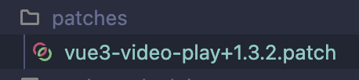

# 第三方包补丁

在开发一个 im 项目时，用到了一个第三方库 `vue3-video-play`，发现这个库打包的时候，写错了 `package.json` 的 `main` 字段，导致项目无法运行，对于每次都要手动修改 `package.json` 的 `main` 字段，是很麻烦的，于是找到了一个解决方案，就是使用 `patch-package` 给第三方包打补丁。

::: danger 注意

使用 `patch-package` ，需要保证项目中有 `package-lock.json` 或者 `yarn.lock` 文件，采用 `cnpm` 安装的包是没有 `package-lock.json` 文件的。

:::

## 如何使用

1. 安装 `patch-package`

```bash
npm i patch-package -D
```

2. 在 node_modules 中，找到你需要修改的包，直接修改他的源代码，修改完成之后，终端执行命令行 `npx patch-package <npm包名>`

```bash
npx patch-package vue3-video-play
```

3. 执行完成之后，补丁生成成功会直接在根目录下生成一个补丁文件夹，如下：



之前后使用 `npm i ` 的时候，就会让这个补丁文件覆盖掉包的源代码
