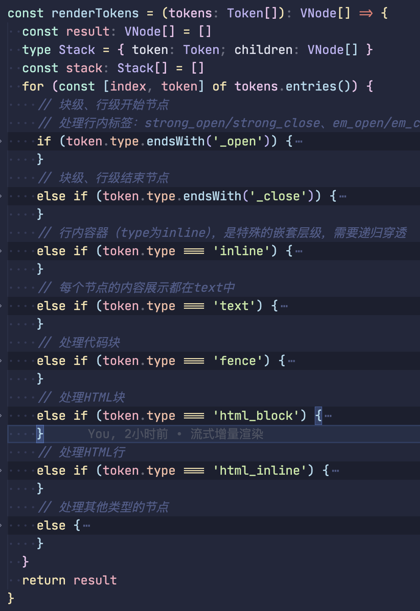

# Prompt 和 AI 增量流式渲染

## Prompt 微调

### 关键词生成

```js
await fetchGpt(`你的任务是根据给定的企业属性，生成与企业属性和短视频拍摄相关的主题关键词。
以下是企业属性：
<企业属性>
  {{COMPANY_ATTRIBUTE}}
</企业属性>
{{COMPANY_ATTRIBUTE}}变量内容为：${promptVar}
请按照以下要求生成关键词：
1. 每个关键词的字数控制在3 - 4个字以内。
2. 生成的关键词数量必须在10 - 15个。
3. 关键词之间用','隔开，不要额外内容，便于我做切割。
`)
```

### 违禁词检测

先通过内部的违禁词接口检测违禁词列表（只包含了骂人的词），然后通过提示词将骂人的词+全部台词文本喂给 AI（不符合直播间规范的词汇交给 AI 自行处理），最后返回需要的 JSON 内容。

```js
const prompt = `你要对直播类内容进行违禁词检查和替换操作。你的任务是检查给定的直播内容，找出其中的违禁词，并将其替换为合适的表述。对于存在夸大效果等不符合直播间规范的词汇，要替换为合适的中性表述；对于骂人的脏话，要把辱骂的词语换成*号，星号个数根据辱骂的长度来显示，且替换内容不允许为空、不允许太长。
首先，请仔细查看以下违禁词列表，这是一个字符串数组：
<违禁词列表>
{ { \${JSON.stringify(err_words || \`[]\`)} }
</违禁词列表>

接下来，请检查以下直播内容文本，这是一个包含违禁词的字符串：

<直播内容文本>
{ { \${content} } }
</直播内容文本>

在检查和替换时，请严格按照以下步骤操作：
1. 把直播内容文本中的每个词与违禁词列表进行逐一比对，请严格按照要求替换：只对在违禁词列表中的词汇进行替换，若词汇不在违禁词列表中，即使它是违禁词也不进行处理。
2. 一旦发现违禁词，对于存在夸大效果等不符合直播间规范的词汇，用恰当的中性表述进行替换。例如，将“最好”替换为“非常好”；若遇到骂人的脏话，把辱骂的词语换成*号，星号个数根据辱骂的长度来确定，保证替换后的表述符合直播间的用语规范。合适的中性表述需根据具体违禁词和语境来确定，要确保语义通顺且不违反规则。
3. 详细记录所有被替换的违禁词以及替换后的内容。

最后，必须严格按照以下JSON格式返回结果，不得包含其他内容：
{"content": "完整的替换内容", "words": [{"error_words":"包含违禁词的字符串1", "replace_words":"对应的替换内容1"}, {"error_words":"包含违禁词的字符串2", "replace_words":"对应的替换内容2"}, ...]}\`
```

## AI 直播台词流式生成渲染

### 使用 v-html 渲染

```vue
<template>
  <div
    class="stream-markdown-body"
    v-html="renderedContent"
  ></div>
</template>

<script setup lang="ts">
import { ref, onMounted } from 'vue'
import MarkdownIt from 'markdown-it'
// markdown文本数据
import { markdownSample } from '../mock/markdownData'

const renderedContent = ref('')
const md = new MarkdownIt()
const buffer = ref('')

// 模拟流式数据接收
const simulateStream = () => {
  const markdown = markdownSample

  const chars = markdown.split('')
  let index = 0

  const renderNext = () => {
    if (index < chars.length) {
      appendChunk(chars[index])
      index++
      // 随机延迟模拟网络请求
      setTimeout(renderNext, Math.random() * 100 + 20)
    }
  }

  renderNext()
}

// 处理流式数据
const appendChunk = (chunk: string) => {
  buffer.value += chunk
  renderedContent.value = md.render(buffer.value)
}

onMounted(() => {
  simulateStream()
})
</script>
```

### v-html 缺点

> 原文：https://juejin.cn/post/7504991619054485554

1. 存在 XSS 风险
2. 无法渲染自定义组件（web components 是可以的，但是 vue 组件不行）
3. 全量渲染无状态：每次更新都会重新生成整个 HTML 字符串，无法追踪 DOM 状态（如表单输入值、滚动位置等），导致交互体验差。
4. 失去 Vue 响应式优势：无法利用 Vue 的虚拟 DOM diff 算法实现增量更新（如仅更新变化的文本或样式），性能较低。

### 优化：Markdown 增量渲染

#### **实现思路**：

1. 采用 markdown-it 将 markdown 文本转为 token
2. 将 token 转为（递归） vnode 进行渲染

#### **节点类型**：

在`markdown-it`中，节点类型(`token.type`)非常多，大致分为：**块级标签（`_open`/`_close`）**、**行内标签（`_open`/`_close`）**、**自闭合标签（如 `hr`、`image`）**、**容器（如 `inline`）** 和**文本（`text`）**

```txt
例如：这是**加粗**的文本和[链接](https://github.com)
转为的 token 树结构如下：
paragraph_open（块级开始）
  inline（行内容器）
    text（文本：这是）
    strong_open（加粗开始）
    text（文本：加粗）
    strong_close（加粗结束）
    text（文本：的文本和）
    link_open（链接开始）
    text（文本：链接）
    link_close（链接结束）
paragraph_close（块级结束）
```

> 不管如何嵌套，`text`节点才是渲染内容的。

除此之外，还有一些其他类型：

```md
code_inline: 'code', // 行内代码
fence: 'code', // 代码块
image: 'img', // 图片
html_block: 'div', // HTML 块级标签
html_inline: 'span', // HTML 行内标签，例如这样的 p 标签会被渲染成行内的：[<p>url</p>](url)
hr: 'hr', // 分割线
```

#### **实现代码**：

```vue {2,42,43,46-48}
<template>
  <component :is="render" />
</template>

<script setup lang="ts">
import { ref, onMounted, h, type VNode, createTextVNode } from 'vue'
import MarkdownIt from 'markdown-it'
import { markdownSample } from '../mock/demo'
import type { Token } from 'markdown-it/index.js'

const md = new MarkdownIt({
  html: true
})

onMounted(() => {
  simulateStream()
})

const mdTokens = ref<Token[]>([])
let buffer = ref('')

// 模拟流式数据接收
const simulateStream = () => {
  const markdown = markdownSample
  const chars = markdown.split('')
  let index = 0

  const renderNext = () => {
    if (index < chars.length) {
      appendChunk(chars[index])
      index++
      // 随机延迟模拟网络请求
      setTimeout(renderNext, Math.random() * 10 + 20)
    }
  }
  renderNext()
}

// 处理流式数据
const appendChunk = (chunk: string) => {
  buffer.value += chunk
  const token: Token[] = md.parse(buffer.value, {})
  mdTokens.value = token
}

const render = () => {
  return h('div', {}, renderTokens(mdTokens.value))
}

// 核心逻辑
const renderTokens = (tokens: Token[]): VNode[] => {}
</script>
```

#### **`renderTokens`实现**：

`renderTokens` 方法的核心思路是将 Markdown 解析得到的 tokens 数组递归转换为 Vue 虚拟 DOM（vnode），从而实现 Markdown 内容的渲染。

**数据结构**：

- **tokens**：Markdown 解析后得到的标记数组，每个 token 包含 `type`（类型，如 `paragraph_open`、`text` 等）、`tag`（对应 HTML 标签）、`attrs`（属性）、`content`（内容）等信息。
- **stack**：栈结构，用于处理嵌套的标签（如 `<ul>` 包含 `<li>`，`<div>` 包含 `<p>` 等），记录当前未闭合的父级节点。
- **result**：最终生成的 vnode 数组，作为渲染结果返回。

**节点的处理**：

- **开始节点**：以`_open`结尾的节点，如 `paragraph_open`、`list_item_open` 等，块和行级都是
- **结束节点**：以`_close`结尾的节点，如 `paragraph_close`、`list_item_close` 等，块和行级都是
- **行内容器**：`type`为`inline`的节点，是特殊的嵌套层级，需要递归穿透
- **文本节点**：`type`为`text`的节点，直接创建文本节点，每个节点的内容展示都在 text 中。
- **特殊节点**：
  - `fence`：代码块
  - `html_block`：HTML 块
  - `html_inline`：HTML 行
  - 剩余节点：例如`image`、`hr`、`code_inline`等



::: code-group

```ts [_open结尾]
// 块级、行级开始节点
// 处理行内标签：strong_open/strong_close、em_open/em_close也是如此
if (token.type.endsWith('_open')) {
  stack.push({
    token,
    children: []
  })
  continue
}
```

```ts [_close结尾]
// 块级、行级结束节点
if (token.type.endsWith('_close')) {
  if (!stack.length) continue
  const { token: openToken, children: openTokenChild } = stack.pop() as Stack
  // xx_close节点都是有tag的
  const tag = openToken.tag
  // 开始标签上有attrs，例如[链接](https://github.com/)，
  // type为link_open，attrs为['href', 'https://github.com/'][]
  // 制造vnode的attrs
  const attrs: Record<string, string> = {}
  if (openToken?.attrs) {
    // key：href，value：https://github.com/
    openToken.attrs.forEach(([key, value]) => (attrs[key] = value))
  }
  // 需要添加唯一key
  const vnode = h(
    tag,
    { ...attrs, key: `${openToken.type}-${index}` },
    openTokenChild
  )
  if (stack.length) {
    stack[stack.length - 1].children.push(vnode)
  } else {
    result.push(vnode)
  }
  continue
}
```

```ts [行内容器，type为inline]
/**
 * 数据结构
 * Token: {
 *     type: 'inline',
 *     children: [
 *       {
 *          type: 'text',
 *          content: '这是'
 *       },
 *       {
 *           type: 'strong_open',
 *           tag: 'strong'
 *       },
 *       {
 *          type: 'text',
 *          content: '加粗'
 *       },
 *       {
 *           type: 'strong_close',
 *           tag: 'strong'
 *       }
 *    ]
 * }
 */
// 行内容器（type为inline），是特殊的嵌套层级，需要递归穿透
if (token.type === 'inline') {
  const children = renderTokens(token.children || [])
  if (stack.length > 0) {
    // 添加到栈末尾
    stack[stack.length - 1].children.push(...children)
  } else {
    // 添加到结果
    result.push(...children)
  }
  continue
}
```

```ts [text节点]
if (token.type === 'text') {
  // const textVNode = token.content // 纯文本可直接作为vnode
  const textVNode = createTextVNode(token.content) // 纯文本可直接作为vnode
  if (stack.length) {
    stack[stack.length - 1].children.push(textVNode)
  } else {
    result.push(textVNode)
  }
  continue // 处理完文本，跳过后续判断
}
```

```ts [代码块]
if (token.type === 'fence') {
  const language = token.info || 'plain'
  const codeContent = token.content
  const lines = codeContent.split('\n') // 按行拆分为增量单元数组
  const nodeLines: VNode[] = []
  for (const [i, line] of lines.entries()) {
    const lineVNode = h(
      'span',
      {
        key: `${token.type}-${i}`,
        style: { display: 'block', lineHeight: '1.5', height: '1.5rem' }
      },
      line
    )
    nodeLines.push(lineVNode)
  }
  const pre = h(
    'pre',
    { class: `language-${language}`, key: `${token.type}-${index}` },
    [...nodeLines]
  )
  result.push(pre)
  continue
}
```

```ts [HTML块，html_block]
if (token.type === 'html_block') {
  const vnode = h('div', {
    key: `html-block-${index}`,
    innerHTML: token.content
  })
  if (stack.length) {
    stack[stack.length - 1].children.push(vnode)
  } else {
    result.push(vnode)
  }
  continue
}
```

```ts [HTML行，html_inline]
if (token.type === 'html_inline') {
  const vnode = createTextVNode(token.content)
  if (stack.length) {
    stack[stack.length - 1].children.push(vnode)
  } else {
    result.push(vnode)
  }
  continue
}
```

```ts [剩余节点]
// 处理其他类型的节点
else {
  const tag = mapTokenToTag(token)
  const attrs: Record<string, string> = {}
  if (token.attrs) {
    token.attrs.forEach(([key, value]) => (attrs[key] = value))
  }
  const vnode = h(
    tag,
    { ...attrs, key: `${token.type}-${index}` },
    token.content ? [createTextVNode(token.content)] : []
  )
  if (stack.length) {
    stack[stack.length - 1].children.push(vnode)
  } else {
    result.push(vnode)
  }
}

const otherTag: Record<string, string | typeof Think> = {
  code_inline: 'code',
  fence: 'code',
  image: 'img',
  html_block: 'div',
  html_inline: 'span',
  hr: 'hr',
  // 添加自定义标签（vue组件）
  think: Think
}

// 映射函数：将token转换为对应的标签或组件
const mapTokenToTag = (token: Token): string | typeof Think => {
  // 使用otherTag映射表处理特殊标签
  if (token.tag && otherTag[token.tag]) {
    return otherTag[token.tag]
  }

  // 默认返回token的标签
  return token.tag || 'div'
}
```

:::

::: details 完整代码

```vue
<template>
  <component :is="render" />
</template>

<script setup lang="ts">
import { ref, onMounted, h, type VNode, createTextVNode } from 'vue'
import MarkdownIt from 'markdown-it'
import { markdownSample } from '../mock/demo'
import type { Token } from 'markdown-it/index.js'
import { Think } from './Think'

const md = new MarkdownIt({
  html: true,
  linkify: true
})

onMounted(() => {
  simulateStream()
})

const mdTokens = ref<Token[]>([])
let buffer = ref('')

// 模拟流式数据接收
const simulateStream = () => {
  const markdown = markdownSample
  const chars = markdown.split('')
  let index = 0

  const renderNext = () => {
    if (index < chars.length) {
      appendChunk(chars[index])
      index++
      // 随机延迟模拟网络请求
      setTimeout(renderNext, Math.random() * 10 + 20)
    }
  }

  renderNext()
}

// 处理流式数据
const appendChunk = (chunk: string) => {
  buffer.value += chunk
  const token: Token[] = md.parse(buffer.value, {})
  mdTokens.value = token
}

const render = () => {
  return h('div', { class: 'markdown-body' }, renderTokens(mdTokens.value))
}

const renderTokens = (tokens: Token[]): VNode[] => {
  const result: VNode[] = []
  type Stack = { token: Token; children: VNode[] }
  const stack: Stack[] = []
  for (const [index, token] of tokens.entries()) {
    // 块级、行级开始节点
    // 处理行内标签：strong_open/strong_close、em_open/em_close也是如此
    if (token.type.endsWith('_open')) {
      stack.push({
        token,
        children: []
      })
      continue
    }
    // 块级、行级结束节点
    else if (token.type.endsWith('_close')) {
      if (!stack.length) continue
      const { token: openToken, children: openTokenChild } =
        stack.pop() as Stack
      // xx_close节点都是有tag的
      const tag = openToken.tag
      // 开始标签上有attrs，例如[链接](https://github.com/)，
      // type为link_open，attrs为['href', 'https://github.com/'][]
      // 制造vnode的attrs
      const attrs: Record<string, string> = {}
      if (openToken?.attrs) {
        // key：href，value：https://github.com/
        openToken.attrs.forEach(([key, value]) => (attrs[key] = value))
      }
      // 需要添加唯一key
      const vnode = h(
        tag,
        { ...attrs, key: `${openToken.type}-${index}` },
        openTokenChild
      )
      if (stack.length) {
        stack[stack.length - 1].children.push(vnode)
      } else {
        result.push(vnode)
      }
      continue
    }
    // 行内容器（type为inline），是特殊的嵌套层级，需要递归穿透
    else if (token.type === 'inline') {
      const children = renderTokens(token.children || [])
      if (stack.length > 0) {
        // 添加到栈末尾
        stack[stack.length - 1].children.push(...children)
      } else {
        // 添加到结果
        result.push(...children)
      }
      continue
    }
    // 每个节点的内容展示都在text中
    else if (token.type === 'text') {
      // const textVNode = token.content // 纯文本可直接作为vnode
      const textVNode = createTextVNode(token.content) // 纯文本可直接作为vnode
      if (stack.length) {
        stack[stack.length - 1].children.push(textVNode)
      } else {
        result.push(textVNode)
      }
      continue // 处理完文本，跳过后续判断
    }
    // 处理代码块
    else if (token.type === 'fence') {
      const language = token.info || 'plain'
      const codeContent = token.content
      const lines = codeContent.split('\n') // 按行拆分为增量单元数组
      const nodeLines: VNode[] = []
      for (const [i, line] of lines.entries()) {
        const lineVNode = h(
          'span',
          {
            key: `${token.type}-${i}`,
            style: { display: 'block', lineHeight: '1.5', height: '1.5rem' }
          },
          line
        )
        nodeLines.push(lineVNode)
      }
      const pre = h(
        'pre',
        { class: `language-${language}`, key: `${token.type}-${index}` },
        [...nodeLines]
      )
      result.push(pre)
      continue
    }
    // 处理HTML块
    else if (token.type === 'html_block') {
      const vnode = h('div', {
        key: `html-block-${index}`,
        innerHTML: token.content
      })
      if (stack.length) {
        stack[stack.length - 1].children.push(vnode)
      } else {
        result.push(vnode)
      }
      continue
    }
    // 处理HTML行
    else if (token.type === 'html_inline') {
      const vnode = createTextVNode(token.content)
      if (stack.length) {
        stack[stack.length - 1].children.push(vnode)
      } else {
        result.push(vnode)
      }
      continue
    }
    // 处理其他类型的节点
    else {
      const tag = mapTokenToTag(token)
      const attrs: Record<string, string> = {}
      if (token.attrs) {
        token.attrs.forEach(([key, value]) => (attrs[key] = value))
      }
      const vnode = h(
        tag,
        { ...attrs, key: `${token.type}-${index}` },
        token.content ? [createTextVNode(token.content)] : []
      )
      if (stack.length) {
        stack[stack.length - 1].children.push(vnode)
      } else {
        result.push(vnode)
      }
    }
  }
  return result
}

const otherTag: Record<string, string | typeof Think> = {
  code_inline: 'code',
  fence: 'code',
  image: 'img',
  html_block: 'div',
  html_inline: 'span',
  hr: 'hr',
  // 添加自定义标签（vue组件）
  think: Think
}

// 映射函数：将token转换为对应的标签或组件
const mapTokenToTag = (token: Token): string | typeof Think => {
  // 使用otherTag映射表处理特殊标签
  if (token.tag && otherTag[token.tag]) {
    return otherTag[token.tag]
  }

  // 默认返回token的标签
  return token.tag || 'div'
}
</script>
```

:::

### 流式处理优化——智能解析

组件在流式传输期间自动完成不完整的粗体、斜体和代码格式，隐藏损坏的链接直到完成。

智能解析包括：

**自动完成不完整的格式**：

- **Bold**: `**incomplete` → `**incomplete**` (auto-closed)
  粗体： `**incomplete` → `**incomplete**` （自动关闭）
- **Italic**: `*incomplete` → `*incomplete*` (auto-closed)
  斜体： `*incomplete` → `*incomplete*` （自动关闭）
- **Strikethrough**: `~~incomplete` → `~~incomplete~~` (auto-closed)
  删除线： `~~incomplete` → `~~incomplete~~` （自动关闭）
- **Inline code**: `` `incomplete`` → `` `incomplete` `` (auto-closed)
  内联代码： `` `incomplete`` → `` `incomplete` `` （自动关闭）

**隐藏不完整的元素**

- **Links**: `[incomplete text` (hidden until `]` appears)
  链接： `[incomplete text` （隐藏直到 `]` 出现）
- **Images**: `![incomplete alt` (hidden until `]` appears)
  图像： `![incomplete alt` （隐藏直到 `]` 出现）
- **Code blocks**: Protects triple backticks from inline code completion
  代码块：保护三重反引号免受内联代码补全的影响

::: details react 优化代码

````tsx
'use client'
import { cn } from '@/lib/utils'
import type { ComponentProps, HTMLAttributes } from 'react'
import { isValidElement, memo } from 'react'
import ReactMarkdown, { type Options } from 'react-markdown'
import rehypeKatex from 'rehype-katex'
import remarkGfm from 'remark-gfm'
import remarkMath from 'remark-math'
import { CodeBlock, CodeBlockCopyButton } from './ui/shadcn-io/ai/code-block'
import 'katex/dist/katex.min.css'
import hardenReactMarkdown from 'harden-react-markdown'
/**
 * Parses markdown text and removes incomplete tokens to prevent partial rendering
 * of links, images, bold, and italic formatting during streaming.
 */
function parseIncompleteMarkdown(text: string): string {
  if (!text || typeof text !== 'string') {
    return text
  }
  let result = text
  // Handle incomplete links and images
  // Pattern: [...] or ![...] where the closing ] is missing
  const linkImagePattern = /(!?\[)([^\]]*?)$/
  const linkMatch = result.match(linkImagePattern)
  if (linkMatch) {
    // If we have an unterminated [ or ![, remove it and everything after
    const startIndex = result.lastIndexOf(linkMatch[1])
    result = result.substring(0, startIndex)
  }
  // Handle incomplete bold formatting (**)
  const boldPattern = /(\*\*)([^*]*?)$/
  const boldMatch = result.match(boldPattern)
  if (boldMatch) {
    // Count the number of ** in the entire string
    const asteriskPairs = (result.match(/\*\*/g) || []).length
    // If odd number of **, we have an incomplete bold - complete it
    if (asteriskPairs % 2 === 1) {
      result = `${result}**`
    }
  }
  // Handle incomplete italic formatting (__)
  const italicPattern = /(__)([^_]*?)$/
  const italicMatch = result.match(italicPattern)
  if (italicMatch) {
    // Count the number of __ in the entire string
    const underscorePairs = (result.match(/__/g) || []).length
    // If odd number of __, we have an incomplete italic - complete it
    if (underscorePairs % 2 === 1) {
      result = `${result}__`
    }
  }
  // Handle incomplete single asterisk italic (*)
  const singleAsteriskPattern = /(\*)([^*]*?)$/
  const singleAsteriskMatch = result.match(singleAsteriskPattern)
  if (singleAsteriskMatch) {
    // Count single asterisks that aren't part of **
    const singleAsterisks = result.split('').reduce((acc, char, index) => {
      if (char === '*') {
        // Check if it's part of a ** pair
        const prevChar = result[index - 1]
        const nextChar = result[index + 1]
        if (prevChar !== '*' && nextChar !== '*') {
          return acc + 1
        }
      }
      return acc
    }, 0)
    // If odd number of single *, we have an incomplete italic - complete it
    if (singleAsterisks % 2 === 1) {
      result = `${result}*`
    }
  }
  // Handle incomplete single underscore italic (_)
  const singleUnderscorePattern = /(_)([^_]*?)$/
  const singleUnderscoreMatch = result.match(singleUnderscorePattern)
  if (singleUnderscoreMatch) {
    // Count single underscores that aren't part of __
    const singleUnderscores = result.split('').reduce((acc, char, index) => {
      if (char === '_') {
        // Check if it's part of a __ pair
        const prevChar = result[index - 1]
        const nextChar = result[index + 1]
        if (prevChar !== '_' && nextChar !== '_') {
          return acc + 1
        }
      }
      return acc
    }, 0)
    // If odd number of single _, we have an incomplete italic - complete it
    if (singleUnderscores % 2 === 1) {
      result = `${result}_`
    }
  }
  // Handle incomplete inline code blocks (`) - but avoid code blocks (```)
  const inlineCodePattern = /(`)([^`]*?)$/
  const inlineCodeMatch = result.match(inlineCodePattern)
  if (inlineCodeMatch) {
    // Check if we're dealing with a code block (triple backticks)
    const hasCodeBlockStart = result.includes('```')
    const codeBlockPattern = /```[\s\S]*?```/g
    const completeCodeBlocks = (result.match(codeBlockPattern) || []).length
    const allTripleBackticks = (result.match(/```/g) || []).length
    // If we have an odd number of ``` sequences, we're inside an incomplete code block
    // In this case, don't complete inline code
    const insideIncompleteCodeBlock = allTripleBackticks % 2 === 1
    if (!insideIncompleteCodeBlock) {
      // Count the number of single backticks that are NOT part of triple backticks
      let singleBacktickCount = 0
      for (let i = 0; i < result.length; i++) {
        if (result[i] === '`') {
          // Check if this backtick is part of a triple backtick sequence
          const isTripleStart = result.substring(i, i + 3) === '```'
          const isTripleMiddle =
            i > 0 && result.substring(i - 1, i + 2) === '```'
          const isTripleEnd = i > 1 && result.substring(i - 2, i + 1) === '```'
          if (!(isTripleStart || isTripleMiddle || isTripleEnd)) {
            singleBacktickCount++
          }
        }
      }
      // If odd number of single backticks, we have an incomplete inline code - complete it
      if (singleBacktickCount % 2 === 1) {
        result = `${result}\``
      }
    }
  }
  // Handle incomplete strikethrough formatting (~~)
  const strikethroughPattern = /(~~)([^~]*?)$/
  const strikethroughMatch = result.match(strikethroughPattern)
  if (strikethroughMatch) {
    // Count the number of ~~ in the entire string
    const tildePairs = (result.match(/~~/g) || []).length
    // If odd number of ~~, we have an incomplete strikethrough - complete it
    if (tildePairs % 2 === 1) {
      result = `${result}~~`
    }
  }
  return result
}
// Create a hardened version of ReactMarkdown
const HardenedMarkdown = hardenReactMarkdown(ReactMarkdown)
export type MarkdownRenderProps = HTMLAttributes<HTMLDivElement> & {
  options?: Options
  children: Options['children']
  allowedImagePrefixes?: ComponentProps<
    ReturnType<typeof hardenReactMarkdown>
  >['allowedImagePrefixes']
  allowedLinkPrefixes?: ComponentProps<
    ReturnType<typeof hardenReactMarkdown>
  >['allowedLinkPrefixes']
  defaultOrigin?: ComponentProps<
    ReturnType<typeof hardenReactMarkdown>
  >['defaultOrigin']
  parseIncompleteMarkdown?: boolean
}
const components: Options['components'] = {
  ol: ({ node, children, className, ...props }) => (
    <ol
      className={cn('ml-4 list-outside list-decimal', className)}
      {...props}
    >
      {children}
    </ol>
  ),
  li: ({ node, children, className, ...props }) => (
    <li
      className={cn('py-1', className)}
      {...props}
    >
      {children}
    </li>
  ),
  ul: ({ node, children, className, ...props }) => (
    <ul
      className={cn('ml-4 list-outside list-disc', className)}
      {...props}
    >
      {children}
    </ul>
  ),
  hr: ({ node, className, ...props }) => (
    <hr
      className={cn('my-6 border-border', className)}
      {...props}
    />
  ),
  strong: ({ node, children, className, ...props }) => (
    <span
      className={cn('font-semibold', className)}
      {...props}
    >
      {children}
    </span>
  ),
  a: ({ node, children, className, ...props }) => (
    <a
      className={cn('font-medium text-primary underline', className)}
      rel='noreferrer'
      target='_blank'
      {...props}
    >
      {children}
    </a>
  ),
  h1: ({ node, children, className, ...props }) => (
    <h1
      className={cn('mt-6 mb-2 font-semibold text-3xl', className)}
      {...props}
    >
      {children}
    </h1>
  ),
  h2: ({ node, children, className, ...props }) => (
    <h2
      className={cn('mt-6 mb-2 font-semibold text-2xl', className)}
      {...props}
    >
      {children}
    </h2>
  ),
  h3: ({ node, children, className, ...props }) => (
    <h3
      className={cn('mt-6 mb-2 font-semibold text-xl', className)}
      {...props}
    >
      {children}
    </h3>
  ),
  h4: ({ node, children, className, ...props }) => (
    <h4
      className={cn('mt-6 mb-2 font-semibold text-lg', className)}
      {...props}
    >
      {children}
    </h4>
  ),
  h5: ({ node, children, className, ...props }) => (
    <h5
      className={cn('mt-6 mb-2 font-semibold text-base', className)}
      {...props}
    >
      {children}
    </h5>
  ),
  h6: ({ node, children, className, ...props }) => (
    <h6
      className={cn('mt-6 mb-2 font-semibold text-sm', className)}
      {...props}
    >
      {children}
    </h6>
  ),
  table: ({ node, children, className, ...props }) => (
    <div className='my-4 overflow-x-auto'>
      <table
        className={cn('w-full border-collapse border border-border', className)}
        {...props}
      >
        {children}
      </table>
    </div>
  ),
  thead: ({ node, children, className, ...props }) => (
    <thead
      className={cn('bg-muted/50', className)}
      {...props}
    >
      {children}
    </thead>
  ),
  tbody: ({ node, children, className, ...props }) => (
    <tbody
      className={cn('divide-y divide-border', className)}
      {...props}
    >
      {children}
    </tbody>
  ),
  tr: ({ node, children, className, ...props }) => (
    <tr
      className={cn('border-border border-b', className)}
      {...props}
    >
      {children}
    </tr>
  ),
  th: ({ node, children, className, ...props }) => (
    <th
      className={cn('px-4 py-2 text-left font-semibold text-sm', className)}
      {...props}
    >
      {children}
    </th>
  ),
  td: ({ node, children, className, ...props }) => (
    <td
      className={cn('px-4 py-2 text-sm', className)}
      {...props}
    >
      {children}
    </td>
  ),
  blockquote: ({ node, children, className, ...props }) => (
    <blockquote
      className={cn(
        'my-4 border-muted-foreground/30 border-l-4 pl-4 text-muted-foreground italic',
        className
      )}
      {...props}
    >
      {children}
    </blockquote>
  ),
  code: ({ node, className, ...props }) => {
    const inline = node?.position?.start.line === node?.position?.end.line
    if (!inline) {
      return (
        <code
          className={className}
          {...props}
        />
      )
    }
    return (
      <code
        className={cn(
          'rounded bg-[rgba(var(--coze-bg-6),var(--coze-bg-6-alpha))] px-1.5 py-0.5 font-mono text-sm',
          className
        )}
        {...props}
      />
    )
  },
  pre: ({ node, className, children }) => {
    let language = 'javascript'
    if (typeof node?.properties?.className === 'string') {
      language = node.properties.className.replace('language-', '')
    }
    // Extract code content from children safely
    let code = ''
    if (
      isValidElement(children) &&
      children.props &&
      typeof (children.props as any).children === 'string'
    ) {
      code = (children.props as any).children
    } else if (typeof children === 'string') {
      code = children
    }
    return (
      <CodeBlock
        className={cn('my-4 h-auto', className)}
        code={code}
        language={language}
      >
        <CodeBlockCopyButton
          onCopy={() => console.log('Copied code to clipboard')}
          onError={() => console.error('Failed to copy code to clipboard')}
        />
      </CodeBlock>
    )
  }
}
const MarkdownRender = memo(
  ({
    className,
    options,
    children,
    allowedImagePrefixes,
    allowedLinkPrefixes,
    defaultOrigin,
    parseIncompleteMarkdown: shouldParseIncompleteMarkdown = true,
    ...props
  }: MarkdownRenderProps) => {
    // Parse the children to remove incomplete markdown tokens if enabled
    const parsedChildren =
      typeof children === 'string' && shouldParseIncompleteMarkdown
        ? parseIncompleteMarkdown(children)
        : children
    return (
      <div
        className={cn(
          'size-full [&>*:first-child]:mt-0 [&>*:last-child]:mb-0',
          className
        )}
        {...props}
      >
        <HardenedMarkdown
          allowedImagePrefixes={allowedImagePrefixes ?? ['*']}
          allowedLinkPrefixes={allowedLinkPrefixes ?? ['*']}
          components={components}
          defaultOrigin={defaultOrigin}
          rehypePlugins={[rehypeKatex]}
          remarkPlugins={[remarkGfm, remarkMath]}
          {...options}
        >
          {parsedChildren}
        </HardenedMarkdown>
      </div>
    )
  },
  (prevProps, nextProps) => prevProps.children === nextProps.children
)
MarkdownRender.displayName = 'MarkdownRender'

export default MarkdownRender
````

:::
