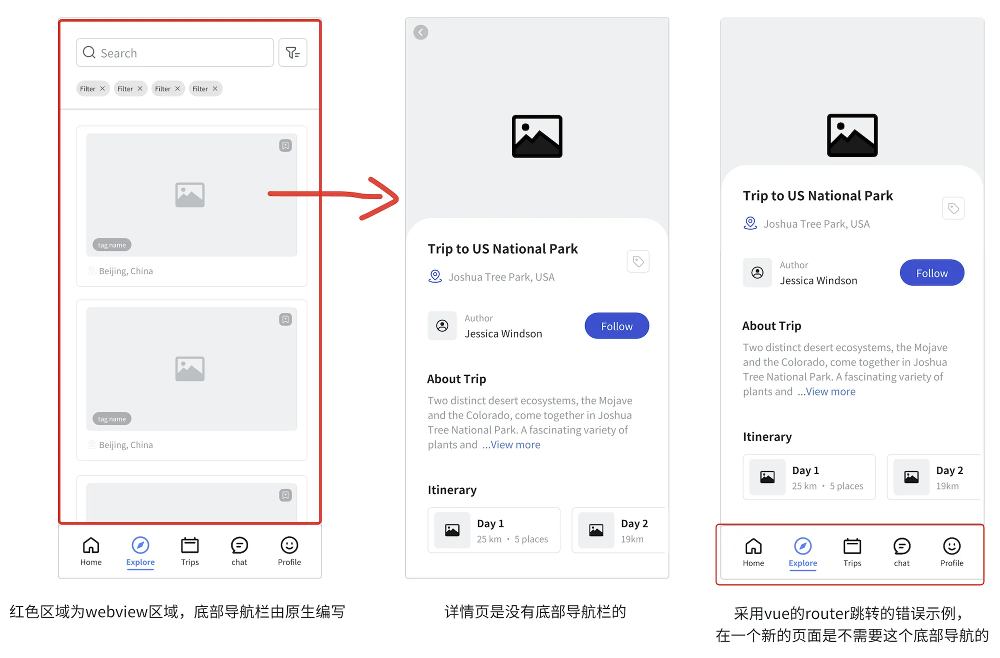

# 实习中遇到的难点

## h5 与原生（ios 和安卓）交互

### h5 和原生的通信方式有哪些？

| 方式           | 优点       | 缺点                      | 适用场景                 |
| :------------- | :--------- | :------------------------ | :----------------------- |
| `URL Scheme`   | 简单通用   | 无法直接获取返回值        | 打开 App、传递参数       |
| `JS Bridge`    | 双向高效   | 需要原生开发配合          | 复杂交互（如拍照、支付） |
| `postMessage`  | 安全跨域   | 兼容性依赖 `WebView` 版本 | 跨窗口通信               |
| `LocalStorage` | 兼容性最强 | 实时性差、数据量受限      | 简单通知类场景           |

::: details 详细介绍

#### 一、URL Scheme（自定义协议）

**原理**：通过类似`appname://action?param=value`的自定义协议触发 App 监听的特定行为。
例如：在 h5 的请求拦截器中，当状态码为 401 时（登录失效），去拉起原生登录页

```typescript
// 关键在于?cmd=login这个参数
const LoginUrl = `//ai.${hostName}/loginbak/index.html?cmd=login`
```

#### 二、WebView JS Bridge（JS 桥接）

JS Bridge 是一种机制，它能让 JavaScript 与原生代码（像 Java、Objective - C 这类）实现互相通信。凭借这种机制，WebView 里的网页能够调用原生应用的功能，原生应用也可以操控网页行为。下面从工作原理、通信方式、应用场景、实现要点以及示例这几个方面来详细介绍 JS Bridge。

**原理**：通过原生 WebView 组件（如 Android 的`webViewClient`、iOS 的`wkWebView`）注入接口，使 JS 能直接调用原生方法。（原生也能调 js）

**应用场景**：

- **混合开发**：在开发 Hybrid App 时，Web 页面需要调用摄像头、定位、支付等原生功能。
- **性能优化**：对于一些计算量较大的任务，可以交给原生代码去处理，从而提升应用的性能。

例如：h5 调用原生的挂在到`window`上的方法（自定义的，需要和原生约定）

```js
// 传递不同的事件名，去调用原生的功能
export const setNativeInfo = (options) => {
  let str = initOption(options)
  if (isIOS) {
    // ios暴露jsNavtiveHandle方法
    window.app && window.app.jsNavtiveHandle && window.app.jsNavtiveHandle(str)
  } else {
    // 安卓暴露invokeNativeMethod方法
    window.localjs &&
      window.localjs.invokeNativeMethod &&
      window.localjs.invokeNativeMethod(str)
  }
}
```

在做 h5 兼容的时候，由于不同系统的状态栏和导航栏高度不统一，就可以采用这种方法，让原生将高度数据返回，这样适配更方便简单

```js
// 获取安卓状态栏高度
export const anGetHeaderHeight = () => {
  return setNativeInfo({
    targetClass,
    methodName: 'getNaviTypeConfig'
  })
}
// 获取ios状态栏高度
export const iosGetHeaderHeight = () => {
  return setNativeInfo({
    targetClass,
    methodType: 1,
    methodName: 'getNaviTypeConfig'
  })
}
// 兼容两者
export const getHeaderHeight = () => {
  const res = isIOS ? iosGetHeaderHeight() : anGetHeaderHeight()
  const resObj = res ? JSON.parse(res) : {}
  return resObj
}
```

:::

### h5 路由跳转遇到的问题

**背景**：原生使用 webview 嵌套 h5，我的 h5 是 vue 项目，在 app 首页 tab 中，直接把 tab 的整个页面交给 h5 来渲染，因为 tab 页面的列表点击后，需要跳转一个新页面，新页面打开的是一个新的 webview，底部的 tab 不能在详情页出现。我当时使用的是 vue 自带的 vue-router 进行跳转，出现的是由图一到图三的效果，这样导致不够美观，下面来分析原因：



在`vue/react`项目中，路由跳转首先想到的是自带的 `vue-router` / `react-router-dom` 这些框架带的路由库，拿`vue`来说：

Vue Router 的工作原理是通过 `pushState` 或 `hashchange` 实现无刷新跳转，**URL 变化但页面不重新加载**。

> `history.pushState(state, title, url)` 方法可以改变浏览器地址栏的 URL，但不会向服务器发送请求，也不会刷新页面，只是将新的 URL 添加到浏览器历史记录中
>
> 当调用 `router.push()` 时，Vue Router 内部会调用 `history.pushState()`，同时更新应用内部的状态，匹配新的路由，根据路由配置加载相应的组件并更新视图

这就是问题的所在，相当于我路由跳转，还是在同一个 WebView 中，WebView 本质是一个浏览器容器，但它对 JavaScript 路由变化的感知能力有限。当你使用`router.push`时，虽然 URL 改变了，但 WebView 可能不会认为这是一个 "新页面"，因此不会触发原生层创建新 WebView 的逻辑。

**解决办法 1**：可以采用 `location.href`  会触发完整的页面刷新，WebView 检测到 URL 变化后，会通知原生层创建新的 WebView 实例（⚠️ 如果 vue-router 有 base，`location`  跳转的链接需要拼上 base）

**解决办法 2**：可以对`vue-router`的路由进行重写，具体步骤为：

1. 确定需要触发新`webview`的路由条件，可以是路径匹配、`meta`元信息等
2. 保存原始的 `router.push` 方法
3. 重写 `router.push`，根据条件决定使用 `location.href` 还是原来的`push`方法

这里使用  `meta`  字段来判断，例如：

::: details 详细代码

```ts
import { createRouter, createWebHistory } from 'vue-router'
const routes = [
  {
    path: '/',
    name: 'home',
    component: () => import('../views/HomeView.vue'),
    meta: { requiresNewWebview: false } // 不打开webview
  },
  {
    path: '/about',
    name: 'about',
    component: () => import('../views/AboutView.vue'),
    meta: { requiresNewWebview: true } // 详情页，需要新webview
  }
]
const router = createRouter({
  history: createWebHistory('/baseURL'),
  routes
})

// 保存原始 push 方法
const originalPush = router.push
// 重写 push 方法
router.push = function push(to) {
  try {
    // router.resolve 解析路由信息而不实际进行导航
    const targetRoute = router.resolve(to)
    // 校验 targetRoute 是否存在（避免无效路由）
    if (!targetRoute) {
      console.error('无效的路由配置:', to)
      return originalPush.call(this, to)
    }
    // 判断是走原始push还是location.href
    if (targetRoute.meta.requiresNewWebview) {
      // 拼接完整 URL（含 base 路径）
      const fullUrl = `${router.options.history.base}${targetRoute.fullPath}`
      window.location.href = fullUrl
      return Promise.resolve()
    } else {
      // 使用原始 push 方法
      return originalPush.call(this, to)
    }
  } catch (error) {
    console.error('路由跳转失败:', error)
    return Promise.reject(error)
  }
}

export default router
```

:::

### h5 嵌入 tab 页数据刷新问题

在底部 tab 有用到任务列表页面，在 tab 的首页也有这个选项卡可以进入（有两个入口）

- 在首页入口进入，相当于打开新的 webview，当返回上一页的时候，可以正常返回，并且数据变化，也会刷新（采用 window.localtion.href 进行跳转）-> 因为两个页面都是在一个新的 webview 中。
- 但是在底部的任务 tab 跳转后，会导致任务列表的数据不会更新，因为任务详情页面是打开一个 webview，而任务列表又是一个 webview，详情页返回后，相当于关闭了一个 webview，但是 tab 的感知不到更新，所以需要在关闭的时候去通过原生，去监听变化，刷新新的列表。

```ts
onMounted(() => {
  loadData()
  if (!window.viewAppear) {
    window.viewAppear = () => {
      loadData().then(() => {
        gofinish.value = !gofinish.value
      })
    }
  }
})
```
