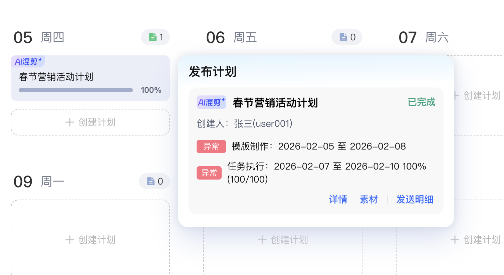
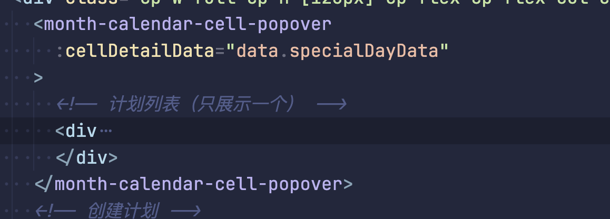
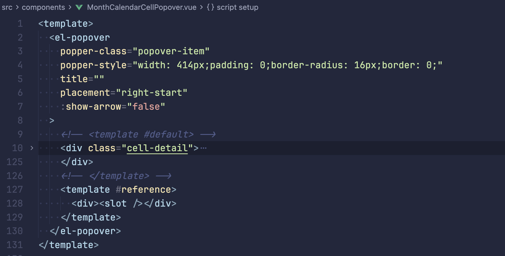
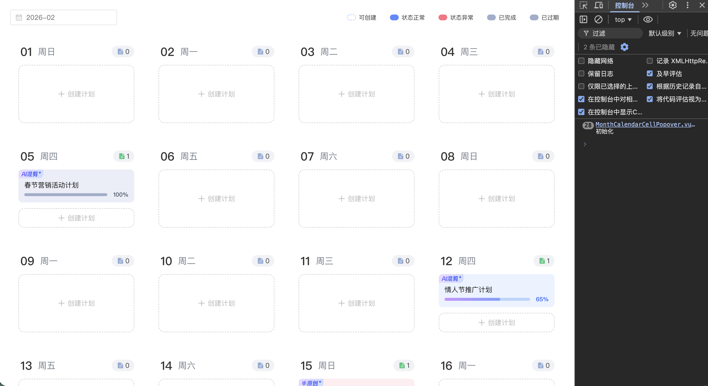
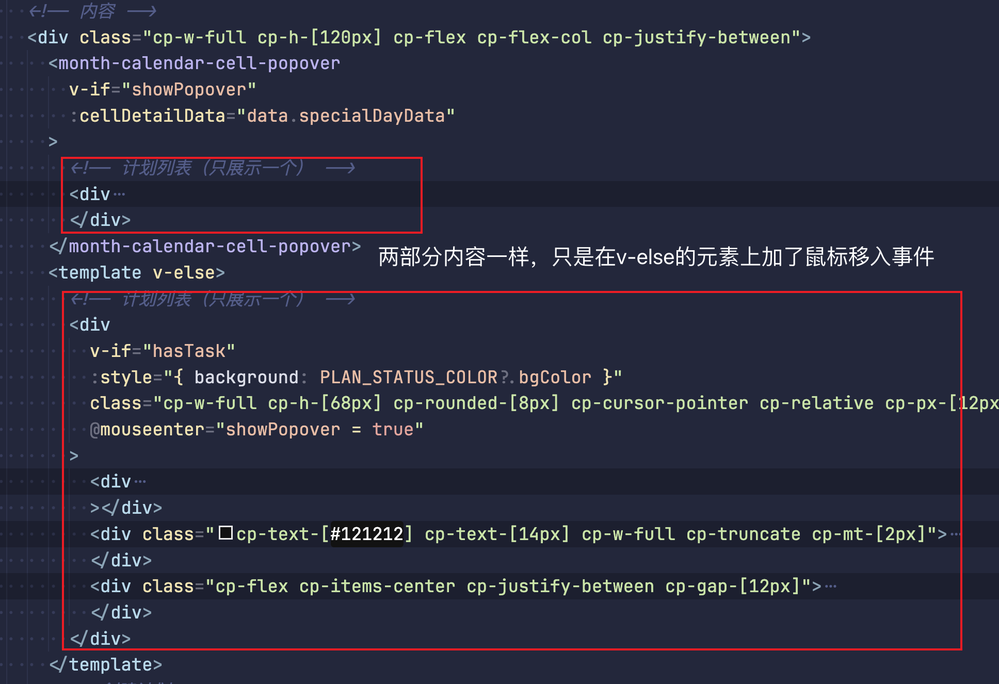

# 日历组件优化

## 背景

我们有一个**月视图日历**：一屏会渲染整月的大致 30 个日期格子（`MonthCalendarItem`），每个格子里有一个「计划列表」区域；用户
**hover 到有计划的格子**
时，会弹出一个 Popover，展示该日期的发布计划详情（`MonthCalendarCellPopover`）。

也就是说：**每个格子都可能挂一个 Popover 组件**，但用户**只有鼠标移上去才会看**。

但是在进行 Code Review 的时候，会发现 Popover 这个组件会在初始化的时候渲染多次。

原逻辑就是在日历格Item外包裹一层组件：

但是由于组件是在初始化加载的，一个日期就会 mounted 挂载一次，即使我当前日期是不允许hover或当前日期数据为空的时候，就不需要展示外层 Popover。

虽然这是一个后台项目，对性能要求不是很高，但是对于像一个c端项目，对性能要求就比较高，这样不必要的首次渲染会降低用户的体验，造成页面卡顿。

## 解决办法

解决的思路是利用惰性组件，当我鼠标移入的时候，才进行内容的渲染，并且只初始化一次。这样可以大大提升dom在首屏加载的速度。

> 惰性组件（Lazy
> Component），也叫懒加载组件，是前端性能优化的核心技术，核心是延迟加载非首屏组件代码，仅在需要渲染时才下载并执行，大幅减少初始包体积与加载时间。

使用 `v-if` + `@mouseenter` 鼠标移入事件结合处理即可。具体代码如下：

这样改造后就仅当用户hover后才会进行加载
